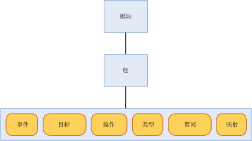

# <a name="sql-server-extended-events-packages"></a>SQL Server 扩展事件包
[!INCLUDE[appliesto-ss-asdb-xxxx-xxx-md](../../includes/appliesto-ss-asdb-xxxx-xxx-md.md)]

  包是用于 [!INCLUDE[ssNoVersion](../../includes/ssnoversion-md.md)] 扩展事件对象的容器。 扩展事件包有三种类型，它们是：  
  
-   package0 - 扩展事件系统对象。 这是默认包。  
  
-   sqlserver - [!INCLUDE[ssNoVersion](../../includes/ssnoversion-md.md)] 相关对象。  
  
-   sqlos - [!INCLUDE[ssNoVersion](../../includes/ssnoversion-md.md)] 操作系统 (SQLOS) 相关对象。  
  
> [!NOTE]  
>  SecAudit 包由 [!INCLUDE[ssNoVersion](../../includes/ssnoversion-md.md)] 审核使用。 包中的所有对象均不能通过扩展事件数据定义语言 (DDL) 使用。  
  
 包是由名称、GUID 以及包含该包的二进制模块进行标识的。 有关详细信息，请参阅 [sys.dm_xe_packages (Transact-SQL)](../../relational-databases/system-dynamic-management-views/sys-dm-xe-packages-transact-sql.md)。  
  
 包可以包含以下任一对象或所有对象，稍后将在本主题中详细介绍这些对象：  
  
-   事件  
  
-   目标  
  
-   操作  
  
-   类型  
  
-   谓词  
  
-   地图  
  
 在一个事件会话中可混合不同包中的对象。 有关详细信息，请参阅 [SQL Server Extended Events Sessions](../../relational-databases/extended-events/sql-server-extended-events-sessions.md)。  
  
## <a name="package-contents"></a>包的内容  
 下图显示了可以在包含于模块中的包中存在的对象。 模块可以是可执行文件或者是动态链接库。  
  
   
  
### <a name="events"></a>事件  
 事件是程序（例如 [!INCLUDE[ssNoVersion](../../includes/ssnoversion-md.md)]）的执行路径中的相关监视点。 事件触发即表明已经到达相关点，并具有自事件触发以来的状态信息。  
  
 事件可仅用于跟踪目的或用于触发操作。 这些操作可以是同步的，也可以是异步的。  
  
> [!NOTE]  
>  事件不知道在对事件触发做出响应时可能会触发的操作。  
  
 在向扩展事件注册包后，将不能更改该包中的事件集。  
  
 所有事件都有一个用于定义其内容的版本控制架构。 此架构由其类型已定义好的事件列组成。 特定类型的事件在提供其数据时必须始终完全遵守在架构中指定的相同顺序。 但是，事件目标不必使用提供的所有数据。  
  
#### <a name="event-categorization"></a>事件分类  
 扩展事件使用与 Windows 事件跟踪 (ETW) 类似的事件分类模型。 两个事件属性将用于分类、通道和关键字。 使用这些属性可支持将扩展事件与 ETW 及其工具进行集成。  
  
 **Channel**  
  
 通道用于标识事件的用户。 下表对这些通道进行了说明。  
  
|术语|定义|  
|----------|----------------|  
|管理员|管理员事件主要针对的是最终用户、管理员和支持人员。 管理员通道中包含的事件指示定义好的解决方案出现问题，管理员可以对该问题进行处理。 例如，应用程序无法连接到打印机就是一个管理员事件。 这些事件可能在文档中有详细描述，或者有与之关联的消息告诉读者如何纠正这一问题。|  
|操作|操作事件用于分析和诊断问题或匹配项。 它们可用于基于问题或匹配项来触发工具或任务。 操作事件的一个示例是从系统中添加或删除打印机。|  
|分析|分析事件的发布量是很大的。 它们对程序操作进行说明并且通常用于性能调查。|  
|调试|调试事件仅由开发人员用来诊断问题以进行调试。<br /><br /> 调试渠道中的事件返回特定于实现的内部状态数据。 这些事件返回的架构和数据可能在 SQL Server 的将来版本中更改或失效。 因此，调试渠道中的事件在 SQL Server 的将来版本中可能更改或删除且不事先通知。|  
  
 **关键字**  
  
 关键字是特定于应用程序的，并且使得对相关事件的分组更加细化，这样您能更容易地指定和检索要在会话中使用的事件。 可以使用以下查询来获取关键字信息。  
  
```  
select map_value Keyword from sys.dm_xe_map_values  
where name = 'keyword_map'  
```  
  
> [!NOTE]  
>  关键字将紧密映射到 SQL 跟踪事件的当前分组中。  
  
### <a name="targets"></a>目标  
 目标是指事件使用者。 目标在触发事件的线程中同步处理事件或在系统提供的线程中异步处理事件。 扩展事件提供了多个目标，您可以根据需要将其用于定向事件输出。 有关详细信息，请参阅 [SQL Server Extended Events Targets](http://msdn.microsoft.com/library/e281684c-40d1-4cf9-a0d4-7ea1ecffa384)。  
  
### <a name="actions"></a>操作  
 操作是对事件做出的一个编程方式的响应或一系列响应。 操作与事件绑定在一起，并且每个事件都可能具有唯一的一组操作。  
  
> [!NOTE]  
>  用于一组特定事件的操作不能绑定到未知事件。  
  
 在触发事件的线程上将同步调用与该事件绑定的操作。 操作类型很多，并且它们都具有多种功能。 操作可以：  
  
-   捕获堆栈转储和检查数据。  
  
-   使用变量存储将状态信息存储在本地上下文中。  
  
-   聚合事件数据。  
  
-   将数据追加到事件数据。  
  
 以下是一些典型且熟知的操作示例：  
  
-   堆栈转储器  
  
-   执行计划检测（仅限[!INCLUDE[ssNoVersion](../../includes/ssnoversion-md.md)] ）  
  
-   [!INCLUDE[tsql](../../includes/tsql-md.md)] 堆栈集合（仅[!INCLUDE[ssNoVersion](../../includes/ssnoversion-md.md)] ）  
  
-   运行时统计信息计算  
  
-   收集发生异常时的用户输入  
  
### <a name="predicates"></a>谓词  
 谓词是一组逻辑规则，用于在处理事件时计算这些事件。 这可以使扩展事件用户根据特定条件有选择地捕获事件数据。  
  
 谓词可在本地上下文中存储用于创建谓词的数据，这些谓词每 *n* 分钟或每当事件触发 *n* 次时返回一次 true。 本地上下文存储也可用于动态更新谓词，从而在事件包含类似数据时取消未来的事件触发。  
  
 谓词能够检索上下文信息，例如线程 ID 以及事件的特定数据。 谓词的计算结果为完整的布尔表达式，并且它支持在整个表达式为 false 的第一个点处执行短路。  
  
> [!NOTE]  
>  如果早期的谓词检查失败，则可能无法计算具有副作用的谓词。  
  
### <a name="types"></a>类型  
 由于数据是排列在一起的字节集合，因此需要使用字节集合的长度和特征来解释这些数据。 该信息将封装在 Type 对象中。 下面是为包对象提供的类型：  
  
-   事件  
  
-   action  
  
-   target  
  
-   pred_source  
  
-   pred_compare  
  
-   type  
  
 有关详细信息，请参阅 [sys.dm_xe_objects (Transact-SQL)](../../relational-databases/system-dynamic-management-views/sys-dm-xe-objects-transact-sql.md)。  
  
### <a name="maps"></a>地图  
 映射表用于将内部值映射到字符串，这使用户可以知道该值代表什么。 用户可以获得关于内部值真正含义的说明，而不是只能够获取数值。 下面的查询显示了获取映射值的方式。  
  
```  
select map_key, map_value from sys.dm_xe_map_values  
where name = 'lock_mode'  
```  
  
 前面的查询生成以下输出。  
  
 `map_key     map_value`  
  
 `---------------------`  
  
 `0           NL`  
  
 `1           SCH_S`  
  
 `2           SCH_M`  
  
 `3           S`  
  
 `4           U`  
  
 `5           X`  
  
 `6           IS`  
  
 `7           IU`  
  
 `8           IX`  
  
 `9           SIU`  
  
 `10          SIX`  
  
 `11          UIX`  
  
 `12          BU`  
  
 `13          RS_S`  
  
 `14          RS_U`  
  
 `15          RI_NL`  
  
 `16          RI_S`  
  
 `17          RI_U`  
  
 `18          RI_X`  
  
 `19          RX_S`  
  
 `20          RX_U`  
  
 `21          RX_X`  
  
 `21          RX_X`  
  
 以此表为例，假定有一名为模式的列，且其值为 5。 此表指示 5 映射到 X，即表示锁类型为排他。  
  
## <a name="see-also"></a>另请参阅  
 [SQL Server Extended Events Sessions](../../relational-databases/extended-events/sql-server-extended-events-sessions.md)   
 [SQL Server 扩展事件引擎](../../relational-databases/extended-events/sql-server-extended-events-engine.md)   
 [SQL Server Extended Events Targets](http://msdn.microsoft.com/library/e281684c-40d1-4cf9-a0d4-7ea1ecffa384)  
  
  
