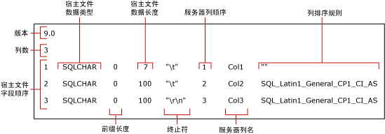

# 使用格式化文件跳过表列 (SQL Server)
  本主题说明格式化文件。 当数据文件中不存在字段时，您可以使用格式化文件跳过导入表列。 仅当跳过的列可为空值和/或具有默认值时，数据文件中的字段数才可以少于表中的列数。  
  
## 示例表和数据文件  
 下列示例需要在 `myTestSkipCol` 示例数据库中的 [!INCLUDE[ssSampleDBnormal](../../includes/sssampledbnormal-md.md)] dbo **架构下存在一个名为** 的表。 此表的创建方式如下所示：  
  
```  
USE AdventureWorks2012;  
GO  
CREATE TABLE myTestSkipCol   
   (  
   Col1 smallint,  
   Col2 nvarchar(50) NULL,  
   Col3 nvarchar(50) not NULL  
   );  
GO  
```  
  
 下列示例使用示例数据文件 `myTestSkipCol2.dat`，此文件仅包含两个字段，但相应的表包含三列：  
  
```  
1,DataForColumn3  
1,DataForColumn3  
1,DataForColumn3  
  
```  
  
 若要将数据从 `myTestSkipCol2.dat` 大容量导入 `myTestSkipCol` 表，则格式化文件必须将第一个数据字段映射到 `Col1`，并跳过 `Col3` 将第二个字段映射到 `Col2`。  
  
## 使用非 XML 格式化文件  
 可以修改非 XML 格式化文件以跳过某个表列。 这通常涉及使用 **bcp** 实用工具创建默认的非 XML 格式化文件，并在文本编辑器中修改此默认文件。 修改过的格式化文件必须将每个现有字段映射到相应的表列并指明要跳过哪个或哪些表列。 修改默认非 XML 数据文件的方法有两种。 两种方法都假定数据文件中没有数据字段，并且不会有数据插入到对应的表列中。  
  
### 创建默认非 XML 格式化文件  
 本主题使用默认非 XML 格式化文件，此文件是使用以下 **bcp** 命令为 `myTestSkipCol` 示例表创建的：  
  
```  
bcp AdventureWorks2012..myTestSkipCol format nul -f myTestSkipCol_Default.fmt -c -T  
```  
  
 以上命令创建了一个非 XML 格式化文件，`myTestSkipCol_Default.fmt`。 此格式化文件称为 *默认格式化文件* ，因为它是 **bcp**生成的格式。 默认格式化文件通常说明数据文件字段与表列之间的一一对应关系。  
  
> [!IMPORTANT]  
>  您可能必须指定要连接的服务器实例的名称。 可能还必须指定用户名和密码。 有关详细信息，请参阅 [bcp Utility](../../tools/bcp-utility.md)。  
  
 下图显示了此默认格式化文件示例中的值。 图中还显示了格式化文件各个字段的名称。  
  
   
  
> [!NOTE]  
>  有关格式化文件字段的详细信息，请参阅[非 XML 格式化文件 (SQL Server)](../../relational-databases/import-export/non-xml-format-files-sql-server.md)。  
  
### 修改非 XML 格式化文件的方法  
 若要跳过某个表列，可编辑默认非 XML 格式化文件并使用以下方法之一修改此文件：  
  
-   首选方法包括三个基本步骤。 首先，删除说明数据文件中丢失字段的任何格式化文件行。 然后，减小所删除行后的每个格式化文件行的“宿主文件字段顺序”值。 这是为了使“宿主文件字段顺序”值按顺序排列（1 到 *n*），它反映了数据文件中各个数据字段的实际位置。 最后，减小“列数”字段中的值以反映数据文件中的实际字段数。  
  
     下面的示例基于 `myTestSkipCol` 表的默认格式化文件，此文件是在本主题先前的“创建默认非 XML 格式化文件”中创建的。 此修改过的格式化文件将第一个数据字段映射到 `Col1`，并跳过 `Col2` 将第二个数据字段映射到 `Col3`。 已删除 `Col2` 的行。  
  
    ```  
    9.0  
    2  
    1       SQLCHAR       0       7       "\t"     1     Col1         ""  
    2       SQLCHAR       0       100     "\r\n"   3     Col3         SQL_Latin1_General_CP1_CI_AS  
    ```  
  
-   若要跳过某个表列，也可以修改与表列对应的格式化文件行的定义。 在此格式化文件行中，“前缀长度”、“宿主文件数据长度”和“服务器列顺序”值必须设置为 0， 并且“终止符”和“列排序规则”字段必须设置为 "" (NULL)。  
  
     “服务器列名”值必须为非空白字符串，但不一定为实际列名。 其余格式字段必须为它们的默认值。  
  
     下面的示例也是从 `myTestSkipCol` 表的默认格式化文件派生出来的。  
  
    ```  
    9.0  
    3  
    1       SQLCHAR       0       7       "\t"     1     Col1         ""  
    2       SQLCHAR       0       0       ""       0     Col2         ""  
    3       SQLCHAR       0       100     "\r\n"   3     Col3         SQL_Latin1_General_CP1_CI_AS  
    ```  
  
### 示例  
 下面的示例同样基于本主题上文“示例表和数据文件”中创建的 `myTestSkipCol` 示例表和 `myTestSkipCol2.dat` 示例数据文件。  
  
#### 使用 BULK INSERT  
 此例使用的是本主题先前的“用于修改非 XML 格式化文件的方法”中创建的两个已修改非 XML 格式化文件之一。 在此例中，修改过的格式化文件名为 `C:\myTestSkipCol2.fmt`。 若要使用 `BULK INSERT` 大容量导入 `myTestSkipCol2.dat` 数据文件，请在 [!INCLUDE[ssManStudioFull](../../includes/ssmanstudiofull-md.md)] 查询编辑器中执行以下代码：  
  
```tsql  
USE AdventureWorks2012;  
GO  
BULK INSERT myTestSkipCol   
   FROM 'C:\myTestSkipCol2.dat'   
   WITH (FORMATFILE = 'C:\myTestSkipCol2.fmt');  
GO  
SELECT * FROM myTestSkipCol;  
GO  
```  
  
## 使用 XML 格式化文件  
 使用 XML 格式化文件时，你无法在通过 **bcp** 命令或 BULK INSERT 语句直接向表导入内容时跳过列。 但是，您可以向表中除最后一列的所有列导入。 如果必须跳过除最后一列的任何列，则必须创建目标表的视图，其中仅包含数据文件中包含的列。 然后，您可以将此文件中的数据大容量导入此视图。  
  
 若要使用 XML 格式化文件通过 OPENROWSET(BULK...) 跳过表列，必须提供选择列表以及目标表中列的显式列表，如下所示：  
  
 INSERT ...<column_list> SELECT <column_list> FROM OPENROWSET(BULK...)  
  
### 创建默认 XML 格式化文件  
 修改过的格式化文件示例基于 `myTestSkipCol` 示例表和数据文件，它们是在本主题先前的“示例表和数据文件”中创建的。 下面的 **bcp** 命令创建 `myTestSkipCol` 表的默认 XML 格式化文件：  
  
```  
bcp AdventureWorks2012..myTestSkipCol format nul -f myTestSkipCol_Default.xml -c -x -T  
```  
  
 生成的默认非 XML 格式化文件说明了数据文件字段与表列之间的一一对应关系，如下所示：  
  
```  
<?xml version="1.0"?>  
<BCPFORMAT xmlns="http://schemas.microsoft.com/sqlserver/2004/bulkload/format" xmlns:xsi="http://www.w3.org/2001/XMLSchema-instance">  
 <RECORD>  
  <FIELD ID="1" xsi:type="CharTerm" TERMINATOR="\t" MAX_LENGTH="7"/>  
  <FIELD ID="2" xsi:type="CharTerm" TERMINATOR="\t" MAX_LENGTH="100" COLLATION="SQL_Latin1_General_CP1_CI_AS"/>  
  <FIELD ID="3" xsi:type="CharTerm" TERMINATOR="\r\n" MAX_LENGTH="100" COLLATION="SQL_Latin1_General_CP1_CI_AS"/>  
 </RECORD>  
 <ROW>  
  <COLUMN SOURCE="1" NAME="Col1" xsi:type="SQLSMALLINT"/>  
  <COLUMN SOURCE="2" NAME="Col2" xsi:type="SQLNVARCHAR"/>  
  <COLUMN SOURCE="3" NAME="Col3" xsi:type="SQLNVARCHAR"/>  
 </ROW>  
</BCPFORMAT>  
```  
  
> [!NOTE]  
>  有关 XML 格式化文件结构的详细信息，请参阅 [XML 格式化文件 (SQL Server)](../../relational-databases/import-export/xml-format-files-sql-server.md)。  
  
### 示例  
 本节中的示例使用了在本主题先前的“示例表和数据文件”中创建的 `myTestSkipCol` 示例表和 `myTestSkipCol2.dat` 示例数据文件。 为将数据从 `myTestSkipCol2.dat` 导入 `myTestSkipCol` 表，示例使用以下修改过的 XML 格式化文件 `myTestSkipCol2-x.xml`。 这基于本主题先前的“创建默认 XML 格式化文件”中创建的格式化文件。  
  
```  
<?xml version="1.0"?>  
<BCPFORMAT xmlns="http://schemas.microsoft.com/sqlserver/2004/bulkload/format" xmlns:xsi="http://www.w3.org/2001/XMLSchema-instance">  
 <RECORD>  
  <FIELD ID="1" xsi:type="CharTerm" TERMINATOR="," MAX_LENGTH="7"/>  
  <FIELD ID="2" xsi:type="CharTerm" TERMINATOR="\r\n" MAX_LENGTH="100" COLLATION="SQL_Latin1_General_CP1_CI_AS"/>  
 </RECORD>  
 <ROW>  
  <COLUMN SOURCE="1" NAME="Col1" xsi:type="SQLSMALLINT"/>  
  <COLUMN SOURCE="2" NAME="Col3" xsi:type="SQLNVARCHAR"/>  
 </ROW>  
</BCPFORMAT>  
```  
  
#### 使用 OPENROWSET(BULK...)  
 下面的示例使用 `OPENROWSET` 大容量行集提供程序和 `myTestSkipCol2.xml` 格式化文件。 此示例将 `myTestSkipCol2.dat` 数据文件大容量导入至 `myTestSkipCol` 表。 语句中包含了需要提供的选择列表以及目标表中列的显式列表。  
  
 在 [!INCLUDE[ssManStudioFull](../../includes/ssmanstudiofull-md.md)] 查询编辑器中，执行下列代码：  
  
```tsql  
USE AdventureWorks2012;  
GO  
INSERT INTO myTestSkipCol  
  (Col1,Col3)  
    SELECT Col1,Col3  
      FROM  OPENROWSET(BULK  'C:\myTestSkipCol2.Dat',  
      FORMATFILE='C:\myTestSkipCol2.Xml'    
       ) as t1 ;  
GO  
```  
  
#### 在视图上使用 BULK IMPORT  
 下面的示例在 `v_myTestSkipCol` 表上创建 `myTestSkipCol` 。 此视图跳过第二表列 `Col2`。 然后此例使用 `BULK INSERT` 将 `myTestSkipCol2.dat` 数据文件导入此视图。  
  
 在 [!INCLUDE[ssManStudioFull](../../includes/ssmanstudiofull-md.md)] 查询编辑器中，执行下列代码：  
  
```tsql  
CREATE VIEW v_myTestSkipCol AS  
    SELECT Col1,Col3  
    FROM myTestSkipCol;  
GO  
  
USE AdventureWorks2012;  
GO  
BULK INSERT v_myTestSkipCol  
FROM 'C:\myTestSkipCol2.dat'  
WITH (FORMATFILE='C:\myTestSkipCol2.xml');  
GO  
```  
  
## 另请参阅  
 [bcp 实用工具](../../tools/bcp-utility.md)   
 [BULK INSERT (Transact-SQL)](../../t-sql/statements/bulk-insert-transact-sql.md)   
 [OPENROWSET (Transact-SQL)](../../t-sql/functions/openrowset-transact-sql.md)   
 [使用格式化文件跳过数据字段 (SQL Server)](../../relational-databases/import-export/use-a-format-file-to-skip-a-data-field-sql-server.md)   
 [使用格式化文件将表列映射到数据文件字段 (SQL Server)](../../relational-databases/import-export/use-a-format-file-to-map-table-columns-to-data-file-fields-sql-server.md)   
 [使用格式化文件批量导入数据 (SQL Server)](../../relational-databases/import-export/use-a-format-file-to-bulk-import-data-sql-server.md)  
  
  