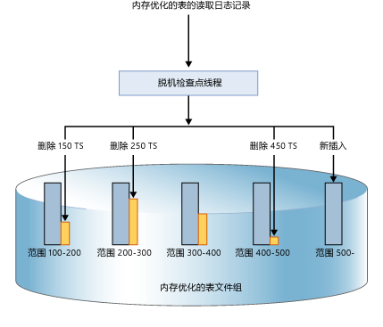
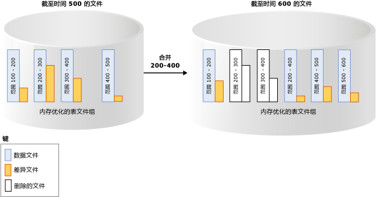

# 内存优化表的持续性
[!INCLUDE[appliesto-ss-xxxx-xxxx-xxx-md](../../includes/appliesto-ss-xxxx-xxxx-xxx-md.md)]

  [!INCLUDE[hek_2](../../includes/hek-2-md.md)] 为内存优化表提供完整持续性。 提交更改内存优化表的事务时，假设基础存储可用， [!INCLUDE[ssNoVersion](../../includes/ssnoversion-md.md)] （就像对基于磁盘的表一样）会保证更改是永久的（数据库重新启动时仍然有效）。 持续性有两个重要方面：事务日志记录和在磁盘存储上持久保存数据更改。  
  
 有关持久性表任意大小限制的详细信息，请参阅 [估算内存优化表的内存需求](../../relational-databases/in-memory-oltp/estimate-memory-requirements-for-memory-optimized-tables.md)。 
  
## 事务日志  
 对基于磁盘的表或持久的内存优化表所做的所有更改均捕获在一个或多个事务日志记录中。 提交事务时， [!INCLUDE[ssNoVersion](../../includes/ssnoversion-md.md)] 将与事务关联的日志记录写入磁盘，然后再通知应用程序或用户会话事务已提交。 这样可确保事务所做的更改是持久的。 内存优化表的事务日志与基于磁盘的表使用的相同日志流完全集成。 此集成使现有事务日志备份、恢复和还原操作可以继续执行，无需任何附加步骤。 但是，由于 [!INCLUDE[hek_2](../../includes/hek-2-md.md)] 可显著增加工作负荷的事务吞吐量，日志 IO 可能成为性能瓶颈。 若要保持此增长的吞吐量，请确保日志 IO 子系统可以处理增加的负载。  
  
## 数据和差异文件  
 内存优化表中的数据在内存中堆数据结构中存储为自由格式的数据行，它们通过内存中的一个或多个索引链接起来。 这些数据行没有基于磁盘的表所使用的页面结构。 为了保持长期的持久性并允许截断事务日志，内存优化表中的操作存留在一组数据和差异文件中。 这些文件是使用异步后台进程基于事务日志而生成的。 数据文件和差异文件位于一个或多个容器中（使用 FILESTREAM 数据所用的机制）。 这些容器是内存优化文件组的一部分。  
  
 按严格顺序向这些文件写入数据，这样可将旋转介质的磁盘延迟降至最低。 可使用不同驱动器上的多个容器分散 I/O 活动。 从磁盘上的数据和差异文件中将数据读入内存时，不同磁盘上多个容器中的数据和差异文件将提高数据库还原/恢复性能。  
  
 用户事务不直接访问数据和差异文件。 所有数据读取和写入均使用内存中数据结构。  
  
### 数据文件  
 数据文件将包含一个或多个内存优化表中作为 INSERT 或 UPDATE 操作的一部分由多个事务插入的行。 例如，一行可以来自内存优化表 T1，而下一行可以来自内存优化表 T2。 这些行按事务日志中事务的顺序追加到数据文件，使数据访问顺序进行。 这将使 I/O 吞吐量比随机 I/O 提高一个数量级。  
  
 一旦数据文件已满，新事务插入的行就存储于其他数据文件中。 一段时间后，来自持久内存优化表中的行将存储于一个或多个数据文件中，并且每个数据文件都包含来自不相联事务范围（而非连续事务范围）的行。 例如，事务提交时间戳范围为 (100, 200) 的数据文件包含由提交时间戳大于 100 并小于等于 200 的事务插入的所有行。 该提交时间戳是在可供提交时分配给某一事务的单调递增的数字。 每个事务都具有唯一的提交时间戳。  
  
 在删除或更新某一行时，该行并不在数据文件中就地删除或更改，而是在另一种文件类型（即差异文件）中跟踪已删除行。 更新操作以针对每一行的删除和插入操作的元组形式进行处理。 这将消除数据文件上的随机 IO。  
 
   大小：在内存大于 16 GB 的计算机中，每个数据文件的大小约为 128 MB；在内存小于或等于 16 GB 的计算机中，其大小约为 16 MB。 如果它认为存储子系统的速度不够快，则可在 [!INCLUDE[ssSQL15](../../includes/sssql15-md.md)] SQL Server 中使用大型检查点模式。 在大型检查点模式下，数据文件的大小将调整为 1 GB。 这将实现存储子系统更高的效率，从而拥有高吞吐量的工作负荷。  
   
### 差异文件  
 每个数据文件都与一个差异文件配对，后者的事务范围相同，并跟踪事务范围中的事务插入的已删除行。 此数据和差异文件称为检查点文件对 (CFP)，是分配和释放的单位以及合并操作的单位。 例如，与事务范围 (100, 200) 对应的差异文件将存储范围 (100, 200) 内的事务插入的删除行。 与数据文件一样，差异文件是顺序访问的。  
  
 在删除某一行时，该行并不是从数据文件中删除，而是对该行的引用将追加到与插入了此数据行的事务范围相关联的差异文件。 由于要删除的行已存在于数据文件中，因此差异文件仅存储引用信息 `{inserting_tx_id, row_id, deleting_tx_id }` ，并且遵循原始删除或更新操作的事务日志顺序。  
  

 大小：在内存大于 16 GB 的计算机中，每个数据文件的大小约为 16 MB；在内存小于或等于 16 GB 的计算机中，其大小约为 1 MB。 如果它认为存储子系统的速度不够快，则启动 [!INCLUDE[ssSQL15](../../includes/sssql15-md.md)] SQL Server 可使用大型检查点模式。 在大型检查点模式下，差异文件的大小将调整为 128 MB。  
 
## 填充数据和差异文件  
 基于已提交事务在内存优化表上生成的事务日志记录填充数据和差异文件，并且将与已插入行和已删除行有关的信息追加到相应的数据和差异文件中。 与基于磁盘的表（在此类表中，在检查点操作完成时使用随机 I/O 刷新数据/索引页）不同，内存优化表的持续性是连续的后台操作。 由于事务可以删除或更新由任何先前的事务插入的任何行，因此将对多个差异文件进行访问。 删除信息始终追加到差异文件的末尾。 例如，提交时间戳为 600 的事务将插入一个新行并删除由提交时间戳为 150、250 和 450 的事务插入的行，如下图所示。 所有 4 个文件 I/O 操作（三个用于删除的行，一个用于新插入的行）都是针对相应的增量和数据文件进行的仅追加操作。  
  
   
  
## 访问数据和差异文件  
 发生以下情况时，将会访问数据和差异文件对。  
  
 脱机检查点辅助进程  
 此线程将对内存优化数据行执行的插入和删除追加到对应的数据和差异文件对。 在 [!INCLUDE[ssSQL14](../../includes/sssql14-md.md)] 中有一个脱机检查点辅助进程；启动 [!INCLUDE[ssSQL15](../../includes/sssql15-md.md)] 将有多个检查点辅助进程。  
  
 合并操作  
 此操作会合并一个或多个数据和差异文件对，并创建新的数据和差异文件对。  
  
 在崩溃恢复期间  
 当 [!INCLUDE[ssNoVersion](../../includes/ssnoversion-md.md)] 重新启动或数据库重新联机时，将使用数据和差异文件对来填充内存优化数据。 从对应的数据文件读取行时，差异文件充当用于已删除行的筛选器。 由于每个数据和差异文件对均独立，因此并行加载这些文件以缩短将数据填充到内存中所用的时间。 将数据载入内存后，内存中 OLTP 引擎即应用检查点文件尚未涵盖的活动事务日志记录，以使内存优化的数据完整。  
  
 还原操作期间  
 从数据库备份创建内存中 OLTP 检查点文件，然后应用一个或多个事务日志备份。 与崩溃恢复一样，内存中 OLTP 引擎将数据并行加载到内存中，以最大程度减小对恢复时间的影响。  
  
## 迁移数据和差异文件  
 内存优化表的数据存储于一个或多个数据和差异文件对（也称作检查点文件对，即 CFP）中。 数据文件存储插入的行，而差异文件引用删除的行。 在 OLTP 工作负荷执行期间，在 DML 操作更新、插入和删除行时，将创建新 CFP 以便持久保存新行，并将对已删除行的引用附加到差异文件中。  
  
 一段时间后，DML 操作时，数据和差异文件数量的增长将导致增加磁盘空间使用率并增加恢复时间。  
  
 为了帮助避免发生这些效率低下的情形，将基于下面所述的合并策略合并较旧的已关闭的数据和差异文件，因此，将压缩存储数组以便表示具有数量减少的文件的相同数据集。  
  
 合并操作将基于内部定义的合并策略将一个或多个相邻的已关闭检查点文件对（CFP，数据和差异文件对，称作合并源）作为输入，生成一个最终的 CFP，称作合并目标。 将使用源 CFP 的每个差异文件中的项从相应数据文件中筛选行，以便删除不需要的数据行。 源 CFP 中的其余行将合并到一个目标 CFP 中。 在该合并完成后，最终生成的合并目标 CFP 将替代源 CFP（合并源）。 这些合并源 CFP 将首先经历过渡阶段，然后从存储中删除。  
  
 在下面的示例中，内存优化表文件组在时间戳 500 处具有四个数据和差异文件对，并且包含来自之前事务的数据。 例如，第一个数据文件中的行对应于时间戳大于 100 且小于等于 200 的事务，或者表示为 (100，200]。 考虑到标为已删除的行后，将第二个和第三个数据文件显示为完整程度小于 50%。 合并操作合并这两个 CFP 并且创建一个新 CFP，它包含时间戳大于 200 且小于等于 400 的事务，这是这两个 CFP 的合并后的范围。 您将看到另一个具有范围 (500, 600] 的 CFP，并且用于事务范围 (200, 400] 的非空差异文件显示，可与事务性活动（包括从源 CFP 删除更多行）同时完成合并操作。  
  
   
  
 后台线程使用合并策略计算所有关闭的 CFP，然后启动一个或多个合并请求以便验证 CFP 的资格。 这些合并请求由脱机检查点线程处理。 将定期进行对合并策略的评估，并且在关闭检查点时也会进行评估。  
  
### [!INCLUDE[ssNoVersion](../../includes/ssnoversion-md.md)] 合并策略  
 [!INCLUDE[ssNoVersion](../../includes/ssnoversion-md.md)] 实现以下合并策略：  
  
-   在考虑已删除的行后，如果可以合并 2 个或多个连续 CFP，则计划进行合并，这样，最后生成的行可以适合于 1 个 CFP 的目标大小。 如上所述，数据和差异文件的目标大小与原始大小相对应。  
  
-   如果数据文件超过目标大小的两倍，并且删除的行超过一半，则单个 CFP 可自行合并。 数据文件可能增大到大于目标大小（例如，如果单个事务或多个并发事务插入或更新大量数据，迫使数据文件增大到超过其目标大小），因为事务不能跨多个 CFP。  
  
 下面是一些示例，显示将在合并策略下合并的 CFP：  
  
|相邻的 CFP 源文件（完整程度百分比）|合并选择|  
|-------------------------------------------|---------------------|  
|CFP0 (30%), CFP1 (50%), CFP2 (50%), CFP3 (90%)|(CFP0, CFP1)   未选择 CFP2，因为它将使最后生成的数据文件超过 100% 的理想大小。|  
|CFP0 (30%), CFP1 (20%), CFP2 (50%), CFP3 (10%)|(CFP0, CFP1, CFP2)。 从左侧开始选择文件。   未选择 CTP3，因为它将使最后生成的数据文件超过 100% 的理想大小。|  
|CFP0 (80%), CFP1 (30%), CFP2 (10%), CFP3 (40%)|(CFP1, CFP2, CFP3)。 从左侧开始选择文件。   将跳过 CFP0，因为如果与 CFP1 合并，最后生成的数据文件超过 100% 的理想大小。|  
  
 不是具有可用空间的所有 CFP 都符合合并条件。 例如，如果两个相邻的 CFP 为 60% 满，则它们将不符合合并条件，并且其中每个 CFP都将有 40% 的未使用存储空间。 在最差情形下，所有 CFP 都将为 50% 满，存储利用率仅为 50%。 当已删除行可能在存储中存在时，因为 CFP 不符合合并条件，所以，已删除行可能已被内存中垃圾回收从内存中删除。 存储和内存的管理与垃圾回收是独立的。 活动 CFP（不是所有 CFP 都在更新）使用的内存可以最高达到内存中持久表大小的 2 倍。  
  
### CFP 的生命周期  
 CFP 要先经过若干状态才可被释放。 需要生成数据库检查点和日志备份，以通过这些阶段转换这些文件，并最终清理不再需要的文件。 有关这些阶段的说明，请参阅 [sys.dm_db_xtp_checkpoint_files (Transact SQL)](../../relational-databases/system-dynamic-management-views/sys-dm-db-xtp-checkpoint-files-transact-sql.md)。  
  
 你可以在日志备份后手动强制生成检查点，以便加快垃圾回收。 在生产方案中，作为备份策略的一部分进行的自动检查点和日志备份可使 CFP 无缝通过这些阶段，而无需任何手动干预。 垃圾回收进程的影响是，具有内存优化表的数据库与其在内存中的大小相比，可能具有更大的存储大小。 如果生成检查点和日志备份的操作未发生，则检查点文件的磁盘上占用将不断增长。  
  
## 另请参阅  
 [创建和管理用于内存优化的对象的存储](../../relational-databases/in-memory-oltp/creating-and-managing-storage-for-memory-optimized-objects.md)  
  
  
