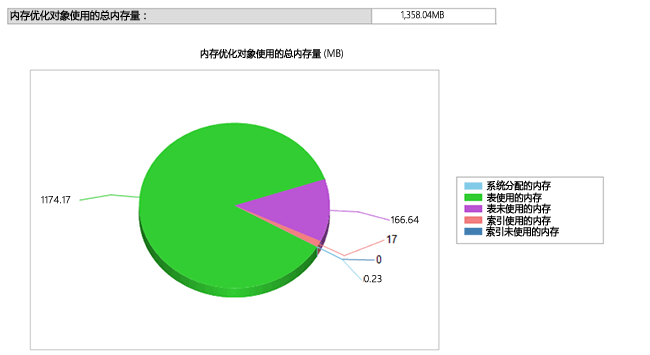

# <a name="monitor-and-troubleshoot-memory-usage"></a>内存使用情况的监视和故障排除
[!INCLUDE[appliesto-ss-asdb-xxxx-xxx-md](../../includes/appliesto-ss-asdb-xxxx-xxx-md.md)][!INCLUDE[hek_1](../../includes/hek-1-md.md)] 使用内存的模式与针对基于磁盘的表的模式不同。 您可以使用为内存和垃圾回收子系统提供的 DMV 或性能计数器，监视数据库中内存优化表和索引分配和使用的内存量。  这使您在系统和数据库级别都获得可见性，并允许防止由于内存用尽而导致的问题。  
  
 本主题介绍如何监视 [!INCLUDE[hek_2](../../includes/hek-2-md.md)] 内存使用量。  
  
## <a name="sections-in-this-topic"></a>本主题的内容  
  
-   [使用内存优化表创建示例数据库](../../relational-databases/in-memory-oltp/monitor-and-troubleshoot-memory-usage.md#bkmk_CreateDB)  
  
-   [监视内存使用量](../../relational-databases/in-memory-oltp/monitor-and-troubleshoot-memory-usage.md#bkmk_Monitoring)  
  
    -   [使用 SQL Server Management Studio](../../relational-databases/in-memory-oltp/monitor-and-troubleshoot-memory-usage.md#bkmk_UsingSSMS)  
  
    -   [使用 DMV](../../relational-databases/in-memory-oltp/monitor-and-troubleshoot-memory-usage.md#bkmk_UsingDMVs)  
  
-   [管理内存优化对象使用的内存](../../relational-databases/in-memory-oltp/monitor-and-troubleshoot-memory-usage.md#bkmk_MemOptObjects)  
  
-   [排除内存问题](../../relational-databases/in-memory-oltp/monitor-and-troubleshoot-memory-usage.md#bkmk_Troubleshooting)  
  
##  <a name="bkmk_CreateDB"></a> 使用内存优化表创建示例数据库  
 如果您已具有含内存优化表的数据库，则可以跳过此部分。  
  
 以下步骤将创建一个数据库，其中包含您可在本主题的其余部分中使用的三个内存优化表。 在该示例中，我们将该数据库映射到了一个资源池，以便我们可以控制内存优化表可使用的内存量。  
  
1.  启动 [!INCLUDE[ssManStudioFull](../../includes/ssmanstudiofull-md.md)]。  
  
2.  单击 **“新建查询”**。  
  
3.  将此代码粘贴到新查询窗口中并执行各部分。  
  
    ```  
    -- create a database to be used  
    CREATE DATABASE IMOLTP_DB  
    GO  
  
    ALTER DATABASE IMOLTP_DB ADD FILEGROUP IMOLTP_DB_xtp_fg CONTAINS MEMORY_OPTIMIZED_DATA  
    ALTER DATABASE IMOLTP_DB ADD FILE( NAME = 'IMOLTP_DB_xtp' , FILENAME = 'C:\Data\IMOLTP_DB_xtp') TO FILEGROUP IMOLTP_DB_xtp_fg;  
    GO  
  
    USE IMOLTP_DB  
    GO  
  
    -- create the resoure pool  
    CREATE RESOURCE POOL PoolIMOLTP WITH (MAX_MEMORY_PERCENT = 60);  
    ALTER RESOURCE GOVERNOR RECONFIGURE;  
    GO  
  
    -- bind the database to a resource pool  
    EXEC sp_xtp_bind_db_resource_pool 'IMOLTP_DB', 'PoolIMOLTP'  
  
    -- you can query the binding using the catalog view as described here  
    SELECT d.database_id  
         , d.name  
         , d.resource_pool_id  
    FROM sys.databases d  
    GO  
  
    -- take database offline/online to finalize the binding to the resource pool  
    USE master  
    GO  
  
    ALTER DATABASE IMOLTP_DB SET OFFLINE  
    GO  
    ALTER DATABASE IMOLTP_DB SET ONLINE  
    GO  
  
    -- create some tables  
    USE IMOLTP_DB  
    GO  
  
    -- create table t1  
    CREATE TABLE dbo.t1 (  
           c1 int NOT NULL CONSTRAINT [pk_t1_c1] PRIMARY KEY NONCLUSTERED  
         , c2 char(40) NOT NULL  
         , c3 char(8000) NOT NULL  
         ) WITH (MEMORY_OPTIMIZED = ON, DURABILITY = SCHEMA_AND_DATA)  
    GO  
  
    -- load t1 150K rows  
    DECLARE @i int = 0  
    BEGIN TRAN  
    WHILE (@i <= 150000)  
       BEGIN  
          INSERT t1 VALUES (@i, 'a', replicate ('b', 8000))  
          SET @i += 1;  
       END  
    Commit  
    GO  
  
    -- Create another table, t2  
    CREATE TABLE dbo.t2 (  
           c1 int NOT NULL CONSTRAINT [pk_t2_c1] PRIMARY KEY NONCLUSTERED  
         , c2 char(40) NOT NULL  
         , c3 char(8000) NOT NULL  
         ) WITH (MEMORY_OPTIMIZED = ON, DURABILITY = SCHEMA_AND_DATA)  
    GO  
  
    -- Create another table, t3   
    CREATE TABLE dbo.t3 (  
           c1 int NOT NULL CONSTRAINT [pk_t3_c1] PRIMARY KEY NONCLUSTERED HASH (c1) WITH (BUCKET_COUNT = 1000000)  
         , c2 char(40) NOT NULL  
         , c3 char(8000) NOT NULL  
         ) WITH (MEMORY_OPTIMIZED = ON, DURABILITY = SCHEMA_AND_DATA)  
    GO  
    ```  
  
##  <a name="bkmk_Monitoring"></a> 监视内存使用量  
  
###  <a name="bkmk_UsingSSMS"></a> 使用 [!INCLUDE[ssManStudioFull](../../includes/ssmanstudiofull-md.md)]  
 [!INCLUDE[ssSQL14](../../includes/sssql14-md.md)] 附随内置的标准报表，以便监视内存中表使用的内存。 您可以使用 [此处](http://blogs.msdn.com/b/managingsql/archive/2006/05/16/ssms-reports-1.aspx)所述的对象资源管理器访问这些报表。 还可使用对象资源管理器监视单独的内存优化表占用的内存。  
  
#### <a name="consumption-at-the-database-level"></a>数据库级别的内存使用情况  
 您可以按如下所示在数据库级别监视内存使用情况。  
  
1.  启动 [!INCLUDE[ssManStudioFull](../../includes/ssmanstudiofull-md.md)] 事件探查器，然后连接到某个服务器。  
  
2.  在对象资源管理器中，右键单击您要报告的数据库。  
  
3.  在上下文菜单中，选择“报表” -> “标准报表” -> “内存优化对象的内存使用情况”  
  
   
  
 此报表显示我们在上面创建的数据库的内存使用情况。  
  
   
  
###  <a name="bkmk_UsingDMVs"></a> 使用 DMV  
 有许多 DMV 可用于监视由内存优化表、索引、系统对象和运行时结构使用的内存。  
  
#### <a name="memory-consumption-by-memory-optimized-tables-and-indexes"></a>内存优化表和索引的内存使用情况  
 您可以通过按如下所示查询 `sys.dm_db_xtp_table_memory_stats` ，查找所有用户表、索引和系统对象的内存使用情况。  
  
```sql  
SELECT object_name(object_id) AS Name  
     , *  
   FROM sys.dm_db_xtp_table_memory_stats  
```  
  
 **示例输出**  
  
```  
Name       object_id   memory_allocated_for_table_kb memory_used_by_table_kb memory_allocated_for_indexes_kb memory_used_by_indexes_kb  
---------- ----------- ----------------------------- ----------------------- ------------------------------- -------------------------  
t3         629577281   0                             0                       128                             0  
t1         565577053   1372928                       1200008                 7872                            1942  
t2         597577167   0                             0                       128                             0  
NULL       -6          0                             0                       2                               2  
NULL       -5          0                             0                       24                              24  
NULL       -4          0                             0                       2                               2  
NULL       -3          0                             0                       2                               2  
NULL       -2          192                           25                      16                              16  
```  
  
 有关详细信息，请参阅 [sys.dm_db_xtp_table_memory_stats](../../relational-databases/system-dynamic-management-views/sys-dm-db-xtp-table-memory-stats-transact-sql.md)。  
  
#### <a name="memory-consumption-by-internal-system-structures"></a>内部系统结构的内存使用情况  
 系统对象也会使用内存，例如事务结构、针对数据和差异文件的缓冲区以及垃圾回收结构等。 您可以通过按如下所示查询 `sys.dm_xtp_system_memory_consumers` ，查找用于这些系统对象的内存。  
  
```sql  
SELECT memory_consumer_desc  
     , allocated_bytes/1024 AS allocated_bytes_kb  
     , used_bytes/1024 AS used_bytes_kb  
     , allocation_count  
   FROM sys.dm_xtp_system_memory_consumers  
```  
  
 **示例输出**  
  
```  
memory_consumer_ desc allocated_bytes_kb   used_bytes_kb        allocation_count  
------------------------- -------------------- -------------------- ----------------  
VARHEAP                   0                    0                    0  
VARHEAP                   384                  0                    0  
DBG_GC_OUTSTANDING_T      64                   64                   910  
ACTIVE_TX_MAP_LOOKAS      0                    0                    0  
RECOVERY_TABLE_CACHE      0                    0                    0  
RECENTLY_USED_ROWS_L      192                  192                  261  
RANGE_CURSOR_LOOKSID      0                    0                    0  
HASH_CURSOR_LOOKASID      128                  128                  455  
SAVEPOINT_LOOKASIDE       0                    0                    0  
PARTIAL_INSERT_SET_L      192                  192                  351  
CONSTRAINT_SET_LOOKA      192                  192                  646  
SAVEPOINT_SET_LOOKAS      0                    0                    0  
WRITE_SET_LOOKASIDE       192                  192                  183  
SCAN_SET_LOOKASIDE        64                   64                   31  
READ_SET_LOOKASIDE        0                    0                    0  
TRANSACTION_LOOKASID      448                  448                  156  
PGPOOL:256K               768                  768                  3  
PGPOOL: 64K               0                    0                    0  
PGPOOL:  4K               0                    0                    0  
```  
  
 有关详细信息，请参阅 [sys.dm_xtp_system_memory_consumers (Transact-SQL)](../../relational-databases/system-dynamic-management-views/sys-dm-xtp-system-memory-consumers-transact-sql.md)。  
  
#### <a name="memory-consumption-at-run-time-when-accessing-memory-optimized-tables"></a>访问内存优化表时在运行时的内存使用情况  
 您可以确定运行时结构使用的内存，例如使用以下查询确定过程缓存使用的内存：运行此查询可获取运行时结构（例如用于过程缓存的运行时结构）使用的内存。 所有运行时结构都用 XTP 进行标记。  
  
```sql  
SELECT memory_object_address  
     , pages_in_bytes  
     , bytes_used  
     , type  
   FROM sys.dm_os_memory_objects WHERE type LIKE '%xtp%'  
```  
  
 **示例输出**  
  
```  
memory_object_address pages_ in_bytes bytes_used type  
--------------------- ------------------- ---------- ----  
0x00000001F1EA8040    507904              NULL       MEMOBJ_XTPDB  
0x00000001F1EAA040    68337664            NULL       MEMOBJ_XTPDB  
0x00000001FD67A040    16384               NULL       MEMOBJ_XTPPROCCACHE  
0x00000001FD68C040    16384               NULL       MEMOBJ_XTPPROCPARTITIONEDHEAP  
0x00000001FD284040    16384               NULL       MEMOBJ_XTPPROCPARTITIONEDHEAP  
0x00000001FD302040    16384               NULL       MEMOBJ_XTPPROCPARTITIONEDHEAP  
0x00000001FD382040    16384               NULL       MEMOBJ_XTPPROCPARTITIONEDHEAP  
0x00000001FD402040    16384               NULL       MEMOBJ_XTPPROCPARTITIONEDHEAP  
0x00000001FD482040    16384               NULL       MEMOBJ_XTPPROCPARTITIONEDHEAP  
0x00000001FD502040    16384               NULL       MEMOBJ_XTPPROCPARTITIONEDHEAP  
0x00000001FD67E040    16384               NULL       MEMOBJ_XTPPROCPARTITIONEDHEAP  
0x00000001F813C040    8192                NULL       MEMOBJ_XTPBLOCKALLOC  
0x00000001F813E040    16842752            NULL       MEMOBJ_XTPBLOCKALLOC  
```  
  
 有关详细信息，请参阅 [sys.dm_os_memory_objects (Transact-SQL)](../../relational-databases/system-dynamic-management-views/sys-dm-os-memory-objects-transact-sql.md)。  
  
#### <a name="memory-consumed-by-includehek2includeshek-2-mdmd-engine-across-the-instance"></a>跨实例的 [!INCLUDE[hek_2](../../includes/hek-2-md.md)] 引擎使用的内存  
 管理分配给 [!INCLUDE[hek_2](../../includes/hek-2-md.md)] 引擎和内存优化对象的内存的方式与管理 [!INCLUDE[ssNoVersion](../../includes/ssnoversion-md.md)] 实例内任何其他内存消耗者的方式完全相同。 MEMORYCLERK_XTP 类型的内存分配器计算分配给 [!INCLUDE[hek_2](../../includes/hek-2-md.md)] 引擎的所有内存。 使用下面的查询可查找 [!INCLUDE[hek_2](../../includes/hek-2-md.md)] 引擎使用的所有内存。  
  
```sql  
-- this DMV accounts for all memory used by the hek_2 engine  
SELECT type  
     , name  
     , memory_node_id  
     , pages_kb/1024 AS pages_MB   
   FROM sys.dm_os_memory_clerks WHERE type LIKE '%xtp%'  
```  
  
 此示例输出显示，分配的总内存为 18 MB（系统级内存占用）和 1358MB（分配给数据库 ID 5）。 此数据库映射到一个专用资源池，因此这些内存仅用于该资源池。  
  
 **示例输出**  
  
```  
type                 name       memory_node_id pages_MB  
-------------------- ---------- -------------- --------------------  
MEMORYCLERK_XTP      Default    0              18  
MEMORYCLERK_XTP      DB_ID_5    0              1358  
MEMORYCLERK_XTP      Default    64             0  
```  
  
 有关详细信息，请参阅 [sys.dm_os_memory_clerks (Transact-SQL)](../../relational-databases/system-dynamic-management-views/sys-dm-os-memory-clerks-transact-sql.md)。  
  
##  <a name="bkmk_MemOptObjects"></a> 管理内存优化对象使用的内存  
 你可以按主题 [将具有内存优化表的数据库绑定至资源池](../../relational-databases/in-memory-oltp/bind-a-database-with-memory-optimized-tables-to-a-resource-pool.md)中所述，通过将内存优化表绑定到一个命名的资源池，控制内存优化表所占用的总内存。  
  
##  <a name="bkmk_Troubleshooting"></a> 排除内存问题  
 排除内存问题是一个由三个步骤构成的过程：  
  
1.  标识您的数据库或实例中对象所使用的内存量。 您可以使用上文中所述的可用于内存优化表的多种监视工具。  例如 DMV `sys.dm_db_xtp_table_memory_stats` 或 `sys.dm_os_memory_clerks`。  
  
2.  确定内存使用的增长方式以及保留多少空间。 通过定期监视内存使用情况，可以知道内存使用的增长方式。 例如，如果您将数据库映射到了某一命名资源池，则可以监视性能计数器 Used Memory (KB) 来查看内存使用情况的增长方式。  
  
3.  可采取相应措施来缓解潜在的内存问题。 有关详细信息，请参阅 [解决内存不足问题](../../relational-databases/in-memory-oltp/resolve-out-of-memory-issues.md)。  
  
## <a name="see-also"></a>另请参阅  
 [将具有内存优化表的数据库绑定至资源池](../../relational-databases/in-memory-oltp/bind-a-database-with-memory-optimized-tables-to-a-resource-pool.md)   
 [更改现有池的 MIN_MEMORY_PERCENT 和 MAX_MEMORY_PERCENT](../../relational-databases/in-memory-oltp/bind-a-database-with-memory-optimized-tables-to-a-resource-pool.md#bkmk_ChangeAllocation)  
  
  
