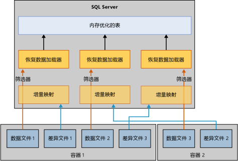

# 内存优化表的还原和恢复
[!INCLUDE[appliesto-ss-xxxx-xxxx-xxx-md](../../includes/appliesto-ss-xxxx-xxxx-xxx-md.md)]

恢复或还原使用内存优化表的数据库的基础机制类似于仅使用基于磁盘表的数据库的机制。 但与基于磁盘的表不同，必须首先将内存优化表加载到内存中，然后数据库才可用于用户访问。 此要求会在数据库恢复中添加一个新步骤。  
  
如果服务器没有足够可用内存，数据库恢复会失败，并且数据库会被标记为可疑。 要解决此问题，请参阅[解决内存不足问题](resolve-out-of-memory-issues.md)。 
  
## 影响加载时间的因素
在恢复或还原操作过程中，内存中 OLTP 引擎读取数据和差异文件以将其载入物理内存。 加载时间由以下因素决定：  
  
-   要加载的数据量。  
  
-   顺序 I/O 带宽。  
  
-   并行度，由文件容器数和处理器核心数决定。  
  
-   日志的活动部分中需重做的日志记录数。  

## 恢复阶段
[!INCLUDE[ssNoVersion](../../includes/ssnoversion-md.md)] 重启时，每个数据库都会经历包含三个阶段的恢复过程：  
  
1.  **分析**。 在此阶段中，将对活动事务日志执行一遍，以便检测已提交和未提交事务。 内存中 OLTP 引擎标识检查点以便加载和预加载其系统表日志条目。 它还处理某些文件分配日志记录。  
  
2.  **重做**。 此阶段在基于磁盘的表和内存优化表上同时运行。  
  
    - 对于基于磁盘的表，数据库将移到当前时间点并且获取未提交事务持有的锁。  
  
    - 对于内存优化表，数据和差异文件对中的数据将被加载到内存中。 然后，数据基于最新持久性检查点的活动事务日志进行更新。  
  
    在基于磁盘的表和内存优化表上的前述操作完成后，数据库将可供访问。  
  
3.  **撤消**。 在此阶段中，将回滚未提交的事务。  
  
## 缩短加载时间的进程
将内存优化表加载到内存中可能会影响恢复时间目标 (RTO) 的性能。 为缩短从数据和差异文件加载内存优化的数据的时间，内存中 OLTP 引擎按如下所示并行加载数据/差异文件：  
  
-   **创建增量映射筛选器**。 差异文件存储对已删除行的引用。 每个容器的一个线程读取差异文件并且创建增量映射筛选器。 （内存优化数据文件组可以具有一个或多个容器。）  
  
-   **对数据文件进行流式处理**。 在创建了增量映射筛选器后，可使用与逻辑 CPU 数量一样多的线程读取数据文件。 每个线程都读取数据行、检查关联的增量映射并且仅将尚未标记为删除的行插入表中。 在某些情况下，此部分的恢复可能是受到 CPU 的约束的，如下图所述：  
  
      
  
## 数据加载缓慢的特定情况
内存优化表通常可按 I/O 速度加载到内存中，但有时将数据行加载到内存中将会较慢。 具体情况为：  
  
-   针对哈希索引的较低的存储桶计数可能会导致过多冲突，致降低插入数据行的速度。 这通常导致较高的 CPU 使用吞吐量，尤其是在恢复即将结束时。 如果正确配置了哈希索引，则不应影响恢复时间。  
  
-   具有一个或多个非聚集索引的大型内存优化表可能引起高 CPU 利用率。 非聚集索引会动态增长，这一点与哈希索引不同，后者在创建时就会确定其桶计数大小。  
  
## 另请参阅  
 [内存优化表的备份、还原和恢复](http://msdn.microsoft.com/library/3f083347-0fbb-4b19-a6fb-1818d545e281)  
  
  
