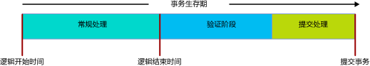

# <a name="transactions-with-memory-optimized-tables"></a>具有内存优化表的事务
[!INCLUDE[appliesto-ss-asdb-xxxx-xxx-md](../../includes/appliesto-ss-asdb-xxxx-xxx-md.md)]

本文介绍特定于内存优化表和本机编译存储过程的事务的所有方面。  
  
SQL Server 中的事务隔离级别以不同的方式应用到内存优化表与基于磁盘的表，并且基础机制不同。 了解差异可帮助程序员设计高吞吐量系统。 在所有情况下，事务完整性的目标是相同的。  

有关特定于内存优化表上的事务的错误条件，请跳转到 [冲突检测和重试逻辑](#conflict-detection-and-retry-logic)一节。
  
有关一般信息，请参见 [SET TRANSACTION ISOLATION LEVEL (Transact-SQL)](../../t-sql/statements/set-transaction-isolation-level-transact-sql.md)。  
  
## <a name="pessimistic-versus-optimistic"></a>悲观和乐观  
  
出现功能差异是因为实现事务完整性的方法包括悲观与乐观。 内存优化表使用乐观方法：  
  
- 悲观方法使用锁来阻止发生潜在冲突。 执行语句时使用锁，提交事务时释放锁。  
  
- 乐观方法在冲突发生时检测到这些冲突，并在提交时间执行验证检查。  
  - 内存优化表不能发生 1205 死锁错误。  
  
乐观方法的开销更小且通常更高效，部分原因是大多数应用程序很少发生事务冲突。 悲观方法和乐观方法之间的主要功能差异在于，如果发生冲突，使用悲观方法时，你需要等待，而使用乐观方法时，其中一个事务将失败并需要客户端重试。 强制 REPEATABLE READ 隔离级别时，功能差异较大；强制 SERIALIZABLE 级别时，功能差异最大。  
  
## <a name="transaction-initiation-modes"></a>事务启动模式  
  
SQL Server 提供以下事务启动模式：  
  
- **自动提交** — 启动简单的查询或 DML 语句将隐式打开事务，结束语句将隐式提交事务。 “自动提交”为默认设置  。  
  - 在自动提交模式下，通常你不需要在 FROM 子句中编写内存优化表上事务隔离级别的相关表提示。  
  
- **显式** - Transact-SQL 包含代码 BEGIN TRANSACTION，以及最终的 COMMIT TRANSACTION。 可将两个或更多个语句并入同一个事务。  
  - 在显式模式下，必须在 FROM 子句中使用数据库选项 MEMORY_OPTIMIZED_ELEVATE_TO_SNAPSHOT 或编写内存优化表上事务隔离级别的相关表提示代码。  
  
- **隐式** - 强制 SET IMPLICIT_TRANSACTION ON 时。 更好的名称可能是 IMPLICIT_BEGIN_TRANSACTION，因为当 0 = @@trancount 时，此选项的唯一用途是在每个 UPDATE 语句前面隐式执行显 BEGIN TRANSACTION 的等效项。 因此，你的 T-SQL 代码最终将发出显式 COMMIT TRANSACTION。   
  
- **ATOMIC 块** - ATOMIC 块中的所有语句始终作为单个事务的一部分运行。 成功时 ATOMIC 块的操作将作为一个整体提交，或者失败时这些操作将全部回滚。 每个本机编译的存储过程都需要一个 ATOMIC 块。  
  
### <a name="code-example-with-explicit-mode"></a>使用显式模式的代码示例  
  
以下解释的 Transact-SQL 脚本使用：  
  
- 一个显式事务。
- 一个名为 dbo.Order_mo 的内存优化表。
- READ COMMITTED 事务隔离级别上下文。  
  
因此，必须对内存优化表编写表提示。 该提示必须针对 SNAPSHOT 甚至更高的隔离级别。 在代码示例中，该提示为 WITH (SNAPSHOT)。 如果删除了此提示，脚本将出现错误 41368，在这种情况下，自动重试将不合适：  

#### <a name="error-41368"></a>错误 41368

只支持对自动提交事务使用 READ COMMITTED 隔离级别访问内存优化表。 显式或隐式事务不支持此隔离级别。 使用表提示（例如 WITH (SNAPSHOT)）为内存优化表提供一种支持的隔离级别。

```sql
SET TRANSACTION ISOLATION LEVEL READ COMMITTED;  
GO  

BEGIN TRANSACTION;  -- Explicit transaction.  

-- Order_mo  is a memory-optimized table.  
SELECT * FROM  
           dbo.Order_mo  as o  WITH (SNAPSHOT)  -- Table hint.  
      JOIN dbo.Customer  as c  on c.CustomerId = o.CustomerId;  
COMMIT TRANSACTION;
```

通过使用数据库选项 `WITH (SNAPSHOT)` 可避免使用 `MEMORY_OPTIMIZED_ELEVATE_TO_SNAPSHOT` 提示的需求。 如果将此选项设置为 `ON`，访问内存优化表时使用的较低隔离级别将自动提升到 SNAPSHOT 隔离。  

```sql
ALTER DATABASE CURRENT
    SET MEMORY_OPTIMIZED_ELEVATE_TO_SNAPSHOT = ON;
```

## <a name="row-versioning"></a>行版本控制  
  
内存优化表使用高度复杂的行版本控制系统，即使在最严格的隔离级别 SERIALIZABLE 上，该系统也能有效地实现乐观方法。 有关详细信息，请参阅 [Introduction to Memory-Optimized Tables](../../relational-databases/in-memory-oltp/introduction-to-memory-optimized-tables.md)（内存优化表简介）。  
  
当 READ_COMMITTED_SNAPSHOT 或 SNAPSHOT 隔离级别生效时，基于磁盘的表间接获得一个行版本控制系统。 此系统基于 tempdb，而内存优化数据结构内置有行版本控制，可实现最大效率。  
  
## <a name="isolation-levels"></a>隔离级别 
  
下表按照从低到高的顺序列出了可能的事务隔离级别。 有关可能发生的冲突以及用于处理这些冲突的重试逻辑的详细信息，请参阅 [冲突检测和重试逻辑](#conflict-detection-and-retry-logic)。 
  
| 隔离级别 | 说明 |   
| :-- | :-- |   
| READ UNCOMMITTED | 不可用：无法在 Read Uncommitted 隔离下访问内存优化表。 如果通过使用 WITH (SNAPSHOT) 表提示，或通过将数据库设置 MEMORY_OPTIMIZED_ELEVATE_TO_SNAPSHOT 设为 ON，将会话级别 TRANSACTION ISOLATION LEVEL 设置为 READ UNCOMMITTED，则仍有可能在 SNAPSHOT 隔离下访问内存优化表。 | 
| READ COMMITTED | 仅当自动提交模式生效时，内存优化表才支持此隔离级别。 如果通过使用 WITH (SNAPSHOT) 表提示，或通过将数据库设置 MEMORY_OPTIMIZED_ELEVATE_TO_SNAPSHOT 设为 ON，将会话级别 TRANSACTION ISOLATION LEVEL 设置为 READ COMMITTED，则仍有可能在 SNAPSHOT 隔离下访问内存优化表。<br/><br/>如果数据库选项 READ_COMMITTED_SNAPSHOT 设置为 ON，则不允许使用相同的语句在 READ COMMITTED 隔离下访问内存优化表和基于磁盘的表。 |  
| SNAPSHOT | 受内存优化表的支持。 <br/><br/> 对于内存优化表，SNAPSHOT 本质上是要求最低的事务隔离级别。 <br/><br/> SNAPSHOT 使用的系统资源比 REPEATABLE READ 或 SERIALIZABLE 要少。 |  
| REPEATABLE READ | 受内存优化表的支持。 REPEATABLE READ 隔离提供以下保证：在提交时，任何并发事务均未更新此事务所读取的任何行。 <br/><br/> 由于使用的是乐观模型，系统并不会阻止并发事务更新此事务所读取的行。 相反，在提交时，此事务已验证是否违反了 REPEATABLE READ 隔离。 如果已违反，此事务将回滚，并且必须重试。 | 
| SERIALIZABLE | 受内存优化表的支持。 <br/><br/> 之所以称为 *Serializable* ，是因为该隔离非常严格，以致事务有点像是串行而不是并行运行的。 | 

## <a name="transaction-phases-and-lifetime"></a>事务阶段和生存期  
  
如果涉及到内存优化表，事务在各个阶段经历的生存期如下图所示：
  
  
  
下面是阶段的描述。  
  
#### <a name="regular-processing-phase-1-of-3"></a>常规处理：第 1 阶段（共 3 个）  
  
- 此阶段包括执行所有查询及查询中的 DML 语句。  
- 在此阶段，语句从事务的逻辑开始时间起将看到内存优化表的版本。  
  
#### <a name="validation-phase-2-of-3"></a>验证：第 2 阶段（共 3 个）  
  
- 验证阶段首先分配结束时间，从而以逻辑方式将事务标记为完成。 此阶段完成后将使对事务进行的所有更改对依赖此事务的其他事务可见。 在此事务已成功提交之前将无法提交依赖于它的事务。 此外，不允许存在这种依赖关系的事务向客户端返回结果集，以确保客户端只看到已成功提交到数据库的数据。  
- 此阶段包括可重复读验证和可序列化验证。 在可重复读验证中，它将检查该事务所读取的任何行从被读取以来是否有更新。 在可序列化验证中，它将检查是否向此事务所扫描的任何数据区域插入了任何行。 按[隔离级别和冲突](#isolation-levels)中的表所述，使用快照隔离时，可能会同时发生可重复读验证和可序列化验证，以验证唯一约束和外键约束的一致性。  
  
#### <a name="commit-processing-phase-3-of-3"></a>提交处理：第 3 阶段（共 3 个）  
  
- 在提交阶段，对持久表的更改会写入日志，随后日志会写入磁盘。 然后，控制权将返回给客户端。  
- 在提交处理完成后，所有依赖事务都会收到它们可以提交的通知。  
  
与往常一样，你应该尽管保持事务工作单元的精简，只要能够满足数据需求即可。  
  
## <a name="conflict-detection-and-retry-logic"></a>冲突检测和重试逻辑 

有两种与事务相关的错误条件会导致事务失败并回滚。 在大多数情况下，一旦发生这种故障，就需要重试事务，这类似于发生死锁时的情况。
- 并发事务之间的冲突。 这些是更新冲突和验证失败，可能是由于发生了事务隔离级别冲突或约束冲突。
- 依赖项失败。 这些是由于你依赖的事务无法提交，或者由于依赖项的数量变得过多而导致的。

下面是当事务访问内存优化表时可能导致事务失败的错误条件。

| 错误代码 | 说明 | 原因 |
| :-- | :-- | :-- |
| **41302** | 尝试更新自从启动现有事务以来，已在其他事务中更新的行。 | 如果两个并发事务试图同时更新或删除同一行，则会发生此错误条件。 其中一个事务会收到此错误消息，并需要重试。 <br/><br/>  | 
| **41305**| 可重复读验证失败。 此事务从内存优化表中读取的行已由另一个在此事务提交前提交的事务更新。 | 如果使用 REPEATABLE READ 或 SERIALIZABLE 隔离，并且某个并发事务的操作导致外键约束冲突，则会发生此错误。 <br/><br/>这种并发的外键约束冲突很少见，一般表示应用程序逻辑或数据输入出现了问题。 但是，如果外键约束所涉及的列上没有索引，也会发生此错误。 因此，建议始终在内存优化表中的外键列上创建索引。 <br/><br/> 有关外键冲突导致的验证失败的更多详细注意事项，请参阅 SQL Server 客户咨询团队发布的 [这篇博客文章](https://blogs.msdn.microsoft.com/sqlcat/2016/03/24/considerations-around-validation-errors-41305-and-41325-on-memory-optimized-tables-with-foreign-keys/) 。 |  
| **41325** | 可序列化验证失败。 将新行插入到了现有事务之前已扫描的区域。 我们将此称为虚拟行。 | 如果使用 SERIALIZABLE 隔离，并且某个并发事务的操作导致主键约束、唯一约束或外键约束冲突，则会发生此错误。 <br/><br/> 这种并发的约束冲突很少见，一般表示应用程序逻辑或数据输入出现了问题。 但是，如果外键约束所涉及的列上没有索引，也会发生此错误，这一点与可重复读验证失败相似。 |  
| **41301** | 依赖项失败：依赖另一个事务，但该事务随后无法提交。 | 此事务 (Tx1) 在另一个事务 (Tx2) 处于其验证或提交处理阶段时，通过读取该事务 (Tx2) 写入的数据依赖于 Tx2。 Tx2 随后无法提交。 Tx2 无法提交最常见的原因是可重复读 (41305) 和可序列化 (41325) 验证失败；不太常见的原因是日志 IO 失败。 |
| 41823  和 41840  | 已达到内存优化表和表变量中的用户数据配额。 | 错误 41823 适用于 SQL Server Express/Web/Standard Edition，以及 [!INCLUDE[sssdsfull](../../includes/sssdsfull-md.md)] 中的单一数据库。 错误 41840 适用于 [!INCLUDE[sssdsfull](../../includes/sssdsfull-md.md)] 中的弹性池。 <br/><br/> 在大多数情况下，这些错误表示已达到最大用户数据大小。从内存优化表中删除数据可解决该错误。 但是，也存在极少数特殊情况，即此错误是暂时性的。 因此，我们建议在第一次遇到这些错误时重试。<br/><br/> 同此列表中的其他错误一样，错误 41823 和 41840 会导致活动事务中止。 |
| **41839** | 事务超出了最大提交依赖项数目。 |适用对象：  [!INCLUDE[ssSQL15](../../includes/sssql15-md.md)]。 更高版本的 [!INCLUDE[ssnoversion](../../includes/ssnoversion-md.md)] 和 [!INCLUDE[sssdsfull](../../includes/sssdsfull-md.md)]没有提交依赖关系数量限制。<br/><br/> 给定事务 (Tx1) 可以依赖的事务数具有限制。 这些事务是传出依赖项。 此外，可以依赖给定事务 (Tx1) 的事务数也有限制。 这些事务是传入依赖项。 两个限制均为 8。 <br/><br/> 导致此失败最常见的情况是有大量读取事务正在访问由单个写入事务写入的数据。 如果所有读取事务都在对相同数据执行大范围扫描，并且写入事务的验证或提交处理时间很长，例如，写入事务在 SERIALIZABLE 隔离下执行大范围扫描（延长了验证阶段的持续时间）或事务日志放置在慢速日志 IO 设备上（延长了提交处理的持续时间），则发生这种情况的可能性会增加。 如果读取事务正在执行大范围扫描，但只需访问几行数据，则可能缺少索引。 同样，如果写入事务正在 SERIALIZABLE 隔离下执行大范围扫描，但只需访问几行数据，这也是缺少索引的征兆。 <br/><br/> 可以使用跟踪标志 9926  解除提交依赖关系数量限制。 只有在确认不缺少索引后仍发生此错误条件时，才使用此跟踪标志，因为它可能会掩盖上述情况中的这些问题。 另需注意的是，复杂的依赖关系图会导致系统效率低下，这里的复杂是指每个事务都有大量传入和传出依赖项，并且每个事务都有许多层依赖关系。  |
  
### <a name="retry-logic"></a>重试逻辑 

当事务由于上述任何条件失败时，应重试该事务。
  
可以在客户端或服务器端实现重试逻辑。 一般建议在客户端实现重试逻辑，因为它效率更高，并且可让你在失败发生前处理事务返回的结果集。  
  
#### <a name="retry-t-sql-code-example"></a>重试 T-SQL 代码示例  
  
使用 T-SQL 的服务器端重试逻辑应仅用于不向客户端返回任何结果集的事务。 否则，重试可能会导致出现预期返回到客户端的那些结果集以外的其他结果集。  
  
以下解释的 T-SQL 脚本演示了可对涉及内存优化表的事务冲突相关的错误使用的重试逻辑。

```sql
-- Retry logic, in Transact-SQL.
DROP PROCEDURE If Exists usp_update_salesorder_dates;
GO

CREATE PROCEDURE usp_update_salesorder_dates
AS
BEGIN
    DECLARE @retry INT = 10;

    WHILE (@retry > 0)
    BEGIN
        BEGIN TRY
            BEGIN TRANSACTION;

            UPDATE dbo.SalesOrder_mo WITH (SNAPSHOT)
                set OrderDate = GetUtcDate()
                where CustomerId = 42;

            UPDATE dbo.SalesOrder_mo WITH (SNAPSHOT)
                set OrderDate = GetUtcDate()
                where CustomerId = 43;

            COMMIT TRANSACTION;

            SET @retry = 0;  -- //Stops the loop.
        END TRY

        BEGIN CATCH
            SET @retry -= 1;

            IF (@retry > 0 AND
                ERROR_NUMBER() in (41302, 41305, 41325, 41301, 41823, 41840, 41839, 1205)
                )
            BEGIN
                IF XACT_STATE() = -1
                    ROLLBACK TRANSACTION;

                WAITFOR DELAY '00:00:00.001';
            END
            ELSE
            BEGIN
                PRINT 'Suffered an error for which Retry is inappropriate.';
                THROW;
            END
        END CATCH

    END -- //While loop
END;
GO

--  EXECUTE usp_update_salesorder_dates;
```

## <a name="cross-container-transaction"></a>跨容器事务  
  
如果事务符合以下条件，可将其称之为跨容器事务：  
  
- 从解释的 Transact-SQL 访问内存优化表；或  
- 当事务已打开时 (XACT_STATE() = 1) 执行本机过程。 

术语“跨容器”源于这样的事实：事务跨两个事务管理容器运行，一个用于基于磁盘的表，另一个用于内存优化表。  
  
在单个跨容器事务中，可以使用不同的隔离级别来访问基于磁盘的表和内存优化表。 这种差异通过显式表提示（如 WITH (SERIALIZABLE)）或数据库选项 MEMORY_OPTIMIZED_ELEVATE_TO_SNAPSHOT（如果事务隔离级别配置为 READ COMMITTED 或 READ UNCOMMITTED，此选项会将内存优化表的隔离级别隐式提升为 SNAPSHOT）来体现。  
  
在以下 Transact-SQL 代码示例中：  
  
- 基于磁盘的表 Table_D1 通过使用 READ COMMITTED 隔离级别来访问。  
- 内存优化表 Table_MO7 通过使用 SERIALIZABLE 隔离级别来访问。 Table_MO6 没有特定的关联隔离级别，因为插入操作始终是一致的，并且实质上在 SERIALIZABLE 隔离下执行。  


```sql
-- Different isolation levels for
-- disk-based tables versus memory-optimized tables,
-- within one explicit transaction.

SET TRANSACTION ISOLATION LEVEL READ COMMITTED;
go

BEGIN TRANSACTION;

    -- Table_D1 is a traditional disk-based table, accessed using READ COMMITTED isolation.

    SELECT * FROM Table_D1;


    -- Table_MO6 and Table_MO7 are memory-optimized tables.
    -- Table_MO7 is accessed using SERIALIZABLE isolation,
    --   while Table_MO6 does not have a specific isolation level.

    INSERT Table_MO6
        SELECT * FROM Table_MO7 WITH (SERIALIZABLE);

COMMIT TRANSACTION;
go
```

## <a name="limitations"></a>限制  
  
- 内存优化表不支持跨数据库事务。 如果某个事务访问内存优化表，该事务无法访问其他任何数据库，但以下数据库除外：  
  - tempdb 数据库。  
  - 对 master 数据库进行的只读访问。  
  
- 不支持分布式事务：使用 BEGIN DISTRIBUTED TRANSACTION 时，事务无法访问内存优化表。  
  
## <a name="natively-compiled-stored-procedures"></a>本机编译的存储过程  
  
- 在本机过程中，ATOMIC 块必须声明整个块的事务隔离级别，例如：  
  - `... BEGIN ATOMIC WITH (TRANSACTION ISOLATION LEVEL = SNAPSHOT, ...) ...`  
  
- 本机过程的正文中不允许显式事务控制语句。 不允许 BEGIN TRANSACTION、ROLLBACK TRANSACTION 等等。  
  
- 有关使用 ATOMIC 块控制事务的详细信息，请参阅 [ATOMIC 块](atomic-blocks-in-native-procedures.md)  
  
## <a name="other-transaction-links"></a>其他事务链接  
  
- [SET IMPLICIT_TRANSACTIONS](../../t-sql/statements/set-implicit-transactions-transact-sql.md)  
  
- [sp_getapplock (Transact-SQL)](../../relational-databases/system-stored-procedures/sp-getapplock-transact-sql.md)  
  
- [数据库引擎中基于行版本控制的隔离级别](https://msdn.microsoft.com/library/ms177404.aspx)  
  
- [控制事务持续性](../../relational-databases/logs/control-transaction-durability.md)   
