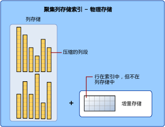

# 列存储索引 - 体系结构
[!INCLUDE[tsql-appliesto-ss2016-xxxx-xxxx-xxx_md](../../includes/tsql-appliesto-ss2016-xxxx-xxxx-xxx-md.md)]

了解列存储索引的体系结构。 掌握这些基础知识可以更轻松地理解其他介绍如何有效使用列存储索引的文章。

## 数据存储使用列存储索引和行存储压缩
在提到列存储索引时，我们经常使用术语“行存储”和“列存储”来强调数据存储的格式。  列存储索引使用这两种类型的存储。

 

- “列存储”是在逻辑上组织为包含行和列的表、在物理上以按列数据格式存储的数据。
  
列存储索引使用列存储格式以物理方式存储大部分数据。 使用列存储格式时，数据将以列的形式压缩和解压缩。 不需要解压缩每个行中未由查询请求的其他值。 这样，便可以快速扫描大型表的整个列。 

- “行存储”是在逻辑上组织为包含行和列的表、在物理上以按行数据格式存储的数据。 这一直是存储关系表数据（例如堆或群集“B 树”索引）的传统方法。

列存储索引还使用称为增量存储的行存储格式以物理方式存储某些行。 增量存储（也称为增量行组）是数量太少，不符合压缩到列存储中的条件的行的保存位置。 每个增量行组作为聚集 B 树索引实现。 

- **增量存储**是数量太少，无法压缩到列存储中的行的保存位置。 增量存储是行存储。 
  
## 针对行组和列段执行操作

列存储索引将行分组成可管理的单元。 其中每个单元称为行组。 为提供最佳性能，行组中的行数大到能够提高压缩率，同时又小到能够从内存中操作受益。

* **行组**是列存储索引针对其执行管理和压缩操作的行的组。 

例如，列存储索引针对行组执行以下操作：

* 将行组压缩到列存储中。 针对行组中的每个列段执行压缩。
* 在 ALTER INDEX REORGANIZE 操作期间合并行组。
* 在 ALTER INDEX REBUILD 操作期间创建新行组。
* 在动态管理视图 (DMV) 中报告行组运行状况和碎片。

增量存储由一个或多个称为增量行组的行组构成。 每个增量行组是一个聚集 B 树索引，用于存储数量太少，无法压缩到列存储中的行。  

* **增量行组**是一个聚集 B 树索引，用于存储较小的批量加载和插入操作，直到行组包含 1,048,576 行或者重新生成了索引。  当增量行组包含 1,048,576 行时，将被标记为已关闭，等待称为 tuple-mover 的进程将它压缩到列存储中。 

每个列在每个行组中都有自身的一些值。 这些值称为列段。 当列存储索引压缩行组时，会单独压缩每个列段。 若要解压缩整个列，列存储索引只需解压缩每个行组中的一个列段。

* **列段**是行组中列值的一部分。 每个行组包含表中每个列的一个列段。 每个列在每个行组中有一个列段。| 
  
   
 
## 小规模加载和插入操作转到增量存储
列存储索引一次至少可将 102,400 个行压缩到列存储索引中，以此提高列存储的压缩率和性能。 若要批量压缩行，列存储索引可在增量存储中累积小规模的加载和插入操作。 增量存储操作在后台处理。 若要返回正确的查询结果，聚集列存储索引将合并来自列存储和增量存储的查询结果。 

在以下情况下，行将转到增量存储：
* 行是使用 INSERT INTO VALUES 语句插入的。
* 行位于批量加载操作的末尾，并且编号小于 102,400。
* 更新。 每个更新操作实现为删除并插入。

增量存储中还会存储标记为已删除、但实际并未从列存储中删除的已删除行的 ID 列表。 

## 增量行组已满时将压缩到列存储中

聚集列存储索引最多收集每个增量行组中的 1,048,576 行，达到此数字后，会将行组压缩到列存储中。 这可以提高列存储索引的压缩率。 如果增量行组包含 1,048,576 行，列存储索引会将行组标记为已关闭。 名为 *tuple-mover* 的后台进程查找每个已关闭的行组并将其压缩到列存储中。 

可以通过使用 [ALTER INDEX](../../t-sql/statements/alter-index-transact-sql.md) 重新生成或重新组织索引，强制将增量行组压缩到列存储中。  请注意，如果在压缩期间遇到内存压力，列存储索引可能会减少压缩行组中的行数。

## 每个表分区具有自身的行组和增量行组

索引、堆和列存储索引中的分区概念是相同的。 将表分区会根据列值范围将表划分为较小的行组。 分区通常用于管理数据。 例如，可为每年的数据创建一个分区，然后使用分区切换将数据存档到更经济的存储中。 分区切换适用于列存储索引，可让你轻松将数据分区移到另一个位置。

行组始终在表分区中定义。 将某个列存储索引分区后，每个分区都有其自身的压缩行组和增量行组。

### 每个分区可以包含多个增量行组
每个分区可以包含多个增量行组。 如果列存储索引需要将数据添加到增量行组，而增量行组已锁定，则列存储索引会尝试获取其他增量行组中的锁。 如果没有任何可用的增量行组，列存储索引将创建新的增量行组。  例如，具有 10 个分区的表可以轻松包含 20 个或更多的增量行组。 

  
## 可以在同一个表中组合列存储索引和行存储索引
非聚集索引包含基础表中部分或全部行与列的副本。 索引将定义为表的一个或多个列，并具有一个用于筛选行的可选条件。 

从 [!INCLUDE[ssSQL15](../../includes/sssql15-md.md)]开始，你可以在行存储表上创建可更新的非聚集列存储索引。 列存储索引将存储数据的副本，因此你需要提供额外的存储。 但是，列存储索引中的数据压缩成的大小比行存储表所需的大小更小。  如果采取这种做法，你可以同时对列存储索引以及行存储索引上的事务运行分析。 当行存储表中的数据更改时，列存储将会更新，因此这两个索引适用于相同的数据。  
  
 从 [!INCLUDE[ssSQL15](../../includes/sssql15-md.md)]开始，你可以对一个列存储索引使用一个或多个非聚集行存储索引。 这样，便可以针对基础列存储上执行有效的表查找。 其他选项也可供使用。 例如，可以通过在行存储表中使用 UNIQUE 约束来强制主键约束。 由于不唯一的值无法插入行存储表，SQL Server 无法将值插入列存储。  
 

## 元数据  
使用这些元数据视图可以查看列存储索引的属性。 其他体系结构信息嵌入在其中的某些视图中。

请注意，列存储索引中的所有列在元数据中存储为包含的列。 列存储索引中没有任何键列。  
  
-   [sys.indexes (Transact-SQL)](../../relational-databases/system-catalog-views/sys-indexes-transact-sql.md)  
  
-   [sys.index_columns (Transact-SQL)](../../relational-databases/system-catalog-views/sys-index-columns-transact-sql.md)  
  
-   [sys.partitions (Transact-SQL)](../../relational-databases/system-catalog-views/sys-partitions-transact-sql.md)  
  
-   [sys.internal_partitions (Transact-SQL)](../../relational-databases/system-catalog-views/sys-internal-partitions-transact-sql.md)  
  
-   [sys.column_store_segments (Transact-SQL)](../../relational-databases/system-catalog-views/sys-column-store-segments-transact-sql.md)  
  
-   [sys.column_store_dictionaries (Transact-SQL)](../../relational-databases/system-catalog-views/sys-column-store-dictionaries-transact-sql.md)  
  
-   [sys.column_store_row_groups (Transact-SQL)](../../relational-databases/system-catalog-views/sys-column-store-row-groups-transact-sql.md)  
  
-   [sys.dm_db_column_store_row_group_operational_stats (Transact-SQL)](../../relational-databases/system-dynamic-management-views/sys-dm-db-column-store-row-group-operational-stats-transact-sql.md)  
  
-   [sys.dm_db_column_store_row_group_physical_stats (Transact-SQL)](../../relational-databases/system-dynamic-management-views/sys-dm-db-column-store-row-group-physical-stats-transact-sql.md)  
  
-   [sys.dm_column_store_object_pool (Transact-SQL)](../../relational-databases/system-dynamic-management-views/sys-dm-column-store-object-pool-transact-sql.md)  
  
-   [sys.dm_db_column_store_row_group_operational_stats (Transact-SQL)](../../relational-databases/system-dynamic-management-views/sys-dm-db-column-store-row-group-operational-stats-transact-sql.md)  
  
-   [sys.dm_db_index_operational_stats (Transact-SQL)](../../relational-databases/system-dynamic-management-views/sys-dm-db-index-operational-stats-transact-sql.md)  
  
-   [sys.dm_db_index_physical_stats (Transact-SQL)](../../relational-databases/system-dynamic-management-views/sys-dm-db-index-physical-stats-transact-sql.md)  
  
|  

## 后续步骤
 有关设计列存储索引的指南，请参阅[列存储索引 - 设计指南](../../relational-databases/indexes/columnstore-indexes-design-guidance.md)

