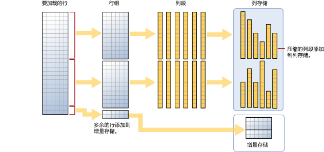

# <a name="columnstore-indexes---data-loading-guidance"></a>列存储索引 - 数据加载指南

[!INCLUDE[SQL Server Azure SQL Database Synapse Analytics PDW ](../../includes/applies-to-version/sql-asdb-asdbmi-asa-pdw.md)]

使用标准 SQL 大容量加载和渗透插入方法将数据加载到列存储索引的选项和建议。 将数据加载到列存储索引是任何数据仓库过程必不可少的组成部分，因为它会将数据移到索引中，准备进行分析。
  
 你是列存储索引的初学者？ 请参阅[列存储索引 - 概述](../../relational-databases/indexes/columnstore-indexes-overview.md)和[列存储索引 - 体系结构](../../relational-databases/sql-server-index-design-guide.md#columnstore_index)。
  
## <a name="what-is-bulk-loading"></a>什么是大容量加载？
*大容量加载*指的是将大量的行添加到数据存储的方式。 这是将数据移到列存储索引的最高效方法，因为它对成批的行进行操作。 大容量加载将行组填充到最大容量，并将它们直接压缩到列存储中。 只有在加载结束时未达到每行组至少 102,400 行的行才会进入增量存储。  

要执行大容量加载，可以使用 [bcp 实用工具](../../tools/bcp-utility.md)、[Integration Services](../../integration-services/sql-server-integration-services.md)，或从临时表中选择行。

  
  
如图所示，大容量加载：
  
- 不会预先为数据排序。 按接收顺序将数据插入行组。
- 如果批大小 >= 102400，行将直接插入压缩的行组。 建议选择不低于 102400 的批大小，以提高批量导入的效率，因为这样可以避免在后台线程“元组发动机 (TM)”最终将行移到压缩行组之前，将数据行移到增量行组。
- 如果批大小 < 102,400 或者剩余行数 < 102,400，行会载入增量行组。

> [!NOTE]
> 在包含非聚集列存储索引数据的行存储表上， [!INCLUDE[ssNoVersion](../../includes/ssnoversion-md.md)] 始终将数据插入到基表。 数据永远不会直接插入到列存储索引。  

大容量加载有以下这些内置的性能优化：
-   **并行加载：** 你可以有多个并发大容量加载（使用 bcp 或批量插入），每个都加载一个单独的数据文件。 与行存储大容量加载到 [!INCLUDE[ssNoVersion](../../includes/ssnoversion-md.md)] 不同，不需要指定 `TABLOCK`，因为每个批量导入线程都以独占方式将数据载入具有排他锁的独立行组（压缩或增量行组）。 

-   **日志记录减小：** 直接加载到压缩行组中的数据会导致显著减小日志大小。 例如，如果 10 倍压缩数据，则相应事务日志将减小大约 10 倍，无需使用 TABLOCK 或批量记录的/简单恢复模式。 进入增量行组的任何数据都将被完全记录。 这包括任何少于 102400 行的批大小。  最佳做法是使用 batchsize >= 102400。 由于无需 TABLOCK，因此可以并行加载数据。 

-   **最小日志记录：** 如果遵循[最小日志记录](../import-export/prerequisites-for-minimal-logging-in-bulk-import.md)的先决条件，则可以进一步减小日志记录。 但是，与将数据加载到行存储中不同，TABLOCK 会导致表具有 X 锁而不是 BU（批量更新）锁，因此无法完成并行数据加载。 有关锁定的详细信息，请参阅[锁定和行版本控制](../sql-server-transaction-locking-and-row-versioning-guide.md)。

-   **锁定优化：** 在将数据加载到压缩行组时，将自动获取行组的 X 锁。 但是，大容量加载到增量行组时，在行组上获取 X 锁，但 [!INCLUDE[ssNoVersion](../../includes/ssnoversion-md.md)] 仍会锁定 PAGE/EXTENT，因为 X 行组锁不是锁定层次结构的一部分。  
  
如果列存储索引上有非聚集 B 树索引，则该索引本身没有锁定优化或日志记录优化，但对聚集列存储索引的上述优化可用。  
  
## <a name="plan-bulk-load-sizes-to-minimize-delta-rowgroups"></a>计划大容量加载大小，以便最大程度地减少增量行组
当大多数的行压缩到列存储中而不位于增量行组中时，列存储索引的性能最佳。 最好调整加载大小，以便行直接进入列存储并尽量绕过增量存储。

以下方案说明何时将加载的行直接转到列存储中以及何时将它们转到增量存储中。 在示例中，每个行组可以具有 102,400-1,048,576 行。 在实践中，如果内存有压力，行组的最大大小可以小于 1,048,576 行。  
  
|要大容量加载的行|已添加到压缩行组的行|已添加到增量行组的行|  
|-----------------------|-------------------------------------------|--------------------------------------|  
|102,000|0|102,000|  
|145,000|145,000<br /><br /> 行组大小：145,000|0|  
|1,048,577|1,048,576<br /><br /> 行组大小：1,048,576。|1|  
|2,252,152|2,252,152<br /><br /> 行组大小：1,048,576、1,048,576、155,000。|0|  
| &nbsp; | &nbsp; | &nbsp; |
  
 以下示例显示将 1,048,577 行加载到表的结果。 这些结果显示列存储（作为压缩的列段）中的一个 COMPRESSED 行组以及增量存储中的 1 行。  
  
```sql  
SELECT object_id, index_id, partition_number, row_group_id, delta_store_hobt_id, 
  state, state_desc, total_rows, deleted_rows, size_in_bytes   
FROM sys.dm_db_column_store_row_group_physical_stats  
```  
  
   
  
## <a name="use-a-staging-table-to-improve-performance"></a>使用临时表提高性能
如果加载数据只是在做运行更多转换之前的预备，将表载入堆表会远快于将数据载入聚集列存储表。 此外，将数据加载到 [临时表][临时] 也会比将表加载到永久性存储快得多。  

 数据加载的常见模式是将数据加载到临时表，执行某种转换，然后使用以下命令将其加载到目标表  
  
```sql  
INSERT INTO <columnstore index>  
SELECT <list of columns> FROM <Staging Table>  
```  
  
 此命令以类似于 BCP 或批量插入的方式将数据加载到列存储索引，但操作是以单个批完成的。 如果临时表中的行数 < 102400，行将加载到增量行组；否则，行将直接加载到压缩行组。 一个重要限制是此 `INSERT` 操作是单线程操作。 要并行加载数据，可以创建多个临时表，或者针对临时表中不重叠的行范围发出 `INSERT`/`SELECT`。 [!INCLUDE[ssSQL15](../../includes/sssql15-md.md)] 中解除了这种限制。 以下命令从临时表并行加载数据，但需要指定 `TABLOCK`。 你可能会发现这与前面提到的有关 bulkload 的内容矛盾，但主要区别在于，在相同事务下执行临时表中的并行数据加载。
  
```sql  
INSERT INTO <columnstore index> WITH (TABLOCK) 
SELECT <list of columns> FROM <Staging Table>  
```  
  
 从临时表加载到聚集列存储索引时，可以使用以下优化：
-   **日志优化：** 将数据加载到压缩行组时，日志记录减小。   
-   **锁定优化：** 加载到压缩行组时将获取行组上的 X 锁。 但是，对于增量行组，在行组上获取 X 锁，但 [!INCLUDE[ssNoVersion](../../includes/ssnoversion-md.md)] 仍会锁定 PAGE/EXTENT 锁，因为 X 行组锁不是锁定层次结构的一部分。  
  
 如果有一个或多个非聚集索引，则不会对索引本身进行锁定或日志记录优化，但是仍可使用如上所述的对聚集列存储索引的优化。  
  
## <a name="what-is-trickle-insert"></a>什么是渗透插入？

*渗透插入*指的是将单个行移到列存储索引的方式。 渗透插入使用 [INSERT INTO](../../t-sql/statements/insert-transact-sql.md) 语句。 使用渗透插入时，所有行将进入增量存储。 这适用于少量的行，但对于较大负载而言并不实用。
  
```sql  
INSERT INTO <table-name> VALUES (<set of values>)  
```  
  
 > [!NOTE]
 > 使用 INSERT INTO 将值插入聚集列存储索引的并发线程可能会将行插入相同的增量存储行组。  
  
 一旦行组包含 1,048,576 行，增量行组就会标记为已关闭但仍可供查询和更新/删除操作使用，但新插入的行会进入现有或新建的增量存储行组。 后台线程 *元组发动机 (TM)* 将每隔大约 5 分钟定期压缩已关闭的增量行组。 你可以显式调用以下命令来压缩已关闭的增量行组  
  
```sql  
ALTER INDEX <index-name> on <table-name> REORGANIZE  
```  
  
 如果你要强制关闭并压缩增量行组，可以执行以下命令。 如果你已完成加载行并且不希望插入任何新行，则可能需要运行此命令。 通过显式关闭并压缩增量行组，可以进一步节省存储空间，提高分析查询性能。 最佳做法之一是在不希望插入新行时调用此命令。  
  
```sql  
ALTER INDEX <index-name> on <table-name> REORGANIZE with (COMPRESS_ALL_ROW_GROUPS = ON)  
```  
  
## <a name="how-loading-into-a-partitioned-table-works"></a>加载到已分区表的工作原理  
 对于已分区数据， [!INCLUDE[ssNoVersion](../../includes/ssnoversion-md.md)] 首先将每一行分配给一个分区，然后对该分区内的数据执行列存储操作。 每个分区都具有自己的行组以及至少一个增量行组。  
  
## <a name="next-steps"></a>后续步骤

博客文章现托管在 techcommunity  上，撰写日期为 2015 年 3 月 11 日：[有关聚集列存储索引的数据加载性能注意事项](https://techcommunity.microsoft.com/t5/DataCAT/Data-Loading-performance-considerations-with-Clustered/ba-p/305223)。
