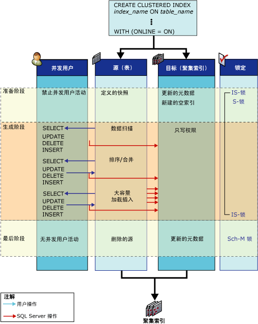

# 联机索引操作的工作方式
[!INCLUDE[appliesto-ss-asdb-xxxx-xxx-md](../../includes/appliesto-ss-asdb-xxxx-xxx-md.md)]

  本主题将定义联机索引操作中存在的结构，并显示与这些结构相关联的活动。  
  
## 联机索引结构  
 为了在索引数据定义语言 (DDL) 操作期间允许执行并发用户活动，在联机索引操作期间使用了以下结构：源和预先存在的索引、目标以及一个临时映射索引（用于联机重新生成堆或删除聚集索引）。  
  
-   **源和预先存在的索引**  
  
     源是指原始表或聚集索引数据。 预先存在的索引是指与源结构相关联的任何非聚集索引。 例如，如果联机索引操作正在重新生成一个与四个非聚集索引相关联的聚集索引，则源就是现有的聚集索引，而预先存在的索引就是这些非聚集索引。  
  
     多名用户可以同时对预先存在的索引执行选择、插入、更新和删除操作。 这包括通过触发器和引用完整性约束执行的大容量插入（支持但不建议执行）和隐式更新。 所有预先存在的索引都用于查询和搜索。 这意味着查询优化器可以选择预先存在的索引，如有必要，还可以在索引提示中指定预先存在的索引。  
  
-   **Target**  
  
     目标是指正在创建或重新生成的新索引（或堆）或一组新索引。 在索引操作期间，用户对源的插入、更新和删除操作是由 [!INCLUDE[ssDEnoversion](../../includes/ssdenoversion-md.md)] 应用到目标的。 例如，如果联机索引操作正在重新生成一个聚集索引，则目标就是重新生成的聚集索引， [!INCLUDE[ssDE](../../includes/ssde-md.md)] 在聚集索引重新生成后不会重新生成非聚集索引。  
  
     提交索引操作之前，在处理 SELECT 语句时不搜索目标索引。 在内部，索引被标记为只写。  
  
-   **临时映射索引**  
  
     用于创建、删除或重新生成聚集索引的联机索引操作还需要用到临时映射索引。 此临时索引由并发事务用来确定当更新或删除了基础表中的行以后，要从正在生成的新索引中删除哪些记录。 此非聚集索引是在创建新聚集索引（或堆）的步骤中创建的，不需要执行单独的排序操作。 并发事务还会在它们的所有插入、更新和删除操作中维护临时映射索引。  
  
## 联机索引活动  
 在简单的联机索引操作 [例如对非索引表（堆）创建聚集索引] 期间，源和目标将经历三个阶段：准备阶段、生成阶段和最后阶段。  
  
 下图显示了联机创建初始聚集索引的过程。 源对象（即堆）没有其他索引。 图中分别显示了每个阶段的源结构活动和目标结构活动；另外还显示了并发的用户选择、插入、更新和删除操作。 准备、生成和最后阶段均与每个阶段使用的锁模式一起指明。  
  
   
  
## 源结构活动  
 下表列出了索引操作每个阶段中涉及源结构的活动以及相应的锁定策略。  
  
|阶段|源活动|源锁|  
|-----------|---------------------|------------------|  
|准备   短暂的阶段|准备系统元数据以创建新的空索引结构。   定义表的一个快照。 即，使用行版本控制提供事务级读一致性。   对源执行的并发用户写操作在短时间内将受到阻止。   不允许执行并发 DDL 操作（创建多个非聚集索引除外）。|对表的 S（共享）*   IS（意向共享）   INDEX_BUILD_INTERNAL_RESOURCE\*\*|  
|生成   主要阶段|在大容量加载操作中对数据进行扫描、排序、合并并将数据插入到目标中。   并发的用户选择、插入、更新和删除操作将被同时应用到预先存在的索引和所有正在生成的新索引。|IS   INDEX_BUILD_INTERNAL_RESOURCE**|  
|最后   短暂的阶段|必须完成所有未提交的更新事务，这一阶段才能开始。 根据获取的锁，所有新的用户读/写事务将在短时间内被阻塞，直到此阶段完成为止。   系统元数据将被更新以便用目标替换源。   如有必要，源将被删除。 例如，在重新生成或删除聚集索引之后。|INDEX_BUILD_INTERNAL_RESOURCE**   如果创建的是非聚集索引，则为对表的 S。\*   如果删除了任何源结构（索引或表），则为 SCH-M（架构修改）。\*|  
  
 \* 索引操作将等待任何未提交的更新事务完成后，才会获取对表的 S 锁或 SCH-M 锁。  
  
 ** 在索引操作执行过程中，资源锁 INDEX_BUILD_INTERNAL_RESOURCE 将阻止对源和预先存在的结构执行并发数据定义语言 (DDL) 操作。 例如，此锁将会阻止为同一表同时重新生成两个索引。 虽然此资源锁与 Sch-M 锁相关联，但它不会阻止数据操作语句。  
  
 上一个表显示了在涉及单个索引的联机索引操作生成阶段获取的单个共享锁（S 锁）。 当在单个联机索引操作中（例如，在为包含一个或多个非聚集索引的表创建初始聚集索引的过程中）生成或重新生成聚集索引和非聚集索引后，在生成阶段将获取两个短期 S 锁，然后再获取长期意向共享 (IS) 锁。 首先获取一个 S 锁以创建聚集索引，当完成聚集索引的创建后，再获取第二个短期 S 锁以创建非聚集索引。 创建完非聚集索引后，S 锁会降级为 IS 锁，直到联机索引操作的最后阶段。  
  
### 目标结构活动  
 下表列出了索引操作每个阶段中涉及目标结构的活动以及相应的锁定策略。  
  
|阶段|目标活动|目标锁|  
|-----------|---------------------|------------------|  
|准备|创建新索引并将其设置为只写。|IS|  
|生成|从源插入数据。   应用已应用到源的用户修改（插入、更新、删除）。   此活动对用户是透明的。|IS|  
|最后|将更新索引元数据。   索引将被设置为读/写状态。|S   或多个   SCH-M|  
  
 在完成索引操作之前，不能通过用户发出的 SELECT 语句来访问目标。  
  
 完成准备阶段和最后阶段之后，存储在过程缓存中的查询和更新计划将失效。 后续查询使用新的索引。  
  
 为联机索引操作所涉及的表声明的游标仅在联机索引阶段有效。 更新游标在每个阶段均无效。 只读游标在最后阶段之后才失效。  
  
## 相关内容  
 [联机执行索引操作](../../relational-databases/indexes/perform-index-operations-online.md)  
  
 [联机索引操作准则](../../relational-databases/indexes/guidelines-for-online-index-operations.md)  
  
  
