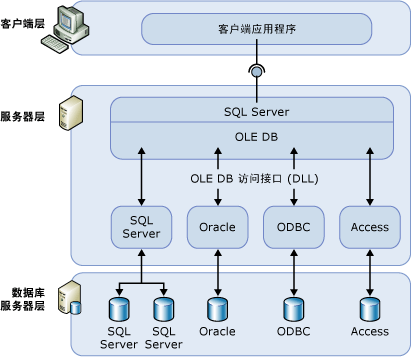

# 链接服务器（数据库引擎）

[!INCLUDE [SQL Server SQL MI](../../includes/applies-to-version/sql-asdbmi.md)]

  通过链接服务器，[!INCLUDE[ssDEnoversion](../../includes/ssdenoversion-md.md)] 和 [!INCLUDE[ssSDSMIfull](../../includes/sssdsmifull-md.md)] 可从远程数据源中读取数据，并针对 [!INCLUDE[ssNoVersion](../../includes/ssnoversion-md.md)] 实例之外的 OLE DB 数据源等远程数据库服务器执行命令。 通常，配置链接服务器是为了支持 [!INCLUDE[ssDE](../../includes/ssde-md.md)] 在 [!INCLUDE[tsql](../../includes/tsql-md.md)] 实例或诸如 Oracle 等其他数据库产品上执行包含表的 [!INCLUDE[ssNoVersion](../../includes/ssnoversion-md.md)]语句。 许多类型的 OLE DB 数据源都可配置为链接服务器，包括 [!INCLUDE[msCoName](../../includes/msconame-md.md)] Access、Excel 和 Azure CosmosDB。

> [!NOTE]
> 链接服务器在 [!INCLUDE[ssDEnoversion](../../includes/ssdenoversion-md.md)] 和 [!INCLUDE[ssSDSMIfull](../../includes/sssdsmifull-md.md)] 中可用。 [!INCLUDE[ssSDSfull](../../includes/sssdsfull-md.md)] 单一实例和弹性池中未启用链接服务器。 这些是部分[可在此处查找到的托管实例中的约束](/azure/sql-database/sql-database-managed-instance-transact-sql-information#linked-servers)。 

## 何时使用链接服务器？

  通过链接服务器，能够实现可在其他数据库中提取和更新数据的分布式数据库。 对于需要实现数据库分片的场景，它们是很好的解决方案，让你无需创建自定义应用程序代码或从远程数据源直接加载。 链接服务器具有以下优点：  
  
-   能够访问 [!INCLUDE[ssNoVersion](../../includes/ssnoversion-md.md)]之外的数据。  
  
-   能够对企业内的异类数据源发出分布式查询、更新、命令和事务。  
  
-   能够以相似的方式确定不同的数据源。  
  
你可以使用 [!INCLUDE[ssManStudioFull](../../includes/ssmanstudiofull-md.md)] 或 [sp_addlinkedserver (Transact-SQL)](../../relational-databases/system-stored-procedures/sp-addlinkedserver-transact-sql.md) 语句配置链接服务器。 OLE DB 访问接口的类型和所需的参数的数量大不相同。 例如，一些访问接口要求你使用 [sp_addlinkedsrvlogin (Transact-SQL)](../../relational-databases/system-stored-procedures/sp-addlinkedsrvlogin-transact-sql.md)之外对 OLE DB 数据源执行命令。 某些 OLE DB 访问接口允许 [!INCLUDE[ssNoVersion](../../includes/ssnoversion-md.md)] 更新数据 OLE DB 源上的数据。 其他访问接口可能仅提供只读数据访问权限。 有关每个 OLE DB 访问接口的信息，请查看该 OLE DB 访问接口的文档。  
  
## 链接服务器组件  
 链接服务器定义指定了下列对象：  
  
-   OLE DB 访问接口  
  
-   OLE DB 数据源  
  
“OLE DB 访问接口”  是管理特定数据源并与其交互的 DLL。 “OLE DB 数据源”  标识可通过 OLE DB 访问的特定数据库。 虽然通过链接服务器定义查询的数据源通常是数据库，但 OLE DB 访问接口对各种文件和文件格式仍可用。 这些文件和文件格式包括文本文件、电子表格数据和全文内容搜索的结果。  
  
从 [!INCLUDE[sql-server-2019](../../includes/sssqlv15-md.md)] 开始，[Microsoft OLE DB Driver for SQL Server (MSOLEDBSQL)](../../connect/oledb/oledb-driver-for-sql-server.md) (PROGID:MSOLEDBSQL) 是默认的 OLE DB 提供程序。 在早期版本中，[SQL Server Native Client OLE DB 提供程序 (SQLNCLI)](../../relational-databases/native-client/sql-server-native-client.md) (PROGID:SQLNCLI11) 是默认的 OLE DB 提供程序。
  
> [!NOTE]  
> [!INCLUDE[ssNoVersion](../../includes/ssnoversion-md.md)] 分布式查询旨在与任何实现所需 OLE DB 接口的 OLE DB 访问接口一起使用。 但是，已针对默认 OLE DB 提供程序测试了 [!INCLUDE[ssNoVersion](../../includes/ssnoversion-md.md)]。  
  
## 链接服务器详细信息  
 下图显示了链接服务器配置的基础。  
  
   
  
通常，链接服务器用于处理分布式查询。 当客户端应用程序通过链接服务器执行分布式查询时， [!INCLUDE[ssNoVersion](../../includes/ssnoversion-md.md)] 将分析命令并向 OLE DB 发送请求。 行集请求的形式可以是对该访问接口执行查询或从该访问接口打开基表。  

> [!NOTE]
> 为使数据源能通过链接服务器返回数据，该数据源的 OLE DB 访问接口 (DLL) 必须与 [!INCLUDE[ssNoVersion](../../includes/ssnoversion-md.md)]的实例位于同一服务器上。  
 
> [!IMPORTANT]
> 使用 OLE DB 提供程序时，运行 [!INCLUDE[ssNoVersion](../../includes/ssnoversion-md.md)] 服务的帐户必须具有对安装提供程序的目录及其所有子目录的读取权限和执行权限。 这包括 Microsoft 发布的提供程序和任何第三方提供程序。

> [!NOTE]
> 使用完全委派时，链接服务器支持 Active Directory 传递身份验证。 自 [!INCLUDE[ssSQL17](../../includes/sssql17-md.md)] CU17 起，还支持使用约束委派的传递身份验证；但是不支持[基于资源的约束委派](/windows-server/security/kerberos/kerberos-constrained-delegation-overview)。

## 管理访问接口  
有一组选项可以控制 [!INCLUDE[ssNoVersion](../../includes/ssnoversion-md.md)] 如何加载和使用注册表中指定的 OLE DB 访问接口。  
  
## 管理链接服务器定义  
设置链接服务器时，请在 [!INCLUDE[ssNoVersion](../../includes/ssnoversion-md.md)]中注册连接信息和数据源信息。 完成注册后，可以用单个逻辑名称来引用该数据源。  
  
可以使用存储过程和目录视图来管理链接服务器定义：  
  
-   通过运行 **sp_addlinkedserver**创建链接服务器定义。  
  
-   通过对 [!INCLUDE[ssNoVersion](../../includes/ssnoversion-md.md)] sys.servers **系统目录视图执行查询，查看有关在** 的特定实例中定义的链接服务器的信息。  
  
-   通过运行 **sp_dropserver**删除链接服务器定义。 还可以使用此存储过程删除远程服务器。  
  
还可以使用 [!INCLUDE[ssManStudioFull](../../includes/ssmanstudiofull-md.md)]来定义链接服务器。 在对象资源管理器中，右键单击“服务器对象”，选择“新建”，再选择“链接服务器”。 通过右键单击链接服务器名称并选择“删除”，可以删除链接服务器定义。  
  
 对链接服务器执行分布式查询时，请对每个要查询的数据源指定由四个部分组成的完全限定的表名。 这个四部分名称格式应为 _linked\_server\_name.catalog_ **.** _schema_ **.** _object\_name_。  
  
> [!NOTE]  
> 可以定义链接服务器指回（环回）到在其上定义它们的服务器。 当在单服务器网络中测试使用分布式查询的应用程序时，环回服务器是很有用的。 环回链接服务器专用于测试，许多操作（如分布式事务）不支持该服务器。  
  
## Related Tasks  
 [创建链接服务器（SQL Server 数据库引擎）](../../relational-databases/linked-servers/create-linked-servers-sql-server-database-engine.md)    
 [sp_addlinkedserver (Transact-SQL)](../../relational-databases/system-stored-procedures/sp-addlinkedserver-transact-sql.md)    
 [sp_addlinkedsrvlogin &#40;Transact-SQL&#41;](../../relational-databases/system-stored-procedures/sp-addlinkedsrvlogin-transact-sql.md)    
 [sp_dropserver (Transact-SQL)](../../relational-databases/system-stored-procedures/sp-dropserver-transact-sql.md)    
  
## 相关内容  
 [sys.servers (Transact-SQL)](../../relational-databases/system-catalog-views/sys-servers-transact-sql.md)    
 [sp_linkedservers (Transact-SQL)](../../relational-databases/system-stored-procedures/sp-linkedservers-transact-sql.md)