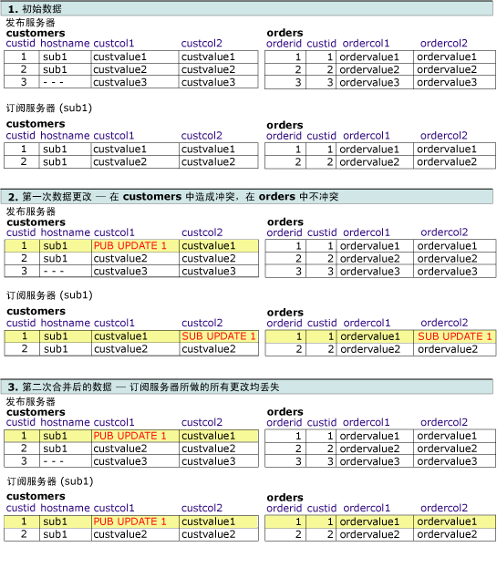
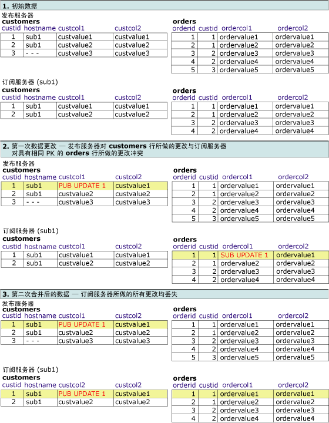

# 检测并解决逻辑记录中的冲突
  本主题介绍使用逻辑记录时冲突检测和冲突解决方法的各种可能组合。 多个节点更改同一数据，或者合并复制遇到某些类型的错误（如复制更改时违反了约束）时，合并复制中会出现冲突。 有关冲突检测和解决的详细信息，请参阅 [Advanced Merge Replication Conflict Detection and Resolution](../../../relational-databases/replication/merge/advanced-merge-replication-conflict-detection-and-resolution.md)。  
  
 若要指定项目的冲突跟踪和解决方法级别，请参阅 [Specify the Conflict Tracking and Resolution Level for Merge Articles](../../../relational-databases/replication/publish/specify-the-conflict-tracking-and-resolution-level-for-merge-articles.md)。  
  
## 冲突检测  
 在其中检测逻辑记录冲突的方式由两个项目属性决定︰ **column_tracking** 和 **logical_record_level_conflict_detection**。 [!INCLUDE[ssVersion2005](../../../includes/ssversion2005-md.md)] 和更高版本还支持逻辑记录级检测。  
  
  **Logical_record_level_conflict_detection** 项目属性可以设置为 TRUE 或 FALSE。 应只对顶级父项目设置此值，子项目将忽略此值。 如果此值为 FALSE，合并复制检测到与以前的版本冲突 [!INCLUDE[ssNoVersion](../../../includes/ssnoversion-md.md)], ，只根据值 **column_tracking** 项目的属性。 如果此值为 TRUE，合并复制将忽略 **column_tracking** 的项目的属性和逻辑记录中任意位置进行更改的情况下检测到冲突。 例如，考虑以下方案：  
  
   
  
 如果两个用户更改 **Customers**、 **Orders**或 **OrderItems** 表中 Customer2 逻辑记录的任何值，将检测冲突。 此示例通过使用 UPDATE 语句所做的更改检测冲突，但还可以通过使用 INSERT 或 DELETE 语句所做的更改来检测冲突。  
  
## 冲突解决  
 默认情况下，合并复制使用基于优先级的逻辑来解决冲突。 如果在两个订阅服务器数据库中做了冲突更改，则对具有较高订阅优先级的订阅服务器所做的更改入选，如果优先级相同，则第一个到达发布服务器的更改入选。 通过行级和列级检测，整个入选行将始终覆盖落选行。  
  
  **Logical_record_level_conflict_resolution** 项目属性可以设置为 TRUE 或 FALSE。 应只对顶级父项目设置此值，子项目将忽略此值。 如果此值为 TRUE，则整个入选逻辑记录将覆盖未入选的逻辑记录。 如果此值为 FALSE，则各个入选行可以来自不同的订阅服务器或发布服务器。 例如，订阅服务器 A 可以在 **Orders** 表的某行中入选冲突，而订阅服务器 B 可以在 **OrderItems** 表的相关行中入选冲突。 结果是包含订阅服务器 A 中的 **Orders** 行和订阅服务器 B 中的 **OrderItems** 行的逻辑记录。  
  
## 冲突解决和检测设置的交互  
 冲突结果取决于冲突检测和解决设置的交互。 在下面的示例中，假定使用的是基于优先级的冲突解决方法。 使用逻辑记录时，可以选择下列组合：  
  
-   行级或列级检测，行级解决方法  
  
-   列级检测，逻辑记录解决方法  
  
-   行级检测，逻辑记录解决方法  
  
-   逻辑记录检测，逻辑记录解决方法  
  
### 行级或列级检测，行级解决方法  
 在此示例中，发布配置方式如下：  
  
-   **column_tracking** 为 TRUE 或 FALSE  
  
-   **logical_record_level_conflict_detection** 为 FALSE  
  
-   **logical_record_level_conflict_resolution** 为 FALSE  
  
 这种情况下，检测的级别为行级或列级，而解决方法的级别为行级。 使用这些设置可以利用使所有逻辑记录的更改按单元复制的优点，但不包括逻辑记录级的冲突检测或解决方法。  
  
### 列级检测，逻辑记录解决方法  
 在此示例中，发布配置方式如下：  
  
-   **column_tracking** 为 TRUE  
  
-   **logical_record_level_conflict_detection** 为 FALSE  
  
-   **logical_record_level_conflict_resolution** 为 TRUE  
  
 发布服务器和订阅服务器以同一个数据集开始，并在 **orders** 表和 **customers** 表之间定义逻辑记录。 发布服务器会更改 **customers** 表中的 **custcol1** 列和 **orders** 表中的 **ordercol1** 。 订阅服务器会更改 **customers** 表中同一行的 **custcol1** 和 **orders** 表中同一行的 **ordercol2** 列。 对 **customer** 表中的同一列进行更改会导致冲突，但对 **orders** 表进行更改不会导致冲突。  
  
 由于是在逻辑记录级解决冲突，因此在复制处理期间，发布服务器上所做的入选更改将替换订阅服务器表中所做的更改。  
  
   
  
### 行级检测，逻辑记录解决方法  
 在此示例中，发布配置方式如下：  
  
-   **column_tracking** 为 FALSE  
  
-   **logical_record_level_conflict_detection** 为 FALSE  
  
-   **logical_record_level_conflict_resolution** 为 TRUE  
  
 发布服务器和订阅服务器以相同的数据集开始。 发布服务器会更改 **customers** 表中的 **custcol1** 列。 订阅服务器会更改 **customers** 表中的 **custcol2** 和 **orders** 表中的 **ordercol2** 列。 对 **customers** 表中的同一行进行更改会导致冲突，但订阅服务器对 **orders** 表进行更改不会导致冲突。  
  
 由于是在逻辑记录级解决冲突，因此在同步过程中，发布服务器上所做的入选更改将替换订阅服务器表中所做的更改。  
  
   
  
### 逻辑记录检测，逻辑记录解决方法  
 在此示例中，发布配置方式如下：  
  
-   **logical_record_level_conflict_detection** 为 TRUE  
  
-   **logical_record_level_conflict_resolution** 为 TRUE  
  
 发布服务器和订阅服务器以相同的数据集开始。 发布服务器会更改 **customers** 表中的 **custcol1** 列。 订阅服务器会更改 **orders** 表中的 **ordercol1** 列。 没有更改到同一行或列，但由于的同一逻辑记录中进行更改 **custid**= 1，在逻辑记录级冲突检测所做的更改。  
  
 由于还是在逻辑记录级解决冲突，因此在同步过程中，发布服务器上所做的入选更改将替换订阅服务器表中所做的更改。  
  
   
  
## 另请参阅  
 [通过逻辑记录对相关行的更改进行分组](../../../relational-databases/replication/merge/group-changes-to-related-rows-with-logical-records.md)  
  
  