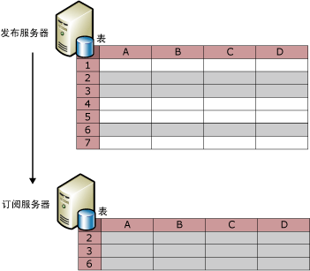
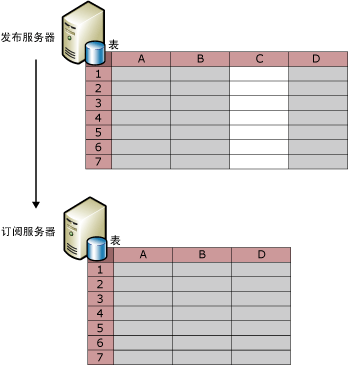
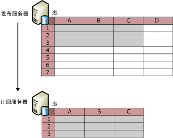

# 筛选已发布数据
[!INCLUDE[appliesto-ss-xxxx-xxxx-xxx-md](../../../includes/appliesto-ss-xxxx-xxxx-xxx-md.md)]
  通过筛选表项目，可以为要发布的数据创建分区。 通过筛选已发布数据，可以：  
  
-   最大程度地减少通过网络发送的数据量。  
  
-   减少订阅服务器上需要的存储空间量。  
  
-   根据各个订阅服务器的要求，自定义发布和应用程序。  
  
-   由于可以将不同的数据分区发送到不同的订阅服务器（没有两个订阅服务器会同时更新相同的数据值），因此可以避免或减少订阅服务器更新数据时的冲突。  
  
-   避免传输敏感数据。 行筛选器和列筛选器可以用于限制订阅服务器对数据的访问。 对于合并复制，如果使用包括 HOST_NAME() 的参数化筛选器，则需要考虑安全问题。 有关详细信息，请参阅 [Parameterized Row Filters](../../../relational-databases/replication/merge/parameterized-filters-parameterized-row-filters.md)中的“使用 HOST_NAME() 进行筛选”部分。  
  
 复制提供了四种筛选器：  
  
-   静态行筛选器，适用于所有类型的复制。  
  
     使用静态行筛选器，可以选择要发布的行的子集。 已筛选发布的所有订阅服务器都接收已筛选表的相同的行子集。 有关详细信息，请参阅本主题中的“静态行筛选器”部分。  
  
-   列筛选器，适用于所有类型的复制。  
  
     使用列筛选器，可以选择要发布的列的子集。 有关详细信息，请参阅本主题中的“列筛选器”部分。  
  
-   参数化行筛选器，仅适用于合并复制。  
  
     使用参数化行筛选器，可以选择要发布的行的子集。 与向所有订阅服务器发送相同行子集的静态筛选器不同，参数化行筛选器使用订阅服务器提供的数据值向订阅服务器发送不同的行子集。 有关详细信息，请参阅 [参数化行筛选器](../../../relational-databases/replication/merge/parameterized-filters-parameterized-row-filters.md)。  
  
-   联接筛选器，仅适用于合并复制。  
  
     使用联接筛选器，可以将行筛选器从一个已发布表扩展到另一个已发布表。 有关详细信息，请参阅 [Join Filters](../../../relational-databases/replication/merge/join-filters.md)。  
  
## 静态行筛选器  
 下图显示的已发布表已经过筛选，因此发布中只包括第 2、3、6 行。  
  
   
  
 静态行筛选器使用 WHERE 子句来选择要发布的相应数据，您需要指定 WHERE 子句的最后部分。 请考虑 Adventure Works 示例数据库中的 **Product 表** ，此表包含列 **ProductLine**。 若要只发布包含与山地车相关的产品数据的行，请指定 `ProductLine = 'M'`。  
  
 静态行筛选器为每个发布生成一组数据。 在上面的示例中，所有订阅服务器只收到包含与山地车相关的产品数据的行。 如果另一个订阅服务器只需要包含与公路自行车相关的产品数据的行：  
  
-   对于快照复制或事务复制，可以再创建一个发布，在这两个发布中都包括该表（在该发布中的项目的筛选器子句中指定 `ProductLine = 'R')`）。  
  
    > [!NOTE]  
    >  在事务发布中使用行筛选器会显著增加开销，因为对于为已发布表写入的每个日志行，都需要计算项目筛选器子句以确定是否要复制该行。 如果每个复制节点都能支持全部数据负载，而且总体数据集相当小，则应避免在事务发布中使用行筛选器。  
  
-   对于合并复制，请使用参数化行筛选器，而不要使用静态行筛选器创建多个发布。 有关详细信息，请参阅 [Parameterized Row Filters](../../../relational-databases/replication/merge/parameterized-filters-parameterized-row-filters.md)。  
  
 若要定义或修改静态行筛选器，请参阅 [Define and Modify a Static Row Filter](../../../relational-databases/replication/publish/define-and-modify-a-static-row-filter.md)。  
  
## 列筛选器  
 下图显示了一个筛选出列 C 的发布。  
  
   
  
 还可以同时使用行筛选和列筛选，如下图所示。  
  
   
  
 创建发布后，可以使用列筛选从现有发布中删除列，但在发布服务器中的表中保留该列，也可以在发布中包括现有列。 对于其他更改（如向表添加新列，然后再将其添加到已发布项目中），请使用架构更改复制。 有关详细信息，请参阅[对发布数据库进行架构更改](../../../relational-databases/replication/publish/make-schema-changes-on-publication-databases.md)主题中的“添加列”和“删除列”这两部分。  
  
 下表列出的列类型不能从某些类型的发布中筛选出。  
  
|列类型|发布类型和选项|  
|-----------------|-------------------------------------|  
|主键列|主键列对于事务发布中的所有表都是必需的。 主键对于合并发布中的表并不是必需的，但如果存在主键列，则无法筛选该列。|  
|外键列|使用新建发布向导创建的所有发布。 可以使用 Transact-SQL 存储过程来筛选外键列。 有关详细信息，请参阅 [Define and Modify a Column Filter](../../../relational-databases/replication/publish/define-and-modify-a-column-filter.md)。|  
|**rowguid** 列|合并发布*|  
|**msrepl_tran_version** 列|允许可更新订阅的快照或事务发布|  
|不允许 NULL 且没有默认值或 IDENTITY 属性集的列。|允许可更新订阅的快照或事务发布|  
|具有唯一约束或索引的列|允许可更新订阅的快照或事务发布|  
|SQL Server 7.0 合并发布中的所有列|SQL Server 7.0 合并发布中不能筛选的列。|  
|时间戳|允许可更新订阅的 SQL Server 7.0 快照或事务发布|  
  
 \*如果在合并发布中发布表，且该表已包含具有 **ROWGUIDCOL** 属性集的 **uniqueidentifier** 数据类型的列，则复制可以使用此列，而不必再创建名为 **rowguid** 的列。 在这种情况下，必须发布现有列。  
  
 若要定义或修改列筛选器，请参阅 [Define and Modify a Column Filter](../../../relational-databases/replication/publish/define-and-modify-a-column-filter.md)中的“使用 HOST_NAME() 进行筛选”部分。  
  
## 筛选注意事项  
 筛选数据时，请谨记下列注意事项：  
  
-   行筛选器中引用的所有列必须都包括在发布中。 也就是说，不能使用列筛选器排除行筛选器中使用的列。  
  
-   如果在初始化订阅后添加或更改了筛选器，必须重新初始化订阅。  
  
-   筛选器中使用的列所允许的最大字节数对于合并发布中的项目是 1024，对于事务发布中的项目是 8000。  
  
-   下列数据类型的列不能在行筛选器或联接筛选器中引用。  
  
    -   **varchar(max) 和 nvarchar(max)**  
  
    -   **varbinary(max)**  
  
    -   **text 和 ntext**  
  
    -   **图像**  
  
    -   **XML**  
  
    -   **UDT**  
  
-   事务复制允许您将索引视图按视图或表来复制。 如果将视图按表复制，则无法从表中筛选列。  
  
 行筛选器未设计为跨数据库工作。 [!INCLUDE[ssNoVersion](../../../includes/ssnoversion-md.md)] 有意将 **sp_replcmds** 的执行（执行筛选器）限制为数据库所有者 (**dbo**)。 **dbo** 不具有跨数据库权限。 [!INCLUDE[ssKatmai](../../../includes/sskatmai-md.md)] 中增加 CDC（变更数据捕获）后，**sp_replcmds** 逻辑将使用用户可以返回到和查询的信息填充变更跟踪表。 出于安全原因， [!INCLUDE[ssNoVersion](../../../includes/ssnoversion-md.md)] 会限制此逻辑的执行，以使恶意的 **dbo** 无法劫持此执行路径。 例如，恶意的 **dbo** 可能在 CDC 表上添加触发器，然后这些触发器会在调用 **sp_replcmds**的用户（在这种情况下为日志读取器代理）的上下文中执行。  如果运行该代理所用的帐户具有更高权限，则恶意的 **dbo** 可以提升其权限。  
  
## 另请参阅  
 [发布数据和数据库对象](../../../relational-databases/replication/publish/publish-data-and-database-objects.md)  
  
  
