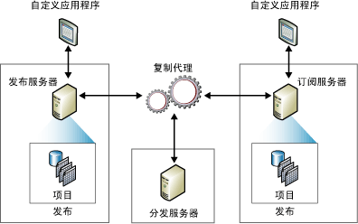

# 复制发布模型概述
[!INCLUDE[appliesto-ss-asdbmi-xxxx-xxx-md](../../../includes/appliesto-ss-asdbmi-xxxx-xxx-md.md)]
  复制使用出版业术语表示复制拓扑中的组件，其中包括发布服务器、分发服务器、订阅服务器、发布、项目和订阅。 可借助杂志的概念来帮助理解 [!INCLUDE[msCoName](../../../includes/msconame-md.md)] [!INCLUDE[ssNoVersion](../../../includes/ssnoversion-md.md)] 复制：  
  
-   杂志出版商（发布服务器）生产一种或多种刊物（发布）  
  
-   刊物（发布）包含文章（项目）  
  
-   出版商（发布服务器）可以直接发行（分发）杂志，也可以使用发行商（分发服务器）  
  
-   订阅者（订阅服务器）接收订阅的刊物（发布）  
  
 虽然杂志术语有助于理解复制，但重要的是要注意到 [!INCLUDE[ssNoVersion](../../../includes/ssnoversion-md.md)] 复制包含有这套术语未予以表述的功能，尤其是订阅服务器进行更新的功能以及发布服务器将增量更改发送到发布中的项目的功能。  
  
 “复制拓扑”  定义了服务器和数据副本间的关系，并阐明了决定数据如何在服务器之间流动的逻辑。 有若干复制进程（称为“代理”  ）负责在发布服务器和订阅服务器之间复制和移动数据。 下图为复制中所涉及的组件和进程的概述。  
  
   
  
## 发布服务器  
 发布服务器是一种数据库实例，它通过复制向其他位置提供数据。 发布服务器可以有一个或多个发布，每个发布定义一组要复制的具有逻辑关系的对象和数据。  
  
## 分发服务器  
 分发服务器也是一种数据库实例，它起着存储区的作用，用于复制与一个或多个发布服务器相关联的特定数据。 每个发布服务器都与分发服务器中的单个数据库（称作分发数据库）相关联。 分发数据库存储复制状态数据和有关发布的元数据，并且在某些情况下为从发布服务器向订阅服务器移动的数据起着排队的作用。 在很多情况下，一个数据库服务器实例充当发布服务器和分发服务器两个角色。 这称为“本地分发服务器”  。 当发布服务器和分发服务器按各自的数据库服务器实例配置时，把分发服务器称为“远程分发服务器”  。  
  
## 订阅服务器  
 订阅服务器是接收复制数据的数据库实例。 订阅服务器可以接收来自多个发布服务器和发布的数据。 根据所选的复制类型，订阅服务器还可以将数据更改传递回发布服务器或者将数据重新发布到其他订阅服务器。  
  
## 项目  
 项目用于标识发布中包含的数据库对象。 一次发布可以包含不同类型的项目，包括表、视图、存储过程和其他对象。 当把表作为项目发布时，可以用筛选器限制发送到订阅服务器的数据的列和行。  
  
## 发布  
 发布是一个数据库中的一个或多个项目的集合。 将多个项目分组成一个发布，使得更便于指定一组作为一个单元复制的、具有逻辑关系的数据库对象和数据。  
  
## 订阅  
 订阅是把发布副本传递到订阅服务器的请求。 订阅定义将接收的发布和接收的时间、地点。 有两种类型的订阅：推送订阅和请求订阅。 有关推送订阅和请求订阅的详细信息，请参阅[订阅发布](../../../relational-databases/replication/subscribe-to-publications.md)。  
  
## 另请参阅  
 [复制代理概述](../../../relational-databases/replication/agents/replication-agents-overview.md)   
 [复制类型](../../../relational-databases/replication/types-of-replication.md)   
 [为 AlwaysOn 可用性组配置复制 (SQL Server)](../../../database-engine/availability-groups/windows/configure-replication-for-always-on-availability-groups-sql-server.md)   
 [维护 AlwaysOn 发布数据库 (SQL Server)](../../../database-engine/availability-groups/windows/maintaining-an-always-on-publication-database-sql-server.md)  
  
  
