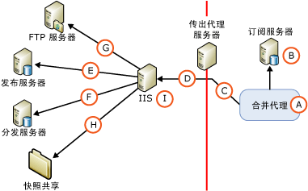

# Web 同步的安全体系结构
  [!INCLUDE[msCoName](../../../includes/msconame-md.md)] [!INCLUDE[ssNoVersion](../../../includes/ssnoversion-md.md)] enables fine-grained control over the configuration of Web synchronization security. 本主题提供了 Web 同步配置中可包括的所有组件以及这些组件之间的连接信息的综合列表。 [!INCLUDE[ssNoteWinAuthentication](../../../includes/ssnotewinauthentication-md.md)]  
  
 下图显示了所有可用连接，但特定拓扑中可能不需要其中的某些连接。 例如，仅当使用 FTP 传递快照时才需要与 FTP 服务器建立连接。  
  
   
  
 下表对图中所示的组件和连接进行了说明。  
  
## A. 用于运行合并代理的 Windows 用户  
 在同步期间，合并代理 (A) 在订阅服务器上启动。 合并代理可以从 [!INCLUDE[ssNoVersion](../../../includes/ssnoversion-md.md)] 代理作业的作业步或独立的自定义应用程序中启动。 如果合并代理从 [!INCLUDE[ssNoVersion](../../../includes/ssnoversion-md.md)] 代理作业的作业步启动，则该合并代理将在您指定的 Windows 用户的上下文中运行。 如果未指定 Windows 用户，则该合并代理将在 [!INCLUDE[ssNoVersion](../../../includes/ssnoversion-md.md)] 代理的 Windows 服务帐户的上下文中运行。  
  
|帐户类型|指定帐户的位置|  
|---------------------|------------------------------------|  
|Windows 用户|[!INCLUDE[tsql](../../../includes/tsql-md.md)]： **@job_login** 的 **@job_password** 和 [@job_password](../../../relational-databases/system-stored-procedures/sp-addmergepullsubscription-agent-transact-sql.md)参数。   RMO（复制管理对象）：<xref:Microsoft.SqlServer.Replication.PullSubscription.SynchronizationAgentProcessSecurity%2A> 的 <xref:Microsoft.SqlServer.Replication.IProcessSecurityContext.Login%2A> 和 <xref:Microsoft.SqlServer.Replication.IProcessSecurityContext.Password%2A> 属性。|  
|[!INCLUDE[ssNoVersion](../../../includes/ssnoversion-md.md)] 代理的 Windows 服务帐户|[!INCLUDE[ssNoVersion](../../../includes/ssnoversion-md.md)] 配置管理器|  
|独立的应用程序|合并代理在运行该应用程序的 Windows 用户的上下文中运行。|  
  
## B. 连接到订阅服务器  
 合并代理使用 Windows 身份验证或 [!INCLUDE[ssNoVersion](../../../includes/ssnoversion-md.md)] 身份验证连接到订阅服务器。 Windows 用户或指定的 [!INCLUDE[ssNoVersion](../../../includes/ssnoversion-md.md)] 登录名必须与下述数据库用户相关联：该数据库用户是订阅数据库中 **dbowner** 固定数据库角色的成员。  
  
> [!NOTE]  
>  当从 [!INCLUDE[ssNoVersion](../../../includes/ssnoversion-md.md)] 代理作业启动合并代理时，将始终使用 Windows 身份验证。 当在没有显式指定 [!INCLUDE[ssNoVersion](../../../includes/ssnoversion-md.md)] 身份验证的情况下通过编程方式启动合并代理时，也将使用 Windows 身份验证。  
  
|身份验证类型|指定身份验证的位置|  
|----------------------------|-------------------------------------------|  
|-   Windows 身份验证。|合并代理 (A) 在为其指定的 Windows 用户的上下文中建立连接。|  
|仅在指定下列值时，才使用[!INCLUDE[ssNoVersion](../../../includes/ssnoversion-md.md)] 身份验证：   -   RMO：为 <xref:Microsoft.SqlServer.Replication.MergeSynchronizationAgent.SubscriberSecurityMode%2A> 指定了 <xref:Microsoft.SqlServer.Replication.SecurityMode.Standard> 值时。 -   合并代理命令行：为**SubscriberSecurityMode** 指定了值 **0** 时。|RMO：<xref:Microsoft.SqlServer.Replication.MergeSynchronizationAgent.SubscriberLogin%2A> 和 <xref:Microsoft.SqlServer.Replication.MergeSynchronizationAgent.SubscriberPassword%2A>。   合并代理命令行： **-SubscriberLogin** 和 **-SubscriberLogin**。|  
  
## C. 连接到传出代理服务器  
 仅当存在限制访问订阅服务器内部网络的传出代理服务器时，才为此连接指定 Windows 用户。  
  
|身份验证类型|指定身份验证的位置|  
|----------------------------|-------------------------------------------|  
|Windows 身份验证|RMO：随 <xref:Microsoft.SqlServer.Replication.MergeSynchronizationAgent.InternetProxyServer%2A> 指定了 <xref:Microsoft.SqlServer.Replication.MergeSynchronizationAgent.InternetProxyLogin%2A> 和 <xref:Microsoft.SqlServer.Replication.MergeSynchronizationAgent.InternetProxyPassword%2A> 时。   合并代理命令行：在 **-InternetProxyServer** 上指定 **-InternetProxyLogin** 和 **-InternetProxyPassword**。|  
  
## D. 连接到 IIS  
 连接到订阅服务器并从订阅数据库中提取任何更改后，合并代理将向 [!INCLUDE[msCoName](../../../includes/msconame-md.md)] Internet Information Services (IIS) 发出 HTTPS 请求并将数据更改作为 XML 消息上载。 合并代理必须具有 IIS 的登录权限。  
  
|身份验证类型|指定身份验证的位置|  
|----------------------------|-------------------------------------------|  
|如果指定下列值之一，则将使用基本身份验证：   -   [!INCLUDE[tsql](../../../includes/tsql-md.md)]：为 **SubscriberSecurityMode** 的 **@internet_security_mode** 参数指定值 [@job_password](../../../relational-databases/system-stored-procedures/sp-addmergepullsubscription-agent-transact-sql.md)参数。 -   RMO：为 <xref:Microsoft.SqlServer.Replication.MergeSynchronizationAgent.InternetSecurityMode%2A> 指定了 <xref:Microsoft.SqlServer.Replication.SecurityMode.Standard> 值时。 -   合并代理命令行：为 **-InternetSecurityMode** 指定了值 **0** 时。|[!INCLUDE[tsql](../../../includes/tsql-md.md)]： **@internet_login** 的 **@internet_password** 和 [@job_password](../../../relational-databases/system-stored-procedures/sp-addmergepullsubscription-agent-transact-sql.md)参数。   RMO：<xref:Microsoft.SqlServer.Replication.MergeSynchronizationAgent.InternetLogin%2A> 和 <xref:Microsoft.SqlServer.Replication.MergeSynchronizationAgent.InternetPassword%2A>。   合并代理命令行： **-InternetLogin** 和 **-InternetPassword**。|  
|如果指定下列值之一，则将使用集成身份验证1 ：   -   [!INCLUDE[tsql](../../../includes/tsql-md.md)]：为 **1** 的 **@internet_security_mode** 参数指定值 [@job_password](../../../relational-databases/system-stored-procedures/sp-addmergepullsubscription-agent-transact-sql.md)参数。 -   RMO：为 <xref:Microsoft.SqlServer.Replication.MergeSynchronizationAgent.InternetSecurityMode%2A> 指定了 <xref:Microsoft.SqlServer.Replication.SecurityMode.Integrated> 值时。 -   合并代理命令行：为 **-InternetSecurityMode** 指定了值 **1** 时。|合并代理 (A) 在为其指定的 Windows 用户的上下文中建立连接。|  
  
 1 仅当所有计算机都位于同一域中或位于彼此建立了信任关系的多个域中时，才可以使用集成身份验证。  
  
> [!NOTE]  
>  如果使用集成身份验证，则必须使用委托。 对于从订阅服务器到 IIS 的连接，建议使用基本身份验证和 SSL。  
  
## E. 连接到发布服务器  
 [!INCLUDE[ssNoVersion](../../../includes/ssnoversion-md.md)] 复制侦听器和合并复制协调器组件承载于运行 IIS 的计算机上。 这些组件可执行下列操作：  
  
-   提取在“D. 连接到 IIS”部分中介绍的 HTTPS 请求。  
  
-   与发布数据库建立 SQL 连接并将已上载的更改应用于发布数据库。  
  
-   提取已下载的更改并将 HTTPS 响应发送回合并代理。  
  
 合并复制协调器使用 Windows 身份验证或 [!INCLUDE[ssNoVersion](../../../includes/ssnoversion-md.md)] 身份验证连接到发布服务器。 Windows 用户或指定的 [!INCLUDE[ssNoVersion](../../../includes/ssnoversion-md.md)] 登录名必须符合以下条件：  
  
-   位于发布访问列表 (PAL) 中。 有关详细信息，请参阅[保护发布服务器](../../../relational-databases/replication/security/secure-the-publisher.md)。  
  
-   与发布数据库中的某个用户相关联。  
  
|身份验证类型|指定身份验证的位置|  
|----------------------------|-------------------------------------------|  
|如果指定下列值之一，则将使用 Windows 身份验证：   -   [!INCLUDE[tsql](../../../includes/tsql-md.md)]：为 **1** 的 **@publisher_security_mode** 参数指定值 [@job_password](../../../relational-databases/system-stored-procedures/sp-addmergepullsubscription-agent-transact-sql.md)参数。 -   RMO：为 <xref:Microsoft.SqlServer.Replication.MergeSynchronizationAgent.PublisherSecurityMode%2A> 指定了 <xref:Microsoft.SqlServer.Replication.SecurityMode.Integrated> 值时。 -   合并代理命令行：为 **-PublisherSecurityMode** 指定了值 **1** 时。|合并代理在为连接到 IIS (D) 而指定的 Windows 用户的上下文中与发布服务器建立连接。 如果发布服务器和 IIS 位于不同的计算机中并且将集成身份验证用于连接 (D)，则必须在运行 IIS 的计算机上启用 Kerberos 委托。 有关详细信息，请参阅 Windows 文档。|  
|如果指定下列值之一，则将使用[!INCLUDE[ssNoVersion](../../../includes/ssnoversion-md.md)] 身份验证：   -   [!INCLUDE[tsql](../../../includes/tsql-md.md)]：为 **SubscriberSecurityMode** 的 **@publisher_security_mode** 参数指定值 [@job_password](../../../relational-databases/system-stored-procedures/sp-addmergepullsubscription-agent-transact-sql.md)参数。 -   RMO：为 <xref:Microsoft.SqlServer.Replication.MergeSynchronizationAgent.PublisherSecurityMode%2A> 指定了 <xref:Microsoft.SqlServer.Replication.SecurityMode.Standard> 值时。 -   合并代理命令行：为 **-PublisherSecurityMode** 指定了值 **0** 时。|[!INCLUDE[tsql](../../../includes/tsql-md.md)]： **@publisher_login** 的 **@publisher_password** 和 [@job_password](../../../relational-databases/system-stored-procedures/sp-addmergepullsubscription-agent-transact-sql.md)参数。   RMO：<xref:Microsoft.SqlServer.Replication.MergeSynchronizationAgent.PublisherLogin%2A> 和 <xref:Microsoft.SqlServer.Replication.MergeSynchronizationAgent.PublisherPassword%2A>。   合并代理命令行： **-PublisherLogin** 和 **-PublisherPassword**。|  
  
## F. 连接到分发服务器  
 在运行 IIS 的计算机上承载的合并复制协调器还与分发服务器建立连接。 合并复制协调器使用 Windows 身份验证或 [!INCLUDE[ssNoVersion](../../../includes/ssnoversion-md.md)] 身份验证连接到分发服务器。 Windows 用户或指定的 [!INCLUDE[ssNoVersion](../../../includes/ssnoversion-md.md)] 登录名必须符合以下条件：  
  
-   位于发布访问列表 (PAL) 中。 有关详细信息，请参阅[保护发布服务器](../../../relational-databases/replication/security/secure-the-publisher.md)。  
  
-   与分发数据库中的某个数据库用户相关联。 用户可以为 **Guest** 用户。  
  
 快照共享通常位于分发服务器上。 有关快照共享的详细信息，请参阅本主题后面的“H. 访问快照共享”部分。  
  
|-   身份验证类型|指定身份验证的位置|  
|-------------------------------|-------------------------------------------|  
|如果指定下列值之一，则将使用 Windows 身份验证：   -   [!INCLUDE[tsql](../../../includes/tsql-md.md)]：为 **1** 的 **@distributor_security_mode** 参数指定值 [@job_password](../../../relational-databases/system-stored-procedures/sp-addmergepullsubscription-agent-transact-sql.md)参数。 -   RMO：为 <xref:Microsoft.SqlServer.Replication.MergeSynchronizationAgent.DistributorSecurityMode%2A> 指定了 <xref:Microsoft.SqlServer.Replication.SecurityMode.Integrated> 值时。 -   合并代理命令行：为 **-DistributorSecurityMode** 指定了值 **1** 时。|合并代理在为连接到 IIS (D) 而指定的 Windows 用户的上下文中与分发服务器建立连接。 如果分发服务器和 IIS 位于不同的计算机中并且将集成身份验证用于连接 (D)，则必须在运行 IIS 的计算机上启用 Kerberos 委托。 有关详细信息，请参阅 Windows 文档。|  
|如果指定下列值之一，则将使用[!INCLUDE[ssNoVersion](../../../includes/ssnoversion-md.md)] 身份验证：   -   [!INCLUDE[tsql](../../../includes/tsql-md.md)]：为 **SubscriberSecurityMode** 的 **@distributor_security_mode** 参数指定值 [@job_password](../../../relational-databases/system-stored-procedures/sp-addmergepullsubscription-agent-transact-sql.md)参数。 -   RMO：为 <xref:Microsoft.SqlServer.Replication.MergeSynchronizationAgent.DistributorSecurityMode%2A> 指定了 <xref:Microsoft.SqlServer.Replication.SecurityMode.Standard> 值时。 -   合并代理命令行：为 **-DistributorSecurityMode** 指定了值 **0** 时。|[!INCLUDE[tsql](../../../includes/tsql-md.md)]： **@distributor_login** 的 **@distributor_password** 和 [@job_password](../../../relational-databases/system-stored-procedures/sp-addmergepullsubscription-agent-transact-sql.md)参数。   RMO：<xref:Microsoft.SqlServer.Replication.MergeSynchronizationAgent.DistributorLogin%2A> 和 <xref:Microsoft.SqlServer.Replication.MergeSynchronizationAgent.DistributorPassword%2A>   合并代理命令行： **-DistributorLogin** 和 **-DistributorPassword**。|  
  
## G. 连接到 FTP 服务器  
 仅当在将快照应用到订阅服务器之前，将快照文件从 FTP 服务器（而不是 UNC 位置）下载到运行 IIS 的计算机上时，才为该连接指定 Windows 用户。 有关详细信息，请参阅[通过 FTP 传输快照](../../../relational-databases/replication/transfer-snapshots-through-ftp.md)。  
  
|身份验证类型|指定身份验证的位置|  
|----------------------------|-------------------------------------------|  
|Windows 身份验证|[!INCLUDE[tsql](../../../includes/tsql-md.md)]： **@ftp_login** 的 **@ftp_password** 和 [@ftp_password](../../../relational-databases/system-stored-procedures/sp-addmergepublication-transact-sql.md)参数。   RMO：<xref:Microsoft.SqlServer.Replication.Publication.FtpLogin%2A> 和 <xref:Microsoft.SqlServer.Replication.Publication.FtpPassword%2A>。|  
  
## H. 访问快照共享  
 在运行 IIS 的计算机上承载的合并复制协调器将访问快照共享。  
  
|身份验证类型|指定身份验证的位置|  
|----------------------------|-------------------------------------------|  
|Windows 身份验证|合并代理在为连接到 IIS (D) 而指定的 Windows 用户的上下文中访问快照共享。 如果快照共享和 IIS 位于不同的计算机中并且将集成身份验证用于连接 (D)，则必须在运行 IIS 的计算机上启用 Kerberos 委托。 有关详细信息，请参阅 Windows 文档。|  
  
## I. IIS 的应用程序池帐户  
 该帐户用来在运行 IIS 的计算机上为 [!INCLUDE[winxpsvr](../../../includes/winxpsvr-md.md)] 启动 W3wp.exe 进程，或在 [!INCLUDE[win2kfamily](../../../includes/win2kfamily-md.md)]上启动 Dllhost.exe 进程。 这些进程可承载运行 IIS 的计算机上的应用程序，如 [!INCLUDE[ssNoVersion](../../../includes/ssnoversion-md.md)] 复制侦听器和合并复制协调器。 该帐户应该对运行 IIS 的计算机上的以下复制 DLL 具有读取和执行权限：  
  
-   Replisapi  
  
-   Replrec  
  
-   Replprov  
  
-   Msgprox  
  
-   Xmlsub  
  
 该帐户还应属于 IIS_WPG 组。 有关详细信息，请参阅[配置 IIS 以实现 Web 同步](../../../relational-databases/replication/configure-iis-for-web-synchronization.md)中的“设置 [!INCLUDE[ssNoVersion](../../../includes/ssnoversion-md.md)] 复制侦听器的权限”一节。  
  
|帐户类型|指定帐户的位置|  
|---------------------|------------------------------------|  
|具有所需权限的任何 Windows 用户。|Internet 信息服务 (IIS) 管理器。 |  
  
## 另请参阅  
 [配置 Web 同步](../../../relational-databases/replication/configure-web-synchronization.md)   
 [Replication Merge Agent](../../../relational-databases/replication/agents/replication-merge-agent.md)  
  
  
