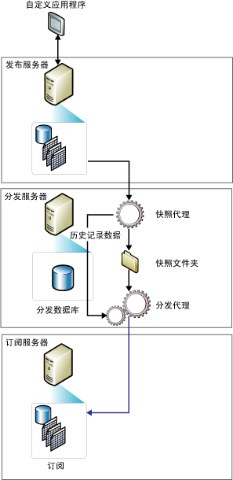

# 快照复制
[!INCLUDE[appliesto-ss-asdb-xxxx-xxx-md](../../includes/appliesto-ss-asdb-xxxx-xxx-md.md)]
  快照复制完全按照数据在特定时刻的状态分发数据，而不监视数据是否更新。 发生同步时，将生成完整的快照并将其发送到订阅服务器。  
  
> [!NOTE]  
>  快照复制可由其自身使用，但是快照处理（负责创建由发布所指定的所有对象和数据的副本）通常还用于为事务发布与合并发布提供初始的数据和数据库对象集。  
  
 当符合以下一个或多个条件时，使用快照复制本身是最合适的：  
  
-   很少更改数据。  
  
-   在一段时间内允许具有相对发布服务器已过时的数据副本。  
  
-   复制少量数据。  
  
-   在短期内出现大量更改。  
  
 在数据更改量很大，但很少发生更改时，快照复制是最合适的。 例如，如果某销售组织维护一个产品价格列表且这些价格每年要在固定时间进行一两次完全更新，那么建议在数据更改后复制完整的数据快照。 对于给定的某些类型的数据，更频繁的快照可能也比较适合。 例如，如果一天中在发布服务器上更新相对小的表，但可以接受一定的滞后时间，则可以在夜间以快照形式传递更改。  
  
 发布服务器上快照复制的连续开销低于事务复制的开销，因为不用跟踪增量更改。 但是，如果要复制的数据集非常大，那么若要生成和应用快照，将需要使用大量资源。 评估是否使用快照复制时，需要考虑整个数据集的大小以及数据的更改频率。  
  
 **本主题内容**  
  
 [快照复制的工作机制](#HowWorks)  
  
 [快照代理](#SnapshotAgent)  
  
 [分发代理和合并代理](#DistAgent)  
  
##   快照复制的工作机制  
 默认情况下，所有三种复制都使用快照初始化订阅服务器。 [!INCLUDE[ssNoVersion](../../includes/ssnoversion-md.md)] 快照代理始终生成快照文件，但传递文件的代理因使用的复制类型而异。 快照复制和事务复制使用分发代理传递文件，而合并复制使用 [!INCLUDE[ssNoVersion](../../includes/ssnoversion-md.md)] 合并代理。 快照代理在分发服务器上运行。 对于推送订阅，分发代理和合并代理在分发服务器上运行；对于请求订阅，则在订阅服务器上运行。  
  
 可以在创建订阅后立即生成和应用快照，也可以按照创建发布时制定的计划进行。 快照代理准备快照文件（其中包含已发布表和数据库对象的架构和数据），然后将这些文件存储在发布服务器的快照文件夹中，并在分发服务器上的分发数据库中记录跟踪信息。 配置分发服务器时，可以指定一个默认的快照文件夹，也可以为发布指定一个备用位置，以替代默认位置或与之并存。  
  
 除了本主题中描述的标准快照过程外，使用参数化筛选器的合并发布还使用一个由两部分组成的快照过程。  
  
 下图显示了快照复制的主要组件。  
  
   
  
##   快照代理  
 对于合并复制，每当运行快照代理时都会生成快照。 对于事务复制，是否生成快照取决于发布属性 **immediate_sync**的设置。 如果该属性设置为 TRUE（使用新建发布向导时的默认设置），则每当运行快照代理时都会生成快照，而且可以随时将其应用到订阅服务器。 如果该属性设置为 FALSE（使用 **sp_addpublication**时的默认设置），则仅当自上次快照代理运行以来添加了新订阅时，才会生成快照；订阅服务器必须等待快照代理完成，才能实现同步。  
  
 快照代理执行以下操作：  
  
1.  在分发服务器到发布服务器之间建立连接，然后根据需要在已发布表上使用锁：  
  
    -   对于合并发布，快照代理不使用任何锁。  
  
    -   对于事务发布，默认情况下快照代理只在快照生成的初始阶段使用锁。  
  
    -   对于快照发布，整个快照生成过程中都使用锁。  
  
2.  将每个项目的表架构副本写入一个 .sch 文件。 如果发布其他数据库对象（如索引、约束、存储过程、视图、用户定义函数等），则生成其他脚本文件。  
  
3.  从发布服务器上已发布的表中复制数据，然后将数据写入快照文件夹。 快照将以一组大容量复制程序 (BCP) 文件的形式生成。  
  
4.  对于快照发布和事务发布，快照代理将向分发数据库的 **MSrepl_commands** 表和 **MSrepl_transactions** 表中追加行。 **MSrepl_commands** 表中包含的是命令，这些命令指示 .sch 和 .bcp 文件、其他快照文件以及对快照前或快照后脚本的引用的位置。 **MSrepl_transactions** 表中包含的是与同步订阅服务器相关的命令。  
  
     对于合并发布，快照代理还执行其他操作。  
  
5.  释放已发布表上的所有锁。  
  
 在快照生成过程中，不能对已发布表进行构架更改。 生成快照文件后，可以使用 Windows 资源管理器在快照文件夹中查看这些快照文件。  
  
##   分发代理和合并代理  
 对于快照发布，分发代理每次运行发布时，都会将一个新快照移动到每个尚未同步但已标记为重新初始化或者包含新项目的订阅服务器中。  
  
 对于快照复制和事务复制，分发代理执行以下操作：  
  
1.  与分发服务器建立连接。  
  
2.  检查分发服务器上分发数据库中的 **MSrepl_commands** 和 **MSrepl_transactions** 表。 代理从第一个表中读取快照文件的位置，并从这两个表中读取订阅服务器同步命令。  
  
3.  将架构和命令应用于订阅数据库。  
  
 对于未筛选的合并复制发布，合并代理将执行以下操作：  
  
1.  与发布服务器建立连接。  
  
2.  检查发布服务器上的 **sysmergeschemachange** 表，确定是否存在应该应用于订阅服务器的新快照。  
  
3.  如果存在新快照，合并代理则将 **sysmergeschemachange**所指定位置处的快照文件应用于订阅数据库。  
  
  
