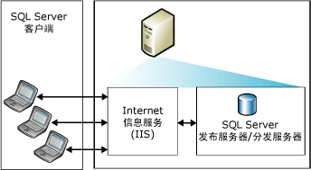
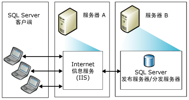
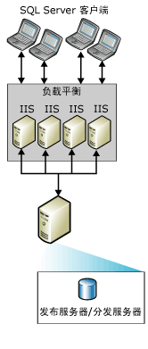
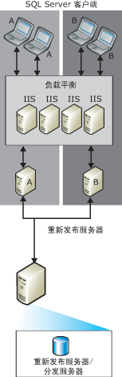

# Topologies for Web Synchronization
[!INCLUDE[appliesto-ss-xxxx-xxxx-xxx-md](../../includes/appliesto-ss-xxxx-xxxx-xxx-md.md)]
  可以从多种 [!INCLUDE[msCoName](../../includes/msconame-md.md)] [!INCLUDE[ssNoVersion](../../includes/ssnoversion-md.md)] Web 同步复制拓扑中进行选择。 配置 Web 同步的常用方法包括：  
  
-   单台服务器  
  
-   两台服务器  
  
-   多个 [!INCLUDE[msCoName](../../includes/msconame-md.md)] Internet 信息服务 (IIS) 系统和 [!INCLUDE[ssNoVersion](../../includes/ssnoversion-md.md)] 重新发布  
  
 有关配置 Web 同步的信息，请参阅[配置 Web 同步](../../relational-databases/replication/configure-web-synchronization.md)。  
  
## 单台服务器  
 在这种最简单的拓扑中，IIS、 [!INCLUDE[ssNoVersion](../../includes/ssnoversion-md.md)] 发布服务器和 [!INCLUDE[ssNoVersion](../../includes/ssnoversion-md.md)] 分发服务器都驻留在一台服务器中。 通过连接到发布服务器中的 IIS 来同步订阅服务器。 发布服务器可位于防火墙后。  
  
> [!NOTE]  
>  建议此配置仅用于 Intranet 方案。 对于其他方案，建议 IIS 服务器和 [!INCLUDE[ssNoVersion](../../includes/ssnoversion-md.md)] 发布服务器/分发服务器位于不同的计算机上。  
  
   
  
## 两台服务器  
 可以将 IIS 放置在一台服务器中，而将 [!INCLUDE[ssNoVersion](../../includes/ssnoversion-md.md)] 发布服务器和分发服务器配置在另一台服务器中。 运行 IIS 的服务器可以用防火墙与 Internet 隔离。 通过连接到 IIS 来同步订阅服务器。  
  
   
  
## 多个 IIS 系统和 SQL Server 重新发布  
 如果需要支持很多同时进行同步的订阅服务器，您可以将此工作分配于多台运行 IIS 的计算机。  
  
   
  
 如果运行 [!INCLUDE[ssNoVersion](../../includes/ssnoversion-md.md)]的计算机上需要进一步的负荷平衡，您可以在多台计算机上创建重新发布层次结构。 顶级发布服务器将数据发布到订阅服务器，这些订阅服务器反过来重新发布来自订阅服务器的数据和负荷平衡请求。  
  
> [!NOTE]  
>  订阅服务器只能与特定发布服务器进行同步。 例如，在重新发布服务器 A 不可用时，针对 A 的订阅服务器不能与重新发布服务器 B 进行同步。  
  
   
  
## 另请参阅  
 [配置 Web 同步](../../relational-databases/replication/configure-web-synchronization.md)   
 [合并复制的 Web 同步](../../relational-databases/replication/web-synchronization-for-merge-replication.md)  
  
  
