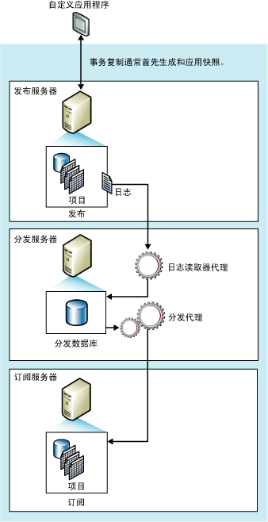

# 事务复制
[!INCLUDE[appliesto-ss-xxxx-xxxx-xxx-md](../../../includes/appliesto-ss-xxxx-xxxx-xxx-md.md)]
  事务复制通常从发布数据库对象和数据的快照开始。 创建了初始快照后，接着在发布服务器上所做的数据更改和架构修改通常在修改发生时（几乎实时）便传递给订阅服务器。 数据更改将按照其在发布服务器上发生的顺序和事务边界应用于订阅服务器，因此，在发布内部可以保证事务的一致性。  
  
 事务复制通常用于服务器到服务器环境中，在以下各种情况下适合采用事务复制：  
  
-   希望发生增量更改时将其传播到订阅服务器。  
  
-   从发布服务器上发生更改，至更改到达订阅服务器，应用程序需要这两者之间的滞后时间较短。  
  
-   应用程序需要访问中间数据状态。 例如，如果某一行更改了五次，事务复制将允许应用程序响应每次更改（例如，激发触发器），而不只是响应该行最终的数据更改。  
  
-   发布服务器有大量的插入、更新和删除活动。  
  
-   发布服务器或订阅服务器不是[!INCLUDE[ssNoVersion](../../../includes/ssnoversion-md.md)] 数据库（例如，Oracle）。  
  
 默认情况下，事务发布的订阅服务器应视为只读，因为更改不会传播回发布服务器。 但是，事务复制确实提供了允许在订阅服务器上进行更新的选项。  
  
 **本主题内容**  
  
 [事务复制的工作机制](#HowWorks)  
  
 [初始数据集](#Dataset)  
  
 [快照代理](#SnapshotAgent)  
  
 [日志读取器代理](#LogReaderAgent)  
  
 [分发代理](#DistributionAgent)  
  
##   事务复制的工作机制  
 事务复制是由 [!INCLUDE[ssNoVersion](../../../includes/ssnoversion-md.md)] 快照代理、日志读取器代理和分发代理实现的。 快照代理准备快照文件（其中包含了已发布表和数据库对象的架构和数据），然后将这些文件存储在快照文件夹中，并在分发服务器中的分发数据库中记录同步作业。  
  
 日志读取器代理监视为事务复制配置的每个数据库的事务日志，并将标记为要复制的事务从事务日志复制到分发数据库中，分发数据库的作用相当于一个可靠的存储-转发队列。 分发代理将快照文件夹中的初始快照文件和分发数据库表中的事务复制到订阅服务器中。  
  
 在发布服务器中所做的增量更改根据分发代理的计划流向订阅服务器，分发代理可以连续运行以尽量减少滞后时间，也可以按预定的时间间隔运行。 由于数据更改必须在发布服务器中进行（使用事务复制时，无需指定立即更新或排队更新选项），从而避免了更新冲突。 最后，所有订阅服务器都将获得与发布服务器相同的值。 如果事务复制使用了立即更新或排队更新选项，更新可以在订阅服务器中进行，对于排队更新，可能会发生冲突。  
  
 下图显示了事务复制的主要组件。  
  
   
  
##   初始数据集  
 新的事务复制订阅服务器中必须包含一些表，这些表需要与发布服务器中的表具有相同的架构和数据，这样才能从发布服务器中接收增量更改。 初始数据集通常是由快照代理创建并由分发代理分发和应用的快照。 初始数据集还可以通过备份或其他方式提供，如使用 [!INCLUDE[ssNoVersion](../../../includes/ssnoversion-md.md)] Integration Services 提供。  
  
 在向订阅服务器分发并应用快照时，只有那些等待初始快照的订阅服务器才会受到影响。 该发布的其他订阅服务器（已经初始化的订阅服务器）不会受到影响。  
  
## 并发快照处理  
 在快照生成期间，快照复制会在作为复制的一部分发布的所有表上放置共享锁。 这样可以防止更新正在发布的表。 并发快照处理（事务复制的默认方式）在整个快照生成过程中并不保留共享锁，因而允许用户在复制创建初始快照文件时继续工作，而不会被打断。  
  
##   快照代理  
 快照代理在事务复制中实现初始快照所使用的过程与快照复制所使用的过程相同（上述有关并发快照处理的情况除外）。  
  
 生成快照文件后，可以使用 [!INCLUDE[msCoName](../../../includes/msconame-md.md)] Windows 资源管理器在快照文件夹中查看这些快照文件。  
  
##   修改数据修改与日志读取器代理  
 日志读取器代理在分发服务器中运行；它通常连续运行，但也可以按照您制定的计划运行。 执行日志读取器代理时，它首先读取发布事务日志（该日志与执行一般 [!INCLUDE[ssNoVersion](../../../includes/ssnoversion-md.md)] 数据库引擎操作期间用于事务跟踪和恢复的数据库日志相同），并标识任何 INSERT、UPDATE 以及 DELETE 语句，或者对已标记为要复制的事务进行的其他数据修改。 然后，该代理将这些事务批量复制到分发服务器中的分发数据库中。 日志读取器代理使用内部存储过程 **sp_replcmds** 从日志中获取标记为要复制的下一个命令集。 这样，分发数据库就成为一个存储-转发队列，从该队列中将更改发送到订阅服务器中。 只有已提交的事务才能发送到分发数据库中。  
  
 当整批事务都成功写入分发数据库之后，将提交这批事务。 在每一批命令都提交到分发服务器后，日志读取器代理将调用 **sp_repldone** 以标记最终完成复制的位置。 最后，代理在事务日志中标记可以清除的行。 仍在等待复制的行不会被清除。  
  
 事务命令在传播到所有订阅服务器或达到最大分发保持期之前，一直存储在分发数据库中。 订阅服务器按事务在发布服务器中应用的相同顺序接收事务。  
  
##   分发代理  
 对于推送订阅，分发代理在分发服务器上运行；对于请求订阅，分发代理在订阅服务器上运行。 该代理将事务从分发数据库移动到订阅服务器中。 如果订阅被标记为需要验证，则分发代理还要检查发布服务器和订阅服务器中的数据是否匹配。  
  
  
