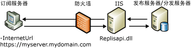

# 合并复制的 Web 同步
 [!INCLUDE [SQL Server](../../includes/applies-to-version/sqlserver.md)]
  对过进行合并复制的 Web 同步，可以使用 HTTPS 协议复制数据，这对于以下情况非常有用：  
  
-   通过 Internet 同步移动用户数据。  
  
-   跨企业防火墙在 [!INCLUDE[msCoName](../../includes/msconame-md.md)] [!INCLUDE[ssNoVersion](../../includes/ssnoversion-md.md)] 数据库之间同步数据。  
  
 例如，正在出差的销售代表可以使用 Web 同步。 [!INCLUDE[ssSampleDBCoFull](../../includes/sssampledbcofull-md.md)]公司的销售代表们要去所在区域的不同商店和供应商那里出差。 如果出差时间较长，销售代表们会住在宾馆里，这就需要一种方便的方法，能够在每天结束时上载销售数据，下载产品更新信息。  
  
 因此， [!INCLUDE[ssSampleDBCoShort](../../includes/sssampledbcoshort-md.md)] 的 IT 部门为每台便携式计算机配置了 [!INCLUDE[ssNoVersion](../../includes/ssnoversion-md.md)] ，并启用了合并复制以便使用 Web 同步。 每台便携式计算机上的合并代理都有一个 Internet URL，它指向运行 [!INCLUDE[msCoName](../../includes/msconame-md.md)] Internet 信息服务 (IIS) 的计算机上所安装的复制组件。 这些组件用于使订阅服务器与发布服务器同步。 现在，每个代表能够通过任何可用的 Internet 连接进行连接而无须使用远程拨号，能够上载和下载合适的数据。 Internet 连接使用传输层安全性 (TLS)（旧称为“安全套接字层 (SSL)”），因此不需要虚拟专用网 (VPN)。  
  
 有关如何配置 Web 同步所需的组件的信息，请参阅[配置 Web 同步](../../relational-databases/replication/configure-web-synchronization.md)、[配置 IIS 以实现 Web 同步](../../relational-databases/replication/configure-iis-for-web-synchronization.md)和[配置 IIS 7 以实现 Web 同步](../../relational-databases/replication/configure-iis-7-for-web-synchronization.md)。  
  
> [!NOTE]  
>  Web 同步的设计目的是为了与便携式计算机、手持设备以及其他客户端同步数据， Web 同步并不适于大容量服务器对服务器应用程序。  
  
## Web 同步的工作机制概述  
 使用 Web 同步时，借助 HTTPS 协议，将订阅服务器上的更新按 XML 消息打包并发送给运行 IIS 服务器的计算机。 然后，运行 IIS 的计算机将命令以二进制格式发送给发布服务器（通常使用 TCP/IP）。 发布服务器上的更新将被发送给运行 IIS 的计算机，然后按 XML 消息打包，以便传递给订阅服务器。  
  
 下图显示了合并复制的 Web 同步中涉及的一些组件。  
  
   
  
 Web 同步选项仅适用于请求订阅；所以，合并代理始终在订阅服务器上运行。 此合并代理可以是标准合并代理、合并代理 ActiveX 控件或者通过复制管理对象 (RMO) 提供同步的应用程序。 若要指定运行 IIS 的计算机的位置，请对合并代理使用 **–InternetUrl** 参数。  
  
 [!INCLUDE[ssNoVersion](../../includes/ssnoversion-md.md)] 复制侦听器 (Replisapi.dll) 在运行 IIS 的计算机上配置，负责处理从发布服务器和订阅服务器发送给服务器的消息。 拓扑中的每个节点都使用合并复制协调器 (Replrec.dll) 处理 XML 数据流。  
  
 对于所有参与 Web 同步的计算机，均需要[!INCLUDE[ssVersion2005](../../includes/ssversion2005-md.md)] 或更高版本。  
  
### 同步过程  
 同步过程包括以下步骤：  
  
1.  合并代理在订阅服务器上启动。 该代理将执行下列操作：  
  
    1.  与订阅数据库建立 SQL 连接。  
  
    2.  从数据库中提取任何更改。  
  
    3.  向运行 IIS 的计算机发出 HTTPS 请求。  
  
    4.  将数据更改作为 XML 消息上载。  
  
2.  运行 IIS 的计算机中所承载的 [!INCLUDE[ssNoVersion](../../includes/ssnoversion-md.md)] 复制侦听器和合并复制协调器将执行下列操作：  
  
    1.  对 HTTPS 请求做出响应。  
  
    2.  与发布数据库建立 SQL 连接。  
  
    3.  将上载更改应用于发布数据库。  
  
    4.  为订阅服务器提取下载更改。  
  
    5.  将 HTTPS 响应发送回合并代理。  
  
3.  然后，订阅服务器上的合并代理将接受 HTTPS 响应，并将下载更改应用于订阅数据库。  
  
## 另请参阅  
 [Configure Web Synchronization](../../relational-databases/replication/configure-web-synchronization.md)   
 [Web 同步的拓扑](../../relational-databases/replication/topologies-for-web-synchronization.md)  
  
  
