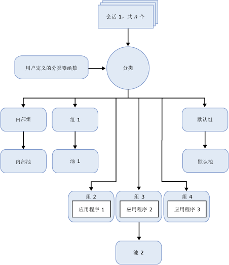

# Resource Governor
[!INCLUDE[appliesto-ss-xxxx-xxxx-xxx-md](../../includes/appliesto-ss-xxxx-xxxx-xxx-md.md)]
  [!INCLUDE[ssNoVersion](../../includes/ssnoversion-md.md)] 资源调控器是一项可用于管理 [!INCLUDE[ssNoVersion](../../includes/ssnoversion-md.md)] 工作负荷和系统资源使用情况的功能。 您可使用资源调控器指定传入应用程序请求可以使用的 CPU、物理 IO 和内存的数量限制。  
  
## 资源调控器的优势  
 利用资源调控器，您可以通过指定传入请求的资源消耗限制来管理 [!INCLUDE[ssNoVersion](../../includes/ssnoversion-md.md)] 工作负荷和资源。 在资源调控器上下文中，工作负荷是一组大小相似的查询或请求，可以且应该视为单个实体。 这并不是必需的，但是工作负荷的资源使用模式越统一，通过资源调控器可能获得的益处越多。 资源限制可以实时重新配置，对正在执行的工作负荷影响非常小。  
  
 在相同服务器上存在多个不同工作负荷的环境中，使用资源调控器可以区分这些工作负荷并能根据指定的限制在请求时分配共享资源。 这些资源是 CPU、物理 IO 和内存。  
  
 通过使用资源调控器，您可以：  
  
-   在服务于多个客户端工作负荷的单个 SQL Server 实例上提供多租户和资源隔离。 也就是说，您可以将某个服务器上的可用资源划分到多个工作负荷上，并且尽量减少在工作负荷争用资源时可能发生的问题。  
  
-   提供可预测性能并且在多工作负荷和多用户环境中支持针对工作负荷租户的 SLA。  
  
-   隔离和限制失控查询，或者中止可能使 IO 子系统饱和以及对其他工作负荷有负面影响的操作（例如 DBCC CHECKDB）的 IO 资源。  
  
-   为资源使用退款添加细粒度资源跟踪，并且对服务器资源的使用者提供可预测的计费。  
  
## 资源调控器约束  
 此资源调控器版本存在以下约束：  
  
-   资源管理仅限于 [!INCLUDE[ssDEnoversion](../../includes/ssdenoversion-md.md)]。 资源调控器不能用于 [!INCLUDE[ssASnoversion](../../includes/ssasnoversion-md.md)]、 [!INCLUDE[ssISnoversion](../../includes/ssisnoversion-md.md)]和 [!INCLUDE[ssRSnoversion](../../includes/ssrsnoversion-md.md)]。  
  
-   SQL Server 实例之间没有工作负荷监视或工作负荷管理。  
  
-   资源调控器可以管理 OLTP 工作负荷，但通常持续时间非常短的查询类型总是在 CPU 上停留很短时间而不足以应用带宽控制。 这样会使返回的 CPU 使用率的统计信息有偏差。  
  
-   控制物理 IO 的功能仅适用于用户操作，而不适用于系统任务。 系统任务包括向事务日志的写入操作和 Lazy Writer IO 操作。 资源调控器主要应用于用户读取操作，因为大多数写操作通常由系统任务执行。  
  
-   您不能对内部资源池设置 IO 阈值。  
  
## 资源概念  
 下面的三个概念是了解和使用资源调控器的基础：  
  
-   **资源池。** 资源池表示服务器的物理资源。 您可以将池看作 [!INCLUDE[ssNoVersion](../../includes/ssnoversion-md.md)] 实例内部的一个虚拟 [!INCLUDE[ssNoVersion](../../includes/ssnoversion-md.md)] 实例。 当安装 [!INCLUDE[ssNoVersion](../../includes/ssnoversion-md.md)] 时，会创建两个资源池（内部资源池和默认资源池）。 资源调控器还支持用户定义的资源池。 有关详细信息，请参阅 [Resource Governor Resource Pool](../../relational-databases/resource-governor/resource-governor-resource-pool.md)。  
  
-   **工作负荷组。** 工作负荷组充当具有相似分类标准的会话请求的容器。 工作负荷允许对会话进行聚合监视，并定义会话的策略。 每个工作负荷组都处于一个资源池中。 当安装 [!INCLUDE[ssNoVersion](../../includes/ssnoversion-md.md)] 时，会创建两个工作负荷组（内部工作负荷组和默认工作负荷组）并将其映射到对应的资源池。 资源调控器还支持用户定义的工作负荷组。 有关详细信息，请参阅 [Resource Governor Workload Group](../../relational-databases/resource-governor/resource-governor-workload-group.md)。  
  
-   **分类。** 分类过程会根据传入会话的特征将其分配给工作负荷组。 您可以通过编写用户定义函数（称为分类器函数）来定制分类逻辑。 资源调控器还支持用于实现分类规则的分类器用户定义的函数。 有关详细信息，请参阅 [Resource Governor Classifier Function](../../relational-databases/resource-governor/resource-governor-classifier-function.md)。  
  
> [!NOTE]  
>  资源调控器不向专用管理员连接 (DAC) 施加任何控制。 无需对在内部工作负荷组和资源池中运行的 DAC 查询进行分类。  
  
 在资源调控器的上下文中，您可以将前面的概念视为组件。 下图显示了这些组件及其在数据库引擎环境中相互之间的关系。 从处理的角度，简化的流程如下所示：  
  
-   会话有传入的连接（Session 1，共 *n*个）。  
  
-   会话已分类（分类）。  
  
-   会话工作负荷将路由到工作负荷组，例如，Group 4。  
  
-   工作负荷组使用与其关联的资源池，例如，Pool 2。  
  
-   资源池提供并限制应用程序所需的资源，例如，Application 3。  
  
   
  
## 资源调控器任务  
  
|任务说明|主题|  
|----------------------|-----------|  
|说明如何启用资源调控器。|[启用资源调控器](../../relational-databases/resource-governor/enable-resource-governor.md)|  
|说明如何禁用资源调控器。|[禁用资源调控器](../../relational-databases/resource-governor/disable-resource-governor.md)|  
|说明如何创建、更改和删除资源池。|[资源调控器资源池](../../relational-databases/resource-governor/resource-governor-resource-pool.md)|  
|说明如何创建、更改、移动和删除工作负荷组。|[资源调控器工作负荷组](../../relational-databases/resource-governor/resource-governor-workload-group.md)|  
|说明如何创建和测试分类器用户定义函数。|[资源调控器分类器函数](../../relational-databases/resource-governor/resource-governor-classifier-function.md)|  
|说明如何使用模板配置资源调控器。|[使用模板配置资源调控器](../../relational-databases/resource-governor/configure-resource-governor-using-a-template.md)|  
|说明如何查看资源调控器属性。|[查看资源调控器属性](../../relational-databases/resource-governor/view-resource-governor-properties.md)|  
  
## 另请参阅  
 [数据库引擎实例 (SQL Server)](../../database-engine/configure-windows/database-engine-instances-sql-server.md)  
  
  
