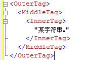
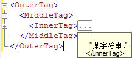

# <a name="code-outlining"></a>代码大纲显示
[!INCLUDE[appliesto-ss-asdb-asdw-pdw-md](../../includes/appliesto-ss-asdb-asdw-pdw-md.md)]
  使用 [!INCLUDE[ssManStudioFull](../../includes/ssmanstudiofull-md.md)] 查询编辑器中的大纲显示功能可在编辑查询时有选择地隐藏代码， 从而可以更加方便地查看您正在处理的代码，尤其是大型查询文件中的代码。  
  
## <a name="outlining-overview"></a>大纲显示概述  
 默认情况下，打开查询编辑器窗口时所有代码均可见。 可将代码区域折叠起来以便在视图中隐藏该区域。 编辑器窗口左侧边缘的竖线使用一个方块和一个减号 (-) 来标识每个可折叠代码区域的起点。 单击减号时，代码区域的文本将更换为一个含有三个句点 ( ) 的框，且减号将变为加号 (+)。 单击加号时，将显示折叠的代码，且加号将变为减号。 将指针移动到含有三个句点的框上方时，该处出现工具提示，显示折叠部分包含的代码。  
  
## <a name="system-outline-regions"></a>系统大纲区域  
 每个 [!INCLUDE[ssManStudioFull](../../includes/ssmanstudiofull-md.md)] 编辑器均生成一组默认的系统定义的大纲区域。  
  
 MDX 和 DMX 代码编辑器可为每个多行语句创建大纲区域。 这是以上编辑器支持的唯一大纲显示级别。  
  
### <a name="analysis-services-xmla-query-editor-regions"></a>Analysis Services XMLA 查询编辑器区域  
 [!INCLUDE[ssASnoversion](../../includes/ssasnoversion-md.md)] XMLA 查询编辑器为每个多行 XML 属性生成大纲区域。 该编辑器可为嵌套标签嵌套大纲区域。 例如，XMLA 编辑器为以下文件创建三个大纲区域。  
  
   
  
 单击 \<InnerTag> 行上的减号时，只有 InnerTag 会折叠起来，如下图所示。  
  
   
  
 将指针移动到含有三个句点 ( ) 的框上方时，折叠区域中的代码将出现在工具提示中，如下图所示。  
  
   
  
 单击 \<MiddleTag> 行上的减号时，MiddleTag 和 InnerTag 都会折叠起来，如下图所示。  
  
   
  
 单击 \<OuterTag> 行上的减号时，所有三行均折叠起来，如下图所示。  
  
   
  
### <a name="database-engine-query-editor-regions"></a>数据库引擎查询编辑器区域  
 [!INCLUDE[ssDE](../../includes/ssde-md.md)] 查询编辑器为以下层次结构中的每个元素生成大纲区域：  
  
1.  批处理。 第一个批处理是从文件开头到第一个 GO 命令或没有 GO 命令时到文件结尾的代码。 在第一个 GO 命令后面，从每个 GO 命令到下一个 GO 命令或文件结尾均有一个批处理。  
  
2.  块由以下关键字分隔：  
  
    -   BEGIN - END  
  
    -   BEGIN TRY - END TRY  
  
    -   BEGIN CATCH - END CATCH  
  
3.  多行语句。  
  
 例如， [!INCLUDE[ssDE](../../includes/ssde-md.md)] 查询编辑器为以下查询创建三个大纲区域：  
  
```  
CREATE PROCEDURE Sales.SampleProc --Outline region 1  
AS  
BEGIN --Outline region 2   
  SELECT GETDATE() AS TimeOfQuery;  
  SELECT * --Outline region 3  
  FROM sys.transmission_queue;  
  SELECT @@VERSION;  
END;  
GO  
```  
  
 若仅折叠该 `SELECT *` 语句，请单击 `SELECT` 行上的减号。 若要折叠整个 `BEGIN - END` 块，请单击 `BEGIN` 行上的减号。 若要将整个批处理折叠到 `GO` 命令，请单击 `CREATE PROCEDURE` 行上的减号。 由于 `SELECT GETDATE()` 或 `SELECT @@VERSION` 行为单行语句且不具有大纲区域，因此不能将这两行分别单独折叠起来。  
  
  
