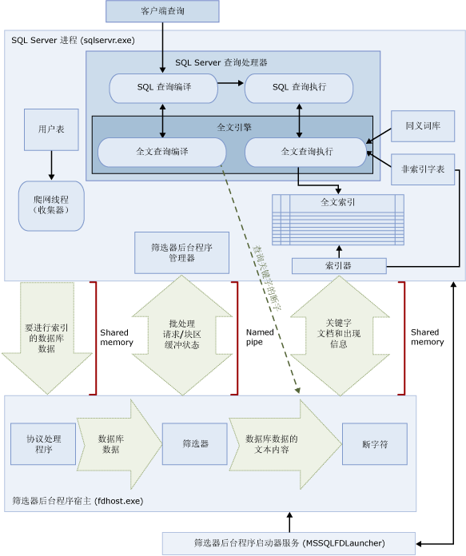

# <a name="full-text-search"></a>全文搜索
[!INCLUDE [SQL Server Azure SQL Database](../../includes/applies-to-version/sql-asdb.md)]

[!INCLUDE[ssNoVersion](../../includes/ssnoversion-md.md)] 和 [!INCLUDE[ssSDSFull](../../includes/sssdsfull-md.md)] 中的全文搜索为用户和应用程序提供了对 [!INCLUDE[ssNoVersion](../../includes/ssnoversion-md.md)] 表中基于字符的数据运行全文查询的功能。
  
## <a name="basic-tasks"></a>基本任务
本主题概述了全文搜索并介绍了其组件和体系结构。 如果你希望马上开始，可以使用下面的基本任务。
-   [全文搜索入门](../../relational-databases/search/get-started-with-full-text-search.md)
-   [创建和管理全文索引目录](../../relational-databases/search/create-and-manage-full-text-catalogs.md)
-   [创建和管理全文索引](../../relational-databases/search/create-and-manage-full-text-indexes.md)
-   [填充全文索引](../../relational-databases/search/populate-full-text-indexes.md)
-   [使用全文搜索查询](../../relational-databases/search/query-with-full-text-search.md)

> [!NOTE]
> 全文搜索是 [!INCLUDE[ssNoVersion](../../includes/ssnoversion-md.md)] 数据库引擎的一个可选组件。 如果你在安装 SQL Server 时没有选择全文搜索，请再次运行 SQL Server 安装程序来添加它。

## <a name="overview"></a>概述
全文索引包括表中一个或多个基于字符的列。 这些列可以具有以下任何数据类型：**char**、**varchar**、**nchar**、**nvarchar**、**text**、**ntext**、**image**、**xml** 或 **varbinary(max)** 和 **FILESTREAM**。 每个全文索引都对表中的一个或多个列创建索引，并且每个列都可以使用特定语言。  
  
 全文查询根据特定语言（例如，英语或日语）的规则对词和短语进行操作，从而依据全文索引中的文本数据执行语言搜索。 全文查询可以包括简单的词和短语，或者词或短语的多种形式。 全文查询返回包含至少一个匹配项（也称为“命中”）的所有文档。 当目标文档包含在全文查询中指定的所有字词，并符合任何其他搜索条件（如匹配的字词之间的距离）时，即发生匹配。    
  
##  <a name="full-text-search-queries"></a><a name="queries"></a> 全文搜索查询  
 在将列添加到全文索引之后，用户和应用程序即可对列中的文本运行全文查询。 这些查询可以搜索以下项中的任一项：  
  
-   一个或多个特定的词或短语（“简单词”）  
  
-   以指定文本开头的词或短语（“前缀词”）  
  
-   特定词的变形（“派生词”）  
  
-   与另一个词或短语邻近的词或短语（“邻近词”）  
  
-   特定词的同义词形式（“同义词库”）  
  
-   使用加权值的词或短语（“加权词”）  
  
 全文查询不区分大小写。 例如对于 "Aluminum" 或 "aluminum"，搜索将返回相同的结果。  
  
 全文查询使用一小组 [!INCLUDE[tsql](../../includes/tsql-md.md)] 谓词（CONTAINS 和 FREETEXT）和函数（CONTAINSTABLE 和 FREETEXTTABLE）。 然而，给定商业应用场景的搜索目标会对全文查询的结构产生影响。 例如：  
  
-   电子商务（在网站上搜索产品）：  
  
    ```  
    SELECT product_id   
    FROM products   
    WHERE CONTAINS(product_description, "Snap Happy 100EZ" OR FORMSOF(THESAURUS,'Snap Happy') OR '100EZ')   
    AND product_cost < 200 ;  
    ```  
  
-   招聘员工（搜索具有 [!INCLUDE[ssNoVersion](../../includes/ssnoversion-md.md)] 使用经验的职位候选人）：  
  
    ```  
    SELECT candidate_name,SSN   
    FROM candidates   
    WHERE CONTAINS(candidate_resume,"SQL Server") AND candidate_division = 'DBA';  
    ```  
  
 有关详细信息，请参阅 [使用全文搜索查询](../../relational-databases/search/query-with-full-text-search.md)。  
  
##  <a name="compare-full-text-search-queries-to-the-like-predicate"></a><a name="like"></a> 全文搜索查询与 LIKE 谓词的对比
 与全文搜索不同，[LIKE](../../t-sql/language-elements/like-transact-sql.md) [!INCLUDE[tsql](../../includes/tsql-md.md)] 谓词仅对字符模式有效。 另外，不能使用 LIKE 谓词来查询格式化的二进制数据。 此外，对大量非结构化的文本数据执行 LIKE 查询要比对相同数据执行同样的全文查询慢得多。 对数百万行文本数据进行的 LIKE 查询可能需要几分钟的时间才能返回结果；而对于同样的数据，全文查询只需要几秒甚至更少的时间，具体取决于返回的行数。  
  
##  <a name="full-text-search-architecture"></a><a name="architecture"></a> 全文搜索体系结构
 全文搜索体系结构包括以下进程：  
  
-   [!INCLUDE[ssNoVersion](../../includes/ssnoversion-md.md)] 进程 (sqlservr.exe)。  
  
-   筛选器后台程序宿主进程 (fdhost.exe)。  
  
     为了安全起见，筛选器由称为筛选器后台程序宿主的单独进程加载。 fdhost.exe 进程是由 FDHOST 启动器服务 (MSSQLFDLauncher) 创建的，这些进程使用 FDHOST 启动器服务帐户的安全凭据运行。 因此，必须运行 FDHOST 启动器服务才能正常进行全文索引和全文查询。 有关设置此服务的服务帐户的信息，请参阅 [设置用于全文筛选器后台程序启动器的服务帐户](../../relational-databases/search/set-the-service-account-for-the-full-text-filter-daemon-launcher.md)。  
  
 这两个进程包含全文搜索体系结构的各组件。 下图概括了这些组件及其关系。 该图后面的内容介绍了这些组件。  
  
   

###  <a name="sql-server-process"></a><a name="sqlprocess"></a> SQL Server 进程  
 [!INCLUDE[ssNoVersion](../../includes/ssnoversion-md.md)] 进程使用全文搜索的以下组件：  
  
-   **用户表。** 这些表包含要进行全文索引的数据。  
  
-   **全文收集器。** 全文收集器使用全文爬网线程。 它负责计划和驱动对全文索引的填充，并负责监视全文目录。  
  
-   **同义词库文件。** 这些文件包含搜索项的同义词。 有关详细信息，请参阅 [为全文搜索配置和管理同义词库文件](../../relational-databases/search/configure-and-manage-thesaurus-files-for-full-text-search.md)。  
  
-   **非索引字表对象。** 非索引字表对象包含对搜索无用的常见词列表。 有关详细信息，请参阅 [为全文搜索配置和管理非索引字和非索引字表](../../relational-databases/search/configure-and-manage-stopwords-and-stoplists-for-full-text-search.md)。  
  
-   **[!INCLUDE[ssNoVersion](../../includes/ssnoversion-md.md)] 查询处理器。** 查询处理器编译并执行 SQL 查询。 如果 SQL 查询包含全文搜索查询，则在编译和执行期间该查询都会发送到全文引擎。 查询结果将与全文索引相匹配。  
  
-   **全文引擎。** [!INCLUDE[ssNoVersion](../../includes/ssnoversion-md.md)] 中的全文引擎现已与查询处理器完全集成。 全文引擎编译和执行全文查询。 作为查询执行的一部分，全文引擎可能会接收来自同义词库和非索引字表的输入。  

    >[!NOTE]  
    >  在 [!INCLUDE[ssKatmai](../../includes/sskatmai-md.md)] 和更高版本中，全文引擎位于 [!INCLUDE[ssNoVersion](../../includes/ssnoversion-md.md)] 进程中，而不是位于单独的服务中。 通过将全文引擎集成到数据库引擎中，提高了全文可管理性和总体性能，并进一步优化了混合查询。  

-   **索引编写器（索引器）。** 索引编写器生成用于存储索引标记的结构。  
  
-   **筛选器后台程序管理器。** 筛选器后台程序管理器负责监视全文引擎筛选器后台程序宿主的状态。  
  
###  <a name="filter-daemon-host-process"></a><a name="fdhostprocess"></a> Filter Daemon Host process  
 筛选器后台程序宿主是一个由全文引擎启动的进程。 它运行下列全文搜索组件，这些组件负责对表中的数据进行访问、筛选和断字，同时还负责对查询输入进行断字和提取词干。  
  
 筛选器后台程序宿主的组件如下：  
  
-   **协议处理程序。** 此组件从内存中取出数据，以进行进一步的处理，并访问指定数据库的用户表中的数据。 其职责之一是从全文索引列中收集数据，并将所收集的数据传递给筛选器后台程序宿主，从而由该宿主根据需要应用筛选和断字符。  
  
-   **筛选器。** 某些数据类型需要筛选，然后才能为文档中的数据（包括 **varbinary**、 **varbinary(max)** 、 **image**或 **xml** 列中的数据）创建全文索引。 给定文档采用何种筛选器取决于文档类型。 例如，Microsoft Word (.doc) 文档、Microsoft Excel (.xls) 文档和 XML (.xml) 文档分别使用不同的筛选器。 然后，筛选器从文档中提取文本块区，删除嵌入的格式并保留文本，如有可能的话也会保留有关文本位置的信息。 结果将以文本化信息流的形式出现。 有关详细信息，请参阅 [配置和管理搜索筛选器](../../relational-databases/search/configure-and-manage-filters-for-search.md)。  
  
-   **断字符和词干分析器。** 断字符是特定于语言的组件，它根据给定语言的词汇规则查找词边界（“断字”）。 每个断字符都与用于组合动词及执行变形扩展的特定于语言的词干分析器组件相关联。 在创建索引时，筛选器后台程序宿主使用断字符和词干分析器来对给定表列中的文本数据执行语言分析。 与全文索引中的表列相关的语言将决定为列创建索引时要使用的断字符和词干分析器。 有关详细信息，请参阅 [配置和管理断字符和词干分析器以便搜索](../../relational-databases/search/configure-and-manage-word-breakers-and-stemmers-for-search.md)。  
  
##  <a name="full-text-search-processing"></a><a name="processing"></a> 全文搜索处理  
 全文搜索由全文引擎提供支持。 全文引擎有两个角色：索引支持和查询支持。  
  
###  <a name="full-text-indexing-process"></a><a name="indexing"></a> 全文索引过程  
 全文填充（也称为爬网）开始后，全文引擎会将大批数据存入内存并通知筛选器后台程序宿主。 宿主对数据进行筛选和断字，并将转换的数据转换为倒排词列表。 然后，全文搜索从词列表中提取转换的数据，对其进行处理以删除非索引字，然后将某一批次的词列表永久保存到一个或多个倒排索引中。  
  
 对存储在 **varbinary(max)** 或 **image** 列中的数据编制索引时，筛选器（实现 **IFilter** 接口）将基于为该数据指定的文件格式（例如， [!INCLUDE[msCoName](../../includes/msconame-md.md)] Word）来提取文本。 在某些情况下，筛选器组件要求将 **varbinary(max)** 或 **image** 数据写入 filterdata 文件夹中，而不是将其存入内存。  
  
 在处理过程中，通过断字符将收集到的文本数据分隔成各个单独的标记或关键字。 用于词汇切分的语言将在列级指定，或者也可以通过筛选器组件在 **varbinary(max)** 、 **image**或 **xml** 数据内标识。  
  
 还可能会进行其他处理以删除非索引字，并在将标记存储到全文索引或索引片断之前对其进行规范化。  
  
 填充完成后，将触发最终的合并过程，以便将索引碎片合并为一个主全文索引。 由于只需要查询主索引而不需要查询大量索引碎片，因此这将提高查询性能，并且可以使用更好的计分统计信息来得出相关性排名。  
  
###  <a name="full-text-querying-process"></a><a name="querying"></a> 全文查询过程  
 查询处理器将查询的全文部分传递到全文引擎以进行处理。 全文引擎执行断字，此外，它还可以执行同义词库扩展、词干分析以及非索引字（干扰词）处理。 然后，查询的全文部分以 SQL 运算符的形式表示，主要作为流式表值函数 (STVF)。 在查询执行过程中，这些 STVF 访问倒排索引以检索正确结果。 此时会将结果返回给客户端，或者先将它们进一步处理，再将它们返回给客户端。  

## <a name="full-text-index-architecture"></a>全文索引体系结构
  全文引擎使用全文索引中的信息来编译可快速搜索表中的特定词或词组的全文查询。 全文索引将有关重要的词及其位置的信息存储在数据库表的一列或多列中。 全文索引是一种特殊类型的基于标记的功能性索引，它是由 [!INCLUDE[ssNoVersion](../../includes/ssnoversion-md.md)]全文引擎生成和维护的。 生成全文索引的过程不同于生成其他类型的索引。 全文引擎并非基于特定行中存储的值来构造 B 树结构，而是基于要编制索引的文本中的各个标记来生成倒排、堆积且压缩的索引结构。  全文索引大小仅受运行 [!INCLUDE[ssNoVersion](../../includes/ssnoversion-md.md)] 实例的计算机的可用内存资源限制。  
  
 从 [!INCLUDE[ssKatmai](../../includes/sskatmai-md.md)]开始，全文索引与数据库引擎集成在一起，而不是像 [!INCLUDE[ssNoVersion](../../includes/ssnoversion-md.md)]早期版本那样位于文件系统中。 对于新数据库，全文目录现在为不属于任何文件组的虚拟对象；它仅是一个表示一组全文索引的逻辑概念。 然而，请注意，在升级 [!INCLUDE[ssVersion2005](../../includes/ssversion2005-md.md)] 数据库（即包含数据文件的任意全文目录）的过程中，将创建一个新文件组。有关详细信息，请参阅 [升级全文搜索](../../relational-databases/search/upgrade-full-text-search.md)。  
  
每个表只允许有一个全文索引。 若要对某个表创建全文索引，该表必须具有一个唯一且非 Null 的列。 你可以在 **char**、 **varchar**、 **nchar**、 **nvarchar**、 **text**、 **ntext**、 **image**、 **xml**、 **varbinary**类型的列上生成全文索引，并且可对 **varbinary(max)** 索引以进行全文搜索。 在数据类型为  **varbinary**、 **varbinary(max)** 、 **image**或 **xml** 的列上创建全文索引需要你指定类型列。 *类型列*是用来存储每行中文档的文件扩展名（.doc、.pdf、xls 等）的表列。  

###  <a name="full-text-index-structure"></a><a name="structure"></a> 全文索引结构  
 对全文索引的结构的良好了解将帮助您了解全文引擎的工作方式。 本主题使用 **中的** Document [!INCLUDE[ssSampleDBCoShort](../../includes/sssampledbcoshort-md.md)] 表的以下摘录部分作为示例表。 此摘录部分仅显示该表的两个列（ **DocumentID** 列和 **Title** 列）和三行。  
  
 对于本示例，我们假定已对“标题”列创建全文索引。  
  
|DocumentID|标题|  
|----------------|-----------|  
|1|Crank Arm and Tire Maintenance|  
|2|Front Reflector Bracket and Reflector Assembly 3|  
|3|Front Reflector Bracket Installation|  
  
 例如，下表（显示 Fragment 1）描述对“Document”表的“Title”列创建的全文索引的内容。 与该表呈现的信息相比，全文索引包含更多信息。 该表是全文索引的逻辑表示形式，并且仅为演示目的提供。 行以压缩格式存储，以优化磁盘的使用。  
  
 注意，数据已从原始文档倒排。 发生数据倒排是因为关键字映射到文档 ID。 因此，全文索引通常称为倒排索引。  
  
 还要注意，已从全文索引中删除关键字“and”。 这样做是因为“and”是非索引字，从全文索引中删除非索引字可以大幅节省磁盘空间，并因此提高查询性能。 有关非索引字的详细信息，请参阅 [为全文搜索配置和管理非索引字和非索引字表](../../relational-databases/search/configure-and-manage-stopwords-and-stoplists-for-full-text-search.md)。  
  
 **碎片 1**  
  
|关键字|ColId|DocId|出现次数|  
|-------------|-----------|-----------|----------------|  
|Crank|1|1|1|  
|Arm|1|1|2|  
|Tire|1|1|4|  
|维护|1|1|5|  
|Front|1|2|1|  
|Front|1|3|1|  
|Reflector|1|2|2|  
|Reflector|1|2|5|  
|Reflector|1|3|2|  
|Bracket|1|2|3|  
|Bracket|1|3|3|  
|Assembly|1|2|6|  
|3|1|2|7|  
|安装|1|3|4|  
  
 **Keyword** 列包含在创建索引时提取的单个标记的表示形式。 断字符可确定组成标记的词。  
  
 “ColId” 列包含的值对应于已建立全文索引的特定列。  
  
 “DocId” 列包含八字节整数的值，该值映射到全文索引表中特定的全文键值。 如果全文键不是整数数据类型，则需要此映射。 在这样的情况下，全文键值与 **DocId** 值之间的映射将保留在名为 DocId Mapping 的单独表中。 若要查询这些映射，请使用 [sp_fulltext_keymappings](../../relational-databases/system-stored-procedures/sp-fulltext-keymappings-transact-sql.md) 系统存储过程。 若要满足搜索条件，则上述表中的 DocId 值需要与 DocId Mapping 表联接，以便从所查询的基表中检索行。 如果基表的全文键值是整数类型，则该值直接充当 DocId，而不需要映射。 因此，使用整数全文键值有助于优化全文查询。  
  
 **Occurrence** 列包含整数值。 对于每个 DocId 值，均有一个 Occurrence 值的列表对应于该 DocId 值中特定关键字的相对字偏移量。 位置值用于确定短语或邻近匹配项，例如具有相邻位置值的短语。 它们还用于计算相关性分数，例如记分时可能会用某个关键字在 DocId 中的出现次数。   
  
###  <a name="full-text-index-fragments"></a><a name="fragments"></a> 全文索引碎片  
 逻辑全文索引通常拆分到多个内部表中。 每个内部表称为一个全文索引碎片。 这些碎片中的某一些可能包含比其他碎片更新的数据。 例如，如果用户更新其 DocId 是 3 的以下行，并且该表可自动跟踪更改，则会创建新的碎片。  
  
|DocumentID|标题|  
|----------------|-----------|  
|3|Rear Reflector|  
  
 在下面的示例（显示 Fragment 2）中，碎片中包含比 Fragment 1 中更新的关于 DocId 3 的数据。 因此，当用户查询“Rear Reflector”时，会将 Fragment 2 中的数据用于 DocId 3。 每个碎片都用一个创建时间戳来标记，可以使用 [sys.fulltext_index_fragments](../../relational-databases/system-catalog-views/sys-fulltext-index-fragments-transact-sql.md) 目录视图查询该时间戳。  
  
 **碎片 2**  
  
|关键字|ColId|DocId|Occ|  
|-------------|-----------|-----------|---------|  
|Rear|1|3|1|  
|Reflector|1|3|2|  
  
 从 Fragment 2 可以看到，全文查询需要在内部查询每个碎片，并放弃更旧的条目。 因此，全文索引中太多的全文索引碎片会导致查询性能大幅下降。 若要减少碎片数，请使用 [ALTER FULLTEXT CATALOG](../../t-sql/statements/alter-fulltext-catalog-transact-sql.md)[!INCLUDE[tsql](../../includes/tsql-md.md)] 语句的 REORGANIZE 选项来重新组织全文目录。 此语句将执行一次 *主合并*，主合并将碎片合并成一个更大的碎片，并从全文索引中删除所有过时的条目。  
  
 经过重新组织后，示例索引会包含以下行：  
  
|关键字|ColId|DocId|Occ|  
|-------------|-----------|-----------|---------|  
|Crank|1|1|1|  
|Arm|1|1|2|  
|Tire|1|1|4|  
|维护|1|1|5|  
|Front|1|2|1|  
|Rear|1|3|1|  
|Reflector|1|2|2|  
|Reflector|1|2|5|  
|Reflector|1|3|2|  
|Bracket|1|2|3|  
|Assembly|1|2|6|  
|3|1|2|7|  

### <a name="differences-between-full-text-indexes-and-regular-sql-server-indexes"></a>全文索引和普通 SQL Server 索引之间的区别：  
  
|全文索引|普通 SQL Server 索引|  
|------------------------|--------------------------------|  
|每个表只允许有一个全文索引。|每个表允许有多个普通索引。|  
|将数据添加到全文索引的操作称为“填充”，可以通过计划或特定请求来请求填充，也可以在添加新数据时自动填充。|当插入、更新或删除作为其基础的数据时自动更新。|  
|在同一个数据库内分组为一个或多个全文目录。|不分组。|  

##  <a name="full-text-search-linguistic-components-and-language-support"></a><a name="components"></a> 全文搜索中的语言组件和语言支持
 全文搜索支持大约 50 种不同语言，例如英语、西班牙语、中文、日语、阿拉伯语、孟加拉语和印地语。 有关支持的全文语言的完整列表，请参阅 [sys.fulltext_languages (Transact-SQL)](../../relational-databases/system-catalog-views/sys-fulltext-languages-transact-sql.md)。 全文索引中包含的每一列与一个 Microsoft Windows 区域设置标识符 (LCID) 相关联，每个区域设置标识符等同于全文搜索支持的一种语言。 例如，LCID 1033 等于美国英语，LCID 2057 等于英国英语。 对于每种支持的全文语言， [!INCLUDE[ssNoVersion](../../includes/ssnoversion-md.md)] 提供语言组件以支持对以该语言存储的全文数据进行索引和查询。  
  
 语言特有组件包括：  
  
-   **断字符和词干分析器。** 断字符根据给定语言的词汇规则查找词边界（“断字”）。 每个断字符与一个词干分析器相关联，该词干分析器组合了同一种语言的动词。 有关详细信息，请参阅 [配置和管理断字符和词干分析器以便搜索](../../relational-databases/search/configure-and-manage-word-breakers-and-stemmers-for-search.md)。  
  
-   **非索引字表。** 提供系统非索引字表，其中包含一组基本非索引字（也称为干扰词）。 “非索引字”是对搜索没有任何帮助并且被全文查询忽略的词。 例如，在英语区域设置中，诸如“a”、“and”、“is”和“the”之类的词都被视为非索引字。 通常情况下，需要配置一个或多个同义词库文件和非索引字表。 有关详细信息，请参阅 [为全文搜索配置和管理非索引字和非索引字表](../../relational-databases/search/configure-and-manage-stopwords-and-stoplists-for-full-text-search.md)。  
  
-   **同义词库文件。** [!INCLUDE[ssNoVersion](../../includes/ssnoversion-md.md)] 还会安装一个全局同义词库文件，并且还为每种全文语言安装一个同义词库文件。 安装的同义词库文件实际上是空的，不过可以编辑它们以便为特定语言或商业应用场景定义同义词。 通过开发针对全文数据定制的同义词库，您可以有效地扩大对这些数据的全文查询的范围。 有关详细信息，请参阅 [为全文搜索配置和管理同义词库文件](../../relational-databases/search/configure-and-manage-thesaurus-files-for-full-text-search.md)。  
  
-   **筛选器 (iFilter)。**  对 **varbinary(max)** 、 **image**或 **xml** 数据类型列中的文档进行索引时，需要使用筛选器来执行额外的处理工作。 此筛选器必须特定于文档类型（.doc、.pdf、.xls、.xml 等）。 有关详细信息，请参阅 [配置和管理搜索筛选器](../../relational-databases/search/configure-and-manage-filters-for-search.md)。  
  
 断字符（和词干分析器）以及筛选器在筛选器后台程序宿主进程 (fdhost.exe) 中运行。  

[!INCLUDE[tsql-appliesto-ss2008-asdb-xxxx-xxx_md](../../includes/tsql-appliesto-ss2008-asdb-xxxx-xxx-md.md)]
