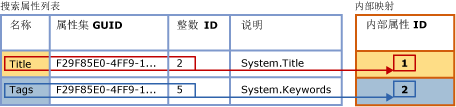
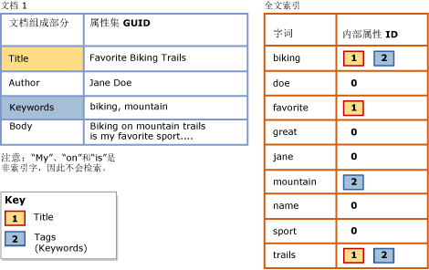

# <a name="search-document-properties-with-search-property-lists"></a>使用搜索属性列表搜索文档属性
[!INCLUDE[appliesto-ss-asdb-xxxx-xxx-md](../../includes/appliesto-ss-asdb-xxxx-xxx-md.md)]
  文档属性的内容先前无法与文档正文的内容区分。 此局限性将全文查询限制为针对整个文档进行一般搜索。 但现在，对于 **varbinary**、 **varbinary(max)** （包括 **FILESTREAM**）或 **image** 二进制数据列中支持的文档类型，你可以配置全文索引以支持对特定属性（如 Author 和 Title）进行属性范围内的搜索。 这种形式的搜索称为“属性搜索”  。  
  
 关联的 [筛选器](../../relational-databases/search/configure-and-manage-filters-for-search.md) (IFilter) 确定能否针对指定的文档类型进行属性搜索。 对于某些文档类型，关联的 IFilter 提取为该类型文档定义的某些或所有属性，以及文档正文的内容。 您可以对全文索引进行配置，以便仅对全文索引期间 IFilter 提取的属性支持属性搜索。 在提取若干文档属性的 IFilter 中，包括用于提取 Microsoft Office 文档类型（如 .docx、.xlsx 和.pptx）的 IFilter。 另一方面，XML IFilter 不发出属性。  
  
##  <a name="how-full-text-search-works-with-search-properties"></a><a name="How_FTS_Works_with_search_properties"></a> 全文搜索如何与搜索属性一起使用  
  
### <a name="internal-property-ids"></a>内部属性 ID  
 全文引擎任意向每个注册的属性分配一个内部属性 ID，这个 ID 在该特定搜索列表中唯一标识属性并且特定于该搜索属性列表。 因此，如果某个属性添加到多个搜索属性列表中，则其内部属性 ID 很可能在不同列表之间是不同的。  
  
 在向某个搜索列表注册某一属性时，全文引擎向该属性任意分配一个内部属性 ID  。 该内部属性 ID 是在该搜索属性列表中唯一标识该属性的整数。  
  
 下图显示一个搜索属性列表的逻辑视图，该搜索属性列表指定两个属性：Title 和 Keywords。 Keywords 的属性列表名称是“Tags”。 这些属性属于其 GUID 为 F29F85E0-4FF9-1068-AB91-08002B27B3D9 的相同属性集。 属性整数标识符对于 Title 为 2，对于 Tags (Keywords) 为 5。 全文引擎任意将每个属性映射到在搜索属性列表中唯一的内部属性 ID。 Title 属性的内部属性 ID 为 1，Tags 属性的内部属性 ID 为 2。  
  
   
  
 内部属性 ID 很可能不同于该属性的属性整数标识符。 如果为多个搜索属性列表注册给定属性，则可能会为每个搜索属性列表指定不同的内部属性 ID。 例如，内部属性 ID 在一个搜索属性列表中可以是 4，在另一个列表中可以是 1，在其他列表中可以是 3，依此类推。 相反，属性整数标识符是属性所有固有的，并且无论在哪里使用该属性其属性标识符都保持相同。  
  
### <a name="indexing-of-registered-properties"></a>已注册属性的索引  
 在某个全文索引与搜索属性列表相关联后，必须重新填充该索引以便对特定于属性的搜索词建立索引。 在全文索引期间，所有属性的内容都与其他内容一起存储于全文索引中。 但是，在对在某个已注册属性中找到的搜索词建立索引时，全文索引器还将相应的内部属性 ID 与该搜索词一起存储。 相反，如果未注册某个属性，则该属性将存储于全文索引中，就像它是文档正文的一部分，并且对于内部属性 ID，该属性的值为零。  
  
 下图显示一个逻辑视图，说明搜索词如何出现在与上图中所示的搜索属性列表相关联的全文索引中。 示例文档 Document 1 包含三个属性（Title、Author 和 Keywords）以及文档正文。 对于在搜索属性列表中指定的属性 Title 和 Keywords，搜索词与其在全文索引中的相应内部属性 ID 相关联。 相反，将对 Author 属性的内容建立索引，就像它是文档正文的一部分。 这意味着，注册某一属性将在一定程度上增加全文索引的大小，具体取决于属性中存储的内容量。  
  
   
  
 Title 属性中的搜索词（“Favorite”、“Biking”和“Trails”）与分配给此索引的 Title 的内部属性 ID (1) 相关联。 Keywords 属性中的搜索词（“biking”和“mountain”）与分配给此索引的 Tags 的内部属性 ID (2) 相关联。 对于 Author 属性（“Jane”和“Doe”）的搜索词 n 以及文档正文中的搜索词，该内部属性 ID 为 0。 “biking”一词在 Title 属性、Keywords (Tags) 属性以及文档正文中出现。 针对 Title 或 Keywords (Tags) 属性中“biking”的属性搜索将在结果中返回此文档。 针对“biking”的一般全文查询也返回此文档，就像没有为属性搜索配置索引。 在 Author 属性中针对“biking”的属性搜索将不返回此文档。  
  
 属性范围的全文查询使用向全文索引的当前搜索属性列表注册的内部属性 ID。  
  
##  <a name="impact-of-enabling-property-searching"></a><a name="impact"></a> 启用属性搜索的影响  
 根据您在搜索属性列表中指定的属性的数目以及每个属性的内容，配置全文索引以便支持搜索一个或多个属性将在某种程度上增加索引的大小。  
  
 在测试 Microsoft Word、Excel 和 PowerPoint 文档的典型资料时，我们配置了一个全文索引以便对典型的搜索属性建立索引。 对这些属性建立索引将全文索引的大小增加了大约 5%。 我们预计这一大小上的增量对于大多数文档资料而言大致相近。 不过，这个大小上的增量最终将取决于相对于整个数据量，给定文档资料中的属性数据量的比例。  
  
##  <a name="creating-a-search-property-list-and-enabling-property-search"></a><a name="creating"></a> 创建搜索属性列表并启用属性搜索  
  
###  <a name="creating-a-search-property-list"></a><a name="creating_sub"></a> 创建搜索属性列表  
 **使用 Transact-SQL 创建搜索属性列表**  
  
 使用 [CREATE SEARCH PROPERTY LIST (Transact-SQL)](../../t-sql/statements/create-search-property-list-transact-sql.md) 语句并至少提供该列表中的一个名称。  
  
##### <a name="to-create-a-search-property-list-in-management-studio"></a>在 Management Studio 中创建搜索属性列表  
  
1.  在对象资源管理器中，展开服务器。  
  
2.  展开 **“数据库”** ，然后展开要在其中创建搜索属性列表的数据库。  
  
3.  展开“存储”  ，然后右键单击“搜索属性列表”  。  
  
4.  选择 **“新建搜索属性列表”** 。  
  
5.  指定该属性列表的名称。  
  
6.  还可以选择将其他人指定为该属性列表的所有者。  
  
7.  选择以下选项之一：  
  
    -   **创建空的搜索属性列表**  
  
    -   **从现有搜索属性列表创建**  
  
     有关详细信息，请参阅 [New Search Property List](/sql/database-engine/new-search-property-list)。  
  
8.  [!INCLUDE[clickOK](../../includes/clickok-md.md)]  
  
###  <a name="adding-properties-to-a-search-property-list"></a><a name="adding"></a> 将属性添加到搜索属性列表  
 属性搜索要求创建“搜索属性列表”  并且指定您希望可供搜索的一个或多个属性。 在您向搜索属性列表添加某一属性时，将向该特定列表注册该属性。 若要向搜索属性列表添加属性，您需要以下值：  
  
-   属性集 GUID  
  
     每个搜索属性都属于包含一组相关属性的单个属性集。 每个属性集均由全局唯一标识符 (GUID) 标识。  
  
-   属性整数标识符  
  
     每个搜索属性都拥有在属性集内唯一的标识符。 对于某一给定属性，该标识符可以是整数或字符串，但全文搜索仅支持整数标识符。  
  
-   属性名称  
  
     该名称是用户将在全文查询中为搜索属性指定的名称。 属性名称可以包含内部空格。 最大长度为 256 个字符。  
  
     属性名称可以是以下任何项：  
  
    -   属性的 Windows 规范名称，例如 **System.Author** 或 **System.Contact.HomeAddress**。  
  
    -   便于您的用户记住的用户友好名称。 某些属性与已知的用户友好名称（例如“Author”或“Home Address”）相关联，但您可以指定最适合您的用户的任何名称。  
  
    > [!NOTE]  
    >  属性集 GUID 和属性标识符的给定组合在给定搜索属性列表内必须唯一。 这意味着，您不能使用不同的名称或说明多次添加同一属性。  
  
-   属性说明（可选）  
  
     在您将某个搜索属性添加到搜索属性列表时，您可以提供可选说明。 例如，您可能要提供与其名称未表露其含义的属性有关的信息，或者您可能想要描述该属性的属性集。  
  
 **获取搜索属性列表的值**  
  
 请参阅 [查找搜索属性的属性集 GUID 和属性整数 ID](../../relational-databases/search/find-property-set-guids-and-property-integer-ids-for-search-properties.md)。  
  
 **使用 Transact-SQL 将属性添加到搜索属性列表中**  
  
 通过借助[查找搜索属性的属性集 GUID 和属性整数 ID](../../relational-databases/search/find-property-set-guids-and-property-integer-ids-for-search-properties.md) 一文中介绍的方法之一获得的值使用 [ALTER SEARCH PROPERTY LIST &#40;Transact-SQL&#41;](../../t-sql/statements/alter-search-property-list-transact-sql.md) 语句。  
  
 下面的示例演示在将属性添加到搜索属性列表时这些值的用法：  
  
```  
ALTER SEARCH PROPERTY LIST DocumentTablePropertyList  
   ADD 'Title'  
   WITH ( PROPERTY_SET_GUID = 'F29F85E0-4FF9-1068-AB91-08002B27B3D9', PROPERTY_INT_ID = 2,   
      PROPERTY_DESCRIPTION = 'System.Title - Title of the item.' );  
```  
  
 **将属性添加到 Management Studio 中的搜索属性列表**  
  
 使用 **“搜索属性列表属性”** 对话框以添加或删除搜索属性。 在对象资源管理器中，您可以在关联数据库的 **“存储”** 节点下找到 **“搜索属性列表”** 。  
  
###  <a name="associating-a-search-property-list-with-a-full-text-index"></a><a name="associating"></a> 将搜索属性列表与全文索引关联  
 为使全文索引支持对向搜索属性列表注册的属性执行属性搜索，您需要将搜索属性列表与索引相关联并且重新填充该索引。 重新填充全文索引将为每个已注册属性中的搜索词创建特定于属性的索引条目。  
  
 只要全文索引保持与此搜索属性列表相关联，全文查询就可以使用 CONTAINS 谓词的 PROPERTY 选项来搜索为该搜索属性列表注册的属性。  
  
 如果您更改与全文索引关联的搜索属性列表，则该索引必须重新生成以使其进入一致状态。 将立即截断索引，并在运行完全填充之前保留为空。 有关更改搜索属性列表在何时将导致重新生成索引的详细信息，请参阅 [ALTER FULLTEXT INDEX (Transact-SQL)](../../t-sql/statements/alter-fulltext-index-transact-sql.md) 中的“注释”。  
  
 **使用 Transact-SQL 将搜索属性列表与全文索引相关联**  
  
 将 [ALTER FULLTEXT INDEX (Transact-SQL)](../../t-sql/statements/alter-fulltext-index-transact-sql.md) 语句和 `SET SEARCH PROPERTY LIST = <property_list_name>` 子句结合使用。  
  
 **使用 Management Studio 将搜索属性列表与全文索引相关联**  
  
 在“全文索引属性”对话框的“常规”页上，为“搜索属性列表”指定一个值。  
  
##  <a name="querying-search-properties-with-contains"></a><a name="Ov_CONTAINS_using_PROPERTY"></a> 使用 CONTAINS 查询搜索属性  
 针对属性范围的全文查询的基本 [CONTAINS](../../t-sql/queries/contains-transact-sql.md) 语法如下：  
  
```sql  
SELECT column_name FROM table_name  
  WHERE CONTAINS ( PROPERTY ( column_name, 'property_name' ), '<contains_search_condition>' )  
```  
  
 例如，下面的查询在 `Title`数据库的 `Document` 表的 `Production.Document` 列中搜索索引属性 `AdventureWorks` 。 该查询仅返回其 `Title` 属性包含字符串 `Maintenance` 或 `Repair`  
  
```  
USE AdventureWorks  
GO  
SELECT Document FROM Production.Document  
  WHERE CONTAINS ( PROPERTY ( Document, 'Title' ), 'Maintenance OR Repair')  
GO  
```  
  
 该示例假定文档的 IFilter 提取其 Title 属性，然后将 Title 属性添加到搜索属性列表，并且搜索属性列表与全文索引相关联。  
  
##  <a name="managing-search-property-lists"></a><a name="managing"></a> 管理搜索属性列表  
  
###  <a name="viewing-and-changing-a-search-property-list"></a><a name="viewing"></a> 查看和更改搜索属性列表  
 **使用 Transact-SQL 更改搜索属性列表**  
  
 使用 [ALTER SEARCH PROPERTY LIST (Transact-SQL)](../../t-sql/statements/alter-search-property-list-transact-sql.md) 语句添加或删除搜索属性。  
  
##### <a name="to-view-and-change-a-search-property-list-in-management-studio"></a>查看和更改 Management Studio 中的搜索属性列表  
  
1.  在对象资源管理器中，展开服务器。  
  
2.  展开 **“数据库”** ，然后展开数据库。  
  
3.  展开 **“存储”** 。  
  
4.  展开 **“搜索属性列表”** 以显示搜索属性列表。  
  
5.  右键单击该属性列表，然后选择“属性”  。  
  
6.  在 **“搜索属性列表编辑器”** 对话框中，使用“属性”网格添加或删除搜索属性：  
  
    1.  若要删除某个文档属性，请单击该属性左侧的行标题，然后按 Del。  
  
    2.  若要添加某个文档属性，请在该列表底部的空行中单击，然后在 **\*** 右侧为这个新属性输入值。  
  
         有关这些值的信息，请参阅 [搜索属性列表编辑器](/sql/database-engine/search-property-list-editor)。 有关如何获取由 Microsoft 定义的属性的这些值的信息，请参阅 [查找搜索属性的属性集 GUID 和属性整数 ID](../../relational-databases/search/find-property-set-guids-and-property-integer-ids-for-search-properties.md)。 有关由独立软件供应商 (ISV) 定义的属性的信息，请参阅该供应商提供的文档。  
  
7.  [!INCLUDE[clickOK](../../includes/clickok-md.md)]  
  
###  <a name="deleting-a-search-property-list"></a><a name="deleting"></a> 删除搜索属性列表  
 在属性列表与任何全文索引关联时，不能从数据库中删除该列表。  
  
 **使用 Transact-SQL 删除搜索属性列表**  
  
 使用 [DROP SEARCH PROPERTY LIST (Transact-SQL)](../../t-sql/statements/drop-search-property-list-transact-sql.md)语句。  
  
##### <a name="to-delete-a-search-property-list-in-management-studio"></a>删除 Management Studio 中的搜索属性列表  
  
1.  在对象资源管理器中，展开服务器。  
  
2.  展开 **“数据库”** ，然后展开数据库。  
  
3.  展开 **“存储”** ，然后展开 **“搜索属性列表”** 节点。  
  
4.  右键单击要删除的属性列表，然后单击“删除”  。  
  
5.  [!INCLUDE[clickOK](../../includes/clickok-md.md)]  
  
## <a name="see-also"></a>另请参阅  
 [查找搜索属性的属性集 GUID 和属性整数 ID](../../relational-databases/search/find-property-set-guids-and-property-integer-ids-for-search-properties.md)   
 [配置和管理搜索筛选器](../../relational-databases/search/configure-and-manage-filters-for-search.md)  
  
  
