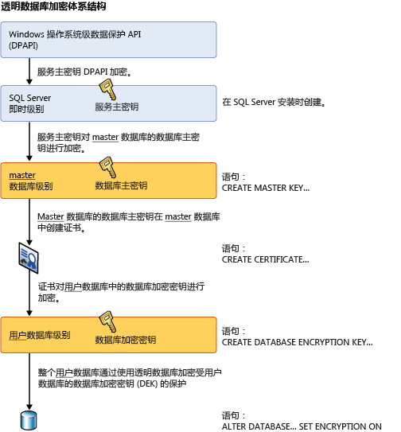

# <a name="transparent-data-encryption-tde"></a>透明数据加密 (TDE)
[!INCLUDE[tsql-appliesto-ss2008-all_md](../../../includes/tsql-appliesto-ss2008-all-md.md)]

 > 有关与以前版本的 SQL Server 相关的内容，请参阅[透明数据加密 (TDE)](https://msdn.microsoft.com/library/bb934049(SQL.120).aspx)。

  透明数据加密 (TDE) 加密 [!INCLUDE[ssNoVersion](../../../includes/ssnoversion-md.md)][!INCLUDE[ssSDSFull](../../../includes/sssdsfull-md.md)] 和 [!INCLUDE[ssSDWfull](../../../includes/sssdwfull-md.md)] 数据文件，称为加密空闲数据。 您可以采取一些预防措施来帮助保护数据库的安全，如设计一个安全系统、加密机密资产以及在数据库服务器的周围构建防火墙。 但是，如果遇到物理介质（如驱动器或备份磁带）被盗的情况，恶意破坏方只需还原或附加数据库即可浏览数据。 一种解决方案是加密数据库中的敏感数据，并通过证书保护用于加密数据的密钥。 这可以防止任何没有密钥的人使用这些数据，但这种保护必须事先计划。  
  
 TDE 可对数据和日志文件执行实时 I/O 加密和解密。 这种加密使用数据库加密密钥 (DEK)，该密钥存储在数据库引导记录中以供恢复时使用。 DEK 是使用存储在服务器的 master 数据库中的证书保护的对称密钥，或者是由 EKM 模块保护的非对称密钥。 TDE 保护“处于休眠状态”的数据，即数据和日志文件。 它提供了遵从许多法律、法规和各个行业建立的准则的能力。 软件开发人员籍此可以使用 AES 和 3DES 加密算法来加密数据，且无需更改现有的应用程序。  
  
> [!IMPORTANT]  
>  TDE 不提供跨通信信道加密。 有关如何跨通信信道加密数据，请参阅[启用数据库引擎的加密连接（SQL Server 配置管理器）](../../../database-engine/configure-windows/enable-encrypted-connections-to-the-database-engine.md)。  
>   
>  **相关主题：**  
>   
>  -   [借助 Azure SQL 数据库实现透明数据加密](../../../relational-databases/security/encryption/transparent-data-encryption-azure-sql.md)  
> -   [开始在 SQL 数据仓库上使用透明数据加密 (TDE)](https://azure.microsoft.com/documentation/articles/sql-data-warehouse-encryption-tde-tsql/)  
> -   [将受 TDE 保护的数据库移到其他 SQL Server](../../../relational-databases/security/encryption/move-a-tde-protected-database-to-another-sql-server.md)  
> -   [使用 EKM 在 SQL Server 上启用 TDE](../../../relational-databases/security/encryption/enable-tde-on-sql-server-using-ekm.md)   
> -   [使用具有 SQL 加密功能的 SQL Server 连接器](../../../relational-databases/security/encryption/use-sql-server-connector-with-sql-encryption-features.md)
> - [有关 TDE 的常见问题解答的 SQL Server 安全博客](https://blogs.msdn.microsoft.com/sqlsecurity/2016/10/05/feature-spotlight-transparent-data-encryption-tde/)
 
  
## <a name="about-tde"></a>关于 TDE  
 数据库文件的加密在页级别执行。 已加密数据库中的页在写入磁盘之前会进行加密，在读入内存时会进行解密。 TDE 不会增加已加密数据库的大小。  
  
 **适用于 [!INCLUDE[ssSDS](../../../includes/sssds-md.md)] 的信息**  
  
 当将 TDE 与 [!INCLUDE[sqldbesa](../../../includes/sqldbesa-md.md)] V12 一起使用时，[!INCLUDE[ssSDS](../../../includes/sssds-md.md)] 将为你自动创建存储在 master 数据库中的服务器级别的证书。 若要移动 [!INCLUDE[ssSDS](../../../includes/sssds-md.md)] 上的 TDE 数据库，必须解密该数据库、移动该数据库，然后在目标 [!INCLUDE[ssSDS](../../../includes/sssds-md.md)]上重新启用 TDE。 有关 [!INCLUDE[ssSDS](../../../includes/sssds-md.md)]上 TDE 的分步说明，请参阅 [Transparent Data Encryption with Azure SQL Database](../../../relational-databases/security/encryption/transparent-data-encryption-azure-sql.md)。  
  
 **适用于 [!INCLUDE[ssNoVersion](../../../includes/ssnoversion-md.md)] 的信息**  
  
 对数据库实施保护措施后，可以通过使用正确的证书还原此数据库。 有关证书的详细信息，请参阅 [SQL Server Certificates and Asymmetric Keys](../../../relational-databases/security/sql-server-certificates-and-asymmetric-keys.md)。  
  
 启用 TDE 时，应该立即备份证书和与证书相关联的私钥。 如果证书变为不可用，或者如果必须在另一台服务器上还原或附加数据库，则必须同时具有证书和私钥的备份，否则将无法打开该数据库。 即使不再对数据库启用 TDE，也应该保留加密证书。 即使数据库未加密，事务日志的某些部分仍可能保持受到保护，但在执行数据库的完整备份前，对于某些操作可能需要证书。 超过过期日期的证书仍可以用于通过 TDE 加密和解密数据。  
  
 **加密层次结构**  
  
 下图显示了 TDE 加密体系结构。 仅数据库级项目（在 [!INCLUDE[ssSDS](../../../includes/sssds-md.md)]上使用 TDE 时，用户可配置数据库加密密钥和 ALTER DATABASE 部分。  
  
   
  
## <a name="using-transparent-data-encryption"></a>使用透明数据加密  
 若要使用 TDE，请按以下步骤操作。  
  
**适用于**： [!INCLUDE[ssNoVersion](../../../includes/ssnoversion-md.md)]。  
  
-   创建主密钥  
  
-   创建或获取由主密钥保护的证书  
  
-   创建数据库加密密钥并通过此证书保护该密钥  
  
-   将数据库设置为使用加密  
  
 下面的示例演示如何使用安装在名为 `AdventureWorks2012` 的服务器上的证书加密和解密 `MyServerCert`数据库。  
  
```sql  
USE master;  
GO  
CREATE MASTER KEY ENCRYPTION BY PASSWORD = '<UseStrongPasswordHere>';  
go  
CREATE CERTIFICATE MyServerCert WITH SUBJECT = 'My DEK Certificate';  
go  
USE AdventureWorks2012;  
GO  
CREATE DATABASE ENCRYPTION KEY  
WITH ALGORITHM = AES_128  
ENCRYPTION BY SERVER CERTIFICATE MyServerCert;  
GO  
ALTER DATABASE AdventureWorks2012  
SET ENCRYPTION ON;  
GO  
```  
  
 加密和解密操作由 [!INCLUDE[ssNoVersion](../../../includes/ssnoversion-md.md)]安排在后台线程中执行。 您可以使用本主题后面部分显示的列表中的目录视图和动态管理视图查看这些操作的状态。  
  
> [!CAUTION]  
>  启用了 TDE 的数据库的备份文件也使用数据库加密密钥进行加密。 因此，当您还原这些备份时，用于保护数据库加密密钥的证书必须可用。 也就是说，除了备份数据库之外，您还要确保自己保留了服务器证书的备份以防数据丢失。 如果证书不再可用，将会导致数据丢失。 有关详细信息，请参阅 [SQL Server Certificates and Asymmetric Keys](../../../relational-databases/security/sql-server-certificates-and-asymmetric-keys.md)。  
  
## <a name="commands-and-functions"></a>命令和函数  
 TDE 证书必须使用数据库主密钥加密才能被下列语句接受。 如果它们仅用密码加密，这些语句将拒绝将它们视为加密程序。  
  
> [!IMPORTANT]  
>  在 TDE 使用证书之后将证书改为用密码保护将会导致数据库在重新启动后无法访问。  
  
 下表提供了 TDE 命令和函数的链接和说明。  
  
|命令或函数|用途|  
|-------------------------|-------------|  
|[CREATE DATABASE ENCRYPTION KEY (Transact-SQL)](../../../t-sql/statements/create-database-encryption-key-transact-sql.md)|创建一个用于加密数据库的密钥。|  
|[ALTER DATABASE ENCRYPTION KEY (Transact-SQL)](../../../t-sql/statements/alter-database-encryption-key-transact-sql.md)|更改用于加密数据库的密钥。|  
|[DROP DATABASE ENCRYPTION KEY (Transact-SQL)](../../../t-sql/statements/drop-database-encryption-key-transact-sql.md)|删除用于加密数据库的密钥。|  
|[ALTER DATABASE SET 选项 (Transact-SQL)](../../../t-sql/statements/alter-database-transact-sql-set-options.md)|介绍用来启用 TDE 的 **ALTER DATABASE** 选项。|  
  
## <a name="catalog-views-and-dynamic-management-views"></a>目录视图和动态管理视图  
 下表显示了 TDE 目录视图和动态管理视图。  
  
|目录视图或动态管理视图|用途|  
|---------------------------------------------|-------------|  
|[sys.databases (Transact-SQL)](../../../relational-databases/system-catalog-views/sys-databases-transact-sql.md)|显示数据库信息的目录视图。|  
|[sys.certificates (Transact-SQL)](../../../relational-databases/system-catalog-views/sys-certificates-transact-sql.md)|显示数据库中的证书的目录视图。|  
|[sys.dm_database_encryption_keys (Transact-SQL)](../../../relational-databases/system-dynamic-management-views/sys-dm-database-encryption-keys-transact-sql.md)|提供有关数据库中使用的加密密钥的信息以及数据库加密状态的动态管理视图。|  
  
## <a name="permissions"></a>权限  
 如上表中所述，TDE 的每项功能和每个命令都有各自的权限要求。  
  
 查看 TDE 所涉及的元数据要求拥有对证书的 VIEW DEFINITION 权限。  
  
## <a name="considerations"></a>注意事项  
 当进行数据库加密操作的重新加密扫描时，将禁用对数据库的维护操作。 您可以使用数据库的单用户模式设置来执行维护操作。 有关详细信息，请参阅 [将数据库设置为单用户模式](../../../relational-databases/databases/set-a-database-to-single-user-mode.md)。  
  
 可以使用 sys.dm_database_encryption_keys 动态管理视图来确定数据库加密状态。 有关详细信息，请参阅本主题前面的“目录视图和动态管理视图”部分。  
  
 在 TDE 过程中，数据库中的所有文件和文件组都进行加密。 如果将数据库中的任何文件组标记为 READ ONLY，数据库加密操作将会失败。  
  
 如果某个数据库正在用于数据库镜像或日志传送，则两个数据库都将进行加密。 日志事务将以加密形式在它们之间发送。  
  
> [!IMPORTANT]  
>  当数据库设置为加密时，将加密全文索引。 使用 SQL Server 2008 之前版本创建的全文索引将会在升级到 SQL Server 2008 或更高版本时导入数据库，并通过 TDE 进行加密。  

> [!TIP]  
> 若要监视数据库的 TDE 状态更改，请使用 SQL Server Audit 或 SQL 数据库审核。 就 SQL Server 而言，在审核操作组 DATABASE_CHANGE_GROUP 下跟踪 TDE，可在 [SQL Server 审核操作组和操作](../../../relational-databases/security/auditing/sql-server-audit-action-groups-and-actions.md)中找到该组。
  
### <a name="restrictions"></a>限制  
 在初始数据库加密、密钥更改或数据库解密期间，不允许执行下列操作：  
  
-   从数据库中的文件组中删除文件  
  
-   删除数据库  
  
-   使数据库脱机  
  
-   分离数据库  
  
-   将数据库或文件组转换为 READ ONLY 状态  
  
 在执行 CREATE DATABASE ENCRYPTION KEY、ALTER DATABASE ENCRYPTION KEY、DROP DATABASE ENCRYPTION KEY 或 ALTER DATABASE...SET ENCRYPTION 语句期间，不允许执行下列操作。  
  
-   从数据库中的文件组中删除文件。  
  
-   删除数据库。  
  
-   使数据库脱机。  
  
-   分离数据库。  
  
-   将数据库或文件组转换为 READ ONLY 状态。  
  
-   使用 ALTER DATABASE 命令。  
  
-   启动数据库或数据库文件备份。  
  
-   启动数据库或数据库文件还原。  
  
-   创建快照。  
  
 下列操作或条件将阻止执行 CREATE DATABASE ENCRYPTION KEY、ALTER DATABASE ENCRYPTION KEY、DROP DATABASE ENCRYPTION KEY 或 ALTER DATABASE...SET ENCRYPTION 语句。  
  
-   数据库为只读或包含任何只读文件组。  
  
-   正在执行 ALTER DATABASE 命令。  
  
-   正在进行任何数据备份。  
  
-   数据处于脱机或还原状态。  
  
-   正在创建快照。  
  
-   数据库维护任务。  
  
 当创建数据库文件时，如果启用了 TDE，则即时文件初始化功能不可用。  
  
 要使用非对称密钥对数据库加密密钥进行加密，非对称密钥必须驻留在可扩展密钥管理提供程序上。  
  
### <a name="transparent-data-encryption-and-transaction-logs"></a>透明数据加密与事务日志  
 允许数据库使用 TDE 具有将虚拟事务日志的剩余部分“清零”以强制加密下一个虚拟事务日志的效果。 这可以保证在数据库设置为加密后事务日志中不会留有明文。 可通过查看 `encryption_state` 视图中的 `sys.dm_database_encryption_keys` 列来确定日志文件加密状态，如以下示例所示：  
  
```  
USE AdventureWorks2012;  
GO  
/* The value 3 represents an encrypted state   
   on the database and transaction logs. */  
SELECT *  
FROM sys.dm_database_encryption_keys  
WHERE encryption_state = 3;  
GO  
```  
  
 有关 [!INCLUDE[ssNoVersion](../../../includes/ssnoversion-md.md)] 日志文件体系结构的详细信息，请参阅[事务日志 (SQL Server)](../../../relational-databases/logs/the-transaction-log-sql-server.md)。  
  
 所有在数据库加密密钥更改前写入事务日志的数据都将使用之前的数据库加密密钥加密。  
  
 在数据库加密密钥修改过两次后，必须执行日志备份才能再次对数据库加密密钥进行修改。  
  
### <a name="transparent-data-encryption-and-the-tempdb-system-database"></a>透明数据加密与 tempdb 系统数据库  
 如果 [!INCLUDE[ssNoVersion](../../../includes/ssnoversion-md.md)] 实例中的任何其他数据库是使用 TDE 加密的，则会加密 tempdb 系统数据库。 这可能会对同一个 [!INCLUDE[ssNoVersion](../../../includes/ssnoversion-md.md)]实例上的未加密数据库产生性能影响。 有关 tempdb 系统数据库的详细信息，请参阅 [tempdb 数据库](../../../relational-databases/databases/tempdb-database.md)。  
  
### <a name="transparent-data-encryption-and-replication"></a>透明数据加密和复制  
 复制不会以加密形式从启用了 TDE 的数据库中自动复制数据。 如果您想保护分发和订阅服务器数据库，则必须单独启用 TDE。 快照复制以及用于事务和合并复制的初始数据分发，都能够在未加密的中间文件（例如 bcp 文件）中存储数据。  在事务或合并复制期间，可以启用加密来保护通信信道。 有关详细信息，请参阅[启用数据库引擎的加密连接（SQL Server 配置管理器）](../../../database-engine/configure-windows/enable-encrypted-connections-to-the-database-engine.md)。  
  
### <a name="transparent-data-encryption-and-filestream-data"></a>透明数据加密和 FILESTREAM 数据  
 即使启用了 TDE，也不会加密 FILESTREAM 数据。  
  
## <a name="transparent-data-encryption-and-buffer-pool-extension"></a>透明数据加密和缓冲池扩展  
 在使用 TDE 加密数据库时不对与缓冲池扩展 (BPE) 相关的文件进行加密。 必须对与 BPE 相关的文件使用文件系统级别的加密工具，如 Bitlocker 或 EFS。  
  
## <a name="transparent-data-encryption-and-in-memory-oltp"></a>透明数据加密和内存中 OLTP  
 可在拥有内存中 OLTP 对象的数据库上启用 TDE。 在 [!INCLUDE[ssSQL15](../../../includes/sssql15-md.md)] 和 [!INCLUDE[ssSDSfull](../../../includes/sssdsfull-md.md)] 中，如果启用 TDE，将对内存中 OLTP 日志记录和数据加密。 在 [!INCLUDE[ssSQL14](../../../includes/sssql14-md.md)] 中，如果启用 TDE，将对内存中 OLTP 日志记录加密，但不对 MEMORY_OPTIMIZED_DATA 文件组中的文件加密。  
  
## <a name="related-tasks"></a>相关任务  
 [将受 TDE 保护的数据库移到其他 SQL Server](../../../relational-databases/security/encryption/move-a-tde-protected-database-to-another-sql-server.md)  
 [使用 EKM 在 SQL Server 上启用 TDE](../../../relational-databases/security/encryption/enable-tde-on-sql-server-using-ekm.md)  
 [使用 Azure 密钥保管库的可扩展密钥管理 (SQL Server)](../../../relational-databases/security/encryption/extensible-key-management-using-azure-key-vault-sql-server.md)  
  
## <a name="related-content"></a>相关内容  
 [借助 Azure SQL 数据库实现透明数据加密](../../../relational-databases/security/encryption/transparent-data-encryption-azure-sql.md)  
 [开始在 SQL 数据仓库上使用透明数据加密 (TDE)](https://azure.microsoft.com/documentation/articles/sql-data-warehouse-encryption-tde-tsql/)  
 [SQL Server 加密](../../../relational-databases/security/encryption/sql-server-encryption.md)  
 [SQL Server 和数据库加密密钥（数据库引擎）](../../../relational-databases/security/encryption/sql-server-and-database-encryption-keys-database-engine.md)  
   
## <a name="see-also"></a>另请参阅  
 [SQL Server 数据库引擎和 Azure SQL 数据库的安全中心](../../../relational-databases/security/security-center-for-sql-server-database-engine-and-azure-sql-database.md)   
 [FILESTREAM (SQL Server)](../../../relational-databases/blob/filestream-sql-server.md)  
  
  
