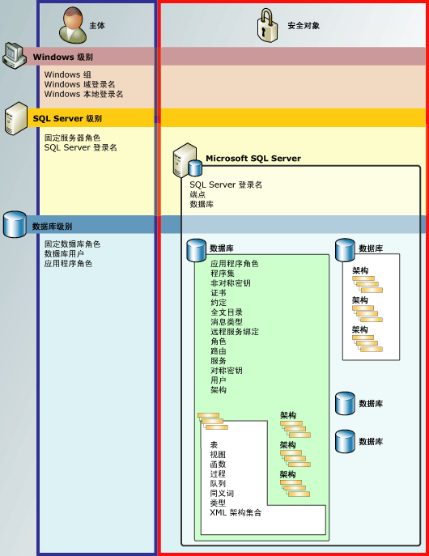

# 权限层次结构（数据库引擎）
[!INCLUDE[appliesto-ss-asdb-asdw-pdw-md](../../includes/appliesto-ss-asdb-asdw-pdw-md.md)]

  [!INCLUDE[ssDE](../../includes/ssde-md.md)] 管理着可以通过权限进行保护的实体的分层集合。 这些实体称为“安全对象” 。 最主要的安全对象是服务器和数据库，但可以在更细化的级别设置各种权限。 [!INCLUDE[ssNoVersion](../../includes/ssnoversion-md.md)] 通过验证主体是否已被授予适当权限来控制主体对安全对象的操作。  
  
 下图显示了 [!INCLUDE[ssDE](../../includes/ssde-md.md)] 权限层次结构之间的关系。  
  
 权限系统在所有的 [!INCLUDE[ssNoVersion](../../includes/ssnoversion-md.md)]、 [!INCLUDE[ssSDS](../../includes/sssds-md.md)]、 [!INCLUDE[ssDW](../../includes/ssdw-md.md)]、 [!INCLUDE[ssAPS](../../includes/ssaps-md.md)]版本中的工作方式相同，但是有些功能并不是在所有版本中都可用。 例如，不能在 Azure 产品中配置服务器级权限。  
  
   
  
## SQL Server 权限图表  
 若要获取 pdf 格式的所有 [!INCLUDE[ssDE](../../includes/ssde-md.md)] 权限的海报大小的图表，请参阅 [https://aka.ms/sql-permissions-poster](https://aka.ms/sql-permissions-poster)。  
  
## 使用权限  
 可以使用常见的 [!INCLUDE[tsql](../../includes/tsql-md.md)] 查询 GRANT、DENY 和 REVOKE 来操作权限。 有关权限的信息，可以在 [sys.server_permissions](../../relational-databases/system-catalog-views/sys-server-permissions-transact-sql.md) 和 [sys.database_permissions](../../relational-databases/system-catalog-views/sys-database-permissions-transact-sql.md) 目录视图中看到。 也可以使用内置函数来查询权限信息。  
  
 有关设计权限系统的信息，请参阅 [Getting Started with Database Engine Permissions](../../relational-databases/security/authentication-access/getting-started-with-database-engine-permissions.md)。  
  
## 另请参阅  
 [保护 SQL Server](../../relational-databases/security/securing-sql-server.md)   
 [权限（数据库引擎）](../../relational-databases/security/permissions-database-engine.md)   
 [安全对象](../../relational-databases/security/securables.md)   
 [主体（数据库引擎）](../../relational-databases/security/authentication-access/principals-database-engine.md)   
 [GRANT (Transact-SQL)](../../t-sql/statements/grant-transact-sql.md)   
 [REVOKE (Transact-SQL)](../../t-sql/statements/revoke-transact-sql.md)   
 [DENY (Transact-SQL)](../../t-sql/statements/deny-transact-sql.md)   
 [HAS_PERMS_BY_NAME (Transact-SQL)](../../t-sql/functions/has-perms-by-name-transact-sql.md)   
 [sys.fn_builtin_permissions (Transact-SQL)](../../relational-databases/system-functions/sys-fn-builtin-permissions-transact-sql.md)   
 [sys.server_permissions (Transact-SQL)](../../relational-databases/system-catalog-views/sys-server-permissions-transact-sql.md)   
 [sys.database_permissions (Transact-SQL)](../../relational-databases/system-catalog-views/sys-database-permissions-transact-sql.md)  
  
  
