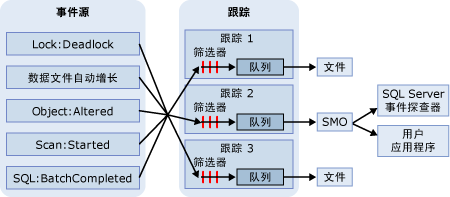

# SQL 跟踪
 [!INCLUDE [SQL Server](../../includes/applies-to-version/sqlserver.md)]
在 SQL 跟踪中，如果事件是在跟踪定义中列出的事件类的实例，则收集这些事件。 可以将这些事件从跟踪中筛选出来或为其目标进行排队。 目标可以是文件或 [!INCLUDE[ssNoVersion](../../includes/ssnoversion-md.md)] 管理对象 (SMO)，它可以使用管理 [!INCLUDE[ssNoVersion](../../includes/ssnoversion-md.md)]的应用程序中的跟踪信息。  
  
> [!IMPORTANT]
> 已弃用 SQL 跟踪和 [!INCLUDE[ssSqlProfiler](../../includes/sssqlprofiler-md.md)]。 包含 Microsoft SQL Server 跟踪和重播对象的“Microsoft.SqlServer.Management.Trace”命名空间也已遭弃用。 
> [!INCLUDE[ssNoteDepFutureAvoid](../../includes/ssnotedepfutureavoid-md.md)] 
> 请改用扩展事件。 有关[扩展事件](../../relational-databases/extended-events/extended-events.md)的详细信息，请参阅[快速入门：SQL Server 中的扩展事件](../../relational-databases/extended-events/quick-start-extended-events-in-sql-server.md)和 [SSMS XEvent 探查器](../../relational-databases/extended-events/use-the-ssms-xe-profiler.md)。

## SQL 跟踪的优点  
Microsoft [!INCLUDE[ssNoVersion](../../includes/ssnoversion-md.md)] 提供 [!INCLUDE[tsql](../../includes/tsql-md.md)] 系统存储过程来创建对 [!INCLUDE[ssDEnoversion](../../includes/ssdenoversion-md.md)]实例的跟踪。 可以不使用 [!INCLUDE[ssSqlProfiler](../../includes/sssqlprofiler-md.md)]，而使用这些系统存储过程从您自己的应用程序中手动创建跟踪。 这样，您就可以针对企业的特定需求编写自定义应用程序。  
  
## SQL 跟踪结构  
事件源可以是生成跟踪事件（例如 [!INCLUDE[tsql](../../includes/tsql-md.md)] 批处理）或 [!INCLUDE[ssNoVersion](../../includes/ssnoversion-md.md)] 事件（例如死锁）的任何源。 有关事件的详细信息，请参阅 [SQL Server Event Class Reference](../../relational-databases/event-classes/sql-server-event-class-reference.md)。 事件发生后，如果该事件类已经包含在跟踪定义中，则跟踪将收集该事件信息。 如果已经在跟踪定义中为该事件类定义筛选器，则将应用这些筛选器并将跟踪事件信息传递到队列。 从队列中，跟踪信息或者被写入文件，或者由应用程序（例如 [!INCLUDE[ssSqlProfiler](../../includes/sssqlprofiler-md.md)]）中的 SMO 使用。 以下关系图显示了在跟踪期间 SQL 跟踪如何收集事件。  
  
  
  
## SQL 跟踪的术语  
下列词汇介绍了 SQL 跟踪的重要概念。  
  
 **事件**  
 [!INCLUDE[msCoName](../../includes/msconame-md.md)] [!INCLUDE[ssDEnoversion](../../includes/ssdenoversion-md.md)] 实例内发生的操作。  
  
 **数据列**  
 事件的属性。  
  
 **事件类**  
 可以被跟踪的事件类型。 该事件类包含可以由事件报告的所有数据列。  
  
 **事件类别**  
 一组相关的事件类。  
  
 **跟踪** （名词）  
 [!INCLUDE[ssDE](../../includes/ssde-md.md)]返回的事件和数据的集合。  
  
 **跟踪** （动词）  
 收集并监视 [!INCLUDE[ssNoVersion](../../includes/ssnoversion-md.md)]实例中的事件。  
  
 **跟踪定义**  
 事件类、数据列和筛选器的集合，用于标识跟踪过程中收集的事件的类型。  
  
 **筛选器**  
 限制跟踪中收集的事件的条件。  
  
 **跟踪文件**  
 保存跟踪时创建的文件。  
  
 **模板**  
 在 [!INCLUDE[ssSqlProfiler](../../includes/sssqlprofiler-md.md)]中，用来定义要在跟踪中收集的事件类和数据列的文件。  
  
 **跟踪表**  
 在 [!INCLUDE[ssSqlProfiler](../../includes/sssqlprofiler-md.md)]中，将跟踪保存到表时创建的表。  
  
## 使用数据列描述返回的事件  
跟踪运行时，SQL 跟踪使用跟踪输出中的数据列来描述返回的事件。 下表说明了 [!INCLUDE[ssSqlProfiler](../../includes/sssqlprofiler-md.md)] 数据列（这些数据列与 SQL 跟踪使用的数据列相同），并指示默认情况下选择的列。  
  
|数据列|列号|说明|  
|-----------------|-------------------|-----------------|  
|ApplicationName|10|客户端应用程序的名称，该客户端应用程序创建了指向 [!INCLUDE[ssNoVersion](../../includes/ssnoversion-md.md)]实例的连接。 此列由该应用程序传递的值填充，而不是由程序名填充的。|  
|**BigintData1**|52|值（**bigint** 数据类型），取决于跟踪中指定的事件类。|  
|**BigintData2**|53|值（**bigint** 数据类型），取决于跟踪中指定的事件类。|  
|**Binary Data**|2|依赖于跟踪中捕获的事件类的二进制值。|  
|**ClientProcessID**|9|由主机分配给正在运行客户端应用程序的进程的 ID。 如果客户端提供了客户端进程 ID，则填充此数据列。|  
|**ColumnPermissions**|44|表示是否已设置了列权限。 可以分析语句文本来确定各列所应用权限的情况。|  
|**CPU**|18|事件使用的 CPU 时间（毫秒）。|  
|**数据库 ID**|3|由 USE *database_name* 语句指定的数据库的 ID；如果未对给定实例发出 USE *database_name*语句，则为默认数据库的 ID。 [!INCLUDE[ssSqlProfiler](../../includes/sssqlprofiler-md.md)] 数据列而且服务器可用，则 **ServerName** 将显示数据库名。 可使用 DB_ID 函数来确定数据库的值。|  
|**DatabaseName**|35|正在运行用户语句的数据库的名称。|  
|**DBUserName**|40|客户端的 [!INCLUDE[ssNoVersion](../../includes/ssnoversion-md.md)] 用户名。|  
|**Duration**|13|事件的持续时间（微秒）。   服务器以微秒（百万分之一秒或 10-6 秒）为单位报告事件的持续时间，以毫秒（千分之一秒或 10-3 秒）为单位报告事件使用的 CPU 时间。 [!INCLUDE[ssSqlProfiler](../../includes/sssqlprofiler-md.md)] 图形用户界面默认以毫秒为单位显示 **“持续时间”** 列，但是当跟踪保存到文件或数据库表中时，将以微秒为单位写入“持续时间” **** 列值。|  
|**EndTime**|15|事件的结束时间。 对指示事件开始的事件类（例如 **SQL:BatchStarting** 或 **SP:Starting**）将不填充此列。|  
|**错误**|31|给定事件的错误号。 通常是 **sysmessages**中存储的错误号。|  
|**EventClass**|27|捕获的事件类的类型。|  
|**EventSequence**|51|此事件的序列号。|  
|**EventSubClass**|21|事件子类的类型，提供有关每个事件类的详细信息。 例如， **Execution Warning** 事件类的事件子类值代表执行警告的类型：   **1** = 查询等候。 查询执行之前必须等待资源；例如，内存。   **2** = 查询超时。查询等待执行所需资源时超时。 所有事件类都不填充此数据列。|  
|**GUID**|54|依赖于跟踪中指定的事件类的 GUID 值。|  
|**FileName**|36|所修改的文件的逻辑名称。|  
|**Handle**|33|一个整数，ODBC、OLE DB 或 DB-Library 使用它来协调服务器的执行情况。|  
|**HostName**|8|正在运行客户端程序的计算机的名称。 如果客户端提供了主机名，则填充此数据列。 若要确定主机名，请使用 HOST_NAME 函数。|  
|**IndexID**|24|受事件影响的对象的索引 ID。 若要确定对象的索引的 ID，请使用 **sysindexes** 系统表的 **indid** 列。|  
|**IntegerData**|25|跟踪中捕获的与事件类对应的整数值。|  
|**IntegerData2**|55|跟踪中捕获的与事件类对应的整数值。|  
|**IsSystem**|60|指示该事件发生在系统进程还是用户进程上：   **1** = 系统   **0** = 用户|  
|**LineNumber**|5|包含存在错误的行的行号。 对于涉及 [!INCLUDE[tsql](../../includes/tsql-md.md)] 语句的事件（如 **SP:StmtStarting**）， **LineNumber** 包含存储过程或批查询中语句的行号。|  
|**LinkedServerName**|45|链接服务器的名称。|  
|**LoginName**|11|用户的登录名（SQL Server 安全登录名或 Windows 登录凭据，格式为“域/用户名”）。|  
|**LoginSid**|41|已登录的用户的安全标识符 (SID)。 可以在 **master** 数据库的 **sys.server_principals** 视图中找到此信息。 服务器中的每个登录名都具有唯一的 ID。|  
|**MethodName**|47|OLEDB 方法的名称。|  
|**模式**|32|一个整数，各种事件都使用它来描述事件要请求或已接收的状态。|  
|**NestLevel**|29|一个整数，表示 @@NESTLEVEL 返回的数据。|  
|**NTDomainName**|7|用户所属的 Microsoft Windows 域。|  
|**NTUserName**|6|Windows 用户名。|  
|**Exchange Spill**|22|系统分配的对象 ID。|  
|**ObjectID2**|56|相关对象或实体（如果存在）的 ID。|  
|**ObjectName**|34|被引用对象的名称。|  
|**ObjectType**|28|表示事件中涉及的对象类型的值。 该值对应于 **sysobjects** 中的 **type**列。|  
|**Offset**|61|语句在存储过程或批处理中的起始偏移量。|  
|**OwnerID**|58|仅限于锁事件。 拥有锁的对象的类型。|  
|**OwnerName**|37|对象所有者的数据库用户名。|  
|**ParentName**|59|该对象所在的架构的名称。|  
|**权限**|19|表示所检查的权限类型的整型值。 值为：   **1** = SELECT ALL   **2** = UPDATE ALL   **4** = REFERENCES ALL   **8** = INSERT   **16** = DELETE   **32** = EXECUTE （只针对过程）   **4096** = SELECT ANY （至少选择一列）   **8192** = UPDATE ANY   **16384** = REFERENCES ANY|  
|**ProviderName**|46|OLEDB 访问接口的名称。|  
|**Reads**|16|由服务器代表事件读取逻辑磁盘的次数。 这些读取操作数包含在语句执行期间读取表和缓冲区的次数。|  
|**RequestID**|49|包含该语句的请求的 ID。|  
|**RoleName**|38|正在启用的应用程序角色名。|  
|**RowCounts**|48|批处理中的行数。|  
|**ServerName**|26|正在跟踪的 [!INCLUDE[ssNoVersion](../../includes/ssnoversion-md.md)] 实例的名称。|  
|**SessionLoginName**|64|发起会话的用户的登录名。 例如，如果您使用 [!INCLUDE[ssNoVersion](../../includes/ssnoversion-md.md)] Login1 **连接到** 并以 **Login2**身份执行语句，则 **SessionLoginName** 将显示 **Login1**，而 **LoginName** 将显示 **Login2**。 此数据列将同时显示 [!INCLUDE[ssNoVersion](../../includes/ssnoversion-md.md)] 登录名和 Windows 登录名。|  
|**严重性**|20|异常错误事件的严重级别。|  
|**SourceDatabaseID**|62|存在该对象的源的数据库 ID。|  
|**SPID**|12|[!INCLUDE[ssNoVersion](../../includes/ssnoversion-md.md)] 为客户端的相关进程分配的服务器进程 ID (SPID)。|  
|**SqlHandle**|63|基于即席查询文本或 SQL 对象的数据库和对象 ID 的 64 位哈希运算。 可以将该值传递到 **sys.dm_exec_sql_text()** 以检索关联的 SQL 文本。|  
|**StartTime**|14|事件（如果有）的开始时间。|  
|**State**|30|错误状态代码。|  
|**Success**|23|表示事件是否成功。 值包括：   **1** = Success.   **0** = Failure   例如， **1** 表示权限检查成功，而 **0** 表示权限检查失败。|  
|**TargetLoginName**|42|如果是针对登录的操作（例如，添加新的登录），这是所针对登录的名称。|  
|**TargetLoginSid**|43|如果是针对登录的操作（例如，添加新的登录），这是所针对登录的 SID。|  
|**TargetUserName**|39|如果是针对某个数据库用户的操作（例如，授予用户权限），这是该用户的名称。|  
|**TextData**|1|依赖于跟踪中捕获的事件类的文本值。 但是，如果跟踪参数化查询，则不以 **TextData** 列中的数据值显示变量。|  
|**Transaction ID**|4|系统为事务分配的 ID。|  
|**类型**|57|跟踪中捕获的与事件类对应的整数值。|  
|**Writes**|17|由服务器代表事件写入物理磁盘的次数。|  
|**XactSequence**|50|用于说明当前事务的标记。|  
  
 *默认情况下，对于所有事件，均填充这些数据列。  
  
 \*\*有关 **ObjectType** 数据列的详细信息，请参阅 [ObjectType 跟踪事件列](../../relational-databases/event-classes/objecttype-trace-event-column.md)。  
  
## SQL 跟踪任务  
  
|任务说明|主题|  
|----------------------|-----------|  
|介绍如何使用 TRANSACT-SQL 存储过程创建和运行跟踪。|[使用 Transact-SQL 存储过程创建和运行跟踪](../../relational-databases/sql-trace/create-and-run-traces-using-transact-sql-stored-procedures.md)|  
|介绍如何在 [!INCLUDE[ssDEnoversion](../../includes/ssdenoversion-md.md)]实例上使用存储过程创建手动跟踪。|[使用存储过程创建手动跟踪](../../relational-databases/sql-trace/create-manual-traces-using-stored-procedures.md)|  
|介绍如何将跟踪结果保存到跟踪结果所写入的文件。|[将跟踪结果保存到文件](../../relational-databases/sql-trace/save-trace-results-to-a-file.md)|  
|介绍如何使用 **temp** 目录中的空间来提高访问跟踪数据的性能。|[改进对跟踪数据的访问](../../relational-databases/sql-trace/improve-access-to-trace-data.md)|  
|介绍如何使用存储过程创建跟踪。|[创建跟踪 (Transact-SQL)](../../relational-databases/sql-trace/create-a-trace-transact-sql.md)|  
|介绍如何使用存储过程创建只检索有关所需跟踪事件信息的筛选器。|[设置跟踪筛选器 (Transact-SQL)](../../relational-databases/sql-trace/set-a-trace-filter-transact-sql.md)|  
|介绍如何使用存储过程修改现有跟踪。|[修改现有跟踪 (Transact-SQL)](../../relational-databases/sql-trace/modify-an-existing-trace-transact-sql.md)|  
|介绍如何使用内置函数查看保存的跟踪。|[查看保存的跟踪 (Transact-SQL)](../../relational-databases/sql-trace/view-a-saved-trace-transact-sql.md)|  
|介绍如何使用内置函数查看跟踪筛选器信息。|[查看筛选器信息 (Transact-SQL)](../../relational-databases/sql-trace/view-filter-information-transact-sql.md)|  
|介绍如何使用存储过程删除跟踪。|[删除跟踪 (Transact-SQL)](../../relational-databases/sql-trace/delete-a-trace-transact-sql.md)|  
|介绍如何将跟踪引起的性能损失降到最低。|[优化 SQL 跟踪](../../relational-databases/sql-trace/optimize-sql-trace.md)|  
|介绍如何筛选跟踪以将跟踪过程中的开销降到最低。|[筛选跟踪](../../relational-databases/sql-trace/filter-a-trace.md)|  
|介绍如何将跟踪收集的数据量降至最低。|[限制跟踪文件和表的大小](../../relational-databases/sql-trace/limit-trace-file-and-table-sizes.md)|  
|介绍在 Microsoft [!INCLUDE[ssNoVersion](../../includes/ssnoversion-md.md)]中计划跟踪的两种方法。|[安排跟踪](../../relational-databases/sql-trace/schedule-traces.md)|  
  
## 另请参阅  
 [SQL Server Profiler 模板和权限](../../tools/sql-server-profiler/sql-server-profiler-templates-and-permissions.md)   
 [SQL Server 管理对象 (SMO) 编程指南](../../relational-databases/server-management-objects-smo/sql-server-management-objects-smo-programming-guide.md)  
  
  
