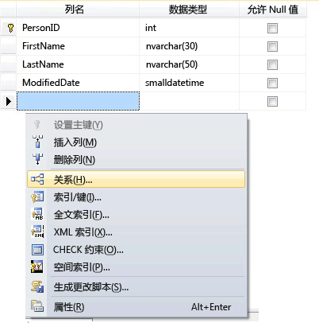
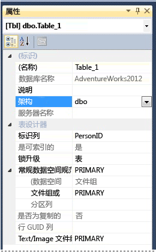

# <a name="create-tables-database-engine"></a>创建表（数据库引擎）
[!INCLUDE [sqlserver2016-asdb-asdbmi-asa-pdw](../../includes/applies-to-version/sqlserver2016-asdb-asdbmi-asa-pdw.md)]

  可通过使用 [!INCLUDE[ssManStudioFull](../../includes/ssmanstudiofull-md.md)] 或 [!INCLUDE[tsql](../../includes/tsql-md.md)] 创建新表，对该表进行命名，然后将其添加到现有数据库中。  
  

  
##  <a name="check-your-permissions-first"></a><a name="Permissions"></a> 首先检查你的权限！  
此任务需要在数据库中具有 CREATE TABLE 权限，对在其中创建表的架构具有 ALTER 权限。  
  
 如果 CREATE TABLE 语句中的任何列被定义为 CLR 用户定义类型，则需要具有对此类型的所有权或 REFERENCES 权限。  
  
 如果 CREATE TABLE 语句中的任何列具有与其关联的 XML 架构集合，则需要具有对 XML 架构集合的所有权或 REFERENCES 权限。  
  
 
## <a name="using-table-designer"></a>使用表设计器  
  
1.  在 SSMS 中的“对象资源管理器”**** 中，连接到包含要修改的数据库的 [!INCLUDE[ssDE](../../includes/ssde-md.md)] 实例。  
  
2.  在 **“对象资源管理器”** 中，展开 **“数据库”** 节点，然后展开将包含新表的数据库。  
  
3.  在对象资源管理器中，右键单击数据库的“表”节点，然后单击“新建表”********。  
  
4.  键入列名，选择数据类型，并选择各列是否允许为空值，如下图所示：  
  
       
  
5.  若要为某个列指定更多属性，例如标识或计算列值，请单击该列，然后在列属性选项卡中，选择适当的属性。 有关列属性的详细信息，请参阅[表列属性 (SQL Server Management Studio)](../../relational-databases/tables/table-column-properties-sql-server-management-studio.md)。  
  
6.  若要将某个列指定为主键，请右键单击该列，然后选择“设置主键”****。 有关详细信息，请参阅 [Create Primary Keys](../../relational-databases/tables/create-primary-keys.md)。  
  
7.  若要创建外键关系、CHECK 约束或索引，请在“表设计器”窗格中单击右键，然后从列表中选择一个对象，如下图所示：  
  
       
  
     有关这些对象的详细信息，请参阅 [Create Foreign Key Relationships](../../relational-databases/tables/create-foreign-key-relationships.md)、 [Create Check Constraints](../../relational-databases/tables/create-check-constraints.md) 和 [Indexes](../../relational-databases/indexes/indexes.md)。  
  
8.  默认情况下，该表包含在 **dbo** 架构中。 若要为该表指定不同架构，请在“表设计器”窗格中右键单击，然后选择“属性”****，如下图中所示。 从“架构”**** 下拉列表中选择适当的架构。  
  
       
  
     有关架构的详细信息，请参阅 [Create a Database Schema](../../relational-databases/security/authentication-access/create-a-database-schema.md)。  
  
9. 从“文件”菜单中，选择“保存”表名称 。  
  
10. 在 **“选择名称”** 对话框中，为该表键入一个名称，再单击 **“确定”**。  
  
11. 若要查看这个新表，请在 **“对象资源管理器”** 中展开 **“表”** 节点，然后按 **F5** 刷新对象列表。 该新表将显示在表列表中。  
  
##  <a name="using-transact-sql"></a><a name="TsqlProcedure"></a> 使用 Transact-SQL  
  
## <a name="using-query-editor"></a>使用查询编辑器  
  
1.  在 **“对象资源管理器”** 中，连接到 [!INCLUDE[ssDE](../../includes/ssde-md.md)]的实例。  
  
2.  在标准菜单栏上，单击 **“新建查询”** 。  
  
3.  将以下示例复制并粘贴到查询窗口中，然后单击“执行” 。  
  
    ```  
    CREATE TABLE dbo.PurchaseOrderDetail  
    (  
        PurchaseOrderID int NOT NULL  
        ,LineNumber smallint NOT NULL  
        ,ProductID int NULL  
        ,UnitPrice money NULL  
        ,OrderQty smallint NULL  
        ,ReceivedQty float NULL  
        ,RejectedQty float NULL  
        ,DueDate datetime NULL  
    );  
    ```  
  
 有关详细信息，请参阅 [CREATE TABLE (Transact-SQL)](../../t-sql/statements/create-table-transact-sql.md)。  
  
  
