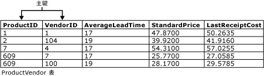

# 主键和外键约束
[!INCLUDE[tsql-appliesto-ss2016-asdb-xxxx-xxx-md](../../includes/tsql-appliesto-ss2016-asdb-xxxx-xxx-md.md)]

  主键和外键是两种类型的约束，可用于强制 [!INCLUDE[ssNoVersion](../../includes/ssnoversion-md.md)] 表中的数据完整性。 这些是重要的数据库对象。  
  
 本主题包含以下各节。  
  
 [主键约束](../../relational-databases/tables/primary-and-foreign-key-constraints.md#PKeys)  
  
 [Foreign Key Constraints](../../relational-databases/tables/primary-and-foreign-key-constraints.md#FKeys)  
  
 [相关任务](../../relational-databases/tables/primary-and-foreign-key-constraints.md#Tasks)  
  
##   主键约束  
 表通常具有包含唯一标识表中每一行的值的一列或一组列。 这样的一列或多列称为表的主键 (PK)，用于强制表的实体完整性。 由于主键约束可保证数据的唯一性，因此经常对标识列定义这种约束。  
  
 如果为表指定了主键约束， [!INCLUDE[ssDE](../../includes/ssde-md.md)] 将通过为主键列自动创建唯一索引来强制数据的唯一性。 当在查询中使用主键时，此索引还允许对数据进行快速访问。 如果对多列定义了主键约束，则一列中的值可能会重复，但来自主键约束定义中所有列的值的任何组合必须唯一。  
  
 如下图所示， **Purchasing.ProductVendor** 表中的 **ProductID** 和 **VendorID** 列构成了针对此表的复合主键约束。 这确保了 ProductVendor 表中的每个行都具有 ProductID 和 VendorID 的一个唯一组合。 这样可以防止插入重复的行。  
  
   
  
-   一个表只能包含一个主键约束。  
  
-   主键不能超过 16 列且总密钥长度不能超过 900 个字节。  
  
-   由主键约束生成的索引不会使表中的索引数超过 999 个非聚集索引和 1 个聚集索引。  
  
-   如果没有为主键约束指定聚集或非聚集索引，并且表中没有聚集索引，则使用聚集索引。  
  
-   在主键约束中定义的所有列都必须定义为不为 Null。 如果没有指定为 Null 性，则参与主键约束的所有列的为 Null 性都将设置为不为 Null。  
  
-   如果在 CLR 用户定义类型的列中定义主键，则该类型的实现必须支持二进制排序。  
  
##   Foreign Key Constraints  
 外键 (FK) 是用于在两个表中的数据之间建立和加强链接的一列或多列的组合，可控制可在外键表中存储的数据。 在外键引用中，当包含一个表的主键值的一个或多个列被另一个表中的一个或多个列引用时，就在这两个表之间创建了链接。 这个列就成为第二个表的外键。  
  
 例如，因为销售订单和销售人员之间存在一种逻辑关系，所以 **Sales.SalesOrderHeader** 表含有一个指向 **Sales.SalesPerson** 表的外键链接。 **SalesOrderHeader** 表中的 **SalesPersonID** 列与 **SalesPerson** 表中的主键列相对应。 **SalesOrderHeader** 表中的 **SalesPersonID** 列是指向 **SalesPerson** 表的外键。 通过创建此外键关系，如果 **SalesPerson** 表的主键中不存在 **SalesPersonID** 的值，则 **SalesPersonID** 的值将无法插入到 **SalesOrderHeader** 表。  
  
 表最多可以将 253 个其他表和列作为外键引用（传出引用）。 [!INCLUDE[ssSQL15](../../includes/sssql15-md.md)] 将可在单独的表中引用的其他表和列（传入引用）的数量限制从 253 提高至 10,000。 （兼容性级别至少必须为 130。）数量限制的提高带来了下列约束：  
  
-   只有 DELETE DML 操作才支持超过 253 个外键引用。 不支持 UPDATE 和 MERGE 操作。  
  
-   对自身进行外键引用的表仍只能进行 253 个外键引用。  
  
-   列存储索引、内存优化表、Stretch Database 或已分区外键表暂不支持进行超过 253 个外键引用。  
  
### 外键约束的索引  
 与主键约束不同，创建外键约束不会自动创建对应的索引。 但是由于以下原因，对外键手动创建索引通常是有用的：  
  
-   当在查询中组合相关表中的数据时，经常在联接条件中使用外键列，方法是将一个表的外键约束中的一列或多列与另一个表中的主键列或唯一键列匹配。 索引使 [!INCLUDE[ssDE](../../includes/ssde-md.md)] 可以在外键表中快速查找相关数据。 但是，创建此索引并不是必需的。 即使没有对两个相关表定义主键或外键约束，也可以对来自这两个表中的数据进行组合，但两个表间的外键关系说明已用其键作为条件对其进行了优化，以便组合到查询中。  
  
-   对主键约束的更改可由相关表中的外键约束检查。  
  
### 引用完整性  
 尽管外键约束的主要目的是控制可以存储在外键表中的数据，但它还可以控制对主键表中数据的更改。 例如，如果在 **Sales.SalesPerson** 表中删除一个销售人员行，而这个销售人员的 ID 由 **Sales.SalesOrderHeader** 表中的销售订单使用，则这两个表之间关联的完整性将被破坏； **SalesOrderHeader** 表中删除的销售人员的销售订单因为与 **SalesPerson** 表中的数据没有链接而变得孤立了。  
  
 外键约束防止这种情况发生。 如果主键表中数据的更改使之与外键表中数据的链接失效，则这种更改将无法实现，从而确保了引用完整性。 如果试图删除主键表中的行或更改主键值，而该主键值与另一个表的外键约束中的值相对应，则该操作将失败。 若要成功更改或删除外键约束中的行，必须先在外键表中删除或更改外键数据，这会将外键链接到不同的主键数据。  
  
#### 级联引用完整性  
 通过使用级联引用完整性约束，您可以定义当用户试图删除或更新现有外键指向的键时， [!INCLUDE[ssDE](../../includes/ssde-md.md)] 执行的操作。 可以定义以下级联操作。  
  
 NO ACTION  
 [!INCLUDE[ssDE](../../includes/ssde-md.md)] 将引发错误，此时将回滚对父表中行的删除或更新操作。  
  
 CASCADE  
 如果在父表中更新或删除了一行，则将在引用表中更新或删除相应的行。 如果 **timestamp** 列是外键或被引用键的一部分，则不能指定 CASCADE。 不能为带有 INSTEAD OF DELETE 触发器的表指定 ON DELETE CASCADE。 对于带有 INSTEAD OF UPDATE 触发器的表，不能指定 ON UPDATE CASCADE。  
  
 SET NULL  
 如果更新或删除了父表中的相应行，则会将构成外键的所有值设置为 NULL。 若要执行此约束，外键列必须可为空值。 无法为带有 INSTEAD OF UPDATE 触发器的表指定。  
  
 SET DEFAULT  
 如果更新或删除了父表中对应的行，则组成外键的所有值都将设置为默认值。 若要执行此约束，所有外键列都必须有默认定义。 如果某个列可为空值，并且未设置显式的默认值，则将使用 NULL 作为该列的隐式默认值。 无法为带有 INSTEAD OF UPDATE 触发器的表指定。  
  
 可将 CASCADE、SET NULL、SET DEFAULT 和 NO ACTION 在相互存在引用关系的表上进行组合。 如果 [!INCLUDE[ssDE](../../includes/ssde-md.md)] 遇到 NO ACTION，它将停止并回滚相关的 CASCADE、SET NULL 和 SET DEFAULT 操作。 如果 DELETE 语句导致 CASCADE、SET NULL、SET DEFAULT 和 NO ACTION 操作的组合，则在 [!INCLUDE[ssDE](../../includes/ssde-md.md)] 检查所有 NO ACTION 前，将应用所有 CASCADE、SET NULL 和 SET DEFAULT 操作。  
  
### 触发器和级联引用操作  
 级联引用操作按下列方式激发 AFTER UPDATE 或 AFTER DELETE 触发器：  
  
-   首先执行由原始 DELETE 或 UPDATE 直接导致的所有级联引用操作。  
  
-   如果为受影响的表定义了任何 AFTER 触发器，则在执行完所有级联操作后激发这些触发器。 这些触发器将按与级联操作相反的顺序激发。 如果单个表中存在多个触发器，它们将按随机顺序激发，除非专门为表指定了第一个或最后一个触发器。 此顺序是使用 [sp_settriggerorder](../../relational-databases/system-stored-procedures/sp-settriggerorder-transact-sql.md)指定的。  
  
-   如果多个级联链源自作为 UPDATE 或 DELETE 操作的直接目标的表，则这些链激发各自的触发器的顺序是不定的。 但是，只有当一条链激发其所有的触发器之后，另一条链才开始激发。  
  
-   不管是否影响任何行，作为 UPDATE 或 DELETE 操作的直接目标的表上的 AFTER 触发器都会激发。 在这种情况下，级联操作不会影响其他表。  
  
-   如果上面的任一触发器对其他表执行 UPDATE 或 DELETE 操作，这些操作将启动辅助级联链。 在激发所有主链上的所有触发器后，会分别为每个 UPDATE 或 DELETE 操作处理这些辅助链。 可能会为后续的 UPDATE 或 DELETE 操作递归重复此过程。  
  
-   在触发器内执行 CREATE、ALTER、DELETE 或其他数据定义语言 (DDL) 操作可能会导致 DDL 触发器激发。 之后，就可能会执行启动其他级联链和触发器的 DELETE 或 UPDATE 操作。  
  
-   如果任何特定的级联引用操作链中产生错误，都将引发错误并且不会在该链中激发任何 AFTER 触发器，而创建该链的 DELETE 或 UPDATE 操作将回滚。  
  
-   具有 INSTEAD OF 触发器的表不能同时具有指定级联操作的 REFERENCES 子句。 但是，级联操作目标表的 AFTER 触发器可对另一个表或视图执行 INSERT、UPDATE 或 DELETE 语句，这将激发为该对象定义的 INSTEAD OF 触发器。  
  
##   相关任务  
 下表列出了与主键和外键约束关联的常见任务。  
  
|任务|主题|  
|----------|-----------|  
|说明如何创建主键。|[创建主键](../../relational-databases/tables/create-primary-keys.md)|  
|说明如何删除主键。|[删除主键](../../relational-databases/tables/delete-primary-keys.md)|  
|说明如何修改主键。|[修改主键](../../relational-databases/tables/modify-primary-keys.md)|  
|说明如何创建外键关系|[创建外键关系](../../relational-databases/tables/create-foreign-key-relationships.md)|  
|说明如何修改外键关系。|[修改外键关系](../../relational-databases/tables/modify-foreign-key-relationships.md)|  
|说明如何删除外键关系。|[删除外键关系](../../relational-databases/tables/delete-foreign-key-relationships.md)|  
|说明如何查看外键属性。|[查看外键属性](../../relational-databases/tables/view-foreign-key-properties.md)|  
|说明如何禁止将外键约束用于复制。|[对复制禁用外键约束](../../relational-databases/tables/disable-foreign-key-constraints-for-replication.md)|  
|说明如何在 INSERT 或 UPDATE 语句执行过程中禁用外键约束。|[使用 INSERT 和 UPDATE 语句禁用外键约束](../../relational-databases/tables/disable-foreign-key-constraints-with-insert-and-update-statements.md)|  
  
  
