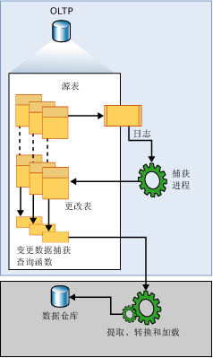

# <a name="about-change-data-capture-sql-server"></a>关于变更数据捕获 (SQL Server)
[!INCLUDE[tsql-appliesto-ss2008-xxxx-xxxx-xxx-md](../../includes/tsql-appliesto-ss2008-xxxx-xxxx-xxx-md.md)]
  变更数据捕获可记录应用于 [!INCLUDE[ssNoVersion](../../includes/ssnoversion-md.md)] 表的插入、更新和删除活动。 这样，就可以按易于使用的关系格式提供这些更改的详细信息。 将为修改的行捕获列信息以及将更改应用于目标环境所需的元数据，并将其存储在镜像所跟踪源表的列结构的更改表中。 系统提供了一些表值函数，以便使用者可以系统地访问更改数据。  
  
 此技术针对的数据使用者的一个典型示例是提取、转换和加载 (ETL) 应用程序。 ETL 应用程序以增量方式将 [!INCLUDE[ssNoVersion](../../includes/ssnoversion-md.md)] 源表中的更改数据加载到数据仓库或数据市场。 虽然数据仓库中的源表的表示形式必须反映源表中的更改，但刷新源副本的端到端技术并不适用。 相反，您需要一种具有特定结构的可靠更改数据流，以便使用者可以将其应用于不同的目标数据表示形式。 [!INCLUDE[ssNoVersion](../../includes/ssnoversion-md.md)] 变更数据捕获就提供了这一技术。  
  
## <a name="change-data-capture-data-flow"></a>变更数据捕获数据流  
 下图说明了变更数据捕获的主体数据流。  
  
   
  
 变更数据捕获的更改数据源为 [!INCLUDE[ssNoVersion](../../includes/ssnoversion-md.md)] 事务日志。 在将插入、更新和删除应用于跟踪的源表时，将会在日志中添加说明这些更改的项。 日志用作捕获进程的输入来源。 它会读取日志，并在跟踪的表的关联更改表中添加有关更改的信息。 系统将提供一些函数，以枚举在更改表中指定范围内发生的更改，并以筛选的结果集的形式返回该值。 通常，应用程序进程使用筛选的结果集在某种外部环境中更新源表示形式。  
  
## <a name="understanding-change-data-capture-and-the-capture-instance"></a>了解变更数据捕获和捕获实例  
 在跟踪对数据库中任何单个表进行的更改之前，必须为数据库显式启用变更数据捕获。 这是使用 [sys.sp_cdc_enable_db](../../relational-databases/system-stored-procedures/sys-sp-cdc-enable-db-transact-sql.md)存储过程完成的。 为数据库启用变更数据捕获后，可以使用 [sys.sp_cdc_enable_table](../../relational-databases/system-stored-procedures/sys-sp-cdc-enable-table-transact-sql.md)存储过程将源表标识为跟踪的表。 为表启用变更数据捕获后，将创建一个关联的捕获实例以支持传播源表中的更改数据。 捕获实例由一个更改表和最多两个查询函数组成。 说明捕获实例配置详细信息的元数据保留在变更数据捕获元数据表 **cdc.change_tables**、 **cdc.index_columns**和 **cdc.captured_columns**中。 可以使用 [sys.sp_cdc_help_change_data_capture](../../relational-databases/system-stored-procedures/sys-sp-cdc-help-change-data-capture-transact-sql.md)存储过程来检索此信息。  
  
 与捕获实例关联的所有对象都是在启用变更数据捕获的数据库的变更数据捕获架构中创建的。 捕获实例名称的要求是：必须是有效的对象名，并且在数据库捕获实例中是唯一的。 默认情况下，该名称是源表的 \<*架构名称*_*表名*>。 它的关联更改表的命名方式为：在捕获实例名称后面追加 **_CT** 。 用于查询所有更改的函数的命名方式为：在捕获实例名称后面追加 **fn_cdc_get_all_changes_**。 如果将捕获实例配置为支持 **net changes**，则还会创建 **net_changes** 查询函数，并通过在捕获实例名称后面追加 **fn_cdc_get_net_changes\_** 来进行命名。  
  
## <a name="change-table"></a>更改表  
 变更数据捕获更改表的前五列是元数据列。 这些列提供与记录的更改有关的附加信息。 其余列镜像源表中按名称标识的捕获列（通常还会按类型进行标识）。 这些列保存从源表中收集的捕获列数据。  
  
 应用于源表的每个插入或删除操作在更改表中各占一行。 插入操作生成的行的数据列包含插入后的列值。 删除操作生成的行的数据列包含删除前的列值。 更新操作需要两行数据：一行用于标识更新前的列值，另一行用于标识更新后的列值。  
  
 更改表中的每一行还包含其他元数据，用于解释更改操作的情况。 __$start_lsn 列标识为更改指定的提交日志序列号 (LSN)。 提交 LSN 不仅标识在同一事务中提交的更改，而且还对这些事务进行排序。 可以使用 \_\_$seqval 列对同一事务中进行的其他更改进行排序。 \_\_$operation 列记录与更改关联的操作：1 = 删除，2 = 插入，3 = 更新（前像），4 = 更新（后像）。 \_\_$update_mask 列是一个可变的位掩码，每个捕获列都有一个对应的定义位。 对于插入和删除项，更新掩码始终设定所有位。 但是，更新行仅设定与更改列对应的那些位。  
  
## <a name="change-data-capture-validity-interval-for-a-database"></a>数据库的变更数据捕获有效性间隔  
 数据库的变更数据捕获有效性间隔是指更改数据可供捕获实例使用的时段。 有效性间隔从为数据库表创建第一个捕获实例时开始，并一直持续到当前时间。  
  
 如果没有定期系统地清除数据，更改表中存储的数据将会变得非常大。 变更数据捕获清除进程负责实施基于保持期的清除策略。 首先，它移动有效性间隔的低端点以满足时间限制。 然后，它删除过期的更改表项。 默认情况下，数据保持期为三天。  
  
 在高端，当捕获进程提交每批新的更改数据时，将在 **cdc.lsn_time_mapping** 中为每个具有更改表项的事务添加新的项。 在映射表中，将保留提交日志序列号 (LSN) 和事务提交时间（分别为 start_lsn 和 tran_end_time 列）。 位于 **cdc.lsn_time_mapping** 中的最大 LSN 值表示数据库有效性窗口的高水印。 其相应提交时间将作为基于保持期的清除操作计算新的低水印的基础。  
  
 由于捕获进程从事务日志中提取更改数据，因此，向源表提交更改的时间与更改出现在其关联更改表中的时间之间存在内在的延迟。 虽然这种延迟通常很小，但务必记住，在捕获进程处理相关日志项之前无法使用更改数据。  
  
## <a name="change-data-capture-validity-interval-for-a-capture-instance"></a>捕获实例的变更数据捕获有效性间隔  
 虽然数据库有效性间隔和各个捕获实例的有效性间隔通常是一致的，但并非始终是这种情况。 捕获实例的有效性间隔从捕获进程识别捕获实例并开始将关联更改记录到其更改表时开始。 因此，如果捕获实例是在不同时间创建的，则每个实例最初具有不同的低端点。 [sys.sp_cdc_help_change_data_capture](../../relational-databases/system-stored-procedures/sys-sp-cdc-help-change-data-capture-transact-sql.md) 返回的结果集中的 start_lsn 列显示每个定义的捕获实例的当前低端点。 当清除进程清除更改表项时，它将调整所有捕获实例的 start_lsn 值，以反映可用更改数据的新低水印。 仅调整那些 start_lsn 值当前低于新的低水印的捕获实例。 随着时间的推移，如果没有创建新的捕获实例，所有单个实例的有效性间隔将逐渐与数据库有效性间隔保持一致。  
  
 有效性间隔对更改数据使用者至关重要，因为捕获实例的当前变更数据捕获有效性间隔必须完全涵盖请求的提取间隔。 如果提取间隔的低端点位于有效性间隔低端点左侧，则可能会由于过早清除而丢失更改数据。 如果提取间隔的高端点位于有效性间隔高端点右侧，则捕获进程没有全部处理提取间隔所表示的时段，也可能会丢失更改数据。  
  
 [sys.fn_cdc_get_min_lsn](../../relational-databases/system-functions/sys-fn-cdc-get-min-lsn-transact-sql.md) 用于检索捕获实例的当前最小 LSN，而 [sys.fn_cdc_get_max_lsn](../../relational-databases/system-functions/sys-fn-cdc-get-max-lsn-transact-sql.md) 用于检索当前的最大 LSN 值。 当查询更改数据时，如果指定的 LSN 范围不在这两个 LSN 值之间，变更数据捕获查询函数将会失败。  
  
## <a name="handling-changes-to-source-tables"></a>处理对源表的更改  
 对于下游使用者来说，适应所跟踪源表中的列更改是一个难题。 虽然对源表启用变更数据捕获不能避免此类 DDL 更改的发生，但变更数据有助于减轻对使用者造成的影响，因为即使底层源表的列结构发生更改，它也能通过 API 返回不变的结果集。 在定义查询函数访问的基础更改表中，也会反映这种固定的列结构。  
  
 为适应固定列结构更改表，在为源表启用变更数据捕获后，负责填充更改表的捕获进程将忽略未指定进行捕获的任何新列。 如果删除了某个跟踪的列，则会为在后续更改项中为该列提供 Null 值。 但是，如果现有列的数据类型发生了更改，则这种更改会传播到更改表中，以确保捕获机制没有将数据丢失引入跟踪的列。 捕获进程还会将检测的跟踪表列结构的任何更改发送到 cdc.ddl_history 表。 如果使用者希望得到下游应用程序中可能需要进行的调整的通知，请使用 [sys.sp_cdc_get_ddl_history](../../relational-databases/system-stored-procedures/sys-sp-cdc-get-ddl-history-transact-sql.md)存储过程。  
  
 通常，在将 DDL 更改应用于其关联源表时，当前捕获实例将继续保持其结构。 不过，可以为表创建第二个捕获实例以反映新的列结构。 这样，捕获进程就可以将对相同源表所做的更改发送到两个不同的更改表，这两个更改表具有不同的列结构。 因此，一个更改表可以继续为当前运行的程序提供数据，而第二个更改表可以驱动开发环境以尝试加入新的列数据。 允许捕获机制依次填充两个更改表意味着，可以从一个表转换到另一个表，而不会造成更改数据丢失。 只要两个变更数据捕获时间线重叠，就可能会发生这种转换。 当转换生效时，可能会删除过时的捕获实例。  
  
> [!NOTE]  
>  可同时与单个源表相关联的最大捕获实例数为两个。  
  
## <a name="relationship-between-the-capture-job-and-the-transactional-replication-logreader"></a>捕获作业与事务复制日志读取器之间的关系  
 变更数据捕获进程逻辑嵌入在存储过程 [sp_replcmds](../../relational-databases/system-stored-procedures/sp-replcmds-transact-sql.md)中，后者是作为 sqlservr.exe 一部分生成的内部服务器函数，事务复制也会使用它从事务日志中收集更改。 如果仅为数据库启用了变更数据捕获，您可以将变更数据捕获 SQL Server 代理捕获作业作为调用 sp_replcmds 的载体进行创建。 如果还启用了复制，则会单独使用事务日志读取器来满足这两个使用者的更改数据需求。 如果为相同数据库同时启用了复制和变更数据捕获，这种策略可大大减少日志争用。  
  
 只要启用了变更数据捕获的数据库的复制状态发生变化，就会自动在这两种运行模式之间进行切换以捕获更改数据。  
  
> [!IMPORTANT]  
>  两个捕获逻辑实例均需要运行 [!INCLUDE[ssNoVersion](../../includes/ssnoversion-md.md)] 代理才能执行相应的进程。  
  
 捕获进程的主要任务是，扫描日志并将列数据以及与事务有关的信息写入变更数据捕获更改表中。 若要确保它填充的所有变更数据捕获更改表具有一致的事务界限，捕获进程将在每个扫描周期内打开并提交其自己的事务。 它检测何时为表新启用了变更数据捕获，并自动将这些表加入到当前在日志中监视更改项的表集中。 同样，它还会检测禁用的变更数据捕获，进而从当前监视更改数据的表集中删除源表。 在处理完日志的某个部分后，捕获进程将通知服务器日志截断逻辑，后者使用此信息来确定适合截断的日志项。  
  
> [!NOTE]  
>  在对数据库启用变更数据捕获时，即使恢复模式设置为简单恢复，日志截断点也不会向前推进，直到为捕获标记的所有更改都已由捕获进程收集为止。 如果捕获进程未运行且有要收集的更改，执行 CHECKPOINT 将不会截断日志。  
  
 还可以使用捕获进程保留对跟踪的表进行的 DDL 更改的历史记录。 只要删除了启用变更数据捕获的数据库或表，或者添加、修改或删除了启用变更数据捕获的表中的列，与变更数据捕获关联的 DDL 语句就会在数据库事务日志中输入内容。 捕获进程将处理这些日志项，然后将关联的 DDL 事件发送到 cdc.ddl_history 表。 可使用 [sys.sp_cdc_get_ddl_history](../../relational-databases/system-stored-procedures/sys-sp-cdc-get-ddl-history-transact-sql.md)存储过程来获取与影响所跟踪表的 DDL 事件的相关信息。  
  
## <a name="change-data-capture-agent-jobs"></a>变更数据捕获代理作业  
 通常有两个 [!INCLUDE[ssNoVersion](../../includes/ssnoversion-md.md)] 代理作业与启用了变更数据捕获的数据库相关联：一个作业用于填充数据库更改表，另一个作业负责清除更改表。 两个作业都包含一个运行 [!INCLUDE[tsql](../../includes/tsql-md.md)] 命令的步骤。 调用的 [!INCLUDE[tsql](../../includes/tsql-md.md)] 命令是变更数据捕获定义的存储过程，用于实现作业逻辑。 为数据库中的第一个表启用变更数据捕获时，将会创建这些作业。 将始终创建清除作业。 仅当没有为数据库定义事务发布时，才会创建捕获作业。 如果为数据库同时启用了变更数据捕获和事务复制，并删除了事务日志读取器作业，则也会创建捕获作业，因为数据库不再具有定义的发布。  
  
 捕获和清除作业都是使用默认参数创建的。 捕获作业会立即启动。 它连续运行，每个扫描周期最多可处理 1000 个事务，并在两个周期之间停顿 5 秒钟。 清除作业在每天凌晨 2 点运行一次。 它将更改表项保留三天（4320 分钟），使用单个删除语句最多可删除 5000 项。  
  
 为数据库禁用变更数据捕获时，将会删除变更数据捕获代理作业。 如果同时启用了变更数据捕获和事务复制，则在数据库中添加第一个发布时，也可能会删除捕获作业。  
  
 在内部，变更数据捕获代理作业是分别使用 [sys.sp_cdc_add_job](../../relational-databases/system-stored-procedures/sys-sp-cdc-add-job-transact-sql.md) 和 [sys.sp_cdc_drop_job](../../relational-databases/system-stored-procedures/sys-sp-cdc-drop-job-transact-sql.md)存储过程创建和删除的。 系统也会公开这些存储过程，以使管理员能够控制这些作业的创建和删除过程。  
  
 管理员对变更数据捕获代理作业的默认配置没有显式的控制权。 提供 [sys.sp_cdc_change_job](../../relational-databases/system-stored-procedures/sys-sp-cdc-change-job-transact-sql.md) 的目的是让你可以修改默认配置参数。 此外， [sys.sp_cdc_help_jobs](../../relational-databases/system-stored-procedures/sys-sp-cdc-help-jobs-transact-sql.md) 存储过程还允许查看当前的配置参数。 在启动时，捕获作业和清除作业均会从 msdb.dbo.cdc_jobs 表中提取配置参数。 在停止并重新启动作业后，使用 [sys.sp_cdc_change_job](../../relational-databases/system-stored-procedures/sys-sp-cdc-change-job-transact-sql.md) 对这些值所做的任何更改才会生效。  
  
 此外，系统还另外提供了两个存储过程，让你能够启动和停止变更数据捕获代理作业： [sys.sp_cdc_start_job](../../relational-databases/system-stored-procedures/sys-sp-cdc-start-job-transact-sql.md) 和 [sys.sp_cdc_stop_job](../../relational-databases/system-stored-procedures/sys-sp-cdc-stop-job-transact-sql.md)。  
  
> [!NOTE]  
>  启动和停止捕获作业并不会造成更改数据丢失。 它仅防止捕获进程主动扫描日志，以将更改项存储在更改表中。 若要在高峰需求时段禁止扫描日志以免增加负载，一个合理的策略是停止捕获作业并在需求减少时重新启动。  
  
 两个 [!INCLUDE[ssNoVersion](../../includes/ssnoversion-md.md)] 代理作业从设计上都具有足够高的灵活性和可配置性，可以满足变更数据捕获环境的基本需求。 不过，在这两种情况下，系统都已公开了提供核心功能的基础存储过程，因而可以进行进一步的自定义。  
  
 数据库引擎服务或 SQL Server 代理服务在 NETWORK SERVICE 帐户下运行时，变更数据捕获无法正常工作。 这可能导致错误 22832。  
 
## <a name="working-with-database-and-table-collation-differences"></a>使用数据库和表排序规则的差异

请务必了解在数据库与为变更数据捕获而配置的表的列之间具有不同的排序规则。 CDC 使用临时存储来填充副表。 如果表的 CHAR 或 VARCHAR 列的排序规则与数据库排序规则不同，并且这些列存储了非 ASCII 字符（例如双字节 DBCS 字符），则 CDC 可能无法将更改后的数据与基表中的数据保持一致。 这是因为临时存储变量不能包含与之关联的排序规则。

请考虑以下方法之一，确保变更数据捕获与基表保持一致：

- 将 NCHAR 或 NVARCHAR 数据类型用于包含非 ASCII 数据的列。

- 或者，将相同的排序规则用于列和数据库。

例如，如果有使用 SQL_Latin1_General_CP1_CI_AS 排序规则的数据库，请考虑下表：

```tsql
CREATE TABLE T1( 
     C1 INT PRIMARY KEY, 
     C2 VARCHAR(10) collate Chinese_PRC_CI_AI)
```

CDC 可能无法为列 C2 捕获二进制数据，因为它的排序规则不同 (Chinese_PRC_CI_AI)。 使用 NVARCHAR 可避免此问题：

```tsql
CREATE TABLE T1( 
     C1 INT PRIMARY KEY, 
     C2 NVARCHAR(10) collate Chinese_PRC_CI_AI --Unicode data type, CDC works well with this data type)
```

## <a name="see-also"></a>另请参阅  
 [跟踪数据更改 (SQL Server)](../../relational-databases/track-changes/track-data-changes-sql-server.md)   
 [启用和禁用变更数据捕获 (SQL Server)](../../relational-databases/track-changes/enable-and-disable-change-data-capture-sql-server.md)   
 [处理变更数据 (SQL Server)](../../relational-databases/track-changes/work-with-change-data-sql-server.md)   
 [管理和监视变更数据捕获 (SQL Server)](../../relational-databases/track-changes/administer-and-monitor-change-data-capture-sql-server.md)  
  
  
