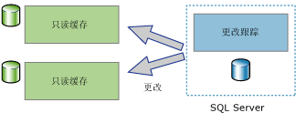
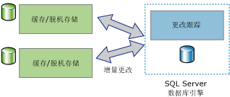

# 关于更改跟踪 (SQL Server)
[!INCLUDE[tsql-appliesto-ss2008-asdb-xxxx-xxx_md](../../includes/tsql-appliesto-ss2008-asdb-xxxx-xxx-md.md)]

  更改跟踪是一种轻量型解决方案，它为应用程序提供了一种有效的更改跟踪机制。 通常，若要使应用程序能够查询对数据库中的数据所做的更改和访问与这些更改相关的信息，应用程序开发人员必须实现自定义更改跟踪机制。 创建这些机制通常涉及多项工作，并且常常涉及使用触发器、 **timestamp** 列和新表组合来存储跟踪信息，同时还会涉及使用自定义清除过程。  
  
 不同类型的应用程序对其所需的有关更改的信息量有不同的要求。 应用程序可以使用更改跟踪来回答以下有关对用户表所做更改的问题：  
  
-   用户表中有哪些行发生了更改？  
  
    -   所需的只是行已更改的事实，而不是行更改的次数或任何中间更改的值。  
  
    -   可以从所跟踪的表中直接获取最新的数据。  
  
-   某行是否已更改？  
  
    -   当在同一事务中进行更改时，必须提供并记录行已更改的事实以及有关这一更改的信息。  
  
> [!NOTE]  
>  如果应用程序需要有关所有所做更改的信息以及所更改数据的中间值，则可能适合使用变更数据捕获，而不适合使用更改跟踪。 有关详细信息，请参阅[关于变更数据捕获 (SQL Server)](../../relational-databases/track-changes/about-change-data-capture-sql-server.md)。  
  
## 单向和双向同步应用程序  
 需要将数据与 [!INCLUDE[ssDEnoversion](../../includes/ssdenoversion-md.md)] 实例同步的应用程序必须能够查询更改。 更改跟踪可用作单向和双向同步应用程序的基础。  
  
### 单向同步应用程序  
 可以生成使用更改跟踪的单向同步应用程序，如客户端或中间层缓存应用程序。 如下图所示，缓存应用程序要求在 [!INCLUDE[ssDE](../../includes/ssde-md.md)] 中存储数据并在其他数据存储区中缓存数据。 应用程序必须能够使用对数据库表所做的任何更改来使缓存保持最新。 没有要传回到的 [!INCLUDE[ssDE](../../includes/ssde-md.md)]的更改。  
  
   
  
### 双向同步应用程序  
 也可以生成使用更改跟踪的双向同步应用程序。 在此方案中， [!INCLUDE[ssDE](../../includes/ssde-md.md)] 实例中的数据与一个或多个数据存储区同步。 可以更新这些存储区中的数据，并且这些更改必须再同步到 [!INCLUDE[ssDE](../../includes/ssde-md.md)]中。  
  
   
  
 偶尔连接的应用程序就是双向同步应用程序的一个很好的示例。 在这种类型的应用程序中，客户端应用程序查询并更新本地存储区。 当客户端与服务器之间存在连接时，应用程序会与服务器同步，并更改两个方向的数据流。  
  
 双向同步应用程序必须能够检测冲突。 如果在两次同步之间的时间两个数据存储区中的相同数据发生了更改，则会出现冲突。 有了检测冲突的功能，应用程序可以确保不会丢失这些更改。  
  
## 更改跟踪的工作方式  
 若要配置更改跟踪，可以使用 DDL 语句或 [!INCLUDE[ssManStudioFull](../../includes/ssmanstudiofull-md.md)]。 有关详细信息，请参阅 [启用和禁用更改跟踪 (SQL Server)](../../relational-databases/track-changes/enable-and-disable-change-tracking-sql-server.md)。 若要跟踪更改，必须首先对数据库启用更改跟踪，然后对该数据库内要跟踪的表启用更改跟踪。 表定义无需任何更改，也不会创建任何触发器。  
  
 为表配置了更改跟踪后，任何影响该表中的行的 DML 语句都将导致针对每个有所修改的行的更改跟踪信息被记录下来。 若要查询已更改的行并获取有关这些更改的信息，可以使用 [更改跟踪功能](../../relational-databases/system-functions/change-tracking-functions-transact-sql.md)。  
  
 主键列值是来自所跟踪的并记录更改信息的表中的唯一信息。 这些值用于标识发生更改的行。 要获取这些行的最新数据，应用程序可以使用主键列值联接源表和所跟踪的表。  
  
 使用更改跟踪也可以获取与每个行所做更改相关的信息。 例如，导致更改（插入、更新或删除）的 DML 操作的类型或作为更新操作的一部分而更改的列。 
 
## 更改跟踪清除
所有表（已启用更改跟踪功能）的更改跟踪信息存储在内存中行存储中。 与每个表（已启用更改跟踪功能）关联的更改跟踪数据会在每个检查点从内存中行存储刷新到磁盘上的相应内部表。 检查点的内存中行存储还会在行移到磁盘上的表之后进行清除。

启用更改跟踪功能的每个表都有一个磁盘上的内部表，更改跟踪功能可以使用该表来确定更改版本以及自特定版本以来更改过的行。 每次苏醒时，“自动清除”线程就会扫描 SQL Server 实例上的所有用户数据库，标识启用了更改跟踪的数据库。 磁盘上的每个内部表都会根据数据库的保持期设置清除其过期记录。

在 [!INCLUDE[ssSQL14](../../includes/sssql14-md.md)] 和 [!INCLUDE[ssSQL15](../../includes/sssql15-md.md)] 的 Service Pack 中增加了存储过程，用于对更改跟踪内部表执行手动清除。 [KB173157](https://support.microsoft.com/help/3173157/adds-a-stored-procedure-for-the-manual-cleanup-of-the-change-tracking-side-table-in-sql-server-2014-sp2-or-2016-sp1) 中提供了该存储过程的详细信息。 
  
## 另请参阅  
 [启用和禁用更改跟踪 (SQL Server)](../../relational-databases/track-changes/enable-and-disable-change-tracking-sql-server.md)   
 [处理更改跟踪 (SQL Server)](../../relational-databases/track-changes/work-with-change-tracking-sql-server.md)   
 [管理更改跟踪 (SQL Server)](../../relational-databases/track-changes/manage-change-tracking-sql-server.md)   
 [跟踪数据更改 (SQL Server)](../../relational-databases/track-changes/track-data-changes-sql-server.md)  
  
  

