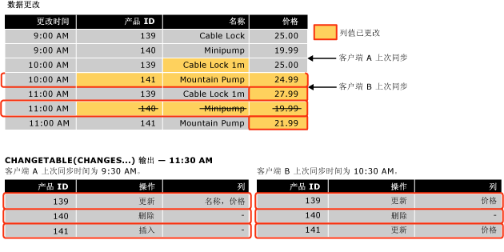

# <a name="work-with-change-tracking-sql-server"></a>使用更改跟踪 (SQL Server)
[!INCLUDE[tsql-appliesto-ss2008-asdb-xxxx-xxx-md](../../includes/tsql-appliesto-ss2008-asdb-xxxx-xxx-md.md)]

  使用更改跟踪的应用程序必须能够获取跟踪的更改，将这些更改应用到其他数据存储区并更新源数据库。 本主题介绍了如何执行这些任务，以及在发生故障转移且必须从备份还原数据库时，角色更改跟踪如何进行。  
  
##  <a name="Obtain"></a> 通过使用更改跟踪函数获取更改  
 介绍如何使用更改跟踪功能来获取更改以及有关对数据库所做的更改的信息。  
  
### <a name="about-the-change-tracking-functions"></a>关于更改跟踪函数  
 应用程序可以使用以下函数来获取在数据库中所做的更改以及有关这些更改的信息：  
  
 CHANGETABLE(CHANGES …) 函数  
 此行集函数用于查询更改信息。 该函数查询内部更改跟踪表中存储的数据。 该函数返回的结果集中包含已更改的行的主键和其他更改信息，例如，操作、更新的列以及行版本。  
  
 CHANGETABLE(CHANGES …) 将上次同步版本作为参数。 上次同步版本使用 `@last_synchronization_version` 变量获得。 上次同步版本的语义如下所示：  
  
-   进行调用的客户端已获取更改，并知道直至上次同步版本（含该版本）所做的所有更改。  
  
-   因此，CHANGETABLE(CHANGES …) 返回在上次同步版本之后进行的所有更改。  
  
     下图说明了如何使用 CHANGETABLE(CHANGES …) 获取更改。  
  
       
  
 CHANGE_TRACKING_CURRENT_VERSION() 函数  
 用于获取当前版本，以供下次查询更改时使用。 该版本表示上次提交的事务的版本。  
  
 CHANGE_TRACKING_MIN_VALID_VERSION() 函数  
 用于获取客户端能够具有的并且仍能从 CHANGETABLE() 获取有效结果的最低有效版本。 客户端应将上次同步版本与此函数返回的值进行对照检查。 如果上次同步版本低于此函数返回的版本，客户端将无法从 CHANGETABLE() 获取有效结果，而必须重新进行初始化。  
  
### <a name="obtaining-initial-data"></a>获取初始数据  
 在应用程序第一次获取更改之前，应用程序必须发送查询以获取初始数据和同步版本。 应用程序必须直接从表中获取相应的数据，然后使用 CHANGE_TRACKING_CURRENT_VERSION() 获取初始版本。 第一次获取更改时，会将此版本传递给 CHANGETABLE(CHANGES …)。  
  
 下面的示例说明了如何获取初始同步版本和初始数据集。  
  
```sql  
    -- Obtain the current synchronization version. This will be used next time that changes are obtained.  
    SET @synchronization_version = CHANGE_TRACKING_CURRENT_VERSION();  
  
    -- Obtain initial data set.  
    SELECT  
        P.ProductID, P.Name, P.ListPrice  
    FROM  
        SalesLT.Product AS P  
```  
  
### <a name="using-the-change-tracking-functions-to-obtain-changes"></a>使用更改跟踪函数获取更改  
 若要获取表中更改的行以及有关这些更改的信息，请使用 CHANGETABLE(CHANGES…)。 例如，下面的查询获取 `SalesLT.Product` 表的更改。  
  
```sql  
SELECT  
    CT.ProductID, CT.SYS_CHANGE_OPERATION,  
    CT.SYS_CHANGE_COLUMNS, CT.SYS_CHANGE_CONTEXT  
FROM  
    CHANGETABLE(CHANGES SalesLT.Product, @last_synchronization_version) AS CT  
  
```  
  
 通常，客户端需要获取行的最新数据，而不仅仅是行的主键。 因此，应用程序将来自 CHANGETABLE(CHANGES …) 的结果与用户表中的数据联接在一起。 例如，下面的查询与 `SalesLT.Product` 表联接在一起以获取 `Name` 和 `ListPrice` 列的值。 请注意，本例中使用了 `OUTER JOIN`。 若要确保返回有关从用户表中删除的那些行的更改信息，则必须使用此运算符。  
  
```sql  
SELECT  
    CT.ProductID, P.Name, P.ListPrice,  
    CT.SYS_CHANGE_OPERATION, CT.SYS_CHANGE_COLUMNS,  
    CT.SYS_CHANGE_CONTEXT  
FROM  
    SalesLT.Product AS P  
RIGHT OUTER JOIN  
    CHANGETABLE(CHANGES SalesLT.Product, @last_synchronization_version) AS CT  
ON  
    P.ProductID = CT.ProductID  
```  
  
 若要获取在下次更改枚举中使用的版本，请使用 CHANGE_TRACKING_CURRENT_VERSION()，如下面的示例所示。  
  
```sql  
SET @synchronization_version = CHANGE_TRACKING_CURRENT_VERSION()  
```  
  
 当应用程序获取更改时，它必须同时使用 CHANGETABLE(CHANGES…) 和 CHANGE_TRACKING_CURRENT_VERSION()，如下面的示例所示。  
  
```sql  
-- Obtain the current synchronization version. This will be used the next time CHANGETABLE(CHANGES...) is called.  
SET @synchronization_version = CHANGE_TRACKING_CURRENT_VERSION();  
  
-- Obtain incremental changes by using the synchronization version obtained the last time the data was synchronized.  
SELECT  
    CT.ProductID, P.Name, P.ListPrice,  
    CT.SYS_CHANGE_OPERATION, CT.SYS_CHANGE_COLUMNS,  
    CT.SYS_CHANGE_CONTEXT  
FROM  
    SalesLT.Product AS P  
RIGHT OUTER JOIN  
    CHANGETABLE(CHANGES SalesLT.Product, @last_synchronization_version) AS CT  
ON  
    P.ProductID = CT.ProductID  
```  
  
### <a name="version-numbers"></a>版本号  
 启用了更改跟踪的数据库具有一个版本计数器；在对启用了更改跟踪的表进行更改时，该计数器会随之递增。 每个更改的行都有一个关联的版本号。 将请求发送到应用程序以查询更改时，将调用一个函数以提供版本号。 该函数返回在该版本之后所做的所有更改的相关信息。 从某种意义上讲，更改跟踪版本在概念上与 **rowversion** 数据类型类似。  
  
### <a name="validating-the-last-synchronized-version"></a>验证上次同步版本  
 更改的相关信息将保留有限的一段时间。 时间长度是由 CHANGE_RETENTION 参数控制的，可以将该参数指定为 ALTER DATABASE 的一部分。  
  
 请注意，为 CHANGE_RETENTION 指定的时间决定了所有应用程序必须每隔多长时间从数据库中请求一次更改。 如果应用程序使用的 *last_synchronization_version* 值早于表的最低有效同步版本，该应用程序将无法执行有效的更改枚举。 这是因为，可能已清除了某些更改信息。 在应用程序使用 CHANGETABLE(CHANGES …) 获取更改之前，该应用程序必须验证计划传递给 CHANGETABLE(CHANGES …) 的 *last_synchronization_version* 值。 如果 *last_synchronization_version* 的值无效，则该应用程序必须重新初始化所有数据。  
  
 下面的示例说明了如何验证每个表的 `last_synchronization_version` 值的有效性。  
  
```sql  
-- Check individual table.  
IF (@last_synchronization_version < CHANGE_TRACKING_MIN_VALID_VERSION(  
                                   OBJECT_ID('SalesLT.Product')))  
BEGIN  
  -- Handle invalid version and do not enumerate changes.  
  -- Client must be reinitialized.  
END  
```  
  
 正如下面的示例所示，可以对照数据库中的所有表检查 `last_synchronization_version` 值的有效性。  
  
```sql  
-- Check all tables with change tracking enabled  
IF EXISTS (  
  SELECT COUNT(*) FROM sys.change_tracking_tables  
  WHERE min_valid_version > @last_synchronization_version )  
BEGIN  
  -- Handle invalid version & do not enumerate changes  
  -- Client must be reinitialized  
END  
```  
  
### <a name="using-column-tracking"></a>使用列跟踪  
 通过使用列跟踪，应用程序可以仅获取已更改的列数据，而不是获取整个行。 例如，请考虑以下情况：某个表包含一个或多个较大但很少更改的列，并且还包含其他经常更改的列。 如果未使用列跟踪，应用程序只能确定某一行已更改并且必须同步所有数据（包括大型列数据）。 但是，通过使用列跟踪，应用程序可以确定是否更改了大型列数据，并且仅同步已更改的数据。  
  
 列跟踪信息出现在 CHANGETABLE(CHANGES …) 函数返回的 SYS_CHANGE_COLUMNS 列中。  
  
 可以使用列跟踪，以便为未更改的列返回 NULL。 如果可以将列更改为 NULL，则必须返回一个单独的列以指示是否更改了该列。  
  
 在下面的示例中，如果 `CT_ThumbnailPhoto` 列未更改，则为该列返回 `NULL` 。 该列本身也可能为 `NULL` ，因为已将其更改为 `NULL` ；应用程序可以使用 `CT_ThumbNailPhoto_Changed` 列来确定是否更改了该列。  
  
```sql  
DECLARE @PhotoColumnId int = COLUMNPROPERTY(  
    OBJECT_ID('SalesLT.Product'),'ThumbNailPhoto', 'ColumnId')  
  
SELECT  
    CT.ProductID, P.Name, P.ListPrice, -- Always obtain values.  
    CASE  
           WHEN CHANGE_TRACKING_IS_COLUMN_IN_MASK(  
                     @PhotoColumnId, CT.SYS_CHANGE_COLUMNS) = 1  
            THEN ThumbNailPhoto  
            ELSE NULL  
      END AS CT_ThumbNailPhoto,  
      CHANGE_TRACKING_IS_COLUMN_IN_MASK(  
                     @PhotoColumnId, CT.SYS_CHANGE_COLUMNS) AS  
                                   CT_ThumbNailPhoto_Changed  
     CT.SYS_CHANGE_OPERATION, CT.SYS_CHANGE_COLUMNS,  
     CT.SYS_CHANGE_CONTEXT  
FROM  
     SalesLT.Product AS P  
INNER JOIN  
     CHANGETABLE(CHANGES SalesLT.Product, @last_synchronization_version) AS CT  
ON  
     P.ProductID = CT.ProductID AND  
     CT.SYS_CHANGE_OPERATION = 'U'  
```  
  
### <a name="obtaining-consistent-and-correct-results"></a>获得一致且正确的结果  
 若要获取更改的表数据，您需要执行多个步骤。 请注意，如果没有考虑到并处理某些问题，可能会返回不一致或错误的结果。  
  
 例如，若要获取对 Sales 和 SalesOrders 表所做的更改，应用程序应执行以下步骤：  
  
1.  使用 CHANGE_TRACKING_MIN_VALID_VERSION() 验证上次同步版本。  
  
2.  使用 CHANGE_TRACKING_CURRENT_VERSION() 获取可供下次获取更改时使用的版本。  
  
3.  使用 CHANGETABLE(CHANGES …) 获取对 Sales 表所做的更改。  
  
4.  使用 CHANGETABLE(CHANGES …) 获取对 SalesOrders 表所做的更改。  
  
 数据库中运行的两个进程可能会影响上述步骤返回的结果：  
  
-   清除进程在后台运行，并删除早于指定保持期的更改跟踪信息。  
  
     清除进程是一个单独的后台进程，它使用在为数据库配置更改跟踪时指定的保持期。 问题是清除进程可能会在验证上次同步版本之后以及调用 CHANGETABLE(CHANGES…) 之前运行。 到获取更改时，刚刚还有效的上次同步版本可能不再有效。 因此，可能会返回错误的结果。  
  
-   正在 Sales 和 SalesOrders 表中执行 DML 操作，如下面的操作：  
  
    -   在使用 CHANGE_TRACKING_CURRENT_VERSION() 获取下次使用的版本后，可能对表进行了更改。 因此，返回的更改可能超过预期数量。  
  
    -   可能在从 Sales 表中获取更改的调用以及从 SalesOrders 表中获取更改的调用之间提交了事务。 因此，SalesOrder 表的结果可能包含 Sales 表中不存在的外键值。  
  
 若要解决上面列出的难题，建议您使用快照隔离。 这有助于确保更改信息的一致性，并避免出现与后台清除任务有关的争用情况。 如果没有使用快照事务，在开发使用更改跟踪的应用程序时，可能需要增加很多工作量。  
  
#### <a name="using-snapshot-isolation"></a>使用快照隔离  
 从设计上，更改跟踪可以很好地与快照隔离配合使用。 必须为数据库启用快照隔离。 获取更改所需的所有步骤必须包含在快照事务中。 这可确保快照事务中的查询看不见在获取更改时对数据所做的所有更改。  
  
 若要获取快照事务中的数据，请执行以下步骤：  
  
1.  将事务隔离级别设置为快照，然后启动一个事务。  
  
2.  使用 CHANGE_TRACKING_MIN_VALID_VERSION() 验证上次同步版本。  
  
3.  使用 CHANGE_TRACKING_CURRENT_VERSION() 获取下次要使用的版本。  
  
4.  使用 CHANGETABLE(CHANGES …) 获取对 Sales 表所做的更改。  
  
5.  使用 CHANGETABLE(CHANGES …) 获取对 SalesOrders 表所做的更改。  
  
6.  提交事务。  
  
 由于获取更改所需的所有步骤都是在快照事务中执行的，因此，应注意以下事项：  
  
-   如果清除是在验证上次同步版本之后进行的，则来自 CHANGETABLE(CHANGES …) 的结果仍将有效，因为在事务中看不见清除执行的删除操作。  
  
-   在获取下次同步版本后对 Sales 或 SalesOrders 表所做的所有更改将不可见，并且 CHANGETABLE(CHANGES …) 调用绝不会返回版本晚于 CHANGE_TRACKING_CURRENT_VERSION() 返回结果的更改。 还会保持 Sales 和 SalesOrders 表之间的一致性，因为在 CHANGETABLE(CHANGES …) 调用之间提交的事务将不可见。  
  
 下面的示例说明了如何为数据库启用快照隔离。  
  
```sql  
-- The database must be configured to enable snapshot isolation.  
ALTER DATABASE AdventureWorksLT  
    SET ALLOW_SNAPSHOT_ISOLATION ON;  
```  
  
 快照事务是按如下方式使用的：  
  
```sql  
SET TRANSACTION ISOLATION LEVEL SNAPSHOT;  
BEGIN TRAN  
  -- Verify that version of the previous synchronization is valid.  
  -- Obtain the version to use next time.  
  -- Obtain changes.  
COMMIT TRAN  
```  
  
 有关快照事务的详细信息，请参阅 [SET TRANSACTION ISOLATION LEVEL (Transact-SQL)](../../t-sql/statements/set-transaction-isolation-level-transact-sql.md)。  
  
#### <a name="alternatives-to-using-snapshot-isolation"></a>使用快照隔离的替代方法  
 使用快照隔离有一些替代方法，但它们需要完成更多的工作以确保满足所有应用程序要求。 若要确保 *last_synchronization_version* 有效，并且清除进程在获取更改之前没有删除数据，请执行以下操作：  
  
1.  调用 CHANGETABLE() 后检查 *last_synchronization_version* 。  
  
2.  在使用 CHANGETABLE() 获取更改的每个查询中检查 *last_synchronization_version* 。  
  
 在为下次枚举获取同步版本后，可能会发生数据更改。 可以使用两种方法来处理这种情况。 所使用的选项取决于应用程序及其处理每种方法的副作用的方式：  
  
-   忽略版本高于新同步版本的更改。  
  
     这种方法具有以下副作用：如果创建或更新的行版本早于新同步版本，将跳过新行或更新的行，但以后会对其进行更新。 如果有一个新行，并且另一个表中创建的行引用跳过的行，则可能会出现引用完整性问题。 如果更新了某个现有行，将跳过该行，并且下次才会对其进行同步。  
  
-   包括所有更改，即便更改的版本高于新同步版本。  
  
     下次进行同步时，将重新获取版本高于新同步版本的行。 应用程序必须能够预料并处理这种情况。  
  
 除了上述两个选项外，还可以设计结合这两个选项的方法，具体取决于所执行的操作。 例如，您可能希望应用程序最好忽略晚于下次同步版本（在该版本中创建或删除了行）的更改，但不忽略更新。  
  
> [!NOTE]  
>  若要在使用更改跟踪（或任何自定义跟踪机制）时选择适合应用程序的方法，您需要完成大量的分析工作。 因此，使用快照隔离要简单得多。  
  
##  <a name="Handles"></a> 更改跟踪如何处理对数据库的更改  
 某些使用更改跟踪的应用程序执行与另一个数据存储区的双向同步。 即，在一个 [!INCLUDE[ssNoVersion](../../includes/ssnoversion-md.md)] 数据库中所做的更改将更新到另一个数据存储区中，而在该数据存储区中所做的更改将更新到该 [!INCLUDE[ssNoVersion](../../includes/ssnoversion-md.md)] 数据库中。  
  
 当应用程序使用另一个数据存储区中的更改更新本地数据库时，应用程序必须执行以下操作：  
  
-   检查冲突。  
  
     如果在两个数据存储区中同时更改相同的数据，则会发生冲突。 应用程序必须能够检查冲突，并获取足够的信息以便能够解决冲突。  
  
-   存储应用程序上下文信息。  
  
     应用程序存储具有更改跟踪信息的数据。 如果更改是从本地数据库中获取的，则会将此信息与其他更改跟踪信息放在一起。 此上下文信息的一个常见示例是作为更改源的数据存储区的标识符。  
  
 若要执行上述操作，同步应用程序可使用下列函数：  
  
-   CHANGETABLE(VERSION )  
  
     当应用程序进行更改时，它可以使用该函数来检查冲突。 对于启用了更改跟踪的表，该函数可获取该表中指定行的最新更改跟踪信息。 更改跟踪信息包括上次更改的行的版本。 应用程序可以使用此信息来确定自上次应用程序同步后该行是否进行了更改。  
  
-   WITH CHANGE_TRACKING_CONTEXT  
  
     应用程序可以使用此子句来存储上下文数据。  
  
### <a name="checking-for-conflicts"></a>检查冲突  
 在双向同步方案中，客户端应用程序必须确定在应用程序上次获取更改后某一行是否有更新。  
  
 下面的示例说明了如何使用 CHANGETABLE(VERSION …) 函数以最有效的方式检查冲突，而不是使用单独的查询。 在该示例中， `CHANGETABLE(VERSION …)` 确定 `SYS_CHANGE_VERSION` 所指定的行的 `@product id`。 `CHANGETABLE(CHANGES …)` 可以获取相同的信息，但效率较低。 如果该行的 `SYS_CHANGE_VERSION` 值大于 `@last_sync_version`值，则说明有冲突。 如果有冲突，则不会更新该行。 `ISNULL()` 检查是必需的，因为该行可能没有可用的更改信息。 如果在启用更改跟踪或清除更改信息后没有更新该行，则不存在任何更改信息。  
  
```sql  
-- Assumption: @last_sync_version has been validated.  
  
UPDATE  
    SalesLT.Product  
SET  
    ListPrice = @new_listprice  
FROM  
    SalesLT.Product AS P  
WHERE  
    ProductID = @product_id AND  
    @last_sync_version >= ISNULL (  
        SELECT CT.SYS_CHANGE_VERSION  
        FROM CHANGETABLE(VERSION SalesLT.Product,  
                        (ProductID), (P.ProductID)) AS CT),  
        0)  
```  
  
 以下代码可以检查更新的行数以及找出有关冲突的更多信息。  
  
```sql  
-- If the change cannot be made, find out more information.  
IF (@@ROWCOUNT = 0)  
BEGIN  
    -- Obtain the complete change information for the row.  
    SELECT  
        CT.SYS_CHANGE_VERSION, CT.SYS_CHANGE_CREATION_VERSION,  
        CT.SYS_CHANGE_OPERATION, CT.SYS_CHANGE_COLUMNS  
    FROM  
        CHANGETABLE(CHANGES SalesLT.Product, @last_sync_version) AS CT  
    WHERE  
        CT.ProductID = @product_id;  
  
    -- Check CT.SYS_CHANGE_VERSION to verify that it really was a conflict.  
    -- Check CT.SYS_CHANGE_OPERATION to determine the type of conflict:  
    -- update-update or update-delete.  
    -- The row that is specified by @product_id might no longer exist   
    -- if it has been deleted.  
END  
```  
  
### <a name="setting-context-information"></a>设置上下文信息  
 通过使用 WITH CHANGE_TRACKING_CONTEXT 子句，应用程序可以将上下文信息与更改信息存储在一起。 可随后从 CHANGETABLE(CHANGES  ) 返回的 SYS_CHANGE_CONTEXT 列中获取此信息。  
  
 上下文信息通常用于确定更改源。 如果可以确定更改源，数据存储区在重新同步时可使用该信息来避免获取更改。  
  
```sql  
  -- Try to update the row and check for a conflict.  
  WITH CHANGE_TRACKING_CONTEXT (@source_id)  
  UPDATE  
     SalesLT.Product  
  SET  
      ListPrice = @new_listprice  
  FROM  
      SalesLT.Product AS P  
  WHERE  
     ProductID = @product_id AND  
     @last_sync_version >= ISNULL (  
         (SELECT CT.SYS_CHANGE_VERSION FROM CHANGETABLE(VERSION SalesLT.Product,  
         (ProductID), (P.ProductID)) AS CT),  
         0)  
```  
  
### <a name="ensuring-consistent-and-correct-results"></a>确保获得一致且正确的结果  
 在验证 @last_sync_version 值时，应用程序必须考虑清除过程。 这是因为，在调用 CHANGE_TRACKING_MIN_VALID_VERSION() 后但在进行更新之前，可能已将数据删除。  
  
> [!IMPORTANT]  
>  建议您使用快照隔离，并在快照事务中进行更改。  
  
```sql  
-- Prerequisite is to ensure ALLOW_SNAPSHOT_ISOLATION is ON for the database.  
  
SET TRANSACTION ISOLATION LEVEL SNAPSHOT;  
BEGIN TRAN  
    -- Verify that last_sync_version is valid.  
    IF (@last_sync_version <  
CHANGE_TRACKING_MIN_VALID_VERSION(OBJECT_ID(‘SalesLT.Product’)))  
    BEGIN  
       RAISERROR (N’Last_sync_version too old’, 16, -1);  
    END  
    ELSE  
    BEGIN  
        -- Try to update the row.  
        -- Check @@ROWCOUNT and check for a conflict.  
    END  
COMMIT TRAN  
```  
  
> [!NOTE]  
>  在快照事务启动之后，在该快照事务中正在更新的行可能已经在另一个事务中进行了更新。 在这种情况下，会发生快照隔离更新冲突并导致该事务终止。 如果发生这种情况，请重试此更新。 随后，这会导致检测到更改跟踪冲突并且不会更改任何行。  
  
##  <a name="DataRestore"></a> 更改跟踪和数据还原  
 对于需要同步的应用程序，必须考虑启用了更改跟踪的数据库恢复到早期版本数据的情况。 如果发生故障转移到异步数据库镜像的情况，或者如果在使用日志传送时出现故障，则数据库从备份还原之后就会发生这种情况。 以下情况揭示了这一问题：  
  
1.  表 T1 启用了更改跟踪，并且该表的最低有效版本为 50。  
  
2.  客户端应用程序在版本 100 处同步数据，并获取有关版本 50 到 100 之间的所有更改的信息。  
  
3.  在版本 100 之后又对表 T1 进行了其他更改。  
  
4.  在版本 120 处出现故障，数据库管理员还原了数据库，但出现了数据丢失。 在还原操作之后，该表包含直至版本 70 的数据，最低同步版本仍为 50。  
  
     也就是说，同步数据存储区具有主数据存储区中已不再存在的数据。  
  
5.  T1 更新了许多次。 当前版本为 130。  
  
6.  客户端应用程序再次进行同步并提供上次同步版本号 100。 客户端会验证此版本号有效，因为 100 大于 50。  
  
     客户端获取版本 100 到 130 之间的更改。 此时，客户端并不知道版本 70 到 100 之间的更改已经与以前不同。 客户端上的数据与服务器上的数据不同步。  
  
 请注意，如果将数据库恢复到版本 100 之后的某一版本，则同步不会出现问题。 客户端和服务器将在下一个同步间隔内正确同步数据。  
  
 更改跟踪不支持恢复丢失的数据。 但是，有两种选择可用于检测这些类型的同步问题：  
  
-   在服务器上存储数据库版本 ID，每次恢复数据库或丢失数据时都更新此值。 每个客户端应用程序将存储该 ID，并且每个客户端在同步数据时必须验证此 ID。 如果发生数据丢失，则 ID 将不匹配，并且客户端将重新初始化。 这种方法有一个缺点，即如果数据丢失未越过上次的同步边界，则客户端可能会进行不必要的重新初始化。  
  
-   当客户端查询更改时，会在服务器上为每个客户端记录上次同步的版本号。 如果数据有问题，则上次同步的版本号将不匹配。 这表明需要进行重新初始化。  
  
## <a name="see-also"></a>另请参阅  
 [跟踪数据更改 (SQL Server)](../../relational-databases/track-changes/track-data-changes-sql-server.md)   
 [关于更改跟踪 (SQL Server)](../../relational-databases/track-changes/about-change-tracking-sql-server.md)   
 [管理更改跟踪 (SQL Server)](../../relational-databases/track-changes/manage-change-tracking-sql-server.md)   
 [启用和禁用更改跟踪 (SQL Server)](../../relational-databases/track-changes/enable-and-disable-change-tracking-sql-server.md)   
 [CHANGETABLE (Transact-SQL)](../../relational-databases/system-functions/changetable-transact-sql.md)   
 [CHANGE_TRACKING_MIN_VALID_VERSION (Transact-SQL)](../../relational-databases/system-functions/change-tracking-min-valid-version-transact-sql.md)   
 [CHANGE_TRACKING_CURRENT_VERSION (Transact-SQL)](../../relational-databases/system-functions/change-tracking-current-version-transact-sql.md)   
 [WITH CHANGE_TRACKING_CONTEXT (Transact-SQL)](../../relational-databases/system-functions/with-change-tracking-context-transact-sql.md)  
  
  
