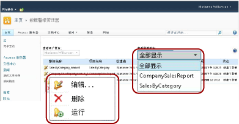

# SharePoint 用户的数据警报管理器

[!INCLUDE [ssrs-appliesto](../includes/ssrs-appliesto.md)] [!INCLUDE [ssrs-appliesto-2016](../includes/ssrs-appliesto-2016.md)] [!INCLUDE [ssrs-appliesto-not-2017](../includes/ssrs-appliesto-not-2017.md)] [!INCLUDE[ssrs-appliesto-sharepoint-2013-2016i](../includes/ssrs-appliesto-sharepoint-2013-2016.md)] [!INCLUDE [ssrs-appliesto-not-pbirs](../includes/ssrs-appliesto-not-pbirs.md)]

[!INCLUDE [ssrs-previous-versions](../includes/ssrs-previous-versions.md)]

[!INCLUDE[ssRSnoversion](../includes/ssrsnoversion-md.md)] 为 SharePoint 信息工作者提供了数据警报管理器以便管理数据警报。 他们可以查看他们所创建的警报的有关信息、删除警报以及打开警报定义以便编辑，并按需运行警报。 他们可以选择是仅查看单个报表的警报，还是所有报表的警告。 下图显示数据警报管理器中可用于信息工作者的功能。

  

> [!NOTE]
> 自 SQL Server 2016 之后，不再提供 Reporting Services 与 SharePoint 的集成这一功能。

在为数据警报启用某一 SharePoint 站点时，将创建两个 SharePoint 页（MyDataAlerts.aspx 和 SiteDataAlerts.aspx）并且将这两个 SharePoint 页将添加到该 SharePoint 站点中。 MyDataAlerts.aspx 是针对 SharePoint 信息工作者的数据警报管理器。 信息工作者通过对其创建警报的报表的右键单击菜单，打开数据警报管理器。  

 您还可以直接通过使用 URL 打开数据警报管理器。 下面的内容显示 URL 的语法：  
  
 `http://<site name>/_layouts/ReportServer/MyDataAlerts.aspx`  
  
> [!NOTE]  
>  在您可以使用 [!INCLUDE[ssRSnoversion](../includes/ssrsnoversion-md.md)] 警报功能之前，管理员必须向您授予权限。 有关所需权限的信息，请参阅 [Reporting Services 数据警报](../reporting-services/reporting-services-data-alerts.md)。  
  
##   查看数据警报信息  
 您可以查看在数据警报设计器中创建的数据警报列表。 若要打开数据警报管理器，请右键单击发布到 SharePoint 库的报表。 下图显示了报表右键单击菜单中的“管理数据警报”选项。  
  
   
  
 数据警报管理器包括一个表，该表列出警报名称、报表名称、警报定义创建者的姓名、发送警报消息的数目、上次运行警报的时间、上次修改警报定义的时间以及最新警报消息的状态。 如果无法生成或发送警报消息，则状态列将包含有关该错误的信息并且帮助您纠正该警报问题。 有关详细信息，请参阅 [在数据警报管理器中管理我的数据警报](../reporting-services/manage-my-data-alerts-in-data-alert-manager.md)。  
  
 下表在数据警报管理器中显示某个表中的示例数据。 发生错误时，错误消息和日志中条目的标识符 (GUID) 包含在表的“状态”字段中。  
  
|警报名称|报表名称|创建者|发送的警报数|上次运行时间|上次修改时间|“登录属性”|  
|----------------|-----------------|----------------|-----------------|--------------|-------------------|------------|  
|SalesQTR|SalesByTerritoryAndQTR|Lauren Johnson|4|6/12/2011|6/1/2011|最后一个警报已成功运行且已发送。|  
|UnitsSold|ProductsSalesByQTR|Lauren Johnson|2|7/1/2011|6/28/2011|已成功运行最后一个警报，但由于数据未发生更改，因此未发送任何警报。|  
|TopPromotion|PromotionTracking|Lauren Johnson|0||5/23/2011|创建了警报。|  
  
  
##   删除数据警报  
 您从数据警报管理器中删除警报定义。 作为信息工作者，您可以删除您创建的警报定义。 您无法删除其他人创建的警报定义。 有关详细信息，请参阅 [在数据警报管理器中管理我的数据警报](../reporting-services/manage-my-data-alerts-in-data-alert-manager.md)。  
  
 当您删除警报定义时，将永久删除该警报定义。 如果您仅希望暂停警报消息，应更改重复执行模式或更改警报定义的开始或停止日期。 有关详细信息，请参阅 [在警报设计器中编辑数据警报](../reporting-services/edit-a-data-alert-in-alert-designer.md)。  
  
  
##   编辑数据警报  
 作为信息工作者，从数据警报管理器中打开您的警报定义以便编辑。 您可以编辑您创建的警报定义，但无法编辑其他人创建的警报定义。 右键单击警报定义并单击“编辑”时，“数据警报设计器”随即打开，其中将显示警报定义。 有关详细信息，请参阅 [数据警报设计器](../reporting-services/data-alert-designer.md) 和 [在警报设计器中编辑数据警报](../reporting-services/edit-a-data-alert-in-alert-designer.md)。  
  
  
##   运行数据警报  
 数据警报管理器包括有关上次警报服务处理数据警报定义的时间和已发送数据警报消息的次数的信息。 您可能要立即运行并发送警报消息，而非等待计划指定的时间。 当您从数据警报管理器运行警报时，会覆盖警报计划，并根据运行报表所需的时间和您选择运行警报的报表服务器的繁忙程度，在一至五分钟之内启动对警报定义的处理。 但是，如果您指定仅当结果更改时才发送消息，则结果没有更改时，将不创建或发送消息。 有关详细信息，请参阅 [在数据警报管理器中管理我的数据警报](../reporting-services/manage-my-data-alerts-in-data-alert-manager.md)。  
  
> [!NOTE]  
>  单击 **“运行”**  选项后，需要几秒钟更新 **“状态”** 列的值以指示正在处理警报。 如果您多次单击 **“运行”**  选项，则将会多次处理警报。 这将不必要地占用报表服务器上的资源，并且还可能会影响报表服务器的性能。 若要查看有关警报的更新信息，请单击 Web 浏览器按钮以检查状态更新及有关警报的其他信息。  
  
  
##   相关任务  
 本节列出了向您展示如何管理警报和编辑警报定义的过程。  
  
-   [在数据警报管理器中管理我的数据警报](../reporting-services/manage-my-data-alerts-in-data-alert-manager.md)  
  
-   [在警报设计器中编辑数据警报](../reporting-services/edit-a-data-alert-in-alert-designer.md)  

## 另请参阅

[数据警报设计器](../reporting-services/data-alert-designer.md)   
[在数据警报设计器中创建数据警报](../reporting-services/create-a-data-alert-in-data-alert-designer.md)   
[Reporting Services 数据警报](../reporting-services/reporting-services-data-alerts.md)  

更多疑问？ [请访问 Reporting Services 论坛](https://go.microsoft.com/fwlink/?LinkId=620231)
