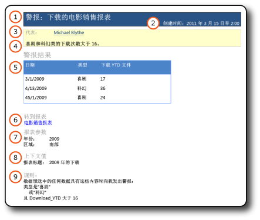
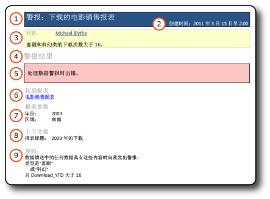

# 数据警报消息

[!INCLUDE [ssrs-appliesto](../includes/ssrs-appliesto.md)] [!INCLUDE [ssrs-appliesto-2016](../includes/ssrs-appliesto-2016.md)] [!INCLUDE [ssrs-appliesto-not-2017](../includes/ssrs-appliesto-not-2017.md)] [!INCLUDE[ssrs-appliesto-sharepoint-2013-2016i](../includes/ssrs-appliesto-sharepoint-2013-2016.md)] [!INCLUDE [ssrs-appliesto-not-pbirs](../includes/ssrs-appliesto-not-pbirs.md)]

[!INCLUDE [ssrs-previous-versions](../includes/ssrs-previous-versions.md)]

SQL Server Reporting Services 数据警报通过电子邮件传递两种类型的数据警报消息： 具有数据警报结果和具有错误说明的消息。 具有结果的消息向所有收件人告知有关报表数据中共同感兴趣的和对业务决策至关重要的更改。 如果由于某种原因导致错误且结果不可用，则发送错误消息。

数据警报定义的所有者还可以在数据警报管理器中查看有关数据警报实例的信息。 有关详细信息，请参阅 [Data Alert Manager for SharePoint Users](../reporting-services/data-alert-manager-for-sharepoint-users.md)。  

> [!NOTE]
> 与 SharePoint 的 reporting Services 集成 SQL Server 2016 之后将不再可用。
  
##   数据警报消息  
 下图显示具有结果的数据警报消息和具有错误说明的警报消息。  
  
 **结果消息**  
  
   
  
 **错误消息**  
  
   
  
 这些消息包含相同类型的信息。  
  
1.  **代表** 包含创建数据警报定义的人员姓名。  
  
2.  如果您在报表定义中提供了说明，则它会在 **代表**下显示。  
  
3.  **警报结果** 显示报表数据馈送中符合在警报定义中以表格格式指定的规则的行，或显示错误说明。 对于显示的行数没有限制。  
  
4.  **转到报表** 是指向警报定义所基于的报表的链接。 如果因为报表移动或删除而导致此链接无效，则显示一条错误消息。  
  
5.  **规则** 列出了警报定义中的规则和子句。 此信息帮助您验证和了解警报结果，并确定数据警报定义中您可能希望更改以缩小或扩大结果的规则。  
  
6.  **报表参数** 列出在运行报表时所使用的参数和参数值。 参数及参数值可帮助您了解警报结果。  
  
7.  **上下文值** 列出报表数据区域之外的报表项的名称和值。 这些项通常为文本框。 例如，带常量值的文本框（如报表主题或报表说明）。  
  
 两种消息类型的唯一区别在于项 5，即 **警报结果**。 如果在创建数据警报实例或数据警报消息时发生错误，则 **警报结果** 显示一条描述问题的错误消息。 此错误消息将发送给所有收件人，让他们知道他们预期和可能依赖来制定业务决策的警报结果不可用。  
  
  
##   相关任务  
 本部分列出的过程说明如何创建和编辑数据警报定义，这些定义可提供您在数据警报消息中看到的大量信息。  
  
-   [在数据警报设计器中创建数据警报](../reporting-services/create-a-data-alert-in-data-alert-designer.md)  
  
-   [编辑警报设计器中的某个数据警报](../reporting-services/edit-a-data-alert-in-alert-designer.md)  

## 另请参阅

[数据警报设计器](../reporting-services/data-alert-designer.md)   
[Reporting Services 数据警报](../reporting-services/reporting-services-data-alerts.md)  

更多问题？ [尝试的 Reporting Services 论坛](http://go.microsoft.com/fwlink/?LinkId=620231)
