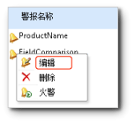

# 在警报设计器中编辑数据警报

[!INCLUDE[ssrs-appliesto-sql2016-xpreview](../includes/ssrs-appliesto-sql2016-xpreview.md)][!INCLUDE[ssrs-appliesto-sharepoint-2013-2016i](../includes/ssrs-appliesto-sharepoint-2013-2016.md)]

打开要从数据警报管理器中进行编辑的数据警报定义。 只有创建了警报定义的用户才能对其进行编辑。 有关打开数据警报管理器的详细信息，请参阅 [在数据警报管理器中管理我的数据警报](../reporting-services/manage-my-data-alerts-in-data-alert-manager.md)。

> [!NOTE]
> 与 SharePoint 的 reporting Services 集成 SQL Server 2016 之后将不再可用。

 下图显示了数据警报管理器中数据警报上的上下文菜单。  
  
   
  
 下面的过程包括打开警报定义以便从数据警报管理器的数据警报设计器中进行编辑的步骤。  
  
### 在数据警报设计器中编辑数据警报定义  
  
1.  在数据警报管理器中，右键单击要编辑的数据警报定义，然后单击“编辑”。  
  
     该警报定义将在数据警报设计器中打开。  
  
2.  更新规则、计划设置和电子邮件设置。 有关详细信息，请参阅 [数据警报设计器](../reporting-services/data-alert-designer.md) 和 [在数据警报设计器中创建数据警报](../reporting-services/create-a-data-alert-in-data-alert-designer.md)。  
  
    > [!NOTE]  
    >  不能选择其他数据馈送。 若要使用不同的数据馈送，则必须创建一个新的数据警报定义。  
  
3.  单击 **“保存”**。  
  
    > [!NOTE]  
    >  如果报表已更改并且从该报表生成的数据馈送已更改，则警报定义将不再有效。 在发生以下情况之一时警报定义将不再有效：警报定义在其规则中引用的列从报表中删除、或更改了数据类型、或删除或移动了报表。 您可以打开无效的警报定义，但在其根据报表数据馈送所基于的当前版本变为有效之前无法重新保存。 若要了解有关如何从报表中生成数据馈送的详细信息，请参阅[基于报表生成数据馈送（报表生成器和 SSRS）](../reporting-services/report-builder/generating-data-feeds-from-reports-report-builder-and-ssrs.md)。  

## 另请参阅

[向管理员提出警报的数据警报管理器](../reporting-services/data-alert-manager-for-alerting-administrators.md)   
[Reporting Services 数据警报](../reporting-services/reporting-services-data-alerts.md)  

更多问题？ [尝试的 Reporting Services 论坛](http://go.microsoft.com/fwlink/?LinkId=620231)
