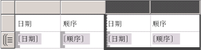
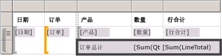
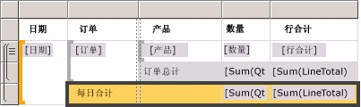
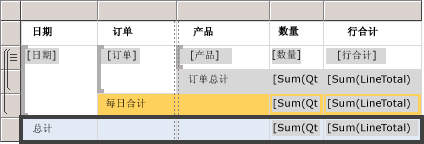
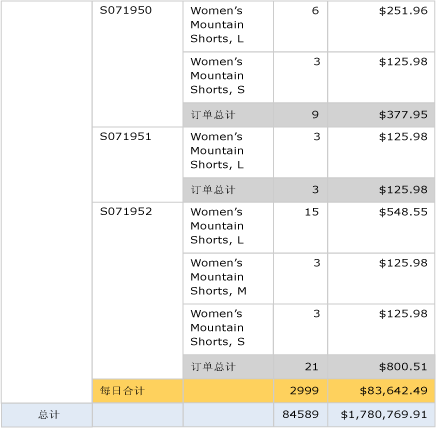

# Lesson 6: Adding Grouping and Totals (Reporting Services)
在本教程课程中，你将向 [!INCLUDE[ssRSnoversion](../includes/ssrsnoversion-md.md)] 报表中添加分组和总计以便组织和汇总数据。  
  
  
## 在报表中对数据进行分组  
  
1.  单击 **“设计”** 选项卡。  
  
2.  如果看不到“行组”窗格，请右键单击设计图面，然后单击“查看”，再单击“分组”。  
  
3.  从 **“报表数据”** 窗格将 **Date** 字段拖到 **“行组”** 窗格， 并将其放置到名为 **(Details)**的行上面。
  
    请注意，行控点中现在有一个方括号，用于显示组。 表现在在垂直点线的两侧各有一个 Date 列。  
  
      
  
4.  从 **“报表数据”** 窗格将 **Order** 字段拖到 **“行组”** 窗格， 并将其放置到 Date 下面和 **(Details)**上面。

   
  
    Note that the row handle now has two brackets in it , to show two groups. The table now has two **Order** columns, too.  
  
5.  删除两根线条 **右侧** 的原始 **Date** 和 **Order** 列。 这将删除该单个记录值，以便仅显示组值。 选择并右键单击两个列的列句柄，然后单击“删除列”。  
  
      
  
6.  若要设置新的日期列的格式，右键单击带有 `[Date]` 字段表达式的单元，然后单击“文本框属性”。  
  
7.  单击“数字”，然后在“类别”字段中，单击“日期”。  
  
8.  在 **“类型”** 框中，选择 **“2000 年 1 月 31 日”**。  
  
9.  [!INCLUDE[clickOK](../includes/clickok-md.md)]的行上面。  
  
10.  切换到 **“预览”** 选项卡以预览报表。 其外观应与下图类似：  
     
  
## 向报表中添加总计  
  
1.  切换到“设计”视图。  
  
2.  右键单击包含 `[LineTotal]` 字段的数据区域单元，并单击“添加总计”。  
  
    这将添加一个带有每个订单的美元总金额的行。  
  
3.  右键单击包含 `[Qty]` 字段的单元，并单击“添加总计”。  
  
    这将向总计行添加每个订单的总数量。  
  
4.  在 `Sum[Qty]`左侧的空单元中，键入标签“**Order Total**”。  
  
5.  可以向总计行添加背景色。 选择两个累加求和单元和标签单元。  
  
6.  在 **“格式”** 菜单上，依次单击 **“背景色”**、 **“浅灰色”**和 **“确定”**。  
  
      
  
## 向报表添加每日总计  
  
1.  右键单击 **Order** 单元，指向“添加总计”，并单击“晚于”。  
  
    这将添加一个包含每天的总量和美元总金额的新行，并在 Order 列的底部添加“**Total**”标签。  
  
2.  在相同单元中，在 **Total** 单词之前键入 **Daily** 单词，使其显示为 **Daily Total**。  
  
3.  选定 **Daily Total** 单元、两个 **Sum** 单元及其之间的空单元。  
  
4.  在 **“格式”** 菜单上，依次单击 **“背景色”**、 **“橙色”**和 **“确定”**。  
  
      
  
## 向报表添加总计  
  
1.  右键单击“Date”单元，指向“添加总计”，并单击“晚于”。  
  
    这将添加一个包含整个报表的总量和美元总金额的新行，并在 **Date** 列中添加 **Total** 标签。  
  
2.  在相同单元中，在 **Total** 单词之前键入 **Grand** 单词，使其显示为 **Grand Total**。  
  
3.  选定 **Grand Total** 单元、两个 **Sum** 单元及其之间的空单元。  
  
4.  在 **“格式”** 菜单上，依次单击 **“背景色”**、 **“浅蓝色”**和 **“确定”**。  
  
      
  
5.  单击 **“预览”**的行上面。  
  
    最后一页的外观应该如下图所示。 在工具栏中，单击“最后一页” 按钮。   
  
      
  
## 将报表发布到报表服务器（可选）  
  
1.  一个可选步骤是将已完成的报表发送到本机模式报表服务器上，以便您可以从报表管理器查看该报表。  
  
2.  单击“项目”菜单，然后单击“教程属性...”  
  
3.  在 **TargetServerURL** 中，键入报表服务器的名称，例如   
- `http:/<servername>/reportserver`  
   
- `http://localhost/reportserver` 如果你的设计报表在报表服务器上，则使用。  
  
  
4. 请注意，“TargetReportFolder”是教程，是项目的名称。  这是在下一步骤中将报表部署到其中的文件夹的名称。  
5. 单击 **“确定”**。  
  
6.  单击“生成”菜单，然后单击“部署教程”。  
  
    如果您在输出窗口中看到如下消息，则指示成功部署。  
  
    > ------ Build started: Project: tutorial, Configuration: Debug ------  
    > Skipping 'Sales Orders.rdl'. 项是最新版本。  
    > 生成完成 -- 0 个错误，0 个警告  
    > ------ Deploy started: Project: tutorial, Configuration: Debug ------  
    > 部署到 http://[server name]/reportserver  
    > 部署 report '/tutorial/Sales Orders'。  
    > 部署完成 - 0 个错误，0 个警告  
    > ==========生成：1 个成功或最新，0 个失败，0 个跳过==========  
    > ==========部署：1 个成功，0 个失败，0 个跳过==========  
  
    如果您看到如下错误消息，则确认您对报表服务器的权限并且已使用管理员权限启动了 [!INCLUDE[ssBIDevStudio](../includes/ssbidevstudio-md.md)] 。  
  
    > “为用户‘XXXXXXXX\\[你的用户名]’授予的权限不足，无法执行此操作”  
  
7.  使用管理员权限浏览到 Web 门户，例如，右键单击 Internet Explorer 图标，然后单击“以管理员身份运行”。  
  
    浏览到 [!INCLUDE[ssRSnoversion_md](../includes/ssrsnoversion-md.md)] Web 门户 URL。   
    **注意：**门户 URL 为“Reports”，而不是“Reportserver”的报表服务器 URL。  例如：   
    - `http://<server name>/reports`的行上面。  
     - `http://localhost/reports` 如果你的设计报表在报表服务器上，则使用。  
  
8.  浏览到包含该报表的文件夹。 默认名称是教程，即项目的名称或在项目属性中的“TargetReportFolder fiedl”中键入的名称。   
单击报表“Sales Orders”的名称以在浏览器中查看呈现的报表。  
  
      
 
** 你已成功完成了“创建基本表报表”教程的学习。**  
  
## 另请参阅  
[对数据进行筛选、分组和排序（报表生成器和 SSRS）](../reporting-services/report-design/filter-group-and-sort-data-report-builder-and-ssrs.md)  
  
  
  

