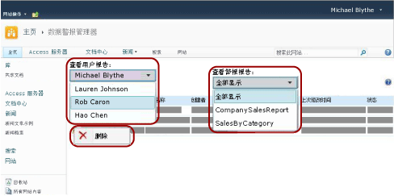

# 在数据警报管理器中管理 SharePoint 站点上的所有数据警报

[!INCLUDE[ssrs-appliesto](../includes/ssrs-appliesto.md)] [!INCLUDE[ssrs-appliesto-2016](../includes/ssrs-appliesto-2016.md)] [!INCLUDE[ssrs-appliesto-not-pbirsi](../includes/ssrs-appliesto-not-pbirs.md)] [!INCLUDE[ssrs-appliesto-sharepoint-2013-2016i](../includes/ssrs-appliesto-sharepoint-2013-2016.md)]

SharePoint 警报管理员可以查看由任何站点用户创建的数据警报的列表以及有关警报的信息。 警报管理员也可以删除警报。 下图显示数据警报管理器中可用于警报管理员的功能。

 

> [!NOTE]
> 自 SQL Server 2016 之后，不再提供 Reporting Services 与 SharePoint 的集成这一功能。

## 查看站点用户创建的警报列表  
  
1.  转到保存数据警报定义的 SharePoint 站点。  
  
2.  在主页上，单击 **“网站操作”**。  
  
3.  滚动到该列表的底部，然后单击 **“站点设置”**。  
  
4.  在 **Reporting Services**下，单击 **“管理数据警报”**。  
  
5.  单击 **“查看用户警报”** 列表旁的向下箭头并且选择您要查看其警报的用户。  
  
6.  单击 **“查看报表警报”** 列表旁的向下箭头并且选择要查看的特定警报，或者单击 **“全部显示”** 以列出所选用户创建的所有警报。  
  
     表将列出名称、报表名称、创建了数据警报的人员的姓名、发送数据警报的数目、上次修改数据警报定义的时间以及数据警报的状态。 如果无法生成或发送数据警报，则状态列将包含有关该错误的信息并且帮助您解决这个问题。  
  
## 删除警报定义  
  
-   右键单击要删除的数据警报，然后单击“删除”。  
  
    > [!NOTE]  
    >  删除警报定义后，将不会发送进一步的警报消息。 但是，如果您查询警报数据库，可能会发现该警报定义仍存在。 警报服务将按照计划执行清除，因此该警报定义将在下次清除中被永久删除。 默认清除间隔为 20 分钟。 此设置以及其他清除间隔都是可配置的。 有关详细信息，请参阅 [Reporting Services 数据警报](../reporting-services/reporting-services-data-alerts.md)。  

## 另请参阅

[向管理员提出警报的数据警报管理器](../reporting-services/data-alert-manager-for-alerting-administrators.md)   
[Reporting Services 数据警报](../reporting-services/reporting-services-data-alerts.md)  

更多疑问？ [请访问 Reporting Services 论坛](https://go.microsoft.com/fwlink/?LinkId=620231)
