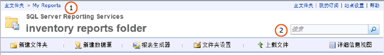

# 在 Web 门户中查找和查看报表（报表生成器和 SSRS）
  报表管理器是一种基于 Web 的工具，该工具包含查看和管理报表的功能。 它是报表服务器安装的一部分。 若要打开报表管理器，请在浏览器窗口中键入报表管理器 URL。 有关浏览器要求的信息，请参阅 [Reporting Services 和 Power View 的浏览器支持](../../reporting-services/browser-support-for-reporting-services-and-power-view.md)。 有关如何可在报表服务器上配置报表管理器 URL 的详细信息，请与系统管理员联系。 有关详细信息，请参阅[配置报表管理器（本机模式）](../../reporting-services/report-server/configure-report-manager-native-mode.md)。  
  
 系统管理员在报表服务器上设置的权限决定您使用报表管理器时可以查看的内容。 权限是通过角色分配授予的。 若要查找和查看报表，您的角色分配必须包括“查看报表”任务。 若要在报表服务器上查找某一报表，请按名称或说明搜索该报表，或者浏览报表服务器文件夹。 只能搜索或通过浏览查找已发布或上载到报表服务器的报表。 有关如何搜索报表的详细信息，请参阅 [搜索报表和其他项（报表生成器和 SSRS）](../../reporting-services/report-builder/searching-for-reports-and-other-items-report-builder-and-ssrs.md)。  
  
> [!NOTE]  
>  [!INCLUDE[ssRBRDDup](../../includes/ssrbrddup-md.md)]  
  
## 在报表管理器中的文件夹层次结构中导航  
 若要通过浏览查找要运行的报表，可以使用主页，当您启动报表管理器时以及当您打开文件夹层次结构中的任意文件夹时，此页会自动显示。 主页仅显示您有权查看的项。 文件夹路径会作为一行链接显示在主页的顶部。 文件夹名依次列出，根文件夹（主文件夹）排在最前面。 打开其他各个文件夹时，相应的文件夹名将添加到页面顶部的文件夹路径中。 下图中的**(1)** 。 打开报表时，相应的报表名称也将添加到文件夹路径中。  
  
   
报表管理器功能区  
  
 使用以下方法可以在整个文件夹层次结构中定位：  
  
-   若要查看文件夹内容，请单击主页中的文件夹名。 文件夹页随即打开，显示该文件夹中的内容。  
  
-   若要在文件夹层次结构中向下定位，请打开当前文件夹的子文件夹。 文件夹包含报表、资源、共享数据源项和其他文件夹。 单击文件夹图标可以打开该文件夹，显示层次结构中下一级的内容。  
  
-   若要在文件夹层次结构中向上定位，请在页面顶部的链接行中单击要查看其内容的文件夹名。 上图中的**(1)** 。  
  
## 打开报表  
 找到报表后，单击报表名称可打开该报表。 该报表会以 HTML 格式呈现，并显示在报表管理器中的“内容”页中。 报表始终由浏览器会话进行缓存，因此如果打开一个报表，通常可以通过单击 **“后退”** 按钮返回到该报表。 即使在要求您提供用户名和密码才能运行报表的情况下，也是如此。 只有关闭浏览器，您才能完全关闭已呈现的报表。  
  
 并不是所有在文件夹层次结构中可见的报表都是可立即访问的。 有些报表可能会提示您输入用户名和密码，以确定您是否有权访问该报表的数据源。 有关在报表管理器中打开报表的详细信息，请参阅[打开和关闭报表（报表管理器）](../../reporting-services/reports/open-and-close-a-report-report-manager.md)。  
  
 此外，您还可以通过报表生成器浏览到报表并从报表服务器直接打开报表。 有关详细信息，请参阅 [搜索报表和其他项（报表生成器和 SSRS）](../../reporting-services/report-builder/searching-for-reports-and-other-items-report-builder-and-ssrs.md)。  
  
## 搜索项  
  
-   若要在报表管理器中搜索项，请在页面顶部的 **“搜索”** 文本框中键入搜索字符串。 上图中的**(2)** 。 搜索将从文件夹层次结构的顶部节点开始，然后逐渐涉及每一个分支。 如果您无权访问特定分支，就会将其跳过。 这一点适用于其他用户的“我的报表”文件夹以及一般情况下不可用的其他文件夹。 搜索结果中将只包含您有权查看的报表和项。  
  
-   若要按名称或说明搜索项，请指定希望匹配的全部或部分文本。 搜索字符串不区分大小写。 您不能使用搜索运算符来规定或排除搜索条件，如加号 (+) 或减号 (–)。  
  
-   若要在报表中搜索特定文本，请使用报表顶部的工具栏。  
  
## 另请参阅  
 [搜索报表和其他项（报表生成器和 SSRS）](../../reporting-services/report-builder/searching-for-reports-and-other-items-report-builder-and-ssrs.md)   
 [查找、查看和管理报表（报表生成器和 SSRS）](../../reporting-services/report-builder/finding-viewing-and-managing-reports-report-builder-and-ssrs.md)  
  
  
