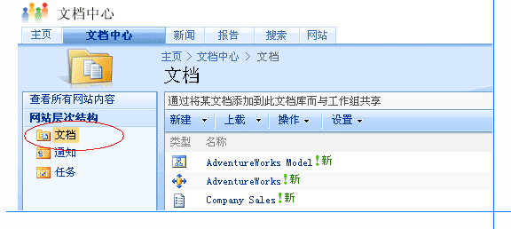
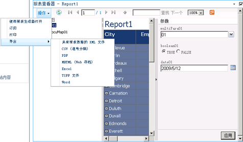
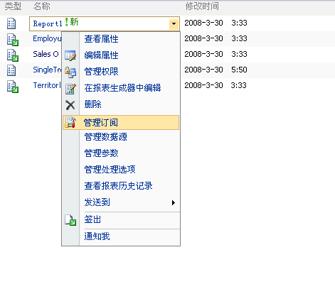

# 查找、查看和管理报表（报表生成器和 SSRS）
  在报表生成器中，可以浏览报表服务器或 SharePoint 站点上的文件夹，以便查找分页报表、共享数据源、模型和其他相关报表项；并且可以浏览计算机，以便查找本地报表。 为了便于查找报表，报表生成器维护最近使用的服务器和站点的列表，并提供对您的计算机的文件系统中“桌面”、“我的文档”和“我的电脑”文件夹的直接访问。  
  
 在报表设计器中，还可以浏览计算机以查找本地分页报表。 将报表部署到报表服务器或 SharePoint 站点之后，可以通过使用 Web 门户来浏览报表服务器，或搜索 SharePoint 站点来查找报表。 报表和相关项在部署之后仍在本地可用。  
  
> [!NOTE]  
> 您可以在本地模式中使用报表生成器，也可以在连接到报表服务器的情况下使用报表生成器。 如果您没有与报表服务器的活动连接，则会受到某些限制。  
  
 若要从报表生成器找到某一报表服务器或 SharePoint 站点上的一个报表，必须提供该报表服务器或 SharePoint 站点的 URL。 当您第一次安装报表生成器时，可以指定要使用的 URL。 这是在您保存或打开报表时报表生成器默认连接到的服务器或站点。  
  
 创建或更新报表时可以在报表生成器和报表设计器中预览报表；并且可以通过使用 Web 门户在报表服务器上查看和管理报表；或者可以在发布报表后通过使用内置的 SharePoint 工具和功能在与 Reporting Services 集成的 SharePoint 站点上查看和管理报表。 有关详细信息，请参阅 [在报表生成器中预览报表](../../reporting-services/report-builder/previewing-reports-in-report-builder.md) 和 [预览报表](../../reporting-services/reports/previewing-reports.md)。  
  
 在报表生成器和报表设计器中预览报表时，或者在 Web 门户或 SharePoint 站点中查看报表时，数据将被刷新，并且报表显示来自该报表使用的数据源的当前数据。 如果您想要查看报表但不刷新其数据，可以将报表历史记录和缓存的数据用于发布的报表。 在报表生成器和报表设计器中预览报表时，您不能使用这些功能。  
  
> [!NOTE]  
> [!INCLUDE[ssRBRDDup](../../includes/ssrbrddup-md.md)]  
  
##   在报表生成器中查找和查看报表  
 若要查找您要使用的报表或者选择要用于报表中的共享数据源、图像或子报表，请浏览您的计算机、报表服务器上的文件夹或者与 Reporting Services 集成的 SharePoint 站点。  
  
 若要查找某一报表服务器上的报表，必须指定该报表服务器的 URL，并且对于文件夹具有读取和保存报表项的相应权限。 若要获得相应 URL 和权限，请询问报表服务器的系统管理员。  
  
 在报表生成器中找到并打开某一报表后，您可以预览和更改它。 当您预览该报表时，将看到当前数据。 有关详细信息，请参阅 [Previewing Reports in Report Builder](../../reporting-services/report-builder/previewing-reports-in-report-builder.md)。  
  
 报表生成器可帮助您完成以下任务：  
  
-   **查找报表** ：查找报表时，可以使用为报表生成器自定义的类似 Microsoft Office 样式的 **“打开文件”** 对话框。 可以浏览报表服务器或文件系统上的文件夹，包括“我的报表”、“站点和服务器”、“桌面”、“我的文档”、“我的电脑”。 “站点和服务器”提供最近使用的服务器列表。  
  
-   **查找共享数据源** ：查找共享数据源时，可以从最近使用的列表中选取，也可以浏览到报表所在的同一报表服务器上的另一个文件夹。  
  
-   **查看报表** ：在创建或更新报表时在报表生成器中预览报表。 在报表生成器连接到某一报表服务器时，该报表服务器加载和处理报表；否则，将在本地处理报表。 报表生成器中的报表查看器将显示呈现的报表。  
  
 
##   从报表服务器查看和管理报表  
 可以使用 Web 门户查看和管理报表服务器上的报表。 浏览服务器上的文件夹找到报表，运行报表，以在浏览器中查看它们，并且执行管理任务。  
  
 Web 门户可帮助你完成以下管理任务：  
  
-   查看和更新报表、共享的数据源和其他报表项的属性。  
  
-   上载报表并为报表创建新的共享数据源。  
  
-   创建计划以便在指定时间和以指定间隔运行报表。  
  
-   创建、更改或删除报表订阅。  
  
-   创建报表历史记录并指定在报表历史记录中保留的报表快照的数量。  
  
-   在服务器上创建新文件夹，以便按照您所需的方式组织报表。  
  
 其中的某些任务可能需要由报表服务器的管理员为您完成。 若要了解有关在报表服务器上执行的任务的详细信息，请参阅 [Reporting Services 报表服务器（本机模式）](../../reporting-services/report-server/reporting-services-report-server-native-mode.md)。  
  
Web 门户通常包含文件夹、报表、数据源以及“我的报表”文件夹。 “我的报表”是一个个人工作区，您可以使用它来存储和处理自己的报表。 其他报表服务器文件夹都是公用文件夹，通常要求用户具有高级权限才能添加或修改文件夹内容。 可以在“我的报表”内创建子文件夹，以便进一步组织你的报表。  
  
 Web 门户在 Reporting Services HTML 查看器中显示报表。 该 HTML 查看器提供了用于在 HTML 中查看报表的框架，并且包括报表工具栏、参数部分、凭据部分和文档映射。 报表工具栏提供了页面导航、缩放、刷新、搜索、导出、打印和数据馈送功能。 在通过 URL 访问报表时，报表工具栏也会在浏览器窗口中显示于报表顶部。 打印功能是可选的，并且必须由管理员启用。 如果启用了打印功能，报表工具栏上将显示一个打印机图标。 下图显示了 Web 门户中的报表工具栏的特写。  
  
   
  
运行报表后，可以将其导出为其他格式，例如 [!INCLUDE[msCoName](../../includes/msconame-md.md)] Excel 或 PDF。 还可以使用逗号分隔值 (CSV) 呈现扩展插件之类的数据扩展插件导出报表，然后使用 CSV 数据文件作为对其他应用程序的输入。 有关导出报表的详细信息，请参阅[导出报表（报表生成器和 SSRS）](../../reporting-services/report-builder/export-reports-report-builder-and-ssrs.md)。
  
 选择和运行报表的最简单方法是打开 Web 门户，然后搜索或浏览到要查看的报表。  
  
 在运行某一报表后，您可以刷新该报表以查看新数据。  
  
### 刷新报表  
 报表数据经常更改，因此您可能希望刷新报表以查看最新的数据。 可以采用三种不同的方法刷新报表：  
  
|选项|结果|  
|------------|------------|  
|浏览器窗口上的 **“刷新”** 按钮|显示在会话缓存中存储的报表。 用户打开报表时即会创建会话缓存。 [!INCLUDE[ssRSnoversion](../../includes/ssrsnoversion-md.md)] 使用浏览器会话来保持一致的查看体验。|  
||单击报表工具栏上的 **“刷新”** 按钮时，如果报表是按需运行的，则报表服务器将重新运行查询并更新报表数据。 如果报表已缓存或者为快照，则单击 **“刷新”** 后，将显示存储在报表服务器数据库中的报表。|  
|Ctrl+F5 组合键|产生与单击报表工具栏上的 **“刷新”** 按钮相同的结果。|  
  
  
##   从 SharePoint 站点查看和管理报表服务器项  
 如果系统管理员将报表服务器配置为以 SharePoint 集成模式运行，则可以从 SharePoint 站点查看和管理报表及其他报表服务器项。  
  
 SharePoint 站点包括的页面可用于设置数据源属性、报表历史记录、报表处理选项、计划、订阅、报表参数以及创建共享计划。 在 SharePoint 站点中管理报表服务器项的方式与您使用 [!INCLUDE[ssNoVersion](../../includes/ssnoversion-md.md)]中的其他工具创建和管理它们的方式相同。  
  
 若要访问应用程序页，请从报表或先前添加到 SharePoint 库的其他报表服务器项的下拉菜单中选择特定于项的操作。 您可能还可以在报表生成器中创建报表、生成模型和设置模型项的安全性，这取决于具体的项以及您拥有的权限。  
  
 有关 Reporting Services 和 SharePoint 技术的详细信息，请参阅[配置和管理报表服务器（Reporting Services SharePoint 模式）](../../reporting-services/report-server-sharepoint/configuration-and-administration-of-a-report-server.md)。
  
### 在 SharePoint 站点中查找报表服务器项  
 在您能够设置属性之前，首先必须能够找到项。 报表服务器项总是存储在多个库中或者存储在某个库的一个文件夹内。  
  
 访问 SharePoint 站点时，您可以看到“浏览”页和“库工具”选项卡。“浏览”页列出各个库，还列出所选库的内容。 可以查看库中的报表和其他项，浏览文件夹，搜索站点以查找项。  
  
 若要将报表服务器项与 SharePoint 站点中的其他项区分开，可使用图标直观地识别出报表服务器项，也可以将鼠标指针置于类型上方并查看文件扩展名。 下图显示了 Reports 库中的文件夹和报表定义：  
  
   
  
### 查看报表  
 上载到 SharePoint 库的报表定义（.rdl 文件）是通过 Reporting Services 外接程序安装的报表查看器 Web 部件来查看的。 当您安装该外接程序时会自动定义一个 .rdl 文件关联。 因此，选择报表时，报表会自动在该 Web 部件中打开。 在打开报表后，可使用 Web 部件提供的报表工具栏在页面间导航，或者搜索、缩放和打印报表。 工具栏包括“导出数据馈送”选项，用于将报表导出为 Atom 数据馈送。它还包括 **“操作”** 菜单，提供用于打印报表、订阅报表和将报表导出为不同格式（例如 PDF、Word 和 Excel）的选项。 通过 **“操作”** 菜单，您还可以在报表生成器中打开报表。 下图显示了一个报表以及 **“操作”** 菜单中的“导出”选项的选项。  
  
   
  
### 通过操作来管理项  
 可以通过每个项的下拉菜单中的操作来执行管理任务。 根据您拥有的权限，每个项都拥有一些共有的操作，这些操作是存储在 SharePoint 库中的项的标准操作。 **“查看属性”** 和 **“编辑属性”** 便属于这样的共有操作。 自定义操作可提供特定于项的管理功能。 下图显示了某个报表定义具有的操作。 对于报表定义，可以具有 **“管理订阅”** 和 **“管理处理选项”** 这样的自定义操作：  
  
   
  
  
##   在桌面应用程序中查看报表  
 可以完全不使用浏览器，而改用桌面应用程序（例如 [!INCLUDE[msCoName](../../includes/msconame-md.md)] Excel）作为报表查看器。 若要执行此操作，请定义一个订阅来指定桌面应用程序格式和共享文件夹目标。 报表服务器可将报表生成为应用程序文件，追加文件扩展名，然后将报表作为文件保存到您的硬盘上。 之后便可以使用 [!INCLUDE[msCoName](../../includes/msconame-md.md)] Excel（或其他应用程序）代替浏览器来查看报表。  
  
  
##   关于用户会话  
 [!INCLUDE[ssRSnoversion](../../includes/ssrsnoversion-md.md)] 在查看报表时使用浏览器会话保持一致性。 会话是基于浏览器连接而不是基于经过身份验证的用户。 用户每次在新的浏览器窗口中打开报表时，都会创建一个新会话。 建立了浏览器会话后，您可以继续使用会话开始时打开的报表版本，即使该报表已在报表服务器上被修改。 例如，如果您在晚上 11:00 打开了一个报表，而报表作者在晚上 11:01 重新发布了同一报表，则您的会话包含的仍然是您在该会话期间打开的报表版本。  
  
 如果使用浏览器的 **“刷新”** 按钮在同一会话内刷新报表，则将显示报表的原始会话版本。 如果使用报表工具栏上的 **“刷新”** 按钮刷新按需运行的报表，则将重新运行该报表并显示新数据（如果有的话）。  
  
 会话信息存储在报表服务器的临时数据库中。 报表服务器不使用 [!INCLUDE[vstecasp](../../includes/vstecasp-md.md)] 会话管理。 如果重新启动服务器或执行数据库恢复操作，将无法还原会话状态。 有关会话管理的详细信息，请参阅 [标识执行状态](../../reporting-services/report-server-web-service-net-framework-soap-headers/identifying-execution-state.md)。  
  
 
##   本节内容  
 以下文章介绍了有关查看和管理报表的其他信息。  
  
 [查找、查看和管理报表](../../reporting-services/report-builder/finding-viewing-and-managing-reports-report-builder-and-ssrs.md)
  
 [使用浏览器查找和查看报表（报表生成器和 SSRS）](../../reporting-services/report-builder/finding-and-viewing-reports-with-a-browser-report-builder-and-ssrs.md)  
 介绍如何使用 URL 来查找和查看报表。  
  
 [在报表生成器中预览报表](../../reporting-services/report-builder/previewing-reports-in-report-builder.md)  
 介绍如何在创建或更新报表时预览这些报表。  
  
## 另请参阅  
 [保存报表（报表生成器）](../../reporting-services/report-builder/saving-reports-report-builder.md)   
 [SQL Server 中的报表生成器](../../reporting-services/report-builder/report-builder-in-sql-server-2016.md)   
 