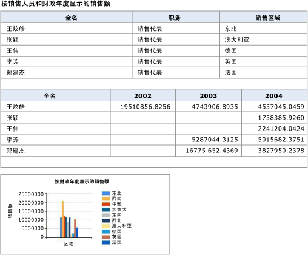
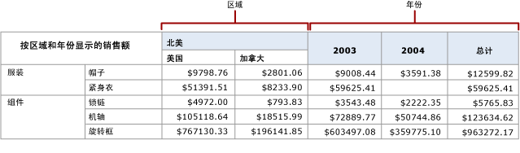
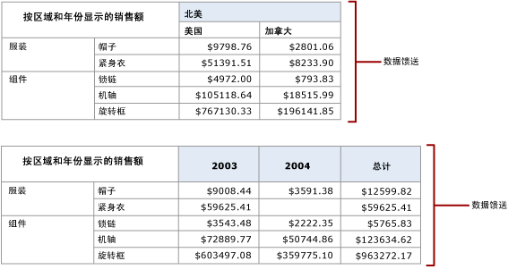
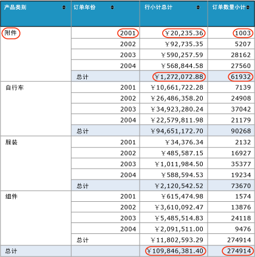

# 基于报表生成数据馈送（报表生成器和 SSRS）

  [!INCLUDE[ssRSnoversion](../../includes/ssrsnoversion-md.md)] Atom 呈现扩展插件可生成 Atom 服务文档，该文档列出分页报表中可用的数据馈送以及来自报表中的数据区域的数据馈送。 使用此扩展插件生成与 Atom 兼容的数据馈送，这些馈送是可读的，并可以与使用从报表生成的数据馈送的应用程序进行交换。 例如，你可以使用 Atom 呈现扩展插件，然后，可以使用 Power Pivot 或 Power BI 中的生成的数据源。  
  
 Atom 服务文档为报表中的每个数据区域至少列出一个数据馈送。 根据数据区域的类型以及数据区域显示的数据， [!INCLUDE[ssRSnoversion](../../includes/ssrsnoversion-md.md)] 可以自数据区域生成多个数据馈送。 例如，矩阵或图表可以提供多个数据馈送。 Atom 呈现扩展插件创建 Atom 服务文档时，将为每个数据馈送创建一个唯一标识符，在 URL 中使用该标识符可以访问数据馈送的内容。  
  
 Atom 呈现扩展插件为数据馈送生成数据的方式类似于逗号分隔值 (CSV) 呈现扩展插件将数据呈现到 CSV 文件的方式。 类似于 CSV 文件，数据馈送是报表数据的平展表示形式。 例如，表中有一个行组对某组中的销售额进行加总时，会对每个数据行重复加总，并没有单独的行仅包含总和。  
  
 可以使用 [!INCLUDE[ssRSnoversion](../../includes/ssrsnoversion-md.md)] Web 门户、Report Server 或与 [!INCLUDE[ssRSnoversion](../../includes/ssrsnoversion-md.md)]集成的 SharePoint 站点来生成 Atom 服务文档和数据馈送。  
  
 Atom 应用于一对相关标准。 Atom 服务文档符合 RFC 5023 Atom 发布协议规范，数据馈送符合 RFC 4287 Atom 联合格式协议规范。  
  
 以下各节提供有关如何使用 Atom 呈现扩展插件的附加信息：  
  
 [!INCLUDE[ssRBRDDup](../../includes/ssrbrddup-md.md)]  
  
##   作为数据馈送的报表  
 可以将生产报表作为数据馈送导出，或者可以创建主要目的是以数据馈送的形式向应用程序提供数据的报表。 将报表用作数据馈送为您在以下情况下提供了另一种向应用程序提供数据的方式：当数据不易通过客户端数据访问接口访问时，或者您更喜欢隐藏数据源的复杂性以使数据的使用更为简便时。 还可以使用 [!INCLUDE[ssRSnoversion](../../includes/ssrsnoversion-md.md)] 功能（如安全、计划和报表快照）管理用来提供数据馈送的报表，这是将报表用作数据馈送的另一个优点。  
  
 若要充分利用 Atom 呈现扩展插件，您应该理解报表是如何呈现到数据馈送中的。 如果使用现有报表，则若能预测这些报表能够生成的数据馈送将很有用；如果编写报表的目的是专门用作数据馈送，则重要的是能够包括数据并优化报表布局以充分利用数据馈送。  
  
 有关详细信息，请参阅[从报表生成数据馈送（报表生成器和 SSRS）](../../reporting-services/report-builder/generate-data-feeds-from-a-report-report-builder-and-ssrs.md)。  
  
  
##   Atom 服务文档（.atomsvc 文件）  
 Atom 服务文档指定针对一个或多个数据馈送的连接。 该连接至少是指向生成馈送的数据服务的简单 URL。  
  
 使用 Atom 呈现扩展插件呈现报表数据时，Atom 服务文档将列出可用于报表的数据馈送。 该文档为报表中的每个数据区域至少列出一个数据馈送。 表和仪表都只生成一个数据馈送；但矩阵、列表和图表可能生成多个数据馈送，具体取决于它们所显示的数据。  
  
 下图显示了使用两个表和一个图表的报表。  
  
   
  
 从此报表生成的 Atom 服务文档包括三个数据馈送：两个表各对应一个数据馈送，图表对应一个数据馈送。  
  
 矩阵数据区域可能包括多个数据馈送，这取决于该矩阵的结构。 下图显示的报表使用生成两个数据馈送的矩阵。  
  
   
  
 从此报表生成的 Atom 服务文档包括两个数据馈送：两个动态对等列（Territory 和 Year）各对应一个数据馈送。 下图显示了每个数据馈送的内容。  
  
   
  
  
##   数据馈送  
 数据馈送是一个 XML 文件，它具有一致的不随时间变化的表格格式，以及在每次运行报表时都可能不同的可变数据。 [!INCLUDE[ssRSnoversion](../../includes/ssrsnoversion-md.md)] 生成的数据馈送采用与 ADO.NET Data Services 生成的数据馈送相同的格式。  
  
 数据馈送包含两部分：标题和数据。 Atom 规范中定义了各部分中的元素。 标题包括用于数据馈送的字符编码架构之类的信息。  
  
### 标题部分  
 以下 XML 代码显示数据馈送的标题部分。  
  
 `<?xml version="1.0" encoding="utf-8" standalone="yes"?><feed xmlns:d="http://schemas.microsoft.com/ado/2007/08/dataservices" xmlns:m="http://schemas.microsoft.com/ado/2007/08/dataservices/metadata" xmlns="http://www.w3.org/2005/Atom">`  
  
 `<title type="text"></title>`  
  
 `<id>uuid:1795992c-a6f3-40ec-9243-fbfd0b1a5be3;id=166321</id>`  
  
 `<updated>2009-05-08T23:09:58Z</updated>`  
  
### 数据部分  
 数据馈送的数据部分包含一个\<**条目**> 元素中生成的 Atom 呈现扩展插件的平展行集中的每一行。  
  
 下图显示了使用组和总计的报表。  
  
   
  
 下面的 XML 演示\<**条目**> 从该报表数据源中的元素。 请注意， \<**条目**> 元素包含的总销售额和组的订单和销售订单和订单的所有组的总计。 \<**条目**> 元素包含多个报表上的所有值。  
  
 `<entry><id>uuid:1795992c-a6f3-40ec-9243-fbfd0b1a5be3;id=166322</id><title type="text"></title><updated>2009-05-08T23:09:58Z</updated><author /><content type="application/xml"><m:properties>`  
  
 `<d:ProductCategory_Value>Accessories</d:ProductCategory_Value>`  
  
 `<d:OrderYear_Value m:type="Edm.Int32">2001</d:OrderYear_Value>`  
  
 `<d:SumLineTotal_Value m:type="Edm.Decimal">20235.364608</d:SumLineTotal_Value>`  
  
 `<d:SumOrderQty_Value m:type="Edm.Int32">1003</d:SumOrderQty_Value>`  
  
 `<d:SumLineTotal_Total_2_1 m:type="Edm.Decimal">1272072.883926</d:SumLineTotal_Total_2_1>`  
  
 `<d:SumOrderQty_Total_2_1 m:type="Edm.Double">61932</d:SumOrderQty_Total_2_1>`  
  
 `<d:SumLineTotal_Total_2_2 m:type="Edm.Decimal">109846381.399888</d:SumLineTotal_Total_2_2>`  
  
 `<d:SumOrderQty_Total_2_2 m:type="Edm.Double">274914</d:SumOrderQty_Total_2_2></m:properties></content>`  
  
 `</entry>`  
  
### 使用数据馈送  
 由报表生成的所有数据馈送都包括生成数据馈送的数据区域父级范围内的报表项。 集成的 SharePoint 站点来生成 Atom 服务文档和数据馈送。 设想有一个报表包含若干表和一个图表。 报表正文中的文本框提供有关每个数据区域的说明性文本。 该报表生成的每个数据馈送中的每个条目都包括该文本框的值。 例如，如果文本为“Chart displays monthly sales averages by sales region”，则所有三个数据馈送都会在每一行中包括此文本。  
  
 如果报表布局包括分层数据关系，如嵌套数据区域，这些关系将包括在报表数据的平展行集中。  
  
 嵌套数据区域的数据行通常较宽，特别是在嵌套表和矩阵包括组和总计的情况下。 您可能会发现，将报表导出到数据馈送并且查看数据馈送以确定生成的数据就是所需数据，这会很有帮助。  
  
 当 Atom 呈现扩展插件创建 Atom 服务文档时，将为数据馈送创建一个唯一标识符，在 URL 中使用该标识符可以查看数据馈送的内容。 如上所示的示例 Atom 服务文档包括 URL `http://ServerName/ReportServer?%2fProduct+Sales+Summary&rs%3aCommand=Render&rs%3aFormat=ATOM&rc%3aDataFeed=xAx0x1`。 该 URL 标识报表 (Product Sales Summary)、Atom 呈现格式 (ATOM) 以及数据馈送的名称 (xAx0x1)。  
  
 报表项名称默认为报表项的报表定义语言 (RDL) 元素名称，这些名称经常较为直观或容易记忆。 例如，放入报表的第一个矩阵的默认名称为 Tablix 1。 数据馈送使用这些名称。  
  
 若要令数据馈送易于使用，可以使用数据区域的 DataElementName 属性来提供友好名称。 如果为 DataElementName 提供值的数据馈送子元素\< **d**> 将使用是它而不是默认的数据区域名称。 例如，如果数据区域的默认名称是 Tablix1，DataElementName 设置 SalesByTerritoryYear 则\< **d**> 在数据源使用 SalesByTerritoryYear。 如果数据区域具有两个数据馈送（类似上述矩阵报表），则数据馈送中使用的名称为 SalesByTerritoryYear _Territory 和 SalesByTerritoryYear _Year。  
  
 如果对报表显示的数据和数据馈送中的数据进行比较，则可能发现一些差异。 报表经常显示格式化的数值和时间/日期数据，但数据馈送包含非格式化的数据。  
  
 数据馈送用 .atom 文件扩展名保存。 可以使用文本或 XML 编辑器（如记事本或 XML 编辑器）来查看文件结构和内容。  
  
  
##   平展报表数据  
 Atom 呈现器将报表数据提供为 XML 格式的平展行集。 用于平展数据表的规则与用于 CSV 呈现器的规则相同，只有以下几点例外：  
  
-   范围中的项平展到详细信息级别。 不同于 CSV 呈现器，顶级文本框显示在写入数据馈送的每个条目中。  
  
-   在输出的每一行上呈现报表参数值。  
  
 分层数据和分组数据必须进行平展才能以与 Atom 兼容的格式表示。 呈现扩展插件可将报表平展为用于表示数据区域中嵌套组的树结构。 要平展报表：  
  
-   行层次结构在列层次结构之前进行平展。  
  
-   行层次结构的成员在列层次结构的成员之前呈现到数据馈送。  
  
-   列按照以下顺序排序：表体中的文本框的顺序为从左到右，从上到下，后面紧跟数据区域，后者顺序为从左到右，从上到下。  
  
-   在数据区域中，列按照以下顺序排序：角成员、行层次结构成员、列层次结构成员，然后是单元。  
  
-   对等数据区域是一些共享一个公共数据区域或动态祖先的数据区域或动态组。 对等数据通过平展后的树的分支进行标识。  
  
 有关详细信息，请参阅 [表、矩阵和列表（报表生成器和 SSRS）](../../reporting-services/report-design/tables-matrices-and-lists-report-builder-and-ssrs.md)。  
  
  
##   Atom 呈现规则  
 Atom 呈现扩展插件在呈现数据馈送时忽略以下信息：  
  
-   格式设置和布局  
  
-   页眉  
  
-   页脚  
  
-   自定义报表项  
  
-   矩形  
  
-   线条  
  
-   映像  
  
-   自动小计  
  
 对其余的报表项进行排序，先从上到下排，再从左到右排。 之后，每一项将呈现到一列中。 如果报表有嵌套数据项（如列表或表），则会在每一行中重复它的父项。  
  
 下表说明了呈现报表项时这些报表项的外观：  
  
|项|呈现行为|  
|----------|------------------------|  
|表|呈现方式为扩展该表，在只保留最起码的格式的情况下为每一行和每一列都分别创建行和列。 小计行和小计列没有列标题或行标题。 不支持钻取报表。|  
|矩阵|呈现方式为扩展该矩阵，在只保留最起码的格式的情况下为每一行和每一列都分别创建行和列。 小计行和小计列没有列标题或行标题。|  
|列表|为列表中每一明细行或实例呈现一个记录。|  
|子报表|对于内容的每个实例，都会重复它的父项。|  
|图表|为每个图表值呈现具有所有图表标签的记录。 来自系列和类别的标签采用平展的层次结构，并包含在图表值的行中。|  
|数据条|像图表一样呈现。 通常，数据条并不包括层次结构或标签。|  
|迷你图|像图表一样呈现。 通常，迷你图并不包括层次结构或标签。|  
|仪表|作为单个记录呈现，具有线性刻度的最小值和最大值、范围的起始和终止值，以及指针的值。|  
|指示器|作为单个记录呈现，具有活动状态名称、可用状态以及数据值。|  
|地图|为每个地图数据区域生成数据馈送。 如果多个地图层使用相同数据区域，数据馈送将包含所有层的数据。 该数据馈送包含一个记录，该记录包含地图层的每个地图成员的标签和值。|  
  
  
##   设备信息设置  
 您可以更改此呈现器的某些默认设置，包括要使用的编码架构。 有关详细信息，请参阅 [ATOM Device Information Settings](../../reporting-services/atom-device-information-settings.md)。  

## 后续步骤

[将导出到 CSV 文件](../../reporting-services/report-builder/exporting-to-a-csv-file-report-builder-and-ssrs.md)   
[导出报表](../../reporting-services/report-builder/export-reports-report-builder-and-ssrs.md)  

更多问题？ [尝试的 Reporting Services 论坛](http://go.microsoft.com/fwlink/?LinkId=620231)
