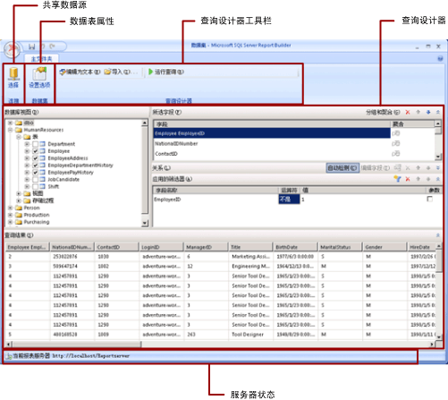

# 共享数据集设计视图（报表生成器）
  在报表中，数据集表示通过对外部数据源运行查询而返回的报表数据。 共享数据集发布在报表服务器上，可由多个报表使用。 你可以创建数据集，以便与他人共享。 在共享数据集设计窗口中，你可以选择共享数据源，指定共享数据集的属性，在查询设计器中创建查询。  
  
   
  
 有关如何处理报表中的数据的详细信息，请参阅 [报表数据集 (SSRS)](../../reporting-services/report-data/report-datasets-ssrs.md)。  
  
##   功能区  
 功能区可帮助您快速查找完成任务所需的命令。 命令通过以下逻辑组进行组织：连接、数据集和查询设计器。  
  
### 连接  
 在“连接”组中使用 **“选择”** 按钮可以选择报表中的共享数据源，或浏览到报表服务器上的共享数据源。  
  
> [!NOTE]  
>  共享数据集必须基于共享数据源。 如果你需要的数据源不可用，则需要在报表服务器上创建一个数据源。 有关详细信息，请参阅[创建、修改和删除共享数据源 (SSRS)](../../reporting-services/report-data/create-modify-and-delete-shared-data-sources-ssrs.md)。  
  
 有关详细信息，请参阅 [Data Connections, Data Sources, and Connection Strings in Report Builder](http://msdn.microsoft.com/library/7e103637-4371-43d7-821c-d269c2cc1b34)。  
  
### 数据集  
 使用 **“Set 选项”** 按钮可以设置共享数据集属性。 其中包括：  
  
-   字段。 可以向字段集合添加字段，或编辑其中的字段。  
  
-   数据选项。 可以设置影响匹配条件和排序顺序的选项（例如区分大小写和排序规则）。  
  
-   筛选器。 可以定义在从数据连接检索报表数据后限制这些数据的筛选器。  
  
-   参数。 可以添加参数或编辑参数选项。 例如，您可以为每个参数指定默认值，以便能够在报表服务器上为这一共享数据集创建缓存刷新计划。  
  
 您设置的值将成为共享数据集在报表服务器上的定义的一部分。 如果报表作者将此共享数据集包括在报表中，您指定的选项将应用于该数据集实例。  
  
 在将共享数据集添加到报表后，报表作者可以覆盖以下选项：排序规则、区分大小写、区分重音、区分假名类型、区分全半角、小计。 他们还可以创建其他数据集筛选器来限制报表中的数据。  
  
 有关详细信息，请参阅 [报表的嵌入数据集和共享数据集（报表生成器和 SSRS）](../../reporting-services/report-data/report-embedded-datasets-and-shared-datasets-report-builder-and-ssrs.md)。  
  
 有关缓存刷新计划的详细信息，请参阅[缓存共享数据集 (SSRS)](../../reporting-services/report-server/cache-shared-datasets-ssrs.md)。  
  
### 查询设计器  
 使用查询设计器工具栏可以帮助您生成用于指定要通过数据连接检索的数据的查询。 您看到的工具栏取决于与通过数据连接获得的数据源类型相关联的查询设计器。  
  
 有关详细信息，请参阅[从外部数据源中添加数据 (SSRS)](../../reporting-services/report-data/add-data-from-external-data-sources-ssrs.md) 中与数据源类型对应的主题。  
  
  
##   查询设计器图面  
 查询设计器可帮助您使用外部数据源所要求的语法来生成查询。  
  
 有些数据源类型提供了图形查询设计器，您可以使用这些设计器来浏览外部数据源中的元数据。 您还可以通过互动方式将名称从元数据窗格拖动到查询设计图面，或通过互动方式选择要使用的名称。  
  
 有些数据源类型支持基于文本的查询设计器，你可以使用此类查询设计器粘贴已在其他工具（例如 [!INCLUDE[ssManStudioFull](../../includes/ssmanstudiofull-md.md)]）中创建的查询。  
  
 每种数据源类型都对将针对外部数据源进行的查询有特定的要求。 有关详细信息，请参阅[从外部数据源中添加数据 (SSRS)](../../reporting-services/report-data/add-data-from-external-data-sources-ssrs.md) 和 [Reporting Services 支持的数据源 (SSRS)](../../reporting-services/report-data/data-sources-supported-by-reporting-services-ssrs.md) 中与数据源类型对应的主题。  
  
  
##   查看查询结果  
 在共享数据集设计视图中，您要生成一个将在处理报表时通过数据连接检索数据的查询。  
  
 运行此查询可查看通过数据连接获取的示例数据，从而验证该查询是否返回您需要的数据类型。 结果集中的列来自通过数据连接获取的数据架构的元数据。 列名成为数据集字段集合。 您在查询结果集中看到的数据值是设计时数据。 在将共享数据集另存为报表服务器上的共享数据集定义后，仅查询文本得到保存。 查询结果集中的数据不会被保存。  
  
 当报表作者将此共享数据集添加到报表中时，系统将在报表服务器上添加一个指向该数据集定义的指针。 在报表中，数据集字段集合显示在“报表数据”窗格中。 查询文本不可用。  
  
 用于运行查询的凭据与用于从报表服务器预览报表或运行报表的凭据是分开的。 有关详细信息，请参阅 [Specify Credential and Connection Information for Report Data Sources](../../reporting-services/report-data/specify-credential-and-connection-information-for-report-data-sources.md)。  
  
### 使用参数运行报表  
 如果查询包括查询变量，则系统将自动为您创建数据集参数。 随后，在您生成了数据集查询后，系统将自动创建设置为数据集参数的报表参数。  
  
 如果报表中包含参数，则只有在所有参数都具有默认值的情况下，该报表才能自动运行。 如果某个参数没有默认值，当运行报表时，必须为该参数选择一个值，然后在 **“运行”** 选项卡上单击 **“查看报表”** 。  
  
 有关详细信息，请参阅 [报表参数（报表生成器和报表设计器）](../../reporting-services/report-design/report-parameters-report-builder-and-report-designer.md)。  
  
  
##   保存共享数据集  
 若要保存生成的查询，请在 **“报表生成器”** 按钮上单击 **“保存”** 或 **“另存为”**。 导航到报表服务器上的相应文件夹，然后保存共享数据集定义。 在您将共享数据集保存到报表服务器后，其他用户才能使用此共享数据集。  
  
  
## 另请参阅  
 [报表数据集 (SSRS)](../../reporting-services/report-data/report-datasets-ssrs.md)   
 [对数据进行筛选、分组和排序（报表生成器和 SSRS）](../../reporting-services/report-design/filter-group-and-sort-data-report-builder-and-ssrs.md)   
 [报表参数（报表生成器和报表设计器）](../../reporting-services/report-design/report-parameters-report-builder-and-report-designer.md)  
  
  
