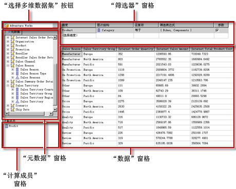

# Analysis Services MDX 查询设计器用户界面
  [!INCLUDE[ssRSnoversion](../../includes/ssrsnoversion-md.md)] 提供了图形查询设计器，可以为 [!INCLUDE[ssASnoversion](../../includes/ssasnoversion-md.md)] 数据源生成多维表达式 (MDX) 查询和数据挖掘表达式 (DMX) 查询。 该主题介绍了 MDX 查询设计器。 有关 DMX 查询设计器的详细信息，请参阅 [针对 DMX 的 Analysis Services 连接类型 (SSRS)](../../reporting-services/report-data/analysis-services-connection-type-for-dmx-ssrs.md)。  
  
 MDX 图形查询设计器有两种模式：设计模式和查询模式。 每种模式都提供一个“元数据”窗格，从该窗格中可以拖动选定的多维数据集的成员，以创建可在处理报表时检索数据的 MDX 查询。  
  
> [!IMPORTANT]  
>  用户创建和运行查询时访问数据源。 您应授予对数据源的最小权限（如只读权限）。  
  
> [!NOTE]  
>  不支持从文件导入 .mdx 查询。  
  
## 设计模式下的图形 MDX 查询设计器  
 编辑报表数据集的 MDX 查询时，图形 MDX 查询设计器将以设计模式打开。  
  
 下图列出了设计模式的窗格。  
  
   
  
 下表列出了查询模式下的窗格：  
  
|窗格|函数|  
|----------|--------------|  
|选择“多维数据集”按钮 (**...**)|显示当前选定的多维数据集。|  
|“元数据”窗格|显示在选定多维数据集中定义的度量值、关键绩效指标 (KPI) 和维度的层次列表。|  
|“计算成员”窗格|显示当前定义的可在查询中使用的计算成员。|  
|“筛选器”窗格|用于选择维度和相关的层次结构，以筛选源中的数据并限制返回报表的数据。|  
|“数据”窗格|在从“元数据”窗格向“计算成员”窗格拖动项目时，显示结果集的列标题。 如果选中 **“自动执行”** 按钮，则可自动更新结果集。 。|  
  
 可以将“元数据”窗格中的维度、度量值和 KPI 以及“计算成员”窗格中的计算成员拖至“数据”窗格。 在“筛选器”窗格中，您可以选择维度和相关的层次结构，并设置筛选器表达式以限制可用于查询的数据。 如果**自动执行**() 选择工具栏上的切换按钮时，查询设计器将运行查询每次拖放到数据窗格上的元数据对象。 你可以手动运行查询使用**运行**() 在工具栏上的按钮。  
  
 在此模式下创建 MDX 查询时，下面的附加属性将会自动包含到查询中：  
  
 **成员属性** MEMBER_CAPTION, MEMBER_UNIQUE_NAME  
  
 **单元属性** VALUE、BACK_COLOR、FORE_COLOR、FORMATTED_VALUE、FORMAT_STRING、FONT_NAME、FONT_SIZE、FONT_FLAGS  
  
 若要指定您自己的附加属性，则必须在查询模式下，手动编辑 MDX 查询。  
  
### 设计模式下的图形 MDX 查询设计器工具栏  
 查询设计器工具栏提供了可以帮助您使用图形界面来设计 MDX 查询的按钮。 下表列出了这些按钮及其功能。  
  
|按钮|Description|  
|------------|-----------------|  
|**编辑为文本**|不可用于此数据源类型。|  
|**导入**|从文件系统中的报表定义 (.rdl) 文件导入现有查询。 有关详细信息，请参阅[报表的嵌入数据集和共享数据集（报表生成器和 SSRS）](../../reporting-services/report-data/report-embedded-datasets-and-shared-datasets-report-builder-and-ssrs.md)。|  
||切换到命令类型 MDX。|  
||切换到命令类型 DMX。|  
||刷新数据源的元数据。|  
||显示 **“计算成员生成器”** 对话框。|  
||在“数据”窗格中的显示或不显示空单元格之间切换。 （这等同于在 MDX 中使用 NON EMPTY 子句）。|  
||在每次进行更改时自动运行查询并显示结果。 结果将显示在“数据”窗格中。|  
||在“数据”窗格中显示聚合。|  
||通过查询在“数据”窗格中删除选定列。|  
||显示 **“查询参数”** 对话框。 指定查询参数的值时，会自动创建具有相同名称的报表参数。 查询参数的值设置为引用该报表参数的表达式。|  
||准备查询。|  
||运行查询并在“数据”窗格中显示结果。|  
||取消查询。|  
||在设计模式和查询模式之间切换。|  
  
## 查询模式下的图形 MDX 查询设计器  
 若要将图形查询设计器更改为 **“查询”** 模式，请单击工具栏上的 **“设计模式”** 按钮。  
  
 下图列出了查询模式的窗格。  
  
   
  
 下表列出了查询模式下的窗格：  
  
|窗格|函数|  
|----------|--------------|  
|选择“多维数据集”按钮 (**...**)|显示当前选定的多维数据集。|  
|元数据/函数/模板窗格|显示在选定多维数据集中定义的度量值、KPI 和维度的层次列表。|  
|“查询”窗格|显示查询文本。|  
|“结果”窗格|显示运行查询的结果。|  
  
 “元数据”窗格会显示 **“元数据”**选项卡、 **“函数”**选项卡和 **“模板”**选项卡。 通过 **“元数据”** 选项卡，可将维度、层次结构、KPI 和度量值拖到“MDX 查询”窗格中。 通过 **“函数”** 选项卡，可将函数拖到“MDX 查询”窗格中。 通过 **“模板”** 选项卡，可将 MDX 模板添加到“MDX 查询”窗格中。 执行查询时，“结果”窗格将显示 MDX 查询的结果。  
  
 您可以扩展设计模式下生成的默认 MDX 查询，以包含附加成员属性和单元属性。 运行查询时，这些值不会显示在结果集中。 但会传递回 [!INCLUDE[ssRSnoversion](../../includes/ssrsnoversion-md.md)] ，您可以在报表中使用这些值。 有关详细信息，请参阅 [Analysis Services 数据库的扩展字段属性 (SSRS)](../../reporting-services/report-data/extended-field-properties-for-an-analysis-services-database-ssrs.md)。  
  
### 查询模式下的图形查询设计器工具栏  
 查询设计器工具栏提供了可以帮助您使用图形界面来设计 MDX 查询的按钮。  
  
 工具栏按钮在设计模式和查询模式下是相同的，但是下列按钮在查询模式下不可用：  
  
-   **编辑为文本**  
  
-   **添加计算成员** ()  
  
-   **显示空单元格**()  
  
-   **自动执行**()  
  
-   **显示聚合**()  
  
## 另请参阅  
 [在 Analysis Services 的 MDX 查询设计器中定义参数（报表生成器和 SSRS）](../../reporting-services/report-data/define-parameters-in-the-mdx-query-designer-for-analysis-services.md)   
 [创建共享数据集或嵌入数据集（报表生成器和 SSRS）](../../reporting-services/report-data/create-a-shared-dataset-or-embedded-dataset-report-builder-and-ssrs.md)   
 [针对 DMX 的 Analysis Services 连接类型 (SSRS)](../../reporting-services/report-data/analysis-services-connection-type-for-dmx-ssrs.md)   
 [RSReportDesigner 配置文件](../../reporting-services/report-server/rsreportdesigner-configuration-file.md)   
 [针对 MDX 的 Analysis Services 连接类型 (SSRS)](../../reporting-services/report-data/analysis-services-connection-type-for-mdx-ssrs.md)  
  
  
