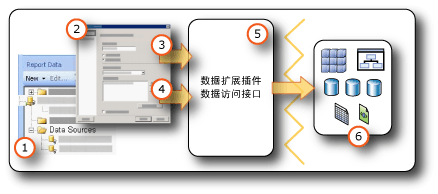

# <a name="data-connections-data-sources-and-connection-strings-report-builder-and-ssrs"></a>数据连接、数据源和连接字符串（报表生成器和 SSRS）

[!INCLUDE [ssrs-appliesto](../../includes/ssrs-appliesto.md)] [!INCLUDE [ssrs-appliesto-2016-and-later](../../includes/ssrs-appliesto-2016-and-later.md)] [!INCLUDE[ssrs-appliesto-pbirsi](../../includes/ssrs-appliesto-pbirs.md)] [!INCLUDE[ssrs-appliesto-sharepoint-2013-2016i](../../includes/ssrs-appliesto-sharepoint-2013-2016.md)]

[!INCLUDE [ssrs-previous-versions](../../includes/ssrs-previous-versions.md)]

  若要在 [!INCLUDE[ssRBnoversion](../../includes/ssrbnoversion.md)] 和  [!INCLUDE[ssRSnoversion](../../includes/ssrsnoversion-md.md)] 已分页的报表中包含数据，必须首先创建“数据源”  和“数据集” 。 本主题解释数据源的类型、如何创建数据源以及与数据源凭据相关的重要信息。 数据源包含数据源类型、连接信息以及要使用的凭据的类型。 有两种类型的数据源：嵌入数据源和共享数据源。 嵌入数据源在报表中定义并只由该报表使用。 共享数据源独立于报表定义并可由多个报表使用。 有关详细信息，请参阅[嵌入数据集和共享数据集（报表生成器和 SSRS）](../../reporting-services/report-data/embedded-and-shared-datasets-report-builder-and-ssrs.md)。  

## <a name="data-in-includessrbnoversionincludesssrbnoversionmd"></a>数据位于 [!INCLUDE[ssRBnoversion](../../includes/ssrbnoversion.md)]  
   
  
1.  **“报表数据”窗格中的数据源** 在创建嵌入数据源或添加共享数据源后，会在“报表数据”窗格中显示一个数据源。  
  
2.  **“连接”对话框** 使用“连接”对话框可以生成连接字符串或粘贴连接字符串。  
  
3.  **数据连接信息** 将连接字符串传递给数据扩展插件。  
  
4.  **凭据** 凭据与连接字符串是分开管理的。  
  
5.  **数据扩展插件/数据访问接口** 对数据的连接可通过多个数据访问层。  
  
6.  **外部数据源** 检索来自关系数据库、多维数据库、SharePoint 列表、Web 服务或报表模型的数据。  

##  <a name="bkmk_data_sources"></a> 嵌入数据源和共享数据源  
 如果您的数据源使用频率较高，就可以采用共享数据源。 建议尽量使用共享数据源。 使用共享数据源可便于对报表和报表访问进行管理，并有助于提高报表和报表所访问数据源的访问安全性。 如果需要共享数据源，可以请求系统管理员为您创建一个。  
  
 嵌入数据源是保存在报表定义中的数据连接。 只有嵌入数据源连接信息所嵌入的报表才能使用这些信息。 若要定义并管理嵌入数据源，请使用 **“数据源属性”** 对话框。  
  
 嵌入数据源和共享数据源的区别在于创建、存储和管理它们的方式不同。  
  
-   在报表设计器中，将嵌入数据源或共享数据源作为 [!INCLUDE[ssBIDevStudioFull](../../includes/ssbidevstudiofull-md.md)] 项目的一部分创建。 您可以控制是在本地使用它们以便进行预览，还是将其作为项目的一部分部署到报表服务器或 SharePoint 站点。 您可以使用已安装在您的计算机上和安装在报表服务器或 SharePoint 站点（在其中部署您的报表）上的自定义数据扩展插件。  
  
     系统管理员可以安装和配置其他数据处理扩展插件和 .NET Framework 数据访问接口。 有关详细信息，请参阅[数据处理扩展插件和 .NET Framework 数据提供程序 (SSRS)](../../reporting-services/report-data/data-processing-extensions-and-net-framework-data-providers-ssrs.md)。  
  
     开发人员可以使用 <xref:Microsoft.ReportingServices.DataProcessing> API 创建数据处理扩展插件以支持其他类型的数据源。  
  
-   在 [!INCLUDE[ssRBnoversion](../../includes/ssrbnoversion.md)]中，浏览到某一报表服务器或 SharePoint 站点并选择共享数据源，或者在报表中创建嵌入数据源。 不能在 [!INCLUDE[ssRBnoversion](../../includes/ssrbnoversion.md)] 中创建共享数据源。 不能在 [!INCLUDE[ssRBnoversion](../../includes/ssrbnoversion.md)] 中使用自定义数据扩展插件。  
  
 下表总结了嵌入数据源和共享数据源之间的差异。  
  
|描述|嵌入<br /><br /> 数据源|共享<br /><br /> 数据源|  
|-----------------|------------------------------|----------------------------|  
|数据连接嵌入在报表定义中。|||  
|指向报表服务器上的数据连接的指针嵌入在报表定义中。|||  
|在报表服务器上管理|||  
|对于共享数据集，要求这么做|||  
|对于组件，要求这么做|||  
  
##  <a name="bkmk_DataConnections"></a> 内置数据扩展插件  
 [!INCLUDE[ssRSnoversion](../../includes/ssrsnoversion-md.md)] 中的内置数据扩展插件包含以下类型的数据连接：  
  
-   Microsoft SQL Server 和 Microsoft Azure SQL 数据库
  
-   Microsoft SQL Server Analysis Services  
  
-   Microsoft SharePoint 列表  
  
-   [!INCLUDE[ssSDSFull](../../includes/sssdsfull-md.md)]  
  
-   Microsoft SQL Server Parallel Data Warehouse  
  
-   OLE DB  
  
-   Oracle  
  
-   SAP NetWeaver BI  
  
-   Hyperion Essbase  
  
-   Teradata  
  
-   XML  
  
-   ODBC  
  
-   用于 Power View 的 Microsoft BI 语义模型：在配置用于 [!INCLUDE[ssGemini](../../includes/ssgemini-md.md)] 库和 [!INCLUDE[ssCrescent](../../includes/sscrescent-md.md)]的 SharePoint 站点上，此数据源类型可用。 此数据源类型仅可用于 [!INCLUDE[ssCrescent](../../includes/sscrescent-md.md)] 演示文稿。 有关详细信息，请参阅 [建立用于 Power View 的完美 BI 语义表格模型](http://technet.microsoft.com/video/building-the-perfect-bi-semantic-tabular-models-for-power-view.aspx)。  
  
 有关 [!INCLUDE[ssRSnoversion](../../includes/ssrsnoversion-md.md)] 支持的数据源和版本的完整列表，请参阅 [Reporting Services 支持的数据源 (SSRS)](../../reporting-services/report-data/data-sources-supported-by-reporting-services-ssrs.md)。  
  
##  <a name="bkmk_connection_examples"></a> 常用连接字符串示例  
 连接字符串是数据访问接口的连接属性的文本表示形式。 下表列出了各种数据连接类型的连接字符串示例。  
 
 > [!NOTE]  
>  访问[Connectionstrings.com](http://www.connectionstrings.com/) 是可获取连接字符串示例的另一种方法。 
  
|**Data source**|**示例**|**Description**|  
|---------------------|-----------------|---------------------|  
|本地服务器上的 SQL Server 数据库|`data source="(local)";initial catalog=AdventureWorks`|将数据源类型设置为 **Microsoft SQL Server**。 有关详细信息，请参阅 [SQL Server 连接类型 (SSRS)](../../reporting-services/report-data/sql-server-connection-type-ssrs.md)。|  
|SQL Server 实例<br /><br /> “数据库”|`Data Source=localhost\MSSQL13.<InstanceName>; Initial Catalog=AdventureWorks`|将数据源类型设置为 **Microsoft SQL Server**。|  
|SQL Server Express 数据库|`Data Source=localhost\MSSQL13.SQLEXPRESS; Initial Catalog=AdventureWorks`|将数据源类型设置为 **Microsoft SQL Server**。|  
|Azure SQL Database|`Data Source=<host>;Initial Catalog=AdventureWorks; Encrypt=True`|将数据源类型设置为“Microsoft Azure SQL 数据库”。 有关详细信息，请参阅 [SQL Azure 连接类型 (SSRS)](../../reporting-services/report-data/sql-azure-connection-type-ssrs.md)。|  
|SQL Server 并行数据仓库|`HOST=<IP address>;database= AdventureWorks; port=<port>`|将数据源类型设置为 **Microsoft SQL Server Parallel Data Warehouse**。 有关详细信息，请参阅 [SQL Server 并行数据仓库连接类型 (SSRS)](../../reporting-services/report-data/sql-server-parallel-data-warehouse-connection-type-ssrs.md)。|  
|本地服务器上的 Analysis Services 数据库|`data source=localhost;initial catalog=Adventure Works DW`|将数据源类型设置为 **Microsoft SQL Server Analysis Services**。 有关详细信息，请参阅[针对 MDX 的 Analysis Services 连接类型 (SSRS)](../../reporting-services/report-data/analysis-services-connection-type-for-mdx-ssrs.md) 或[针对 DMX 的 Analysis Services 连接类型 (SSRS)](../../reporting-services/report-data/analysis-services-connection-type-for-dmx-ssrs.md)。|  
|具有 Sales 透视的 Analysis Services 表格模型数据库|`Data source=<servername>;initial catalog= Adventure Works DW;cube='Sales’`|将数据源类型设置为 **Microsoft SQL Server Analysis Services**。 在 cube= 设置中指定透视名称。 有关详细信息，请参阅 [透视表（SSAS 表格）](../../analysis-services/tabular-models/perspectives-ssas-tabular.md)。|  
|在本机模式下配置的报表服务器上的报表模型数据源|`Server=http://myreportservername/reportserver; datasource=/models/Adventure Works`|指定报表服务器或文档库 URL 以及报表服务器文件夹或文档库文件夹命名空间中已发布的模型的路径。 有关详细信息，请参阅[报表模型连接 (SSRS)](../../reporting-services/report-data/report-model-connection-ssrs.md)。|  
|在 SharePoint 集成模式下配置的报表服务器上的报表模型数据源|`Server=http://server; datasource=http://server/site/documents/models/Adventure Works.smdl`|指定报表服务器或文档库 URL 以及报表服务器文件夹或文档库文件夹命名空间中已发布的模型的路径。|  
|[!INCLUDE[ssNoVersion](../../includes/ssnoversion-md.md)] 2000 [!INCLUDE[ssASnoversion](../../includes/ssasnoversion-md.md)] 服务器|`provider=MSOLAP.2;data source=<remote server name>;initial catalog=FoodMart 2000`|将数据源类型设置为 **OLE DB Provider for OLAP Services 8.0**。<br /><br /> 如果将 [!INCLUDE[ssNoVersion](../../includes/ssnoversion-md.md)] ConnectTo [!INCLUDE[ssASnoversion](../../includes/ssasnoversion-md.md)] 属性设置为 **8.0** ，则可以快速连接到 **2000**数据源。 若要设置此属性，请使用 **“连接属性”** 对话框中的 **“高级属性”** 选项卡。|  
|Oracle 服务器|`data source=myserver`|将数据源类型设置为 **Oracle**。 此外，还必须在报表设计器计算机上和报表服务器上安装 Oracle 客户端工具。 有关详细信息，请参阅 [Oracle 连接类型 (SSRS)](../../reporting-services/report-data/oracle-connection-type-ssrs.md)。|  
|SAP NetWeaver BI 数据源|`DataSource=http://mySAPNetWeaverBIServer:8000/sap/bw/xml/soap/xmla`|将数据源类型设置为 **SAP NetWeaver BI**。 有关详细信息，请参阅 [SAP NetWeaver BI 连接类型 (SSRS)](../../reporting-services/report-data/sap-netweaver-bi-connection-type-ssrs.md)。|  
|Hyperion Essbase 数据源|`Data Source=http://localhost:13080/aps/XMLA; Initial Catalog=Sample`|将数据源类型设置为 **Hyperion Essbase**。 有关详细信息，请参阅 [Hyperion Essbase 连接类型 (SSRS)](../../reporting-services/report-data/hyperion-essbase-connection-type-ssrs.md)。|  
|Teradata 数据源|`data source=`\<NNN>.\<NNN>.\<NNN>.\<NNN>`;`|将数据源类型设置为 **Teradata**。 连接字符串是包含四个字段的 Internet 协议 (IP) 地址，其中每个字段可以包含一至三位数。 有关详细信息，请参阅 [Teradata 连接类型 (SSRS)](../../reporting-services/report-data/teradata-connection-type-ssrs.md)。|  
|Teradata 数据源|`Database=` *\<database name>* `; data source=` *\<NN*N *>.\<NNN>.\<NNN>.\<N*NN*>*`;Use X Views=False;Restrict to Default Database=True`|与前一示例类似，将数据源类型设置为 **Teradata**。 请仅使用在 Database 标记中指定的默认数据库，不要自动发现数据关系。|  
|XML 数据源、Web 服务|`data source=http://adventure-works.com/results.aspx`|将数据源类型设置为 **XML**。 连接字符串是支持 Web 服务定义语言 (WSDL) 的 Web 服务的 URL。 有关详细信息，请参阅 [XML 连接类型 (SSRS)](../../reporting-services/report-data/xml-connection-type-ssrs.md)。|  
|XML 数据源、XML 文档|`http://localhost/XML/Customers.xml`|将数据源类型设置为 **XML**。 其连接字符串是一个指向 XML 文档的 URL。|  
|XML 数据源、嵌入的 XML 文档|*Empty*|将数据源类型设置为 **XML**。 XML 数据嵌入在报表定义中。|  
|SharePoint 列表|`data source=http://MySharePointWeb/MySharePointSite/`|将数据源类型设置为 **SharePoint List**。|  
  
 如果无法使用 **localhost**连接到报表服务器，请检查是否已启用网络协议 TCP/IP 协议。 有关详细信息，请参阅 [Configure Client Protocols](../../database-engine/configure-windows/configure-client-protocols.md)。  
  
 有关连接到这些数据源类型所需的配置详细信息，请参阅[从外部数据源中添加数据 (SSRS)](../../reporting-services/report-data/add-data-from-external-data-sources-ssrs.md) 或 [Reporting Services 支持的数据源 (SSRS)](../../reporting-services/report-data/data-sources-supported-by-reporting-services-ssrs.md) 下的特定数据连接主题。  
  
##  <a name="bkmk_special_password_characters"></a> 密码中的特殊字符  
 如果将 ODBC 或 SQL 数据源配置为提示输入密码或在连接字符串中包含密码，并且用户输入了具有标点符号等特殊字符的密码，则有些基础数据源驱动程序无法验证特殊字符。 处理报表时，可能会出现“密码无效”这一消息来指示此问题。 如果不能更改密码，则可以使用数据库管理员角色将相应的凭据作为系统 ODBC 数据源名称 (DSN) 的一部分存储在服务器上。 有关详细信息，请参阅 [!INCLUDE[dnprdnshort](../../includes/dnprdnshort-md.md)] SDK 文档中的“OdbcConnection.ConnectionString”。  
  
##  <a name="bkmk_Expressions_in_connection_strings"></a> 基于表达式的连接字符串  
 基于表达式的连接字符串是在运行时计算的。 例如，您可以将数据源指定为参数，在连接字符串中包含相应的参数引用，并允许用户选择报表的数据源。 例如，假设一个跨国公司在多个国家/地区都配置了数据服务器。 使用基于表达式的连接字符串，要运行销售报表的用户就可以在运行报表之前选择用于特定国家/地区的数据源。  
  
 下面的示例说明了 [!INCLUDE[ssNoVersion](../../includes/ssnoversion-md.md)] 连接字符串中数据源表达式的用法。 该示例假设您已经创建了一个名为 `ServerName`的报表参数：  
  
```  
="data source=" & Parameters!ServerName.Value & ";initial catalog=AdventureWorks"  
```  
  
 数据源表达式在运行时或预览报表时进行处理。 此类表达式必须用 [!INCLUDE[vbprvb](../../includes/vbprvb-md.md)]编写。 定义数据源表达式时请遵循以下原则：  
  
-   使用静态连接字符串设计报表。 静态连接字符串指的是不通过表达式设置的连接字符串（例如，按照步骤创建报表特定数据源或共享数据源时，定义的就是静态连接字符串）。 使用静态连接字符串，可以在报表设计器中连接到数据源，以便获取创建报表所需的查询结果。  
  
-   定义数据源连接时，请不要使用共享数据源。 不能在共享数据源中使用数据源表达式。 您必须为报表定义嵌入数据源。  
  
-   在连接字符串之外单独指定凭据。 您可以使用存储的凭据、提示凭据或集成安全性。  
  
-   添加报表参数以指定数据源。 对于参数值，可以提供可用值的静态列表（这种情况下，可用值应该是报表可以使用的数据源），或定义在运行时检索数据源列表的查询。  
  
-   请确保列表中的数据源共用同一个数据库架构。 所有报表设计都以架构信息为基础。 如果用于定义报表的架构和报表运行时使用的实际架构不相符，报表将可能无法运行。  
  
-   在发布报表之前，使用表达式替换静态连接字符串。 使用表达式替换静态连接字符串之前，必须保证已经完成了报表的设计。 一旦使用了表达式，就不能在报表设计器中执行查询。 此外，“报表数据”窗格中的字段列表以及“参数”列表将不会自动更新。  

## <a name="next-steps"></a>后续步骤

[创建、修改和删除共享数据源](../../reporting-services/report-data/create-modify-and-delete-shared-data-sources-ssrs.md)   
[创建和修改嵌入的数据源](../../reporting-services/report-data/create-and-modify-embedded-data-sources.md)   
[设置部署属性](../../reporting-services/tools/set-deployment-properties-reporting-services.md)   
[为报表数据源指定凭据和连接信息](../../reporting-services/report-data/specify-credential-and-connection-information-for-report-data-sources.md)  

更多疑问？ [请访问 Reporting Services 论坛](http://go.microsoft.com/fwlink/?LinkId=620231)
