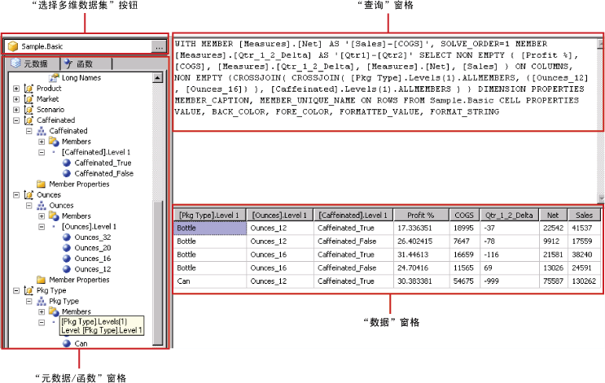

# Hyperion Essbase 查询设计器用户界面
  [!INCLUDE[ssRSnoversion](../../includes/ssrsnoversion-md.md)] 提供了一个图形查询设计器，用于为 [!INCLUDE[extEssbase](../../includes/extessbase-md.md)] 数据源生成多维表达式 (MDX) 查询。 MDX 图形查询设计器有两种模式：设计模式和查询模式。 每种模式都提供一个“元数据”窗格，从该窗格中可以拖动在数据源中定义的多维数据集的成员，以生成可在处理报表时检索数据的 MDX 查询。  
  
> [!IMPORTANT]  
>  用户创建和运行查询时访问数据源。 您应授予对数据源的最小权限（如只读权限）。  
  
 有关使用 [!INCLUDE[extEssbase](../../includes/extessbase-md.md)] 多维数据源的详细信息，请参阅 [Hyperion Essbase 连接类型 (SSRS)](../../reporting-services/report-data/hyperion-essbase-connection-type-ssrs.md)。  
  
 本节介绍每种模式的图形查询设计器中的工具栏按钮和查询设计器窗格。  
  
## 设计模式下的图形查询设计器  
 为使用 [!INCLUDE[extEssbase](../../includes/extessbase-md.md)] 数据源的数据集编辑 MDX 查询时，图形查询设计器将在设计模式下打开。  
  
 下图列出了设计模式的窗格。  
  
   
  
 下表列出了设计模式下的窗格。  
  
|窗格|函数|  
|----------|--------------|  
|“选择多维数据集”按钮|显示当前选定的多维数据集。|  
|“元数据”窗格|显示多维数据集的层次结构列表。|  
|“计算成员”窗格|显示当前定义的可在查询中使用的计算成员。|  
|“筛选器”窗格|显示要在查询中应用的筛选器。|  
|“数据”窗格|显示运行查询的结果。|  
  
 可以将“元数据”窗格中的维度和度量值以及“计算成员”窗格中的计算成员拖到“数据”窗格中。 如果工具栏中的 **“自动执行”** 切换按钮为“开”，则每次将对象拖到“数据”窗格时，查询设计器都将运行查询。 如果 **“自动执行”** 为“关”，则对“数据”窗格进行更改时，查询设计器将不运行查询。 使用工具栏上的 **“运行”** 按钮可以手动运行查询。  
  
 在“筛选器”窗格中，可以选择维度值来限制从数据源检索的数据。 在设计模式下的筛选器中定义的值显示在查询模式下的 MDX Where 子句中。  
  
### 设计模式下的图形查询设计器工具栏  
 查询设计器工具栏提供了可以帮助您使用图形界面来设计 MDX 查询的按钮。 下表显示这些按钮并介绍了它们的功能。  
  
|按钮|Description|  
|------------|-----------------|  
|**编辑为文本**|在基于文本的查询设计器和图形查询设计器之间切换。 不可用于此数据源类型。|  
|**导入**|从文件系统中的报表定义 (.rdl) 文件导入现有查询。 有关详细信息，请参阅[报表的嵌入数据集和共享数据集（报表生成器和 SSRS）](../../reporting-services/report-data/report-embedded-datasets-and-shared-datasets-report-builder-and-ssrs.md)。|  
||刷新数据源的元数据。|  
||显示 **“计算成员生成器”** 对话框。 使用此按钮可以创建或编辑计算成员表达式，其中包括设置 **“求解次序”** 属性。|  
||在“数据”窗格中的显示或不显示空单元格之间切换。 （这等同于在 MDX 中使用 NON EMPTY 子句）。|  
||自动运行查询并在每次更改（如在“数据”窗格中删除一列）之后显示结果。 结果将显示在“数据”窗格中。|  
||从查询中删除选定项。 使用此按钮可以删除“筛选器”窗格中的选定行。|  
||运行查询并在“数据”窗格中显示结果。|  
||取消查询。|  
||在设计模式和查询模式之间切换。|  
  
## 查询模式下的图形查询设计器  
 若要将图形查询设计器更改为查询模式，请单击工具栏上的 **“设计模式”** 切换按钮。 下图列出了查询模式下查询设计器的各个部分。  
  
   
  
 下表介绍了每个窗格的功能。  
  
|窗格|函数|  
|----------|--------------|  
|“选择多维数据集”按钮|显示当前选定的多维数据集。|  
|“元数据/函数”窗格|显示一个选项卡式窗口，其中列出了可用于创建查询文本的元数据或函数列表。|  
|“查询”窗格|显示当前的查询文本。|  
|“结果”窗格|显示查询的结果。|  
  
 通过“元数据”窗格，可以将度量值和维度从 **“元数据”** 选项卡拖到“MDX 查询”窗格。 还可以将函数从 **“函数”** 选项卡拖到“MDX 查询”窗格。 当执行查询时，“结果”窗格将显示当前 MDX 查询的结果。  
  
### 查询模式下的图形查询设计器工具栏  
 查询设计器工具栏提供了可以帮助您使用图形界面来设计 MDX 查询的按钮。 工具栏按钮在设计模式和查询模式下是相同的，但是下列按钮在查询模式下不可用：  
  
-   **编辑为文本**  
  
-   **添加计算成员** ()  
  
-   **显示空单元** ()  
  
-   **自动执行** ()  
  
## 另请参阅  
 [创建共享数据集或嵌入数据集（报表生成器和 SSRS）](../../reporting-services/report-data/create-a-shared-dataset-or-embedded-dataset-report-builder-and-ssrs.md)   
 [RSReportDesigner 配置文件](../../reporting-services/report-server/rsreportdesigner-configuration-file.md)  
  
  