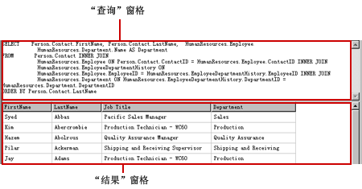
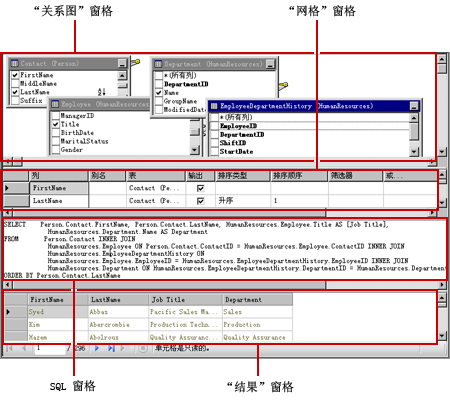
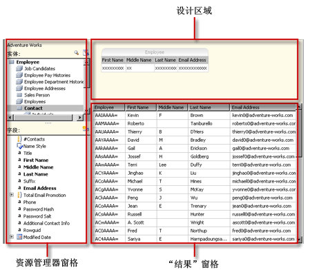
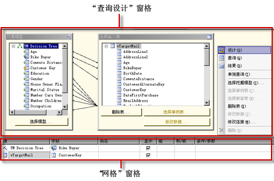
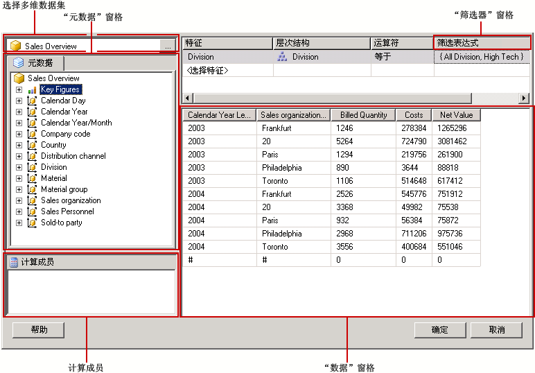

# 查询设计工具 (SSRS)
  [!INCLUDE[ssRSnoversion](../../includes/ssrsnoversion-md.md)] 提供了各种查询设计工具，您可以使用这些工具在报表设计器中创建数据集查询。 某些查询设计器还提供了其他模式，方便你选择是在可视模式下工作，还是直接在查询语言中工作。 本主题将介绍每种工具及其支持的数据源类型。 本主题将介绍下列工具：  
  
-   [基于文本的查询设计器](#Textbased)  
  
-   [图形查询设计器](#Graphical)  
  
-   [报表模型查询设计器](#Model)  
  
-   [MDX 查询设计器](#MDX)  
  
-   [DMX 查询设计器](#DMX)  
  
-   [SapNetWeaver BI 查询设计器](#SAPBW)  
  
-   [Hyperion Essbase 查询设计器](#Hyperion)  
  
 使用报表服务器项目模板或报表服务器向导项目模板时，所有查询设计工具都在 [!INCLUDE[ssBIDevStudioFull](../../includes/ssbidevstudiofull-md.md)] 的数据设计环境中运行。 有关使用查询设计器的详细信息，请参阅 [Reporting Services Query Designers](http://msdn.microsoft.com/library/07efd3f1-804f-45f7-b62a-3e727a3d9835)。  
  
 要处理的数据源类型确定了特定查询设计器的可用性。  
  
 在您的报表中可用的数据源类型由在您的客户端或报表服务器上安装的 [!INCLUDE[ssRSnoversion](../../includes/ssrsnoversion-md.md)] 数据扩展插件决定。 有关详细信息，请参阅 [RSReportDesigner 配置文件](../../reporting-services/report-server/rsreportdesigner-configuration-file.md) 和 [RsReportServer.config 配置文件](../../reporting-services/report-server/rsreportserver-config-configuration-file.md)。  
  
 数据处理扩展插件及其关联的查询设计器在对数据源的支持上在以下方式上可能会不同：  
  
-   **查询设计器类型。** 例如， [!INCLUDE[ssNoVersion](../../includes/ssnoversion-md.md)] 数据源同时支持图形查询设计器和基于文本的查询设计器。  
  
-   **查询语言变化。** 例如，像 [!INCLUDE[tsql](../../includes/tsql-md.md)] 这样的查询语言在语法上可能有所不同，具体情况取决于数据源类型。 [!INCLUDE[msCoName](../../includes/msconame-md.md)] [!INCLUDE[tsql](../../includes/tsql-md.md)] 语言与 Oracle SQL 语言在查询命令的语法上有不同之处。  
  
-   **对数据库对象名的架构部分的支持。** 当数据源使用架构作为数据库对象标识符的一部分时，对于不使用默认架构的任何名称而言，必须将架构名作为查询的一部分提供。 例如， `SELECT FirstName, LastName FROM [Person].[Person]`。  
  
-   **对查询参数的支持。** 数据访问接口在为参数提供支持方面存在差异。 某些数据访问接口支持命名参数；例如， `SELECT Col1, Col2 FROM Table WHERE <parameter identifier><parameter name> = <value>`。 某些数据访问接口支持未命名参数；例如， `SELECT Col1, Col2 FROM Table WHERE <column name> = ?`。 参数标识符可能因数据提供程序不同而不同；例如， [!INCLUDE[ssNoVersion](../../includes/ssnoversion-md.md)] 使用“at”(@) 符号，而 Oracle 则使用冒号 (:)。 某些数据访问接口不支持参数。  
  
-   **能否导入查询。** 例如，对于 [!INCLUDE[ssNoVersion](../../includes/ssnoversion-md.md)] 数据源，可从报表定义文件 (.rdl) 或 .sql 文件中导入现有查询。  
  
##   基于文本的查询设计器  
 基于文本的查询设计器是大多数支持的关系数据源的默认查询生成工具，这些数据源包括 [!INCLUDE[msCoName](../../includes/msconame-md.md)] [!INCLUDE[ssNoVersion](../../includes/ssnoversion-md.md)]、Oracle、Teradata、OLE DB、XML 和 ODBC。 与图形查询设计器相比，此查询设计工具无法在查询设计过程中验证查询语法。 下图显示了基于文本的查询设计器。  
  
   
  
 建议使用基于文本的查询设计器创建复杂查询、使用存储过程、查询 XML 数据以及编写动态查询。 根据数据源的不同，可以通过切换工具栏上的“编辑为文本”按钮而在图形查询设计器和基于文本的查询设计器之间进行切换。 有关详细信息，请参阅[基于文本的查询设计器用户界面](http://msdn.microsoft.com/library/44b7c664-03aa-494e-a484-052b318e810c)。  
  
##   图形查询设计器  
 图形查询设计器用于创建或修改针对关系数据库运行的 [!INCLUDE[tsql](../../includes/tsql-md.md)] 查询。 此查询设计工具用于多种 [!INCLUDE[msCoName](../../includes/msconame-md.md)] 产品和其他 [!INCLUDE[ssNoVersion](../../includes/ssnoversion-md.md)] 组件中。 此工具支持 Text、StoredProcedure 和 TableDirect 模式，具体取决于数据源类型。 下图显示了图形查询设计器。  
  
   
  
 可以通过切换工具栏上的“编辑为文本”按钮而在图形查询设计器和基于文本的查询设计器之间进行切换。 有关详细信息，请参阅 [Graphical Query Designer User Interface](../../reporting-services/report-data/graphical-query-designer-user-interface.md)。  
  
##   报表模型查询设计器  
 报表模型查询设计器用于创建或修改针对已发布到报表服务器的 SMDL 报表模型运行的查询。 针对模型运行的报表支持点击链接型数据浏览。 查询在运行时确定数据浏览路径。 下图显示了报表模型查询设计器。  
  
   
  
 若要使用报表模型查询设计器，必须定义指向已发布模型的数据源。 定义数据源的数据集时，可以在报表模型查询设计器中打开数据集查询。 报表模型查询设计器可在图形模式或基于文本的模式下使用。 可以通过切换工具栏上的“编辑为文本”按钮而在图形查询设计器和基于文本的查询设计器之间进行切换。 有关详细信息，请参阅 [Report Model Query Designer User Interface](../../reporting-services/report-data/report-model-query-designer-user-interface.md)。  
  
##   MDX 查询设计器  
 多维表达式 (MDX) 查询设计器用于创建或修改针对具有多维数据集的 [!INCLUDE[ssASnoversion](../../includes/ssasnoversion-md.md)] 数据源运行的查询。 下图显示了定义查询和筛选器后的 MDX 查询设计器。  
  
   
  
 若要使用 MDX 查询设计器，必须定义包含可用 Analysis Services 多维数据集的数据源，该多维数据集应是有效的并已经过处理。 为数据源定义数据集时，可以在 MDX 查询设计器中打开查询。 如有必要，请使用工具栏上的 MDX 和 DMX 按钮在 MDX 和 DMX 模式之间进行切换。 有关详细信息，请参阅 [Analysis Services MDX Query Designer User Interface](../../reporting-services/report-data/analysis-services-mdx-query-designer-user-interface.md)。  
  
##   DMX 查询设计器  
 数据挖掘预测表达式 (DMX) 查询设计器用于创建或修改针对具有挖掘模型的 [!INCLUDE[ssASnoversion](../../includes/ssasnoversion-md.md)] 数据源运行的查询。 下图显示了选择模型和输入表后的 DMX 查询设计器。  
  
   
  
 若要使用 DMX 查询设计器，必须定义包含有效数据挖掘模型的可用数据源。 为数据源定义数据集时，可以在 DMX 查询设计器中打开查询。 如有必要，请使用工具栏上的 MDX 和 DMX 按钮在 MDX 和 DMX 模式之间进行切换。 选择模型后，可创建向报表提供数据的数据挖掘预测查询。 有关详细信息，请参阅 [Analysis Services DMX Query Designer User Interface](../../reporting-services/report-data/analysis-services-dmx-query-designer-user-interface.md)。  
  
##   Sap NetWeaver BI 查询设计器  
 [!INCLUDE[SAP_DPE_BW_1](../../includes/sap-dpe-bw-1-md.md)] 查询设计器用于从 [!INCLUDE[SAP_DPE_BW_1](../../includes/sap-dpe-bw-1-md.md)] 数据库中检索数据。 若要使用此查询设计器，必须定义至少包含一个 InfoCube、MultiProvider 或启用了 Web 的查询的 [!INCLUDE[SAP_DPE_BW_1](../../includes/sap-dpe-bw-1-md.md)] 数据源。 下图显示了 [!INCLUDE[SAP_DPE_BW_1](../../includes/sap-dpe-bw-1-md.md)] 查询设计器。 有关详细信息，请参阅 [SAP NetWeaver BI Query Designer User Interface](../../reporting-services/report-data/sap-netweaver-bi-query-designer-user-interface.md)。  
  
   
  
##   Hyperion Essbase 查询设计器  
 [!INCLUDE[extEssbase](../../includes/extessbase-md.md)] 查询设计器用于在 [!INCLUDE[extEssbase](../../includes/extessbase-md.md)] 数据库和应用程序中检索数据。 下图显示了 [!INCLUDE[extEssbase](../../includes/extessbase-md.md)] 查询设计器。  
  
   
  
 若要使用此查询设计器，必须具有至少包含一个数据库的 [!INCLUDE[extEssbase](../../includes/extessbase-md.md)] 数据源。  
  
 有关详细信息，请参阅 [Hyperion Essbase Query Designer User Interface](../../reporting-services/report-data/hyperion-essbase-query-designer-user-interface.md)。  
  
## 另请参阅  
 [Reporting Services 工具](../../reporting-services/tools/reporting-services-tools.md)   
 [报表数据集 (SSRS)](../../reporting-services/report-data/report-datasets-ssrs.md)   
 [数据连接、数据源和连接字符串（报表生成器和 SSRS）](../../reporting-services/report-data/data-connections-data-sources-and-connection-strings-report-builder-and-ssrs.md)   
 [Reporting Services 教程 &#40;SSRS &#41;](../../reporting-services/reporting-services-tutorials-ssrs.md)   
 [Reporting Services &#40; 支持的数据源SSRS &#41;](../../reporting-services/report-data/data-sources-supported-by-reporting-services-ssrs.md)   
 [创建的嵌入或共享数据源 &#40;SSRS &#41;](http://msdn.microsoft.com/library/b111a8d0-a60d-4c8b-b00a-51644b19c34b)  
  
  

