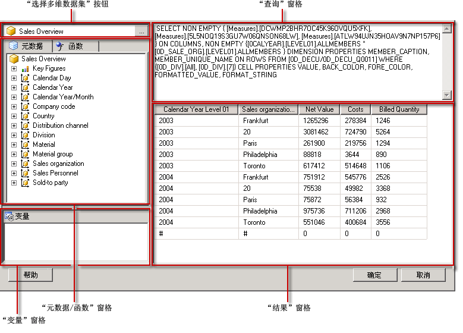

# SAP NetWeaver BI 查询设计器用户界面
  [!INCLUDE[ssRSnoversion](../../includes/ssrsnoversion-md.md)] 提供了图形查询设计器，可用于为 SAP NetWeaver® Business Intelligence 数据源生成多维表达式 (MDX) 查询。 MDX 图形查询设计器有两种模式：设计模式和查询模式。 每种模式都提供一个元数据窗格，在该窗格中，您可以从 InfoCube、MultiProvider 或根据数据源定义的启用 Web 的查询中拖动成员，创建 MDX 查询以便在处理报表时检索数据。  
  
> [!IMPORTANT]  
>  用户创建和运行查询时访问数据源。 您应授予对数据源的最小权限（如只读权限）。  
  
 有关使用 SAP 多维数据源的详细信息，请参阅 [SAP NetWeaver BI 连接类型 (SSRS)](../../reporting-services/report-data/sap-netweaver-bi-connection-type-ssrs.md)。  
  
 本节介绍每种模式的图形查询设计器中的工具栏按钮和查询设计器窗格。  
  
## 设计模式下的图形查询设计器  
 编辑使用 [!INCLUDE[SAP_DPE_BW_1](../../includes/sap-dpe-bw-1-md.md)] 数据源的数据集查询时，图形查询设计器将以设计模式打开。 下图列出了设计模式的窗格。  
  
   
  
 下表列出了设计模式下的窗格。  
  
|窗格|函数|  
|----------|--------------|  
|“选择多维数据集”按钮|显示当前选择的 InfoCube、MultiProvider 或启用 Web 的查询。|  
|“元数据”窗格|显示 InfoCube、MultiProvider 和查询的层次列表。 在数据源中创建的查询可能显示在相应的多维数据集下。|  
|“计算成员”窗格|显示当前定义的可在查询中使用的计算成员。|  
|“数据”窗格|显示运行查询的结果。|  
  
 可以将“元数据”窗格中的维度和关键数字以及“计算成员”窗格中的计算成员拖至“数据”窗格。 如果工具栏中的 **“自动执行”** 切换按钮为“开”，则每次将对象拖到“数据”窗格时，查询设计器都将运行查询。 如果 **“自动执行”** 为“关”，则对“数据”窗格进行更改时，查询设计器将不运行查询。 使用工具栏上的 **“运行”** 按钮可以手动运行查询。  
  
### 设计模式下的图形查询设计器工具栏  
 查询设计器工具栏提供了可以帮助您使用图形界面来设计 MDX 查询的按钮。 下表介绍了这些按钮及其功能。  
  
|按钮|Description|  
|------------|-----------------|  
|**编辑为文本**|在基于文本的查询设计器和图形查询设计器之间切换。 不可用于此数据源类型。|  
|**导入**|从文件系统中的报表定义 (.rdl) 文件导入现有查询。 有关详细信息，请参阅[报表的嵌入数据集和共享数据集（报表生成器和 SSRS）](../../reporting-services/report-data/report-embedded-datasets-and-shared-datasets-report-builder-and-ssrs.md)。|  
||刷新数据源的元数据。|  
||显示 **“计算成员生成器”** 对话框。|  
||在“数据”窗格中的显示或不显示空单元格之间切换。 （这等同于在 MDX 中使用 NON EMPTY 子句）。|  
||自动运行查询并在每次更改（如在“数据”窗格中删除一列）之后显示结果。 结果将显示在“数据”窗格中。|  
||通过查询在“数据”窗格中删除选定列。|  
||显示 **“变量”** 对话框。 仅当选定的多维数据集为“查询”多维数据集时此按钮才可用（因为只有“查询”多维数据集支持变量）。 当向变量分配默认值时，将创建一个相应的报表参数。|  
||运行查询并在“数据”窗格中显示结果。|  
||取消查询。|  
||在设计模式和查询模式之间切换。|  
  
## 查询模式下的图形查询设计器  
 若要将图形查询设计器更改为查询模式，请单击工具栏上的 **“设计模式”** 切换按钮。  
  
 下图列出了查询模式下查询设计器的各个部分。  
  
   
  
 下表介绍了每个窗格的功能。  
  
|窗格|函数|  
|----------|--------------|  
|“选择多维数据集”按钮|显示当前选择的 InfoCube、MultiProvider 或其他多维数据集。|  
|“元数据/函数”窗格|显示一个选项卡式窗口，其中列出了可用于创建查询文本的元数据或函数列表。|  
|“变量”窗格|显示当前定义的可在查询中使用的变量。|  
|“查询”窗格|显示当前的查询文本。|  
|“结果”窗格|显示查询的结果。|  
  
 在“元数据”窗格中，您可以将关键数字和维度从 **“元数据”** 选项卡拖到“MDX 查询”窗格，元数据的技术名称将在光标处插入。 还可以将函数从 **“函数”** 选项卡拖到“MDX 查询”窗格。 当执行查询时，“结果”窗格将显示当前 MDX 查询的结果。  
  
 如果选中的多维数据集是启用 Web 的查询，系统将提示您为现有变量设置静态默认值。 然后可以将变量拖到“MDX 查询”窗格。  
  
 “元数据”和“变量”窗格会显示友好名称。 将对象拖到“MDX 查询”窗格时，可以看到数据源所需要的技术名称会输入到 MDX 查询中。  
  
### 查询模式下的图形查询设计器工具栏  
 查询设计器工具栏提供了可以帮助您使用图形界面来设计 MDX 查询的按钮。 工具栏按钮在设计模式和查询模式下是相同的，但是下列按钮在查询模式下不可用：  
  
-   **编辑为文本**  
  
-   **添加计算成员** ()  
  
-   **显示空单元格**()  
  
-   **自动执行**()  
  
-   **删除** ()  
  
## 另请参阅  
 [创建共享数据集或嵌入数据集（报表生成器和 SSRS）](../../reporting-services/report-data/create-a-shared-dataset-or-embedded-dataset-report-builder-and-ssrs.md)   
 [RSReportDesigner 配置文件](../../reporting-services/report-server/rsreportdesigner-configuration-file.md)  
  
  
