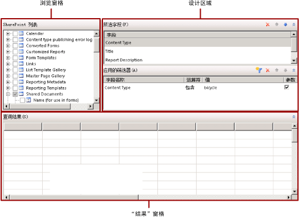

# SharePoint 列表查询设计器（报表生成器）
  报表生成器和报表设计器同时提供了图形查询设计器和基于文本的查询设计器，帮助你创建查询，以指定要从 SharePoint 站点中为报表数据集检索的数据。 使用图形查询设计器可以浏览 SharePoint 列表元数据、以交互方式生成查询，还可以查看查询结果。 使用基于文本的查询设计器可以查看图形查询设计器生成的查询、修改查询或键入查询命令。 您还可以从文件或报表中导入现有的查询。  
  
> [!IMPORTANT]  
>  用户创建和运行查询时访问数据源。 您应授予对数据源的最小权限（如只读权限）。  
  
## 图形查询设计器  
 在图形查询设计器中，您可以浏览 SharePoint 站点，也可以交互方式生成用于为数据集检索 SharePoint 列表数据的命令。 您可以选择要包括在数据集中的字段，或者指定限制数据集中数据的筛选器。 可以指定将筛选器作为参数并在运行时提供筛选器的值。  
  
 SharePoint 列表包含大量 SharePoint 特定的字段，而将这些字段包括在报表中可能并不起什么作用。 查询设计器提供了一个用于隐藏这些字段的选项，从而能够更加轻松、更加快速地确定要使用的字段。  
  
 图形查询设计器分为三个区域  
  
-   “浏览”窗格，在其中您可以选择要使用的列表项及其字段。  
  
-   “设计”区域，在其中您可以生成查询。  
  
-   “结果”窗格，在其中您可以查看查询结果。  
  
 下图显示了用于 SharePoint 列表的图形查询设计器。  
  
   
  
 下表介绍了每个窗格的功能。  
  
 [SharePoint 列表](#DatabaseView)  
 在列表中显示 SharePoint 列表和每一项内的字段。  
  
 [所选字段](#SelectedFields)  
 在“SharePoint 列表”窗格中显示选定项中的 SharePoint 列表字段名称的列表。 这些字段将成为报表数据集的字段集合。  
  
 [应用的筛选器](#AppliedFilters)  
 在“数据库视图”中显示表或视图的字段列表和筛选条件。  
  
 [查询结果](#QueryResults)  
 显示自动生成的查询的结果集示例数据。  
  
###   “SharePoint 列表”窗格  
 “SharePoint 列表”窗格显示您有权查看的数据库对象的元数据，该元数据取决于数据源连接和凭据。 层次结构视图显示按数据库架构组织的数据库对象。 展开每个架构的节点可查看表、视图、存储过程及表值函数。 展开表或视图可显示列。  
  
###   “所选字段”窗格  
 “所选字段”窗格显示您为 SharePoint 列表项选择的列表项字段。 此窗格中显示的字段将成为报表数据集的字段集合。 创建数据集和查询后，使用“报表数据”窗格可查看报表数据集的字段集合。 这些字段表示当您查看报表时可在表、图表及其他报表项中显示的数据。  
  
 若要在此窗格中添加或删除字段，请在“SharePoint 列表”窗格中选中或清除针对表或视图字段的复选框。  
  
###   “应用的筛选器”窗格  
 “应用的筛选器”窗格显示用于限制在运行时检索的数据行数的条件。 此窗格中指定的条件用于生成 [!INCLUDE[tsql](../../includes/tsql-md.md)] WHERE 子句。 如果选择了参数选项，则会自动创建报表参数。 通过基于查询参数的报表参数，用户可为查询指定值，以便控制报表中的数据。  
  
 显示以下列：  
  
-   **字段名称** ：显示应用该条件的字段的名称。  
  
-   **运算符** ：显示要在筛选表达式中使用的运算。  
  
-   **值** ：显示要在筛选表达式中使用的值。  
  
-   **参数** ：显示用于为查询添加查询参数的选项。 使用“数据集属性”可查看查询参数与报表参数之间的关系。  
  
###   “查询结果”窗格  
 “查询结果”窗格显示由其他窗格中的选项指定并且自动生成的查询的结果。 结果集中的列是您在“所选字段”窗格中指定的字段，行数据受限于您在“应用的筛选器”窗格中指定的筛选器。  
  
 此数据表示在运行查询时数据源中的值。 此数据未保存在报表定义中。报表中的实际数据是在处理报表时进行检索的。  
  
 结果集中的排序顺序取决于从数据源检索数据的顺序。 可以通过修改查询来更改排序顺序，也可以在为报表检索数据后更改。  
  
### 图形查询设计器工具栏  
 关系查询设计器工作栏提供了以下按钮，帮助您指定或查看查询结果。  
  
|按钮|描述|  
|------------|-----------------|  
|**编辑为文本**|切换到基于文本的查询设计器，可查看自动生成的查询，也可以修改查询。|  
|**导入**|从文件或报表中导入现有的查询。 支持 .sql 和 .rdl 文件类型。|  
|**运行查询**|运行查询。 “查询结果”窗格显示结果集。|  
|**显示隐藏字段**|在显示字段还是隐藏字段之间切换，这些字段是由 SharePoint 自动生成的（如用于 SharePoint 链接项的 ProgId 和 Level），但通常不在报表中使用。 隐藏这些字段可使字段列表更短且易于使用。|  
  
## 另请参阅  
 [查询设计器（报表生成器）](http://msdn.microsoft.com/library/553f0d4e-8b1d-4148-9321-8b41a1e8e1b9)  
  
  
