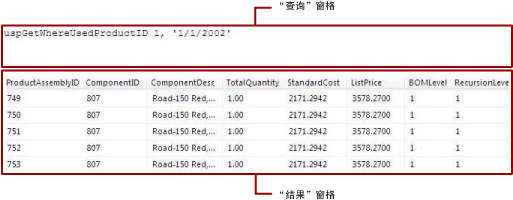

# <a name="text-based-query-designer-user-interface-report-builder"></a>基于文本的查询设计器用户界面（报表生成器）
  使用基于文本的查询设计器可以用数据源支持的查询语言来指定查询，还可以运行查询并在运行时查看结果。 您可以指定多个 [!INCLUDE[tsql](../../includes/tsql-md.md)] 语句，为自定义数据处理扩展插件指定查询或命令语法，还可以指定指定为表达式的查询。 因为基于文本的查询设计器不会对查询进行预处理，并且能适应任何类型的查询语法，所以成为了众多数据源类型的默认查询设计器工具。  
  
> [!IMPORTANT]  
>  用户创建和运行查询时访问数据源。 您应授予对数据源的最小权限（如只读权限）。  
  
 基于文本的查询设计器将显示工具栏和以下两个窗格：  
  
-   **查询** ：根据查询类型的不同，显示查询文本、表名或存储过程名称。 并非所有查询类型都适用于所有数据源类型。 例如，只有数据源类型 OLE DB 支持表名。  
  
-   **结果** ：在设计时，显示查询的运行结果。  
  
## <a name="text-based-query-designer-toolbar"></a>基于文本的查询设计器工具栏  
 基于文本的查询设计器为所有命令类型都提供一个单一工具栏。 下表列出了该工具栏中的每个按钮及其功能。  
  
|按钮|Description|  
|------------|-----------------|  
|**编辑为文本**|在基于文本的查询设计器和图形查询设计器之间切换。 并非所有的数据源类型都支持图形查询设计器。|  
|**导入**|从文件或报表中导入现有的查询。 仅支持 sql 和 rdl 文件类型|  
||运行查询并在“结果”窗格中显示结果集。|  
|**命令类型**|选择 **Text**、 **StoredProcedure**或 **TableDirect**。 如果存储过程带有参数，则单击工具栏上的 **“运行”** 时，将出现 **“定义查询参数”** 对话框，您可以根据需要填入值。 所支持的命令类型因数据源类型而异。 例如，仅 OLE DB 和 ODBC 支持 **TableDirect**。<br /><br /> 注意：如果存储过程返回多个结果集，则仅使用第一个结果集填充数据集。|  
  
### <a name="command-type-text"></a>命令类型 Text  
 创建 [!INCLUDE[ssNoVersion](../../includes/ssnoversion-md.md)] 数据集时，默认情况下，关系查询设计器将会打开。 若要切换为基于文本的查询设计器，请单击工具栏上的“编辑为文本”切换按钮。 基于文本的查询设计器将显示两个窗格：“查询”窗格和“结果”窗格。 下图标出了每个窗格。  
  
   
  
 下表介绍了每个窗格的功能。  
  
|窗格|函数|  
|----------|--------------|  
|查询|显示 [!INCLUDE[tsql](../../includes/tsql-md.md)] 查询文本。 使用此窗格可以编写或编辑 [!INCLUDE[tsql](../../includes/tsql-md.md)] 查询。|  
|结果|显示查询的结果。 若要运行查询，请右键单击任意窗格，然后单击“运行”，或者单击工具栏中的“运行”按钮。|  
  
#### <a name="example"></a>示例  
 以下查询将从用于 **Person** 架构的 AdventureWorks2014 数据库的 **ContactType** 表返回名称列表。  
  
```  
SELECT Name FROM Person.ContactType  
```  
  
 单击工具栏上的 **“运行”** 时，将运行 **“查询”** 窗格中的命令，并在 **“结果”** 窗格中显示结果。 结果集显示 20 种类型的联系人列表，例如，所有者或销售代理。  
  
### <a name="command-type-storedprocedure"></a>命令类型 StoredProcedure  
 选择“Command typeStoredProcedure”时，基于文本的查询设计器将显示两个窗格：“查询”窗格和“结果”窗格。 在“查询”窗格中输入存储过程的名称，然后单击工具栏中的 **“运行”** 按钮。 如果存储过程使用参数，将打开 **“定义查询参数”** 对话框。 输入存储过程的参数值。 对于每个存储过程输入参数，都会创建一个报表参数。  
  
 下图显示运行存储过程时的“查询”和“结果”窗格。 在此示例中，输入参数为常量。  
  
   
  
 下表介绍了每个窗格的功能。  
  
|窗格|函数|  
|----------|--------------|  
|查询|显示存储过程的名称和所有输入参数。|  
|结果|显示查询的结果。 若要运行查询，请右键单击任意窗格，然后单击“运行”，或者单击工具栏中的“运行”按钮。|  
  
#### <a name="example"></a>示例  
 以下查询将调用 AdventureWorks2014 存储过程 **uspGetWhereUsedProductID**。 在运行查询时，您必须为产品标识号参数输入一个值。  
  
```  
uspGetWhereUsedProductID  
```  
  
 单击“运行”(**!**) 按钮。 提示输入查询参数的值时，请使用下表来输入值。  
  
|||  
|-|-|  
|*@StartProductID*|820|  
|*@CheckDate*|20010115|  
  
 对于指定日期，结果集显示使用指定组件号的 13 个产品标识符列表。  
  
### <a name="command-type-tabledirect"></a>命令类型 TableDirect  
 选择“Command typeTableDirect”，基于文本的查询设计器将显示两个窗格：“查询”窗格和“结果”窗格。 如果输入一个表并单击 **“运行”** 按钮，则将返回该表的所有列。  
  
#### <a name="example"></a>示例  
 对于数据源类型 OLE DB，以下数据集查询将为 AdventureWorks2014 数据库中的所有联系人类型返回结果集。  
  
 `Person.ContactType`  
  
 如果输入表名 Person.ContactType，则等同于创建 [!INCLUDE[tsql](../../includes/tsql-md.md)] 语句 `SELECT * FROM Person.ContactType`。  
  
## <a name="see-also"></a>另请参阅  
 [关系查询设计器用户界面（报表生成器）](../../reporting-services/report-data/relational-query-designer-user-interface-report-builder.md)   
 [查询设计器（报表生成器）](http://msdn.microsoft.com/library/553f0d4e-8b1d-4148-9321-8b41a1e8e1b9)  
  
  
