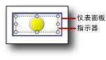

# 添加或删除指示器（报表生成器和 SSRS）
  在 [!INCLUDE[ssRSnoversion_md](../../includes/ssrsnoversion-md.md)] 分页报表中，指示器是以直观的形式提供单个数据值的状态的最小化仪表。 有关它们的详细信息，请参阅 [指示器（报表生成器和 SSRS）](../../reporting-services/report-design/indicators-report-builder-and-ssrs.md)。  
  
 指示器通常放在表或矩阵的单元中，但您也可以通过其自身、与仪表并排或嵌入到仪表中来使用指示器。  
  
 当您首次添加指示器时，指示器配置为默认使用百分比作为度量单位。 百分比范围均匀分布在指示器集的各成员之间，并且由指示器表示的值的作用域为该指示器的父级（如表或矩阵）。  
  
 您可以更新指示器的值和状态。 有关详细信息，请参阅以下主题：  
  
-   [更改指示器图标和指示器集（报表生成器和 SSRS）](../../reporting-services/report-design/change-indicator-icons-and-indicator-sets-report-builder-and-ssrs.md)  
  
-   [设置和配置度量单位（报表生成器和 SSRS）](../../reporting-services/report-design/set-and-configure-measurement-units-report-builder-and-ssrs.md)  
  
-   [设置同步作用域（报表生成器和 SSRS）](../../reporting-services/report-design/set-synchronization-scope-report-builder-and-ssrs.md)  
  
 因为指示器位于仪表面板内，所以，当您要使用 **“指示器属性”** 对话框或 **“属性”** 窗格配置指示器时，您需要选择指示器，而不是选择面板。 下图显示了指示器仪表面板中的一个选定指示器。  
  
   
  
> [!NOTE]  
>  根据数据值的列宽和长度，表或矩阵单元中的文本可以换行并在多行上显示文本。 在发生此情况时，指示器图标可能会拉长和更改形状。 这可能会降低指示器图标的可读性。 将指示器放置于矩形内可以确保其图标永远不会拉长。  
  
## 向表或矩阵添加指示器  
  
1.  打开一个现有报表，或者创建一个新报表（其中包含具有要显示的数据的表或矩阵）。 有关详细信息，请参阅[表（报表生成器和 SSRS）](../../reporting-services/report-design/tables-report-builder-and-ssrs.md)或[矩阵](../../reporting-services/report-design/create-a-matrix-report-builder-and-ssrs.md)。  
  
2.  在您的表或矩阵中插入列。 有关详细信息，请参阅[插入或删除列（报表生成器和 SSRS）](../../reporting-services/report-design/insert-or-delete-a-column-report-builder-and-ssrs.md)。  
  
3.  或者，在 **“插入”** 选项卡上，单击 **“矩形”**，然后单击新列中的单元。  
  
4.  在 **“插入”** 选项卡上，单击 **“指示器”**，然后单击新列中的单元。  
  
     如果您向矩形添加了某一单元，则单击该单元。  
  
5.  在 **“选择指示器样式”** 对话框的左窗格中，单击所需的指示器类型，然后单击指示器集。  
  
6.  单击 **“确定”**。  
  
7.  单击指示器。 将打开 **“仪表数据”** 窗格。  
  
8.  在“值”区域的“(未指定)”下拉列表中，单击要将其值显示为指示器的字段。  
  
     此指示器配置为使用默认值。 默认情况下，指示器配置为使用百分比作为度量单位，并且百分比范围均匀分布在指示器的各成员之间，指示器提供的值使用最近组的作用域。  
  
## 从表或矩阵删除指示器  
  
1.  右键单击要删除的指示器，然后单击“删除”。  
  
    > [!NOTE]  
    >  指示器可能位于包含其他指示器或仪表的仪表面板内。 如果仪表面板包含多个项，请确保单击该指示器以删除它，而不要删除仪表面板。 如果单击并删除了仪表面板，则将删除该仪表面板以及其中的所有项。  
  
2.  单击 **“删除”**。  
  
## 另请参阅  
 [指示器（报表生成器和 SSRS）](../../reporting-services/report-design/indicators-report-builder-and-ssrs.md)  
  
  
