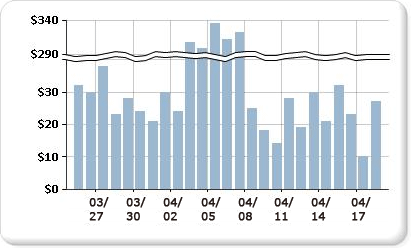

# 在图表中添加刻度分隔线（报表生成器和 SSRS）

  刻度分隔线是在图表的绘图区绘制的一个条带，表示值轴（通常为垂直轴或 Y 轴）上高值和低值之间的一个中断。 使用刻度分隔线可以在同一图表区中显示两个不同范围。  
  
   
  
> [!NOTE]  
>  您不能指定在图表中放置刻度分隔线的位置。 图表根据数据集中的值使用自有的计算方法确定数据范围之间是否有足够的分离空间，以便在运行时的值轴（Y 轴）上绘制刻度分隔线。  
  
 具有刻度分隔线的图表的示例可用于示例报表。 有关下载此示例报表和其他内容的详细信息，请参阅 [报表生成器和报表设计器示例报表](http://go.microsoft.com/fwlink/?LinkId=198283)。  
  
> [!NOTE]  
>  [!INCLUDE[ssRBRDDup](../../includes/ssrbrddup-md.md)]  
  
### 启用图表中的刻度分隔线  
  
1.  右键单击垂直轴，然后单击“轴属性”。 将打开“垂直轴属性”对话框。  
  
2.  选中 **“启用刻度分隔线”** 复选框。  
  
### 更改刻度分隔线的样式  
  
1.  打开“属性”窗格。  
  
2.  在设计图面上，右键单击图表中的 Y 轴。 Y 轴对象（默认情况下名为“图表轴”）的属性显示在“属性”窗格中。  
  
3.  在“刻度线”部分，展开 ScaleBreakStyle 属性。  
  
4.  更改 ScaleBreakStyle 属性（如 BreakLineType 和 Spacing）的值。 有关设置刻度分隔线属性的详细信息，请参阅[在图表中显示包含多个数据区域的序列（报表生成器和 SSRS）](../../reporting-services/report-design/displaying-a-series-with-multiple-data-ranges-on-a-chart.md)。  

## 后续步骤

[图表](../../reporting-services/report-design/charts-report-builder-and-ssrs.md)   
[设置图表格式](../../reporting-services/report-design/formatting-a-chart-report-builder-and-ssrs.md)   
[轴属性对话框-轴选项](http://msdn.microsoft.com/library/b276e210-7a12-48ae-971b-7dabae51df11)  

更多问题？ [尝试的 Reporting Services 论坛](http://go.microsoft.com/fwlink/?LinkId=620231)
