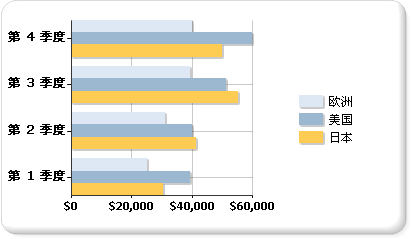

# 条形图（报表生成器和 SSRS）
  条形图将序列显示为若干组水平图条。 平面条形图与柱形图密切相关，柱形图将序列显示为多组垂直图条，而范围条形图将序列显示为多组具有不同起点和终点的水平图条。  
  
 条形图是水平显示数据的唯一图表类型。 因此，该图常用于表示随时间变化的数据，并带有限定的开始和结束日期。 另外，由于类别可以水平显示，因此它还常用于显示分类信息。 有关如何向条形图添加数据的详细信息，请参阅 [图表（报表生成器和 SSRS）](../../reporting-services/report-design/charts-report-builder-and-ssrs.md)。  
  
 下图显示了一个条形图。 条形图非常适用于此数据，因为所有这三个序列都共享一个公共时间段，允许进行有效比较。  
  
   
  
> [!NOTE]  
>  [!INCLUDE[ssRBRDDup](../../includes/ssrbrddup-md.md)]  
  
## 条形图变体  
  
-   **堆积**。 一种多个序列垂直堆积的条形图。 如果图表中只有一个序列，则堆积条形图将与条形图的显示相同。  
  
-   **百分比堆积**。 一种多个序列垂直堆积以占满图表区的条形图。 如果图表中只有一个序列，则所有图条将占满图表区。  
  
-   **三维簇状**。 一种将每个序列分别显示在三维图表的单独行中的条形图。  
  
-   **三维圆柱**。 一种图条在三维图表中的形状类似于圆柱的条形图。  
  
## 条形图的数据注意事项  
  
-   条形图的轴方向相反。 类别轴是垂直轴（或“y 轴”），值轴是水平轴（或“x 轴”）。 也就是说，在条形图中，可以在更大的空间中沿 y 轴将类别标签显示为列表，并自顶部至底部读取。  
  
-   条形图和柱形图最常用于说明各组之间的比较情况。 如果图表中存在三个以上的序列，请考虑使用堆积条形图或柱形图。 如果图表中有多个序列，则还可以将堆积条形图或柱形图收集到多个组中。  
  
-   条形图的值显示方式是自左至右，因此当显示与持续时间相关的数据时，这样会更加直观。  
  
-   如果希望在报表内的表或矩阵中添加图条，请考虑使用线性仪表来代替条形图。 线性仪表专用于显示一个值，而不是多个组，因此在列表或表数据区域内的用法更加灵活。 有关详细信息，请参阅 [仪表（报表生成器和 SSRS）](../../reporting-services/report-design/gauges-report-builder-and-ssrs.md)。  
  
-   您可以在条形图中为单个图条添加特殊的绘制样式以增加其视觉效果。 绘制样式包括楔形、阳文、柱形和由浅到深渐变。 设计这些效果的目的是为了改进二维图表的外观。 即使使用的是三维图表，您仍可应用绘制样式，但效果可能不会相同。 有关如何向条形图添加绘制样式的详细信息，请参阅 [向图表添加凹凸效果、阳文和纹理样式（报表生成器和 SSRS）](../../reporting-services/report-design/chart-effects-add-bevel-emboss-or-texture-report-builder.md)。  
  
-   堆积条形图重叠放置各个序列以创建一个条形堆栈。 您可以选择将每个类别的堆积条形图分隔为多组堆栈。 分组堆积图将并排显示。 一个图表中可以有任意多个分组堆积序列。  
  
-   在条形图上显示数据点标签时，标签放置在每个图条之外。 当图条占据图表区中的所有分配空间时，这可能导致标签重叠。 通过在“属性”窗格中设置 **BarLabelStyle** 属性，可以更改为每个图条显示的数据点标签的位置。  
  
-   如果数据集包含许多与图表大小有关的数据点，则会缩小列或图条的大小以及二者之间的空间。 若要手动设置图表中各个列的宽度，请通过修改 **PointWidth** 属性来修改其宽度（以像素为单位）。 默认情况下，此属性的值为 0.8。 当增大图表中各个列或图条的宽度时，将缩小每个列或图条之间的空间。  
  
## 另请参阅  
 [图表 &#40;报表生成器和 SSRS &#41;](../../reporting-services/report-design/charts-report-builder-and-ssrs.md)   
 [图表类型 &#40;报表生成器和 SSRS &#41;](../../reporting-services/report-design/chart-types-report-builder-and-ssrs.md)   
 [图表 &#40; 中的空和 Null 数据点报表生成器和 SSRS &#41;](../../reporting-services/report-design/empty-and-null-data-points-in-charts-report-builder-and-ssrs.md)   
 [柱形图 &#40;报表生成器和 SSRS &#41;](../../reporting-services/report-design/column-charts-report-builder-and-ssrs.md)   
 [范围图 &#40;报表生成器和 SSRS &#41;](../../reporting-services/report-design/range-charts-report-builder-and-ssrs.md)   
 [在图表 &#40; 的格式设置序列颜色报表生成器和 SSRS &#41;](../../reporting-services/report-design/formatting-series-colors-on-a-chart-report-builder-and-ssrs.md)   
 [在图表 &#40; 的格式设置轴标签报表生成器和 SSRS &#41;](../../reporting-services/report-design/formatting-axis-labels-on-a-chart-report-builder-and-ssrs.md)   
 [格式设置的图例的图表 &#40;报表生成器和 SSRS &#41;](../../reporting-services/report-design/chart-legend-formatting-report-builder.md)   
 [向图表添加凹凸效果、浮雕和纹理样式（报表生成器和 SSRS）](../../reporting-services/report-design/chart-effects-add-bevel-emboss-or-texture-report-builder.md)   
 [教程： 将条形图添加到报表 （报表生成器）](http://go.microsoft.com/fwlink/?LinkId=198052)   
 [教程： 将条形图添加到报表](http://go.microsoft.com/fwlink/?LinkId=198042)  
  
  
