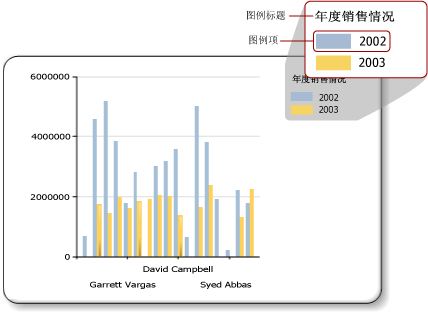

# 图表图例的格式 （报表生成器）
  图表图例包含对图表中每个类别的说明。 图例始终包含一个或多个图例项，每个图例项包含一个表示序列的彩色框以及一个描述该序列的文本字符串，如下图所示。  
  
   
  
 对于除形状图以外的图表，图例项连接到该图表上的单个序列；对于形状图而言，图例连接到各个数据点。 图表会自动基于根据数据生成的序列向图例中添加项。  
  
 可以使用 **“图例属性”** 对话框或“属性”窗格来设置图例的格式。 右键单击图例，然后单击 **“图例属性”** 可以更改图例文本、背景色、边框和三维效果的值。 若要更改图例标题的值，请选择图例，再右键单击图例标题，然后单击 **“图例标题属性”**。  
  
 不能向图例中添加图像、额外的列或其他补充项。  
  
> [!NOTE]  
>  [!INCLUDE[ssRBRDDup](../../includes/ssrbrddup-md.md)]  
  
## 对图例中的图例项进行排序  
 在图例中，序列是按照 [!INCLUDE[ssRSnoversion](../../includes/ssrsnoversion-md.md)] 处理引擎处理它们的顺序进行排序的。 可以更改排序顺序，方法是更改数据字段放置区中字段的顺序。 如果使用序列分组，序列数据在处理之前是未知的，因此您无法对这些项重新进行排序。 所做的更改可在“预览”中查看。 有关序列分组的详细信息，请参阅 [图表（报表生成器和 SSRS）](../../reporting-services/report-design/charts-report-builder-and-ssrs.md)。  
  
 您可以隐藏任何序列，使其不显示在图例中。 如果使用序列分组，所有与数据字段相关的序列都将隐藏。 有关详细信息，请参阅 [隐藏图表上的图例项（报表生成器和 SSRS）](../../reporting-services/report-design/chart-legend-hide-items-report-builder.md)。  
  
## 更改图例中图例项的文本或颜色  
 在图表的数据字段放置区中放入一个字段时，会自动生成一个包含此字段名称的图例项。 默认情况下，每个图例项以数据字段的名称作为其文本。 对于除形状图外的其他图表，每个图例项会连接到图表上的单个序列，而对于形状图，图例会连接到单个数据点而不是单个序列。 在形状图中定义类别组时，每个图例项以该类别组的字符串表示形式作为其文本。 您可以为饼图、圆环图和漏斗图指定自定义标签文本，以显示不同于类别组标签的与图例中每个单个数据点相关的信息。 若要执行此操作，请选择图例，并在 **“序列属性”** 对话框或“属性”窗格的 **LegendText** 属性中指定图例文本。 有关详细信息，请参阅 [更改图例项的文本（报表生成器和 SSRS）](../../reporting-services/report-design/chart-legend-change-item-text-report-builder.md)。  
  
 还可以在 **LegendText** 属性或“序列属性”对话框中，为经常引用的属性指定特定于图表且区分大小写的关键字。 图表控件会在运行时用其数据表示形式替换这些关键字。 对于形状图，此方法非常有用，因为这样可以显示与特定数据点相关的信息。 有关详细信息，请参阅[设置图表上数据点的格式（报表生成器和 SSRS）](../../reporting-services/report-design/formatting-data-points-on-a-chart-report-builder-and-ssrs.md)。  
  
 为每个图例项显示的彩色框继承自其相应序列的填充颜色。 若要更改显示在图例项中的颜色，必须更改相应序列的颜色。 有关详细信息，请参阅 [设置图表上序列颜色的格式（报表生成器和 SSRS）](../../reporting-services/report-design/formatting-series-colors-on-a-chart-report-builder-and-ssrs.md)。  
  
## 删除图例中的多余图例项  
 图例始终连接到序列。 如果一个图例项显示在图例中，但是相应的序列却没有显示在图表中，最有可能的原因是该序列不包含任何值。 您必须删除此序列才能从图例中删除该图例项。 若要从图表中删除序列，请右键单击指定的序列，然后选择“删除序列”选项。  
  
## 重新定位图例  
 图表区是包含轴标签和绘图区的矩形区域。 当图例位于图表区之外时，你可以将该图例拖放到十二个不同位置中的一个。 默认情况下，图例显示在图表区之外。 还可以在 **“图例属性”** 对话框中设置该位置。  
  
 不能将图例拖入或拖离图表区。 如果要将图例定位在图表区中，请在 **“图例属性”** 对话框的 **“停靠”**下，从下拉列表中选择 **“默认值”** ，然后清除 **“在图表区之外显示图例”** 选项。 通过将图例放置在图表区中，可以最大化图表上数据点的空间。 但是，这有可能导致图例与图表上的一些数据点重叠，从而导致图表很难读懂，具体情况取决于数据集。  
  
## 水平显示图例项  
 默认情况下，图例的格式被设置为由一行或多行组成的列表，其中每一行都包含一个图例项。 图例区会展开以容纳图例项的数量。 如果图例无法展开，将显示省略号 ( )。 图例可垂直或水平展开，具体情况取决于指定的图例样式。 可以在 **“图例属性”** 对话框中更改布局样式，或更改分配的空间以显示所有图例项。  
  
 若要水平显示图例，请将图例停靠到图表的顶部或底部。 这将导致图例水平展开。 还可以将 Layout 属性设置为“行”或“宽表”。 在“属性”窗格中设置 MaxAutoSize 属性以控制当图例停靠在图表区的顶部或底部时分配给图例的垂直空间。  
  
## 设置图例文本的格式  
 可以在 **“图例属性”** 对话框的 **“字体”** 页上更改图例文本的字体、大小、样式和颜色。  
  
 默认情况下，图例文本没有为适应图例区的大小而进行优化。 若要使图例文本自动适应所分配的空间，请将 AutoFitTextDisabled 属性设置为 **False** ，并将 MinFontSize 属性的最小字号设置为你认为可呈现且仍允许进行图例优化的最小字号。  
  
## 另请参阅  
 [“图例属性”对话框，“常规”（报表生成器和 SSRS）](http://msdn.microsoft.com/library/db718f8f-f185-422f-871c-96f0749e5893)   
 [更改图例项的文本（报表生成器和 SSRS）](../../reporting-services/report-design/chart-legend-change-item-text-report-builder.md)   
 [设置图表格式（报表生成器和 SSRS）](../../reporting-services/report-design/formatting-a-chart-report-builder-and-ssrs.md)   
 [设置图表上序列颜色的格式（报表生成器和 SSRS）](../../reporting-services/report-design/formatting-series-colors-on-a-chart-report-builder-and-ssrs.md)   
 [图表（报表生成器和 SSRS）](../../reporting-services/report-design/charts-report-builder-and-ssrs.md)   
 [隐藏图表上的图例项（报表生成器和 SSRS）](../../reporting-services/report-design/chart-legend-hide-items-report-builder.md)   
 [使用调色板定义图表上的颜色（报表生成器和 SSRS）](../../reporting-services/report-design/define-colors-on-a-chart-using-a-palette-report-builder-and-ssrs.md)  
  
  
